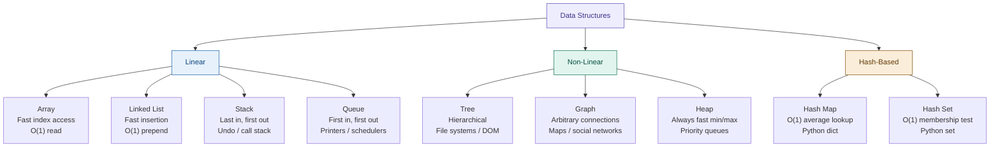
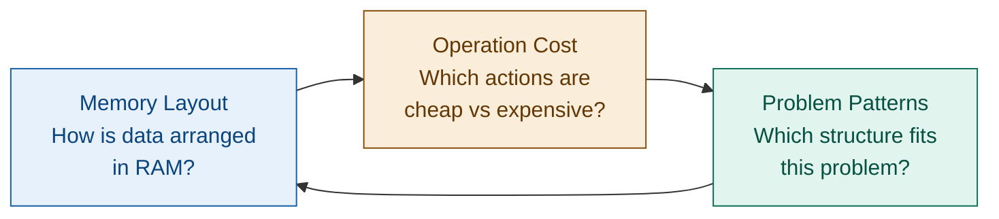
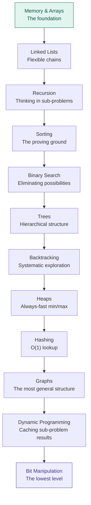

# Introduction to Data Structures and Algorithms

## The Two-Second Question

When you type a search query into Google, something remarkable happens. In under two seconds, Google's servers sift through an index representing hundreds of billions of web pages and return exactly the results you were looking for — ranked by relevance, filtered for quality, personalised to you.

How is that physically possible?

The answer isn't "more computers" or "faster hardware." The answer is *algorithms and data structures*. The right choice of data structure turns a problem that would take centuries into one that takes milliseconds. That's not an exaggeration — it's mathematics.

This track teaches you those ideas from the ground up.

---

## What Is a Data Structure?

A **data structure** is a way of organising data in memory so that certain operations are efficient.

The word "organising" is the key. The same collection of numbers can be arranged in dozens of different ways, and each arrangement makes some things fast and other things slow.

Think of it like a kitchen. You could throw all your ingredients into one giant bin — that's "just a pile of data." Or you could sort them into labelled shelves, refrigerated compartments, and spice racks. The ingredients are identical, but the *organisation* changes everything about how quickly you can cook.



**A data structure is not just a container — it's a contract.** Each one promises certain performance characteristics, and violating those promises (using the wrong structure for the job) can make your program thousands of times slower than it needs to be.

---

## What Is an Algorithm?

An **algorithm** is a precise, step-by-step procedure for solving a problem.

The word comes from the name of 9th-century Persian mathematician Muhammad ibn Musa al-Khwarizmi, whose works introduced systematic methods for solving equations to the Western world.

Algorithms have three properties:

1. **Correctness** — it produces the right answer for every valid input.
2. **Finiteness** — it terminates in a finite number of steps.
3. **Efficiency** — it uses a reasonable amount of time and memory.

You already know algorithms intuitively. A recipe is an algorithm. The process of looking up a word in a paper dictionary (open to the middle, decide if your word comes before or after, repeat) is an algorithm — and a clever one. That's *binary search*, and it finds any word in a 1,000-page dictionary in at most 10 steps.

---

## Why Do They Matter?

Here's a concrete example. Suppose you need to check whether a number appears in a list of one million numbers.

**Approach 1: Check every number (linear search)**
At worst, check all 1,000,000 entries.

**Approach 2: Sort the list first, then binary search**
Sort once (roughly 20,000,000 operations), then each search takes just 20 steps.

If you run 10,000 searches, approach 2 does 20,000,000 + 200,000 = 20.2 million operations. Approach 1 does 10,000,000,000 — ten billion. That's a 500x difference in work, and it grows wider as the dataset grows.

```python,editable
import time

# Simulate a large dataset
data = list(range(1_000_000))  # [0, 1, 2, ..., 999999]
target = 999_983               # near the end — worst case for linear search

# Approach 1: Linear search — O(n)
start = time.time()
found_linear = False
for item in data:
    if item == target:
        found_linear = True
        break
linear_ms = (time.time() - start) * 1000

# Approach 2: Binary search — O(log n)
start = time.time()
lo, hi = 0, len(data) - 1
found_binary = False
steps = 0
while lo <= hi:
    steps += 1
    mid = (lo + hi) // 2
    if data[mid] == target:
        found_binary = True
        break
    elif data[mid] < target:
        lo = mid + 1
    else:
        hi = mid - 1
binary_ms = (time.time() - start) * 1000

print(f"Dataset size: {len(data):,} items")
print(f"Target: {target}")
print()
print(f"Linear search:  {linear_ms:.3f} ms  (scans up to every item)")
print(f"Binary search:  {binary_ms:.4f} ms  ({steps} steps total)")
print()
if binary_ms > 0:
    print(f"Binary search was ~{linear_ms / binary_ms:.0f}x faster")
print(f"Binary search checked {steps} items vs up to 1,000,000")
```

---

## The Core Idea: Three Connected Concepts

Every topic in this track connects back to three questions:



- **An array is fast** because its elements sit in a contiguous block of memory. The CPU can jump directly to any element using arithmetic. That's O(1) access.
- **A linked list is flexible** because its nodes can live anywhere in memory — you just follow the chain of pointers. That makes insertion O(1) but lookup O(n).
- **Recursion is elegant** because the call stack remembers suspended work for you, letting you express divide-and-conquer solutions naturally.
- **Sorting changes the shape of later problems** — a sorted array enables binary search, which enables a whole class of efficient solutions.

Understanding these connections is what separates someone who memorises solutions from someone who *derives* them.

---

## What to Look for in Each Topic

As you work through this track, ask these four questions for every data structure you encounter:

| Question | What it reveals |
|---|---|
| What is the data layout? | How memory is organised |
| Which operations are cheap? | What this structure is built for |
| Which operations are expensive? | When to reach for something else |
| What trade-off is being made? | No structure is perfect for everything |

---

## Real-World Uses

You'll see DSA in action everywhere once you know what to look for:

- **Google Search** — inverted index (a hash map from word to list of pages) + PageRank (graph algorithm)
- **GPS navigation** — Dijkstra's shortest-path algorithm (graph + priority queue)
- **Git version control** — directed acyclic graph of commits
- **Database indexes** — B-trees (generalised binary search trees)
- **Browser history / undo** — stack
- **Streaming video buffering** — queue
- **Autocomplete / spell check** — trie (a specialised tree)
- **Python's `dict` and `set`** — hash tables

---

## How This Track Is Structured



Each section builds on the last. Skip ahead and some concepts will seem mysterious. Follow the order and everything will click into place.

Let's start with the language we use to talk about performance: **Algorithm Analysis**.
