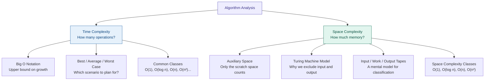
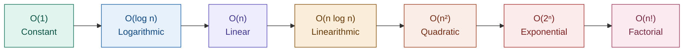
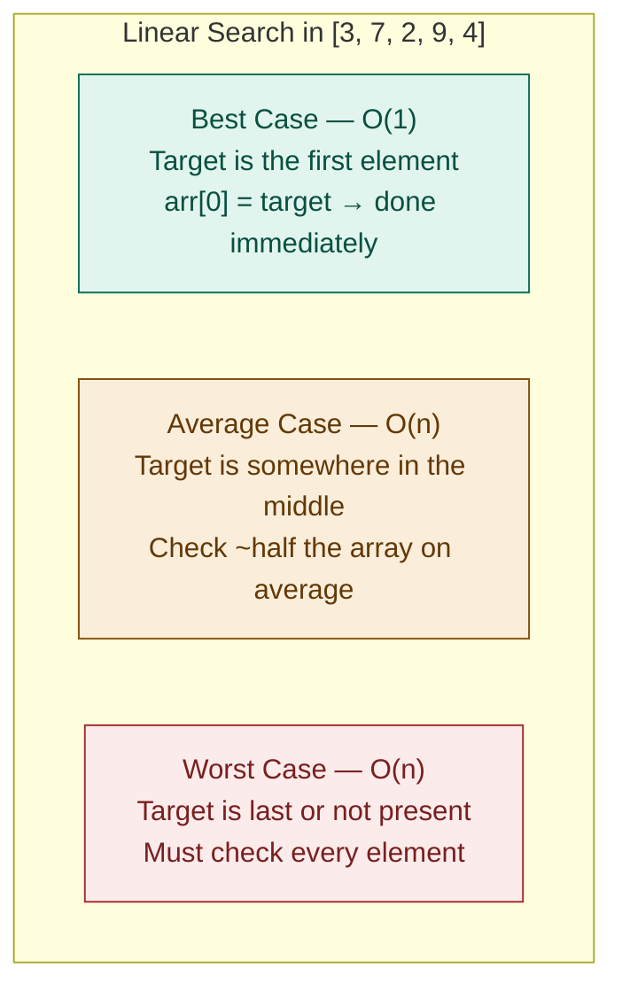
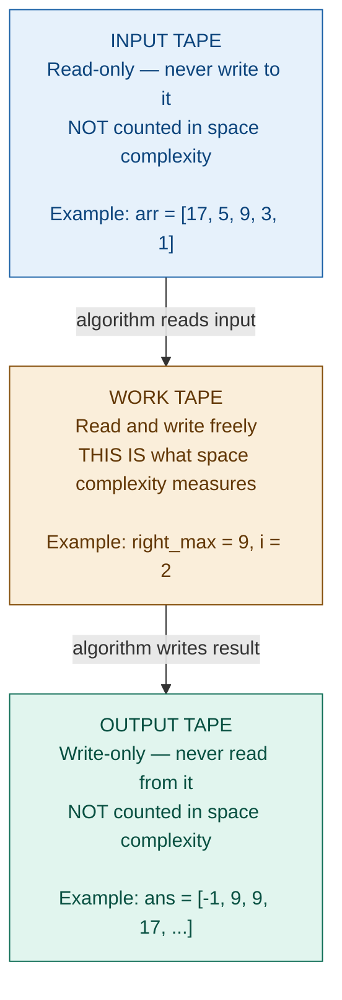
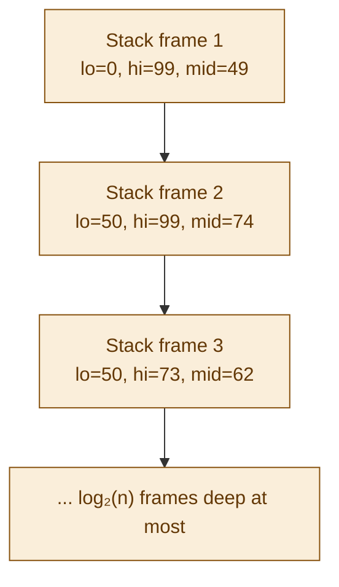
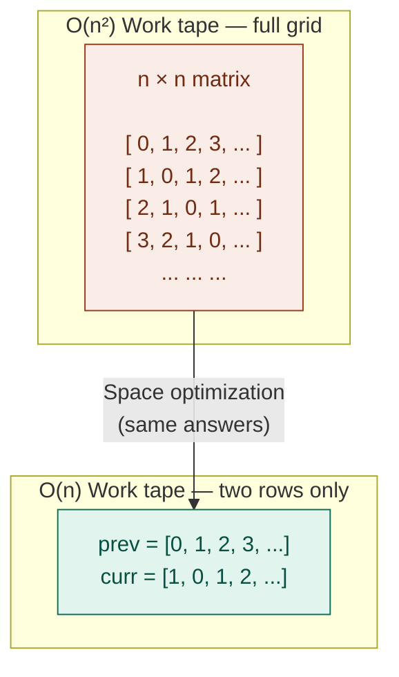
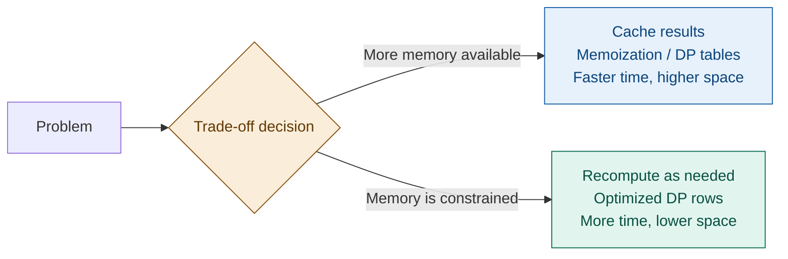
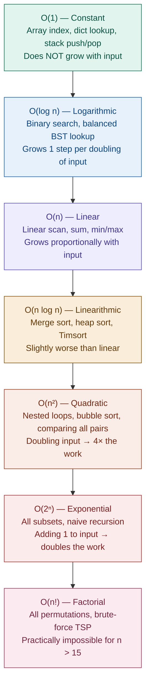

# Algorithm Analysis — Complete Tutorial

> A guide to Time Complexity, Space Complexity, Big O Notation, and the Turing Machine memory model — with runnable examples and real-world context.

---

## Table of Contents

1. [What is Algorithm Analysis?](#1-what-is-algorithm-analysis)
2. [Time Complexity](#2-time-complexity)
   - 2.1 [Big O Notation](#21-big-o-notation)
   - 2.2 [Common Time Complexities](#22-common-time-complexities)
   - 2.3 [Best, Average, and Worst Case](#23-best-average-and-worst-case)
   - 2.4 [Timing It Yourself](#24-timing-it-yourself)
3. [Space Complexity](#3-space-complexity)
   - 3.1 [Auxiliary Space](#31-auxiliary-space)
   - 3.2 [The Turing Machine Model — DSPACE](#32-the-turing-machine-model--dspace)
   - 3.3 [The Three-Tape Model](#33-the-three-tape-model)
   - 3.4 [Space Complexity Classes](#34-space-complexity-classes)
4. [Time vs Space Trade-offs](#4-time-vs-space-trade-offs)
5. [Quick Reference Cheat Sheet](#5-quick-reference-cheat-sheet)

---

## 1. What is Algorithm Analysis?

When you write code to solve a problem, two questions always follow:

- **How fast does it run?** → Time Complexity
- **How much memory does it use?** → Space Complexity

Algorithm Analysis is the discipline of answering both questions *mathematically*, so your answers hold regardless of the machine, the programming language, or the size of the input.

This matters enormously in practice. A web server handling a million requests per day cannot afford an algorithm that is 100x slower than it could be. A mobile app cannot afford one that uses 10x more memory than necessary. Good engineers understand these costs before the code ships.



---

## 2. Time Complexity

Time complexity measures how the number of operations your algorithm performs **scales** as the input size `n` grows.

We never measure raw seconds — hardware varies. Instead we count *operations*, and express how that count scales. An algorithm that takes 1 second on your laptop might take 0.01 seconds on a server, but the *ratio* of work between two inputs will be the same on both machines. That ratio is what time complexity captures.

### 2.1 Big O Notation

Big O is a mathematical notation that describes the **upper bound** of an algorithm's growth rate.

**Formal definition:**
> `f(n) = O(g(n))` means there exist constants `c > 0` and `n₀` such that `f(n) ≤ c · g(n)` for all `n ≥ n₀`.

In plain English: *"after a certain input size, the function never grows faster than `g(n)` by more than a constant factor."*

Think of it like a speed limit. If a road has a 100 km/h limit, you might sometimes go 80, sometimes 95 — but you're guaranteed never to exceed 100. Big O is the speed limit for your algorithm's growth.

**The three asymptotic notations:**

| Notation | Meaning | Used for |
|----------|---------|----------|
| `O(f(n))` | Upper bound — at most this fast | Worst case guarantee |
| `Ω(f(n))` | Lower bound — at least this fast | Best case guarantee |
| `Θ(f(n))` | Tight bound — exactly this fast | Average / typical case |

In everyday engineering, `O` (Big O) is the one you will use 95% of the time. It's a promise: "my algorithm will never do worse than this."

**Key rules for computing Big O:**

1. **Drop constants** — `O(3n)` → `O(n)`. Constants don't describe growth behaviour.
2. **Drop lower-order terms** — `O(n² + n)` → `O(n²)`. The dominant term wins at large n.
3. **Nested loops multiply** — a loop inside a loop is `O(n × n) = O(n²)`.
4. **Sequential steps add** — two loops one after another is `O(n + n) = O(n)`.

```python,editable
# Rule 3 — nested loops multiply → O(n²)
# For every i, we do n iterations of j.
# Total: n × n = n² operations.

n = 4
print("Nested loops (O(n²)):")
for i in range(n):
    for j in range(n):
        print(f"  ({i},{j})", end="")
    print()

print()

# Rule 4 — sequential loops add → O(n + n) = O(n)
# First loop does n operations. Second loop does n more.
# Total: 2n → O(n). The 2 is a constant and gets dropped.

print("Sequential loops (O(n)):")
print("First pass: ", end="")
for i in range(n):
    print(i, end=" ")
print()
print("Second pass:", end=" ")
for j in range(n):
    print(j, end=" ")
print()
print(f"\nNested: {n*n} operations  |  Sequential: {n+n} operations")
```

---

### 2.2 Common Time Complexities

From fastest to slowest growth:



**Growth at a glance — operations needed for n = 1,000:**

| Complexity | Name | Operations | Verdict |
|---|---|---|---|
| O(1) | Constant | 1 | Instant |
| O(log n) | Logarithmic | ~10 | Instant |
| O(n) | Linear | 1,000 | Fast |
| O(n log n) | Linearithmic | ~10,000 | Fast |
| O(n²) | Quadratic | 1,000,000 | Slow |
| O(2ⁿ) | Exponential | 2¹⁰⁰⁰ (astronomical) | Impossible |
| O(n!) | Factorial | larger than above | Impossible |

**Real-world examples for each class:**

| Complexity | Where you encounter it |
|---|---|
| O(1) | Reading a Python `dict` value by key; array index access |
| O(log n) | Binary search; database B-tree index lookup |
| O(n) | Summing a list; finding the largest file in a folder |
| O(n log n) | Sorting (merge sort, Python's Timsort); building a heap |
| O(n²) | Comparing every pair of items; naive substring search |
| O(2ⁿ) | Finding all subsets of a set; naive recursive Fibonacci |
| O(n!) | Solving the Travelling Salesman Problem by brute force |

**Code examples for each class:**

```python,editable
# O(1) — constant: index into array
# The array could have 10 elements or 10 million — the work is the same.
def get_first(arr):
    return arr[0]

# O(log n) — logarithmic: binary search (iterative)
# Each step cuts the remaining search space in half.
# 1,000,000 items → at most 20 steps. 1,000,000,000 → at most 30.
def binary_search(arr, target):
    lo, hi = 0, len(arr) - 1
    steps = 0
    while lo <= hi:
        steps += 1
        mid = (lo + hi) // 2
        if arr[mid] == target:
            return mid, steps
        elif arr[mid] < target:
            lo = mid + 1
        else:
            hi = mid - 1
    return -1, steps

# O(n) — linear: find maximum
# Must look at every element at least once.
def find_max(arr):
    max_val = arr[0]
    for x in arr:
        if x > max_val:
            max_val = x
    return max_val

# O(n²) — quadratic: check all pairs
# For each element, compare against every other element.
def has_duplicate(arr):
    n = len(arr)
    comparisons = 0
    for i in range(n):
        for j in range(i + 1, n):
            comparisons += 1
            if arr[i] == arr[j]:
                return True, comparisons
    return False, comparisons

# Demonstration
arr = list(range(1, 1001))   # [1, 2, 3, ..., 1000]

idx, steps = binary_search(arr, 731)
print(f"Binary search for 731 in 1000 items: found at index {idx} in {steps} steps")

maximum = find_max(arr)
print(f"Find max in 1000 items: {maximum} (required 1000 comparisons)")

small = [1, 3, 5, 7, 9]
found, comps = has_duplicate(small)
print(f"Duplicate check in {small}: {found}, took {comps} comparisons")
print(f"(n={len(small)}, n²={len(small)**2}, actual={comps})")
```

---

### 2.3 Best, Average, and Worst Case

The same algorithm can behave very differently depending on the input. We distinguish three scenarios:



**Why worst case matters most:**

In practice, engineers focus on the **worst case** because:
- It is a *guarantee* — the algorithm will never be slower than this.
- Users experience the worst case, not the average. If your app freezes for one user in a thousand, that user writes the one-star review.
- Systems must be designed to handle peak load, not average load.

```python,editable
def linear_search(arr, target):
    comparisons = 0
    for i, x in enumerate(arr):
        comparisons += 1
        if x == target:
            return i, comparisons
    return -1, comparisons

arr = [3, 7, 2, 9, 4, 6, 1, 8, 5, 0]

# Best case: target is first element
idx, comps = linear_search(arr, 3)
print(f"Best case  — target=3  (first):  found at {idx}, {comps} comparison")

# Average case: target is in the middle
idx, comps = linear_search(arr, 6)
print(f"Average    — target=6  (middle): found at {idx}, {comps} comparisons")

# Worst case: target is last, or not present
idx, comps = linear_search(arr, 0)
print(f"Worst case — target=0  (last):   found at {idx}, {comps} comparisons")

idx, comps = linear_search(arr, 99)
print(f"Worst case — target=99 (absent): found at {idx}, {comps} comparisons")

print(f"\nArray has {len(arr)} elements.")
print("Worst case always checks all of them.")
```

**Quicksort — a dramatic example:**

| Case | When it happens | Complexity |
|---|---|---|
| Best | Pivot always splits the array perfectly in half | O(n log n) |
| Average | Random pivot, typical distribution | O(n log n) |
| Worst | Pivot is always the smallest or largest element (sorted input!) | O(n²) |

This is why good quicksort implementations use random pivot selection — to avoid accidentally hitting the worst case on already-sorted data.

---

### 2.4 Timing It Yourself

Abstract complexity classes become real when you measure them. Here's how O(n) vs O(n²) actually behaves on your hardware:

```python,editable
import time

def measure(fn, n):
    start = time.time()
    fn(n)
    return (time.time() - start) * 1000  # milliseconds

# O(n) algorithm: sum of first n numbers
def linear(n):
    total = 0
    for i in range(n):
        total += i
    return total

# O(n²) algorithm: sum all pairs (i, j)
def quadratic(n):
    total = 0
    for i in range(n):
        for j in range(n):
            total += i + j
    return total

sizes = [100, 500, 1000, 2000]

print(f"{'n':>6} | {'O(n) ms':>10} | {'O(n²) ms':>10} | {'Ratio':>8}")
print("-" * 45)

prev_linear = None
prev_quad = None

for n in sizes:
    t_linear = measure(linear, n)
    t_quad = measure(quadratic, n)
    ratio = t_quad / t_linear if t_linear > 0 else float('inf')
    print(f"{n:>6} | {t_linear:>10.3f} | {t_quad:>10.3f} | {ratio:>7.1f}x")

print()
print("Notice: when n doubles, O(n) roughly doubles.")
print("When n doubles, O(n²) roughly quadruples.")
print("This gap widens forever as n grows.")
```

---

## 3. Space Complexity

Space complexity measures how much **extra memory** an algorithm needs as input size `n` grows.

The critical word is **extra**. This is also called *auxiliary space* — the scratch space your algorithm needs to do its work, beyond what it was given.

### 3.1 Auxiliary Space

**Auxiliary space** is the temporary or extra space used by the algorithm, *not counting* the input itself.

```
Total Space = Input Space + Auxiliary Space
                             ↑
                    This is what Space Complexity measures
```

**Why exclude the input?**

The input already exists before your algorithm runs. You didn't create it. Penalising an algorithm for the size of data it was handed would be misleading — especially for algorithms that operate in sublinear space (needing less memory than the input itself).

---

### 3.2 The Turing Machine Model — DSPACE

The formal justification for excluding input and output comes from **theoretical computer science**. Here is the intuition without the heavy machinery.

Imagine a universal computing machine — not any specific laptop or server, but an abstract machine that captures the essence of computation. Alan Turing described exactly this in 1936: a machine with an infinitely long tape that reads and writes symbols, one cell at a time.

**DSPACE** is the formal measure of how much tape this machine uses to solve a given problem — specifically, how many tape cells it touches *beyond* the input and output.

The key insight: several important algorithms are **sublinear** in space — they use *less* memory than the size of their input. Binary search, for example, searches a million-item array using only three variables (lo, hi, mid). If you counted the array as part of the space, binary search would look like an O(n) algorithm. But it isn't — the array was already there. The algorithm itself uses O(1) space.

To make this precise and fair, the Turing machine model separates the input, the working scratch space, and the output onto different tapes. Space complexity only counts the scratch (work) tape.

---

### 3.3 The Three-Tape Model

The multi-tape Turing machine uses three distinct tapes:



**The kitchen analogy:**

| Kitchen | Turing Machine |
|---|---|
| Bag of ingredients you were given | Input tape |
| Bowls, cutting boards, and tools you used | Work tape |
| Plate you serve to the guest | Output tape |

Space complexity only counts the **bowls and tools** — the scratch space you consumed while cooking. The ingredients and the finished dish don't count.

**Three-question test — apply in order:**

1. Is this variable the **input**? → Input tape. Do not count it.
2. Is this variable what I **return**? → Output tape. Do not count it.
3. Did I **create this myself** just to help compute the answer? → Work tape. **Count it.**

---

### 3.4 Space Complexity Classes

#### O(1) — Constant Space

The work tape size never grows, regardless of input size. Only a fixed number of scalar variables are used.

**Real-world example:** Reading through a million log entries and counting how many contain the word "ERROR" — you only need one counter variable, regardless of file size.

```python,editable
def replace_elements(arr):
    """
    Replace each element with the maximum element to its right.
    Last element becomes -1.
    """
    n = len(arr)
    ans = [0] * n       # OUTPUT tape — not counted
    right_max = -1      # WORK tape — 1 integer
    i = n - 1           # WORK tape — 1 integer

    while i >= 0:
        ans[i] = right_max
        right_max = max(arr[i], right_max)
        i -= 1

    return ans

# Tape assignment:
# arr      → Input  → NOT counted
# ans      → Output → NOT counted
# right_max → Work   → counted (1 integer)
# i         → Work   → counted (1 integer)
#
# Space complexity: O(1) — two integers on the work tape, always.

data = [17, 5, 9, 3, 1]
result = replace_elements(data)
print(f"Input:  {data}")
print(f"Output: {result}")
print()
print("Work tape contents at any moment:")
print("  right_max = one integer")
print("  i         = one integer")
print("  Total: O(1) — constant, no matter how large the array")
```

#### O(log n) — Logarithmic Space

The work tape grows, but very slowly — proportional to the logarithm of n.

**The most common cause: recursion.** Every recursive call adds a *stack frame* to the call stack. The call stack is part of the work tape.

**Real-world example:** Git's internal tree operations are recursive. When you run `git log`, Git walks a tree structure recursively. The call stack depth is logarithmic in the number of commits for a balanced tree.

```python,editable
# Recursive binary search — O(log n) space from the call stack
def binary_search_recursive(arr, target, lo, hi, depth=0):
    if lo > hi:
        return -1, depth
    mid = (lo + hi) // 2
    print(f"  Depth {depth}: checking arr[{mid}] = {arr[mid]}, range [{lo}..{hi}]")
    if arr[mid] == target:
        return mid, depth
    elif arr[mid] < target:
        return binary_search_recursive(arr, target, mid + 1, hi, depth + 1)
    else:
        return binary_search_recursive(arr, target, lo, mid - 1, depth + 1)

arr = list(range(0, 1000, 10))  # [0, 10, 20, ..., 990]
target = 730

print(f"Searching for {target} in array of {len(arr)} items:")
idx, max_depth = binary_search_recursive(arr, target, 0, len(arr) - 1)
print(f"\nFound at index {idx}, max recursion depth: {max_depth}")
print(f"Array size: {len(arr)}, log₂({len(arr)}) ≈ {len(arr).bit_length() - 1}")
print(f"Call stack grew to at most {max_depth + 1} frames deep — O(log n) space")
```



**Compare iterative vs recursive binary search:**

| Version | Work tape contents | Space |
|---|---|---|
| Iterative | `lo`, `hi`, `mid` — always 3 integers | **O(1)** |
| Recursive | call stack grows log₂(n) frames deep | **O(log n)** |

Same algorithm, same logic — different space complexity purely because of how it is written.

---

#### O(n) — Linear Space

The work tape grows proportionally to the input.

**Real-world example:** A web browser's history list. Every page you visit gets added. The memory used is proportional to the number of pages visited.

```python,editable
def count_frequencies(arr):
    """Build a frequency table — classic O(n) space."""
    freq = {}           # WORK tape: grows with n unique elements
    for x in arr:
        freq[x] = freq.get(x, 0) + 1
    return freq         # OUTPUT tape: not counted as work

def find_two_sum(arr, target):
    """
    Find two indices that sum to target.
    Uses a hash map (O(n) work space) to achieve O(n) time
    instead of the O(n²) brute-force approach.
    """
    seen = {}           # WORK tape: up to n entries
    for i, x in enumerate(arr):
        complement = target - x
        if complement in seen:
            return seen[complement], i
        seen[x] = i
    return None

# Example 1: frequency table
words = ["apple", "banana", "apple", "cherry", "banana", "apple"]
freq = count_frequencies(words)
print("Word frequencies:")
for word, count in sorted(freq.items()):
    print(f"  {word}: {count}")
print(f"Work tape (freq dict) holds {len(freq)} entries for {len(words)} words")

# Example 2: two-sum
print()
numbers = [2, 7, 11, 15, 1, 8]
target = 9
result = find_two_sum(numbers, target)
if result:
    i, j = result
    print(f"Two sum: {numbers[i]} + {numbers[j]} = {target}  (indices {i} and {j})")
print("The 'seen' hash map trades O(n) space for O(n) time vs O(n²) brute-force")
```

---

#### O(n²) — Quadratic Space

The work tape holds a 2D structure — typically an n×n matrix or grid. These appear frequently in dynamic programming.

**Real-world example:** Spell checkers and DNA sequence alignment use the edit distance algorithm. Two strings of length n require an n×n grid to compute their minimum edit distance.

```python,editable
def edit_distance(s, t):
    """
    Minimum number of insertions, deletions, or substitutions
    to turn string s into string t.

    Classic O(n²) space DP solution.
    """
    m, n = len(s), len(t)
    # WORK tape: (m+1) × (n+1) grid = O(m*n) ≈ O(n²)
    dp = [[0] * (n + 1) for _ in range(m + 1)]

    # Base cases
    for i in range(m + 1):
        dp[i][0] = i   # delete all of s
    for j in range(n + 1):
        dp[0][j] = j   # insert all of t

    # Fill the grid
    for i in range(1, m + 1):
        for j in range(1, n + 1):
            if s[i-1] == t[j-1]:
                dp[i][j] = dp[i-1][j-1]          # characters match, free
            else:
                dp[i][j] = 1 + min(
                    dp[i-1][j],     # delete from s
                    dp[i][j-1],     # insert into t
                    dp[i-1][j-1]    # substitute
                )
    return dp[m][n]

def edit_distance_optimized(s, t):
    """
    Same result, but O(n) space — only keep the previous row.
    """
    m, n = len(s), len(t)
    prev = list(range(n + 1))   # WORK tape: only one row at a time!
    for i in range(1, m + 1):
        curr = [i] + [0] * n
        for j in range(1, n + 1):
            if s[i-1] == t[j-1]:
                curr[j] = prev[j-1]
            else:
                curr[j] = 1 + min(prev[j], curr[j-1], prev[j-1])
        prev = curr
    return prev[n]

pairs = [
    ("kitten", "sitting"),
    ("sunday", "saturday"),
    ("python", "python"),
    ("abc", ""),
]

print(f"{'s':>10}  {'t':>10}  {'distance':>8}  {'optimized':>9}")
print("-" * 45)
for s, t in pairs:
    d1 = edit_distance(s, t)
    d2 = edit_distance_optimized(s, t)
    print(f"{s:>10}  {t:>10}  {d1:>8}  {d2:>9}")

print()
print("Both give identical results.")
print("Original: O(n²) space (full grid in memory)")
print("Optimized: O(n) space (two rows at a time)")
print("Same time complexity — O(n²) either way.")
```

**The key optimization insight:** Many O(n²) DP problems can be reduced to O(n) space by noticing you only ever need the *previous row*, not the entire grid. You trade readability for memory efficiency.



---

## 4. Time vs Space Trade-offs

In the real world, time and space often trade against each other. You can frequently buy speed by using more memory, or save memory by doing more computation.



**Classic examples:**

| Technique | Time saved | Space cost |
|---|---|---|
| Memoization (top-down DP) | Exponential → polynomial | O(n) to O(n²) extra |
| Hash map for lookups | O(n) search → O(1) search | O(n) for the hash map |
| Precomputed prefix sums | O(n) range sum → O(1) range sum | O(n) for prefix array |
| Rolling window DP | Same time, much less space | O(n²) → O(n) |

**Fibonacci — the textbook progression:**

```python,editable
import sys

# Version 1: Naive recursion
# Time: O(2ⁿ) — recalculates the same values over and over
# Space: O(n) — the call stack
def fib_naive(n):
    if n <= 1:
        return n
    return fib_naive(n - 1) + fib_naive(n - 2)

# Version 2: Memoized recursion
# Time: O(n) — each value computed exactly once
# Space: O(n) — the memo table + call stack
def fib_memo(n, memo=None):
    if memo is None:
        memo = {}
    if n in memo:
        return memo[n]
    if n <= 1:
        return n
    memo[n] = fib_memo(n - 1, memo) + fib_memo(n - 2, memo)
    return memo[n]

# Version 3: Bottom-up DP table
# Time: O(n) — one pass
# Space: O(n) — the dp array
def fib_dp(n):
    if n <= 1:
        return n
    dp = [0] * (n + 1)
    dp[1] = 1
    for i in range(2, n + 1):
        dp[i] = dp[i - 1] + dp[i - 2]
    return dp[n]

# Version 4: Space-optimized
# Time: O(n) — one pass
# Space: O(1) — only two variables!
def fib_optimized(n):
    if n <= 1:
        return n
    a, b = 0, 1
    for _ in range(n - 1):
        a, b = b, a + b
    return b

# Compare results (not timing naive for large n — it's too slow)
print(f"{'n':>4} | {'memo':>12} | {'dp':>12} | {'optimized':>12}")
print("-" * 50)
for n in [5, 10, 20, 30]:
    print(f"{n:>4} | {fib_memo(n):>12} | {fib_dp(n):>12} | {fib_optimized(n):>12}")

print()
print("All four versions give identical answers.")
print("The difference is time and space efficiency:")
print("  fib_naive:     O(2ⁿ) time, O(n) space — unusable for n > 40")
print("  fib_memo:      O(n) time,   O(n) space — fast, uses a dict")
print("  fib_dp:        O(n) time,   O(n) space — fast, uses an array")
print("  fib_optimized: O(n) time,   O(1) space — fast, uses 2 variables")
```

**Real-world decision:** When you're running a web server handling millions of requests, and each request needs the 10,000th Fibonacci number, you'd precompute it once and store it. That's trading O(1) space for O(1) time per request — the ultimate win.

---

## 5. Quick Reference Cheat Sheet

### Big O Complexity Ladder



### Time Complexity Reference

| Complexity | Name | Typical cause | Real-world example |
|---|---|---|---|
| O(1) | Constant | Direct access | Array index, dict lookup |
| O(log n) | Logarithmic | Halving the input | Binary search, database index |
| O(n) | Linear | Single pass | Find max, count occurrences |
| O(n log n) | Linearithmic | Divide and merge | Merge sort, Python's `sorted()` |
| O(n²) | Quadratic | Nested loops | Bubble sort, comparing all pairs |
| O(2ⁿ) | Exponential | All subsets | Naive recursive Fibonacci |
| O(n!) | Factorial | All permutations | Brute-force Travelling Salesman |

### Space Complexity Reference

| Complexity | Name | Typical cause | Real-world example |
|---|---|---|---|
| O(1) | Constant | Only scalar variables | Iterative binary search, two-pointer |
| O(log n) | Logarithmic | Recursive call stack | Recursive binary search, recursive DFS |
| O(n) | Linear | Array or hash map as scratch | Frequency table, BFS queue |
| O(n²) | Quadratic | 2D matrix as scratch | Edit distance DP, pairwise distances |

### The Three-Tape Test

```
Is this variable the INPUT?   → Input tape.  Don't count it.
Is this variable the OUTPUT?  → Output tape. Don't count it.
Did I CREATE it as a helper?  → Work tape.   COUNT IT. ← this is your space complexity
```

### Big O Simplification Rules

```
Drop constants:            O(3n)       → O(n)
Drop lower-order terms:    O(n² + n)   → O(n²)
Nested loops multiply:     O(n) × O(n) = O(n²)
Sequential steps add:      O(n) + O(n) = O(n)
Recursion depth × work:    log n levels × O(n) work = O(n log n)
```

### The One-Sentence Summary

> A good algorithm does the minimum necessary work (time) using the minimum necessary memory (space) — and understanding Big O is how you prove it.

---

*Topics covered: Big O Notation · Ω and Θ · Best/Average/Worst Case · Timing Experiments · Auxiliary Space · DSPACE / Turing Machine Model · Input/Work/Output Tapes · O(1) · O(log n) · O(n) · O(n²) · Time–Space Trade-offs · Fibonacci progression.*
