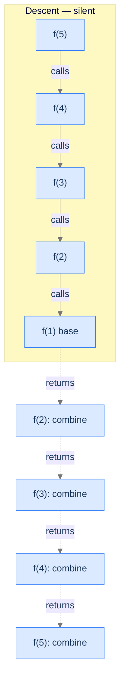
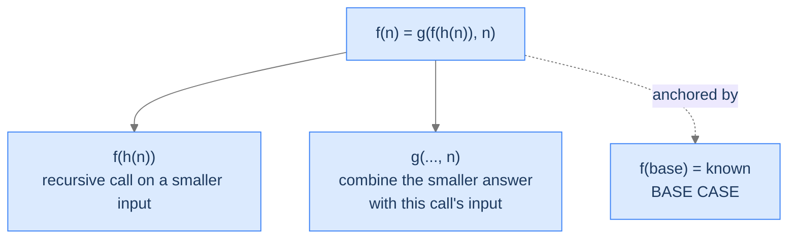
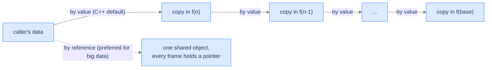
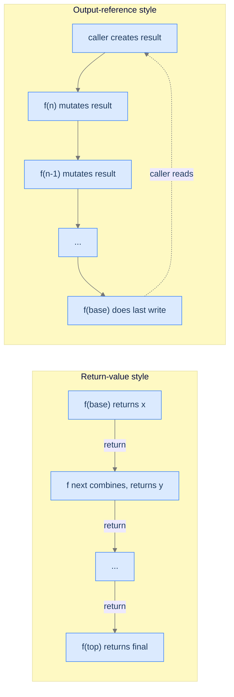
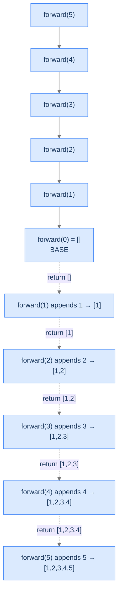
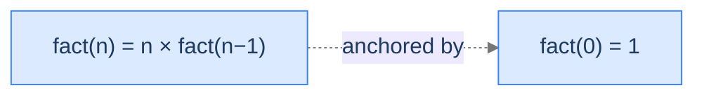
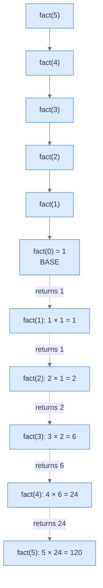
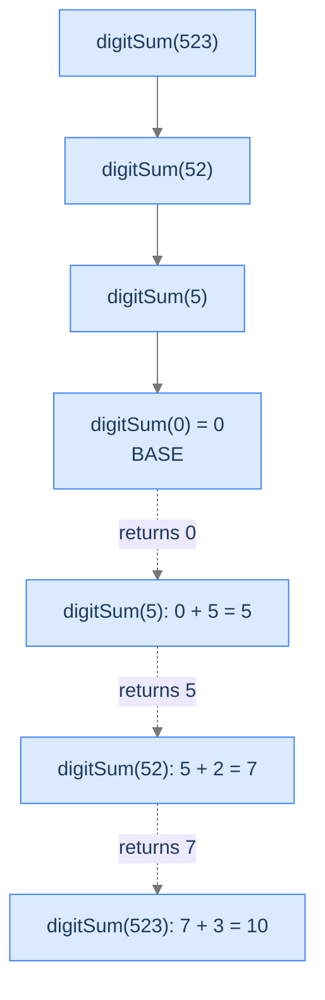
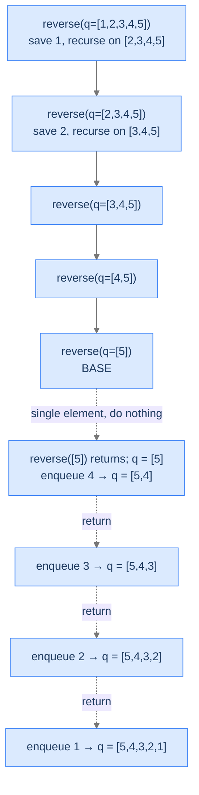

# 4. Pattern: Head Recursion

You can't speak first. Every call defers downward, all the way to the base case, before *any* of them does any actual work. The work happens on the way back — frame by frame, each one taking what came up from below and contributing its piece on the way out. That's head recursion. It's the simplest pattern in the recursion taxonomy and the one that maps most directly onto the queue intuition from the Recursion lesson.

By the end of this lesson you'll know what shape a problem has to have for head recursion to apply, the diagnostic checks you run before writing a single line of code, and four worked problems that turn the pattern into muscle memory.

## Table of contents

1. [Understanding head recursion](#understanding-head-recursion)
2. [Identifying head recursion](#identifying-head-recursion)
3. [Forward sequence](#forward-sequence)
4. [Calculate factorial](#calculate-factorial)
5. [Sum of digits](#sum-of-digits)
6. [Reverse a queue](#reverse-a-queue)

***

# Understanding Head Recursion

> **Course:** DSA › Algorithms › Recursion › Head Recursion

Head recursion means the recursive call sits at the *head* of the function body — right after the base-case check, before any other processing. By the time the body's "real work" starts, the recursive call has already returned with the answer to the smaller subproblem. Every step uses the smaller answer to compute its own.

This is the pattern of the queue from the Recursion lesson: the question goes all the way to the front of the line first, the answer comes back, each person adds 1 on the way out. **The descent is silent; the ascent is where the work happens.**



<p align="center"><strong>Solid arrows are calls (descent). Dashed arrows are returns (ascent). In head recursion, every call's "real work" — the combine step — happens on the dashed arrow, after the recursive call has come back.</strong></p>

---

## What Head Recursion Looks Like in Code

Strip away the problem-specific bits and every head-recursive function looks like this:



<p align="center"><strong>The general recursive equation for head recursion: <code>h</code> reduces the input toward the base case; <code>g</code> combines the smaller answer with the current input. The base case anchors it.</strong></p>

In English: *the answer for `n` is some function `g` of the answer for a smaller input plus the current input itself.* The "smaller input" comes from `h(n)`, and the combining function `g` is whatever the problem demands — addition, multiplication, list-append, anything.

The pseudocode follows the equation line for line:

```
function head_recursion(n):
    if n is base case:
        return base case answer        ← step 0: stop the recursion

    smaller_input = h(n)               ← step 1: reduce toward the base case
    smaller_answer = head_recursion(smaller_input)   ← step 2: descend
    answer = g(smaller_answer, n)      ← step 3: combine on the way back up
    return answer
```

Notice the order: the **recursive call comes first**, *before* the combine step. The function is intentionally idle during the descent and does its work on the return.

> *Before reading on — predict where this function spends its time. Is the descent expensive, or the ascent? When could a 1000-deep recursion finish almost instantly?*

The descent is `n` calls of constant overhead (push a frame, check the base case, call again). The ascent is `n` evaluations of `g`. If `g` is `O(1)` — addition, comparison, append — both phases run in linear time. If `g` is expensive — concatenating arrays, deep-copying objects — the ascent dominates. *That's* the time-cost knob in head recursion. Knowing this saves you from "why is my recursive solution slower than the loop?" mysteries later.

```d2
direction: right

descent: "Descent (silent)" {
  d1: "f(5) called"
  d2: "f(4) called"
  d3: "f(3) called"
  d4: "f(2) called"
  d5: "f(1) — base case" {style.fill: "#fde68a"; style.stroke: "#d97706"}
}

ascent: "Ascent (the work)" {
  a1: "f(1) returns 1"
  a2: "f(2) combines: g(1, 2)" {style.fill: "#bbf7d0"; style.stroke: "#16a34a"}
  a3: "f(3) combines: g(prev, 3)" {style.fill: "#bbf7d0"; style.stroke: "#16a34a"}
  a4: "f(4) combines: g(prev, 4)" {style.fill: "#bbf7d0"; style.stroke: "#16a34a"}
  a5: "f(5) combines: g(prev, 5) — done" {style.fill: "#bbf7d0"; style.stroke: "#16a34a"}
}

descent.d5 -> ascent.a1: hand off
```

<p align="center"><strong>The result is built bottom-up during the unwinding. Every frame's contribution comes from <code>g</code> on the dashed return arrow.</strong></p>

---

## Passing Data Down

Since the recursive call is at the head of the function, **no work has been done yet** when the call is made. There are no intermediate results to forward. Whatever data the recursion needs is whatever was passed in as arguments.

In compiled languages with copy semantics (C, C++, Rust by default), passing a large container as an argument means copying it on every call — `n` calls × `m` elements = `O(n·m)` overhead before any real work happens. The fix is to pass containers **by reference** (`const std::vector<int>&` in C++, `&[i32]` in Rust, `*Slice` in Go) so the data is shared across all frames.

In high-level languages (Java, Kotlin, Scala, JavaScript, TypeScript, Python), object references are the default — every call already shares the same underlying object. There's nothing to optimise.



<p align="center"><strong>Passing big containers by value copies the container at every call (top path). Passing by reference shares one object across all frames (bottom path).</strong></p>

---

## Passing Data Up

In head recursion the natural way to pass data up is the **return value**. Each frame returns its answer to its caller; the caller combines and returns onward. The chain bottoms out at the top-level call, which returns the final answer to whoever invoked it.

For low-level languages, returning a large container by copy has the same cost as passing it down by copy. Two ways to avoid it:

1. **Return by reference / move-semantics** — return a `std::vector<int>&&` or use Rust's ownership transfer so the underlying buffer isn't copied.
2. **Pass an output reference down** — the caller creates the result container, passes it as a reference argument, and the recursive function mutates it in place. Nothing is returned at all; the caller reads the final state from the container they own.

The second pattern (output-by-reference) is especially common when building lists or trees. We'll see it in the Forward Sequence problem below.



<p align="center"><strong>Two ways to deliver the answer back. Return-value style is the default; output-reference style avoids copying large containers in low-level languages.</strong></p>

For most introductory head-recursion problems, the data is small (a single integer, a small string), so the return-value style wins on clarity. The four worked problems below use it.

---

## Algorithm

Putting the pieces together, the generic head-recursion procedure is:

> **headRecursion(n)**
>
> 1. **Stop** — if `n` is the base case, return the known answer.
> 2. **Reduce** — compute the smaller input via `h(n)`.
> 3. **Recurse** — call `headRecursion(h(n))` and capture its result.
> 4. **Combine** — apply `g(result, n)` to fold this frame's contribution into the smaller answer.
> 5. **Return** the combined result to the caller.

Steps 1 and 5 bookend every call; steps 2-3 are the descent; step 4 is the ascent's work.

---

## Implementation

A clean, language-agnostic implementation of the generic template — `g` and `h` are placeholders the problem will fill in.

<div class="lang-tabs">

```python,editable
class Solution:
    def head_recursion(self, n: int) -> int:
        # Step 1 — base case: stops the recursion. Without this branch the
        # function would call itself forever and the stack would overflow.
        if n <= 0:
            return 0

        # Step 2 — reduce the input toward the base case.
        smaller_input = self._h(n)

        # Step 3 — descend: ALL the recursion happens here, before any
        # combine work runs in this frame.
        smaller_answer = self.head_recursion(smaller_input)

        # Step 4 — combine: head recursion's "real work" lives here, on the
        # ascent. By the time we reach this line, every frame below has
        # finished and returned.
        answer = self._g(smaller_answer, n)

        # Step 5 — pass the contribution up to the caller.
        return answer

    def _g(self, smaller: int, n: int) -> int:
        # Problem-specific combine. Example: addition.
        return smaller + n

    def _h(self, n: int) -> int:
        # Problem-specific reduction. Example: decrement.
        return n - 1


if __name__ == "__main__":
    print(Solution().head_recursion(5))   # 1+2+3+4+5 = 15
```

```java,editable
public class Solution {
    int headRecursion(int n) {
        // Step 1 — base case: anchors the recursion
        if (n <= 0) {
            return 0;
        }

        // Step 2 — reduce
        int smallerInput = h(n);

        // Step 3 — descend (all the recursion happens here)
        int smallerAnswer = headRecursion(smallerInput);

        // Step 4 — combine on the ascent
        int answer = g(smallerAnswer, n);

        // Step 5 — return upward
        return answer;
    }

    private int g(int smaller, int n) { return smaller + n; }
    private int h(int n) { return n - 1; }

    public static void main(String[] args) {
        System.out.println(new Solution().headRecursion(5));   // 15
    }
}
```

```c,editable
#include <stdio.h>

/* Forward declarations so g and h can be referenced before definition. */
int g(int smaller, int n);
int h(int n);

int head_recursion(int n) {
    if (n <= 0) {                     /* Step 1 — base case */
        return 0;
    }
    int smaller_input  = h(n);        /* Step 2 — reduce */
    int smaller_answer = head_recursion(smaller_input);  /* Step 3 — descend */
    int answer         = g(smaller_answer, n);           /* Step 4 — combine */
    return answer;                    /* Step 5 — return upward */
}

int g(int smaller, int n) { return smaller + n; }
int h(int n)              { return n - 1; }

int main(void) {
    printf("%d\n", head_recursion(5));   /* 15 */
    return 0;
}
```

```cpp,editable
#include <iostream>

class Solution {
public:
    int headRecursion(int n) {
        if (n <= 0) return 0;                  // Step 1 — base case
        int smallerInput  = h(n);              // Step 2 — reduce
        int smallerAnswer = headRecursion(smallerInput);  // Step 3 — descend
        int answer        = g(smallerAnswer, n);          // Step 4 — combine
        return answer;                                    // Step 5 — return
    }

private:
    int g(int smaller, int n) { return smaller + n; }
    int h(int n) { return n - 1; }
};

int main() {
    std::cout << Solution{}.headRecursion(5) << '\n';   // 15
    return 0;
}
```

```scala,editable
class Solution {
  def headRecursion(n: Int): Int = {
    if (n <= 0) 0                          // Step 1 — base case
    else {
      val smallerInput  = h(n)             // Step 2 — reduce
      val smallerAnswer = headRecursion(smallerInput)  // Step 3 — descend
      val answer        = g(smallerAnswer, n)          // Step 4 — combine
      answer                                           // Step 5 — return
    }
  }

  private def g(smaller: Int, n: Int): Int = smaller + n
  private def h(n: Int): Int = n - 1
}

object Main {
  def main(args: Array[String]): Unit = {
    println(new Solution().headRecursion(5))   // 15
  }
}
```

```javascript,editable
class Solution {
    headRecursion(n) {
        if (n <= 0) return 0;                    // Step 1 — base case
        const smallerInput  = this.h(n);          // Step 2 — reduce
        const smallerAnswer = this.headRecursion(smallerInput);  // Step 3
        const answer        = this.g(smallerAnswer, n);           // Step 4
        return answer;                                            // Step 5
    }
    g(smaller, n) { return smaller + n; }
    h(n) { return n - 1; }
}

console.log(new Solution().headRecursion(5));    // 15
```

```typescript,editable
class Solution {
    headRecursion(n: number): number {
        if (n <= 0) return 0;
        const smallerInput: number  = this.h(n);
        const smallerAnswer: number = this.headRecursion(smallerInput);
        const answer: number        = this.g(smallerAnswer, n);
        return answer;
    }
    g(smaller: number, n: number): number { return smaller + n; }
    h(n: number): number { return n - 1; }
}

console.log(new Solution().headRecursion(5));    // 15
```

```go,editable
package main

import "fmt"

func g(smaller, n int) int { return smaller + n }
func h(n int) int          { return n - 1 }

func headRecursion(n int) int {
    if n <= 0 {                         // Step 1 — base case
        return 0
    }
    smallerInput  := h(n)               // Step 2
    smallerAnswer := headRecursion(smallerInput)  // Step 3
    answer        := g(smallerAnswer, n)          // Step 4
    return answer                                  // Step 5
}

func main() {
    fmt.Println(headRecursion(5))      // 15
}
```

```kotlin,editable
class Solution {
    fun headRecursion(n: Int): Int {
        if (n <= 0) return 0                             // Step 1 — base case
        val smallerInput  = h(n)                         // Step 2 — reduce
        val smallerAnswer = headRecursion(smallerInput)  // Step 3 — descend
        val answer        = g(smallerAnswer, n)          // Step 4 — combine
        return answer                                    // Step 5 — return
    }
    private fun g(smaller: Int, n: Int) = smaller + n
    private fun h(n: Int) = n - 1
}

fun main() {
    println(Solution().headRecursion(5))   // 15
}
```

```rust,editable
fn g(smaller: i32, n: i32) -> i32 { smaller + n }
fn h(n: i32) -> i32 { n - 1 }

fn head_recursion(n: i32) -> i32 {
    if n <= 0 { return 0; }                 // Step 1 — base case
    let smaller_input  = h(n);               // Step 2 — reduce
    let smaller_answer = head_recursion(smaller_input);  // Step 3 — descend
    let answer         = g(smaller_answer, n);            // Step 4 — combine
    answer                                                // Step 5 — return
}

fn main() {
    println!("{}", head_recursion(5));      // 15
}
```

</div>

---

## Complexity Analysis

| Resource | Cost | Why |
|---|---|---|
| **Time** | `O(n)` if `g`, `h` are `O(1)` | One frame per integer down to the base case; each frame does constant work. |
| **Time (large containers)** | `O(n·m)` if data is copied per call | Each of the `n` calls copies a container of size `m`. Avoid by passing by reference. |
| **Space** | `O(n)` | The deepest moment has `n` frames simultaneously alive on the stack — see the slideshow in the Recursion lesson for the exact picture. |

The space cost is the **scaffolding tax** from the Memory Model lesson. Every frame is real bytes; recursion's clean code comes at the cost of holding every intermediate frame in memory until the unwinding starts. Linear-depth recursion on small inputs is fine; deep recursion (anywhere near the stack limit) is not. The escape valve is to convert to iteration when depth becomes a problem — same algorithm, frames moved off the stack.

> **Best Case** — Time `O(n)`, Space `O(n)`
>
> **Worst Case** — Time `O(n)`, Space `O(n)` (no input variation can change the depth)

Some head-recursive problems have non-linear (e.g. exponential) complexity even when the recursion is "single-call" — this happens when `g` itself calls the recursion or does heavy work. We'll meet that variant in the Multiple Recursion lesson (multiple recursion).

---

## Key Takeaway

Head recursion's mantra: **descend silently, ascend with work**. Recursive call first, combine after. The pattern matches any problem where you need the answer to a smaller subproblem *before* you can compute the answer for this step. Now we'll learn how to spot one of those problems on sight.

***

# Identifying Head Recursion

> **Course:** DSA › Algorithms › Recursion › Head Recursion

When you see a fresh problem, three diagnostic questions decide whether head recursion fits.

| # | Question | If "yes," head recursion fits because... |
|---|---|---|
| **Q1** | Does the answer for `n` depend on the answer for a *smaller* version of the same problem? | The recursive structure exists — we have something to reduce to. |
| **Q2** | Can the smaller-input answer be computed *before* this step's contribution? | The recursive call can come first; nothing in this frame needs to run before the descent. |
| **Q3** | Is there a smallest input whose answer is known directly? | The recursion has a base case — the descent terminates. |

If all three answer "yes," the problem fits head recursion's template. Each "yes" rules out a category of failure mode.

### Q1 — Why "smaller version"?

**Mental model.** Recursion only helps if the problem has *self-similar* structure: solving `n` reduces to solving something smaller. "Smaller" usually means fewer elements, a smaller integer, a substring, or a subtree. Without this property, recursing produces no progress — every call is the same problem at the same size, and the stack overflows.

**Concrete check.** For sum-of-digits: `digitSum(523)` reduces to `digitSum(52) + 3`. The sub-problem (digit-sum of 52) is structurally identical, just smaller. ✓

**What breaks otherwise.** Suppose you tried recursion for "find the maximum element in an unsorted array." If your reduction is "max(arr) = max(arr) excluding... what?" you have no way to make the input smaller without doing a linear scan first — and at that point you've already done the work. The problem doesn't reduce; recursion has no leverage.

### Q2 — Why "before this step's contribution"?

**Mental model.** Head recursion places the recursive call *first*. That requires the smaller answer to be computable before the current step does anything else. If the current step had to look at the smaller input, transform it, and only *then* recurse, head recursion wouldn't fit (you'd be in tail-recursion or accumulator territory — the Tail Recursion lesson).

**Concrete check.** For the queue-position problem: to know `pos(5)`, we need `pos(4)`. We don't need to inspect or process anything from `5` *before* the recursion; we just need the smaller answer. Once we have it, we add 1. ✓

**What breaks otherwise.** Imagine "find the running average of a stream." The current step needs the running sum so far *before* it can recurse forward. The work happens before the call — that's tail recursion (or iteration). Head recursion's `recursive call first; combine after` template doesn't fit.

### Q3 — Why "smallest input has a known answer"?

**Mental model.** Without a base case the descent never stops. The smallest input is whatever the recursive relation can't shrink further. For integers it's `0` or `1`; for strings it's the empty string; for a linked list it's `null` / the empty list.

**Concrete check.** For factorial: `fact(0) = 1` is the well-defined base case. ✓

**What breaks otherwise.** A recursive function with no base case (or with a base case unreachable for some inputs — see "predict `findPosition(0)`" in the Recursion lesson) recurses until the stack overflows. The crash is Failure Mode 1 from the Nested Functions lesson.

---

## A Worked Example — Sum of Digits

Before we tackle the four problems, a warm-up. **Given a non-negative integer, find the sum of its digits.**

> *Pause and predict the recursive relation. What's `f(n)` in terms of `f(something_smaller)`? What's the base case?*

The relation: `digitSum(n) = digitSum(n / 10) + (n % 10)`. The base case: `digitSum(0) = 0` (the empty number has no digits to sum).

Run the diagnostics:

| # | Check | Answer |
|---|---|---|
| Q1 | Smaller version? | ✓ `digitSum(n)` reduces to `digitSum(n / 10)` — one digit fewer. |
| Q2 | Smaller answer first, then combine? | ✓ We don't need to do anything with `n` until the smaller answer is in hand; then we add `n % 10`. |
| Q3 | Known answer at the smallest input? | ✓ `digitSum(0) = 0`. |

All three pass, so head recursion fits. The relation slides directly into the generic template:
- `h(n) = n / 10` (remove the last digit)
- `g(smaller, n) = smaller + (n % 10)` (add the last digit on the way back up)
- Base case: `n == 0 ⇒ 0`

We'll write the code in full as **Problem 3** below; treat it as a deliberate progression from this warm-up.

---

## Key Takeaway

Three checks — recursive structure, work-after-recursion, and a base case — gate every head-recursion problem. Pass all three and the template snaps into place. Four worked problems coming up. The first one is deliberately easy. The fourth is *not*.

***

# Forward Sequence

> **Course:** DSA › Algorithms › Recursion › Head Recursion

Our first worked problem. Deliberately easy — this is where you watch the template fit a problem cleanly so you can recognise the fit on sight.

---

## The Problem

Given a positive integer `n`, return a list containing the numbers from `1` to `n` in order. You **must** solve this recursively.

```
Input:  n = 5
Output: [1, 2, 3, 4, 5]

Input:  n = 1
Output: [1]

Input:  n = 3
Output: [1, 2, 3]
```

---

## What Does "Build a List Recursively" Mean?

The natural temptation is to loop: `for i in 1..n: append(i)`. The point of this exercise isn't that recursion is *better* here (it isn't) — it's that you can see the template lock onto a problem whose iterative version is trivial, so you can recognise the same shape later in problems where the recursive version is genuinely shorter than the loop.

The recursive idea: **build the list for `n-1` first, then append `n` to it.** That's `[1, 2, ..., n-1] ++ [n]`. The base case is `n == 0`, returning the empty list.



<p align="center"><strong>Recursion tree for <code>forward(5)</code>. Descent is silent; the appends happen on the ascent — classic head recursion.</strong></p>

---

## Applying the Diagnostic Questions

| # | Check | Answer |
|---|---|---|
| **Q1** | Smaller version? | **Yes** — the list for `n` is the list for `n-1` plus the element `n`. |
| **Q2** | Smaller answer first, then combine? | **Yes** — we need the `[1..n-1]` list before we can append `n`. |
| **Q3** | Known smallest answer? | **Yes** — `forward(0) = []`. |

### Q1 — Why "the list for n is built from the list for n−1"?

The list `[1, 2, ..., n]` factors cleanly into `[1, 2, ..., n-1]` followed by `[n]`. The first part is exactly the smaller subproblem; the second is the trivial contribution this frame makes. That's the textbook shape head recursion looks for.

### Q2 — Why "smaller list before this step's append"?

To put `n` at the *end* of the list, the list for `n-1` must already exist. There's nothing this frame can do with `n` until it has the smaller list to append to. Recursive call first; combine (append) on the way back. ✓

### Q3 — Why "forward(0) = []"?

The smallest meaningful input is `0`: there are no integers from `1` to `0`, so the list is empty. The recursion bottoms out cleanly at `forward(0) = []`. (Some people prefer `forward(1) = [1]` as the base case — both work; the `0` choice is slightly more uniform because every integer reduces to `0`.)

---

## The Append-on-the-Way-Back Strategy (Visualised)

The build happens during stack unwinding. We use the *output-by-reference* style — the caller creates the list, passes it as an out-argument, and each recursive frame appends its value on the ascent. This avoids `O(n)` list-copying at every step in low-level languages.

<div class="d2-slides" data-caption="Each frame appends its value on the way back up. The list grows as the stack unwinds.">

```d2
state: "After forward(0) returns" {
  list: "result = []"
}
```

```d2
state: "forward(1) appends 1" {
  list: "result = [1]" {style.fill: "#dbeafe"; style.stroke: "#3b82f6"}
}
```

```d2
state: "forward(2) appends 2" {
  list: "result = [1, 2]" {style.fill: "#fde68a"; style.stroke: "#d97706"}
}
```

```d2
state: "forward(3) appends 3" {
  list: "result = [1, 2, 3]" {style.fill: "#bbf7d0"; style.stroke: "#16a34a"}
}
```

```d2
state: "forward(4) appends 4" {
  list: "result = [1, 2, 3, 4]" {style.fill: "#fecaca"; style.stroke: "#dc2626"}
}
```

```d2
state: "forward(5) appends 5 — final" {
  list: "result = [1, 2, 3, 4, 5]" {style.fill: "#ede9fe"; style.stroke: "#7c3aed"}
}
```

</div>

---

## The Solution

<div class="lang-tabs">

```python,editable
from typing import List

class Solution:
    def forward_sequence(self, n: int) -> List[int]:
        result: List[int] = []          # Caller-owned list; mutated in place
        self._helper(n, result)         # Helper recurses; result fills up in place
        return result

    def _helper(self, n: int, result: List[int]) -> None:
        # Base case: nothing to add for n == 0
        if n <= 0:
            return
        # Recursive call FIRST — head recursion's signature move
        self._helper(n - 1, result)
        # On the ascent, append this frame's value
        result.append(n)


if __name__ == "__main__":
    print(Solution().forward_sequence(5))   # [1, 2, 3, 4, 5]
```

```java,editable
import java.util.ArrayList;
import java.util.List;

public class Solution {
    public List<Integer> forwardSequence(int n) {
        List<Integer> result = new ArrayList<>();
        helper(n, result);
        return result;
    }

    private void helper(int n, List<Integer> result) {
        if (n <= 0) return;          // Base case
        helper(n - 1, result);       // Recursive call FIRST (head recursion)
        result.add(n);               // Combine on the ascent
    }

    public static void main(String[] args) {
        System.out.println(new Solution().forwardSequence(5));   // [1, 2, 3, 4, 5]
    }
}
```

```c,editable
#include <stdio.h>
#include <stdlib.h>

/* In C we can't return a vector cleanly, so we use the output-reference
 * pattern: caller allocates buffer, recursive helper writes into it. */
static void helper(int n, int *result, int *idx) {
    if (n <= 0) return;              /* Base case */
    helper(n - 1, result, idx);      /* Recurse FIRST */
    result[(*idx)++] = n;            /* Combine on ascent */
}

int main(void) {
    int n = 5;
    int *result = (int *) malloc(sizeof(int) * n);   /* Caller-owned buffer */
    int idx = 0;
    helper(n, result, &idx);
    for (int i = 0; i < idx; i++) printf("%d ", result[i]);
    printf("\n");
    free(result);
    return 0;
}
```

```cpp,editable
#include <iostream>
#include <vector>

class Solution {
public:
    void helper(int n, std::vector<int>& result) {
        if (n <= 0) return;                        // Base case
        helper(n - 1, result);                     // Recurse FIRST
        result.push_back(n);                       // Combine on ascent
    }

    std::vector<int> forwardSequence(int n) {
        std::vector<int> result;                   // Caller-owned vector
        helper(n, result);                         // Reference avoids copy per call
        return result;
    }
};

int main() {
    auto v = Solution{}.forwardSequence(5);
    for (int x : v) std::cout << x << ' ';
    std::cout << '\n';
}
```

```scala,editable
import scala.collection.mutable.ArrayBuffer

class Solution {
  def forwardSequence(n: Int): List[Int] = {
    val result = ArrayBuffer[Int]()
    helper(n, result)
    result.toList
  }

  private def helper(n: Int, result: ArrayBuffer[Int]): Unit = {
    if (n <= 0) return                          // Base case
    helper(n - 1, result)                       // Recurse FIRST
    result += n                                 // Combine on ascent
  }
}

object Main {
  def main(args: Array[String]): Unit = {
    println(new Solution().forwardSequence(5))   // List(1, 2, 3, 4, 5)
  }
}
```

```javascript,editable
class Solution {
    forwardSequence(n) {
        const result = [];
        this._helper(n, result);
        return result;
    }
    _helper(n, result) {
        if (n <= 0) return;             // Base case
        this._helper(n - 1, result);    // Recurse FIRST
        result.push(n);                 // Combine on ascent
    }
}

console.log(new Solution().forwardSequence(5));   // [1, 2, 3, 4, 5]
```

```typescript,editable
class Solution {
    forwardSequence(n: number): number[] {
        const result: number[] = [];
        this._helper(n, result);
        return result;
    }
    private _helper(n: number, result: number[]): void {
        if (n <= 0) return;                       // Base case
        this._helper(n - 1, result);              // Recurse FIRST
        result.push(n);                           // Combine on ascent
    }
}

console.log(new Solution().forwardSequence(5));   // [1, 2, 3, 4, 5]
```

```go,editable
package main

import "fmt"

func helper(n int, result *[]int) {
    if n <= 0 {                       // Base case
        return
    }
    helper(n-1, result)               // Recurse FIRST
    *result = append(*result, n)      // Combine on ascent
}

func forwardSequence(n int) []int {
    result := []int{}
    helper(n, &result)
    return result
}

func main() {
    fmt.Println(forwardSequence(5))   // [1 2 3 4 5]
}
```

```kotlin,editable
class Solution {
    fun forwardSequence(n: Int): List<Int> {
        val result = mutableListOf<Int>()
        helper(n, result)
        return result
    }
    private fun helper(n: Int, result: MutableList<Int>) {
        if (n <= 0) return                // Base case
        helper(n - 1, result)             // Recurse FIRST
        result.add(n)                     // Combine on ascent
    }
}

fun main() {
    println(Solution().forwardSequence(5))   // [1, 2, 3, 4, 5]
}
```

```rust,editable
fn helper(n: i32, result: &mut Vec<i32>) {
    if n <= 0 { return; }              // Base case
    helper(n - 1, result);             // Recurse FIRST
    result.push(n);                    // Combine on ascent
}

fn forward_sequence(n: i32) -> Vec<i32> {
    let mut result: Vec<i32> = Vec::new();
    helper(n, &mut result);
    result
}

fn main() {
    println!("{:?}", forward_sequence(5));   // [1, 2, 3, 4, 5]
}
```

</div>

<details>
<summary><strong>Trace — n = 5</strong></summary>

```
Call:    helper(5, []) → helper(4, []) → helper(3, []) → helper(2, [])
         → helper(1, []) → helper(0, [])  ← base case, returns immediately

Ascent:
  helper(0, []) returns               result = []
  helper(1, ...) appends 1            result = [1]
  helper(2, ...) appends 2            result = [1, 2]
  helper(3, ...) appends 3            result = [1, 2, 3]
  helper(4, ...) appends 4            result = [1, 2, 3, 4]
  helper(5, ...) appends 5            result = [1, 2, 3, 4, 5]

Final answer: [1, 2, 3, 4, 5]
```

The list grows by one element per ascending frame. The descent is silent; the work is in the unwinding.

</details>

---

## Complexity Analysis

| Resource | Cost | Why |
|---|---|---|
| **Time** | `O(n)` | One frame per integer; each frame does an `O(1)` append (amortised for dynamic arrays). |
| **Space (output)** | `O(n)` | The result list itself contains `n` elements. |
| **Space (stack)** | `O(n)` | Recursion depth equals `n`. |

The output-reference style avoids the `O(n²)` cost of "build the list then return-by-copy at every frame," which is the trap a naive recursive build falls into.

---

## Edge Cases

| Case | Example | Expected | Reasoning |
|---|---|---|---|
| Smallest valid input | `n = 1` | `[1]` | Recurse to `forward(0) = []`, append `1`. |
| Smallest possible | `n = 0` | `[]` | Base case fires immediately. |
| Negative input | `n = -3` | `[]` | The `n <= 0` guard catches it; harmless. |
| Large input | `n = 100_000` | Output of length 100k; **possible stack overflow** on JVM (default ~10K) | Linear stack depth — trip Failure Mode 1 from the Nested Functions lesson if the stack is small. The fix is to use iteration for very large `n`. |

---

## Final Takeaway

Forward Sequence is the head-recursion template applied with `g = append` and `h = decrement`. The recursive call goes first, the append happens on the way back, and the list assembles bottom-up — the same scaffolding-unwind picture from the Memory Model lesson producing observable output this time. The next problem looks similar — until you notice the combine step is *multiplication*, and one base case decision changes everything.

***

# Calculate Factorial

> **Course:** DSA › Algorithms › Recursion › Head Recursion

The poster child of recursion. The combine function is multiplication; the base case is delicate.

---

## The Problem

Given a non-negative integer `n`, return its factorial: `n! = n × (n-1) × (n-2) × ... × 1`. By convention `0! = 1`. You **must** solve this recursively.

```
Input:  n = 7
Output: 5040
Explanation: 7 × 6 × 5 × 4 × 3 × 2 × 1 = 5040

Input:  n = 5
Output: 120
Explanation: 5 × 4 × 3 × 2 × 1 = 120

Input:  n = 0
Output: 1
Explanation: factorial(0) = 1 by convention.
```

---

## What Does "Factorial" Mean Recursively?

Read the definition `n! = n × (n-1)!` and the recursion writes itself: the answer for `n` is `n` times the answer for `n-1`. The base case is the one that needs care: `0! = 1`, not `0`.



<p align="center"><strong>The recursive relation for factorial. <code>fact(0) = 1</code> is the multiplicative identity — picking <code>0</code> instead of <code>1</code> as the base would silently produce wrong answers.</strong></p>

> *Predict before reading on — what would happen if we used `fact(0) = 0` as the base case? What about `fact(1) = 1`? Are both valid?*

`fact(0) = 0` would propagate `0` all the way up: every multiplication on the ascent is `n × 0 = 0`. The whole computation collapses. **`fact(1) = 1`** is fine and is sometimes preferred — but you must guarantee `n >= 1` at the call site, or `fact(0)` will skip the base and recurse to `fact(-1)` and crash. `fact(0) = 1` is the safer, more general choice.

---

## Applying the Diagnostic Questions

| # | Check | Answer |
|---|---|---|
| **Q1** | Smaller version? | **Yes** — `fact(n)` reduces to `fact(n-1)`. |
| **Q2** | Smaller answer first, then combine? | **Yes** — multiply `n × fact(n-1)` *after* the recursive call returns. |
| **Q3** | Known smallest answer? | **Yes** — `fact(0) = 1`. |

### Q1 — Why "n−1 is the smaller subproblem"?

`n!` is defined as `n × (n-1)!`. The right-hand side contains `(n-1)!` — that's the same problem on a smaller input. By induction, every step reduces by one until we hit `0`. ✓

### Q2 — Why "compute fact(n−1) before multiplying"?

Multiplication doesn't help us compute `fact(n)` until we know `fact(n-1)`. We can't multiply `n` by an unknown. So the recursive call must happen first — we need its return value before the combine step `n × _` can run. ✓

### Q3 — Why "fact(0) = 1, not 0"?

`1` is the multiplicative identity: anything times `1` is itself. Picking `1` keeps the multiplicative chain consistent. Picking `0` would zero out the whole answer (`5! = 5 × 4 × 3 × 2 × 1 × 0 = 0`).

---

## The Multiply-on-the-Way-Back Strategy (Visualised)



<p align="center"><strong>The descent walks down to <code>fact(0)</code>; the ascent multiplies each frame's <code>n</code> by the smaller answer. The product accumulates from the bottom up.</strong></p>

---

## The Solution

<div class="lang-tabs">

```python,editable
class Solution:
    def factorial(self, n: int) -> int:
        # Base case — must be 1 (multiplicative identity)
        if n == 0:
            return 1
        # Descend first; combine (multiply) after the recursive call returns
        smaller = self.factorial(n - 1)
        return n * smaller


if __name__ == "__main__":
    print(Solution().factorial(7))   # 5040
    print(Solution().factorial(5))   # 120
    print(Solution().factorial(0))   # 1
```

```java,editable
public class Solution {
    public int factorial(int n) {
        if (n == 0) return 1;                  // Base case
        int smaller = factorial(n - 1);         // Descend first
        return n * smaller;                     // Combine on ascent
    }

    public static void main(String[] args) {
        Solution s = new Solution();
        System.out.println(s.factorial(7));    // 5040
        System.out.println(s.factorial(0));    // 1
    }
}
```

```c,editable
#include <stdio.h>

long long factorial(int n) {
    if (n == 0) return 1;                     /* Base case */
    long long smaller = factorial(n - 1);      /* Descend */
    return (long long) n * smaller;            /* Combine */
}

int main(void) {
    printf("%lld\n", factorial(7));   /* 5040 */
    printf("%lld\n", factorial(0));   /* 1 */
    return 0;
}
```

```cpp,editable
#include <iostream>

class Solution {
public:
    long long factorial(int n) {
        if (n == 0) return 1;                  // Base case
        return (long long) n * factorial(n - 1);   // Descend then multiply
    }
};

int main() {
    Solution s;
    std::cout << s.factorial(7) << '\n';   // 5040
    std::cout << s.factorial(0) << '\n';   // 1
}
```

```scala,editable
class Solution {
  def factorial(n: Int): Long = {
    if (n == 0) 1L                          // Base case
    else n.toLong * factorial(n - 1)        // Descend, then multiply
  }
}

object Main {
  def main(args: Array[String]): Unit = {
    println(new Solution().factorial(7))   // 5040
    println(new Solution().factorial(0))   // 1
  }
}
```

```javascript,editable
class Solution {
    factorial(n) {
        if (n === 0) return 1;             // Base case
        return n * this.factorial(n - 1);  // Descend then multiply
    }
}

console.log(new Solution().factorial(7));   // 5040
console.log(new Solution().factorial(0));   // 1
```

```typescript,editable
class Solution {
    factorial(n: number): number {
        if (n === 0) return 1;
        return n * this.factorial(n - 1);
    }
}

console.log(new Solution().factorial(7));   // 5040
```

```go,editable
package main

import "fmt"

func factorial(n int) int64 {
    if n == 0 {
        return 1            // Base case
    }
    return int64(n) * factorial(n-1)   // Descend then multiply
}

func main() {
    fmt.Println(factorial(7))   // 5040
    fmt.Println(factorial(0))   // 1
}
```

```kotlin,editable
class Solution {
    fun factorial(n: Int): Long {
        if (n == 0) return 1L                // Base case
        return n.toLong() * factorial(n - 1) // Descend then multiply
    }
}

fun main() {
    println(Solution().factorial(7))   // 5040
}
```

```rust,editable
fn factorial(n: i64) -> i64 {
    if n == 0 { return 1; }       // Base case
    n * factorial(n - 1)          // Descend then multiply
}

fn main() {
    println!("{}", factorial(7)); // 5040
}
```

</div>

<details>
<summary><strong>Trace — n = 5</strong></summary>

```
Descent:
  fact(5) → fact(4) → fact(3) → fact(2) → fact(1) → fact(0)

Ascent (multiplications happen here):
  fact(0) returns 1
  fact(1) returns 1 × 1   = 1
  fact(2) returns 2 × 1   = 2
  fact(3) returns 3 × 2   = 6
  fact(4) returns 4 × 6   = 24
  fact(5) returns 5 × 24  = 120

Final answer: 120
```

The product is built from the base case up to the top. Same shape as Forward Sequence; different combine function.

</details>

---

## Complexity Analysis

| Resource | Cost | Why |
|---|---|---|
| **Time** | `O(n)` | One frame per integer; constant-time multiply per frame. |
| **Space** | `O(n)` | Recursion depth equals `n`. |

For very large `n` the *integer overflow* matters more than the recursion depth. `20!` already exceeds the range of a 64-bit `long long`. Use big-integer types (Python's native `int`, Java `BigInteger`) for `n > 20`.

---

## Edge Cases

| Case | Example | Expected | Reasoning |
|---|---|---|---|
| Identity base | `n = 0` | `1` | Multiplicative identity. |
| Smallest computational | `n = 1` | `1` | One multiplication: `1 × fact(0) = 1`. |
| Overflow at small `n` | `n = 21` | exceeds 64-bit `long long` | Switch to big-int or warn the caller. |
| Negative input | `n = -3` | undefined | Must be guarded at the entry point — `n < 0` would skip the base and recurse forever. |
| Large `n` | `n = 100_000` | overflow + stack overflow | Use big-int + iteration. |

---

## Final Takeaway

Factorial is the head-recursion template with `g = multiply` and a base case that has to be the multiplicative identity. Different combine, different base case, same scaffolding-unwind shape. The next problem replaces the combine with addition — but adds a twist: the input doesn't shrink by one each time. It shrinks by *a digit*.

***

# Sum of Digits

> **Course:** DSA › Algorithms › Recursion › Head Recursion

This is the warm-up from earlier promoted to a full problem. The reduction `h` is no longer "decrement" — it's "lop off the last digit." Same template, different `h`.

---

## The Problem

Given a non-negative integer `n`, return the sum of its digits. You **must** solve this recursively.

```
Input:  n = 523
Output: 10
Explanation: 5 + 2 + 3 = 10

Input:  n = 1005
Output: 6
Explanation: 1 + 0 + 0 + 5 = 6

Input:  n = 0
Output: 0
```

---

## What Does "Lop Off the Last Digit" Mean?

For any non-negative integer `n`, the operation `n / 10` (integer division) drops its last digit. The dropped digit itself is `n % 10`. Together, these two operations factor any number into "all but the last digit" plus "the last digit":

```d2
direction: right

n: "n = 523" {style.fill: "#dbeafe"; style.stroke: "#3b82f6"}
quot: "n / 10 = 52" {style.fill: "#fde68a"; style.stroke: "#d97706"}
mod:  "n % 10 = 3" {style.fill: "#bbf7d0"; style.stroke: "#16a34a"}

n -> quot: integer division
n -> mod: modulo
```

<p align="center"><strong>Integer division and modulo split <code>n</code> into "everything except the last digit" and "the last digit." This is the engine that drives every digit-by-digit recursion.</strong></p>

The recursive insight: **`digitSum(n) = digitSum(n / 10) + (n % 10)`.** Drop the last digit to get the smaller subproblem; add the last digit on the ascent.

---

## Applying the Diagnostic Questions

| # | Check | Answer |
|---|---|---|
| **Q1** | Smaller version? | **Yes** — `digitSum(n)` reduces to `digitSum(n / 10)` (one fewer digit). |
| **Q2** | Smaller answer first, then combine? | **Yes** — add `n % 10` after the recursive call returns. |
| **Q3** | Known smallest answer? | **Yes** — `digitSum(0) = 0`. |

### Q1 — Why "n / 10 is the smaller version"?

`n / 10` removes the last digit, so the input shrinks by one digit each call. After at most `⌈log₁₀(n)⌉` calls the input is `0` and the recursion terminates. The reduction `h(n) = n / 10` is the textbook "make the input smaller by one unit" — but the unit here is a *digit*, not a unit value. Recursion depth is therefore `O(log n)`, not `O(n)` — much shallower than the previous two problems. ✓

### Q2 — Why "add n % 10 after recursing"?

We need the digit-sum of `n / 10` first. Once we have that, adding the last digit (`n % 10`) gives `digitSum(n)`. The combine step is plain addition; we have to wait for the smaller answer before we can do it. ✓

### Q3 — Why "digitSum(0) = 0"?

Zero has no nonzero digits to sum. Mathematically, `0 = 0`. Picking `0` as the base case makes the recursion terminate cleanly: the moment `n / 10` reaches `0`, we stop. ✓

---

## The Add-on-the-Way-Back Strategy (Visualised)



<p align="center"><strong>Each frame contributes its own last digit on the ascent. The total accumulates bottom-up, frame by frame.</strong></p>

---

## The Solution

<div class="lang-tabs">

```python,editable
class Solution:
    def sum_of_digits(self, n: int) -> int:
        # Base case — empty number has digit-sum 0
        if n == 0:
            return 0
        # Descend on n // 10 (integer division strips the last digit)
        smaller = self.sum_of_digits(n // 10)
        # Combine on the ascent: add the last digit (n % 10)
        return smaller + n % 10


if __name__ == "__main__":
    print(Solution().sum_of_digits(523))   # 10
    print(Solution().sum_of_digits(1005))  # 6
```

```java,editable
public class Solution {
    public int sumOfDigits(int n) {
        if (n == 0) return 0;                          // Base case
        int smaller = sumOfDigits(n / 10);             // Descend
        return smaller + (n % 10);                     // Combine on ascent
    }

    public static void main(String[] args) {
        System.out.println(new Solution().sumOfDigits(523));   // 10
    }
}
```

```c,editable
#include <stdio.h>

int sum_of_digits(int n) {
    if (n == 0) return 0;                     /* Base case */
    int smaller = sum_of_digits(n / 10);       /* Descend */
    return smaller + (n % 10);                 /* Combine on ascent */
}

int main(void) {
    printf("%d\n", sum_of_digits(523));   /* 10 */
    return 0;
}
```

```cpp,editable
#include <iostream>

class Solution {
public:
    int sumOfDigits(int n) {
        if (n == 0) return 0;                  // Base case
        return sumOfDigits(n / 10) + (n % 10); // Descend then add
    }
};

int main() {
    std::cout << Solution{}.sumOfDigits(523) << '\n';   // 10
}
```

```scala,editable
class Solution {
  def sumOfDigits(n: Int): Int = {
    if (n == 0) 0                          // Base case
    else sumOfDigits(n / 10) + (n % 10)    // Descend, add on ascent
  }
}

object Main {
  def main(args: Array[String]): Unit = {
    println(new Solution().sumOfDigits(523))   // 10
  }
}
```

```javascript,editable
class Solution {
    sumOfDigits(n) {
        if (n === 0) return 0;                                     // Base case
        return this.sumOfDigits(Math.floor(n / 10)) + (n % 10);    // Descend + add
    }
}

console.log(new Solution().sumOfDigits(523));   // 10
```

```typescript,editable
class Solution {
    sumOfDigits(n: number): number {
        if (n === 0) return 0;
        return this.sumOfDigits(Math.floor(n / 10)) + (n % 10);
    }
}

console.log(new Solution().sumOfDigits(523));   // 10
```

```go,editable
package main

import "fmt"

func sumOfDigits(n int) int {
    if n == 0 {
        return 0                       // Base case
    }
    return sumOfDigits(n/10) + (n % 10)   // Descend + add on ascent
}

func main() {
    fmt.Println(sumOfDigits(523))   // 10
}
```

```kotlin,editable
class Solution {
    fun sumOfDigits(n: Int): Int {
        if (n == 0) return 0                     // Base case
        return sumOfDigits(n / 10) + (n % 10)    // Descend + add on ascent
    }
}

fun main() {
    println(Solution().sumOfDigits(523))   // 10
}
```

```rust,editable
fn sum_of_digits(n: i32) -> i32 {
    if n == 0 { return 0; }              // Base case
    sum_of_digits(n / 10) + (n % 10)     // Descend + add on ascent
}

fn main() {
    println!("{}", sum_of_digits(523));   // 10
}
```

</div>

<details>
<summary><strong>Trace — n = 1005</strong></summary>

```
Descent (each call removes one digit):
  digitSum(1005) → digitSum(100) → digitSum(10) → digitSum(1) → digitSum(0)

Ascent (each frame adds its last digit):
  digitSum(0)      returns 0
  digitSum(1)      returns 0 + 1 = 1
  digitSum(10)     returns 1 + 0 = 1
  digitSum(100)    returns 1 + 0 = 1
  digitSum(1005)   returns 1 + 5 = 6

Final answer: 6
```

The depth is `4` (number of digits), not `1005` (the value). That's the `O(log n)` depth in action.

</details>

---

## Complexity Analysis

| Resource | Cost | Why |
|---|---|---|
| **Time** | `O(log n)` | Recursion depth equals the number of digits, which is `⌈log₁₀(n)⌉`. |
| **Space** | `O(log n)` | Same — one frame per digit. |

The depth here is *much* shallower than the previous two problems. Forward Sequence and Factorial recurse `n` times for input `n`; Sum of Digits recurses `~log₁₀(n)` times. Even `n = 10⁹` only goes ten frames deep — completely safe.

---

## Edge Cases

| Case | Example | Expected | Reasoning |
|---|---|---|---|
| Zero | `n = 0` | `0` | Base case fires; correct. |
| Single digit | `n = 7` | `7` | `digitSum(0) + 7 = 7`. |
| Trailing zeros | `n = 1005` | `6` | The zeros contribute `0` each — see trace above. |
| All same digit | `n = 9999` | `36` | `9 + 9 + 9 + 9 = 36`. |
| Large input | `n = 2_147_483_647` | sum of those 10 digits | Even max-int is only ~10 digits deep. |

---

## Final Takeaway

Sum of Digits is head recursion with `g = add` and a `h(n) = n / 10` reduction that shrinks the input by an order of magnitude per call instead of by one unit. The shape is identical to Forward Sequence and Factorial; only the *rate* of descent differs. The next problem stretches the template the furthest yet — the input is a queue, not an integer, and the combine step has to be done with care.

***

# Reverse a Queue

> **Course:** DSA › Algorithms › Recursion › Head Recursion

The hardest of the four. The recursive structure is still head-recursion-flavoured, but you have to use the call stack itself as your auxiliary data structure — and the combine step requires an enqueue *after* the recursive call.

---

## The Problem

Given a queue `q`, reverse its contents in place. You may not return a new queue. You **must** solve this recursively.

```
Input:  q = [1, 2, 3, 4, 5, 6, 7]   (front on the left)
Output: q = [7, 6, 5, 4, 3, 2, 1]
```

---

## What Makes Reversing a Queue Recursively Tricky?

A queue gives you two operations: dequeue from the front, enqueue to the back. There's no "swap front and back" operation. To reverse, every element has to move from the front to the back — but the order in which they get re-enqueued is the *reverse* of the order in which they were dequeued.

The recursive trick: **dequeue the front, recurse on the rest, then enqueue the saved front at the back.** The recursion uses the call stack as a temporary stash for every dequeued element, then drains it on the ascent.



<p align="center"><strong>Recursion tree for reversing a 5-element queue. The descent saves each front in a stack frame's local variable. The ascent re-enqueues them in reverse order.</strong></p>

---

## Applying the Diagnostic Questions

| # | Check | Answer |
|---|---|---|
| **Q1** | Smaller version? | **Yes** — reverse of `q` reduces to "save front, reverse the rest, append saved front." |
| **Q2** | Smaller answer first, then combine? | **Yes** — recurse first, then enqueue the saved front. |
| **Q3** | Known smallest answer? | **Yes** — a queue of size 0 or 1 is already "reversed." |

### Q1 — Why "the rest of the queue is the smaller version"?

A queue with `n` elements reversed is logically: `[front] + reverse(rest)` — but the front belongs at the *end* after reversal. Concretely: reverse-of-`[1,2,3,4,5]` = `[reverse-of-[2,3,4,5], 1]`. The rest is the smaller subproblem; the saved front is this frame's contribution. ✓

### Q2 — Why "recurse first, enqueue later"?

The saved front has to go *behind* the reversed rest. We can't enqueue it before the rest has been reversed; if we did, it'd land in the middle. So the recursion must complete first. Each ascending frame's enqueue lands the saved element at what's currently the back of the partially-reversed queue. ✓

### Q3 — Why "size 0 or 1 is the base case"?

A 0- or 1-element queue is identical forwards and backwards. There's nothing to do, and the recursion bottoms out cleanly. ✓

---

## The Save-and-Re-enqueue Strategy (Visualised)

The descent saves each front in a stack-frame local. The ascent drains those locals back into the queue.

<div class="d2-slides" data-caption="Each descending frame saves its front and recurses; each ascending frame enqueues the saved front to the back.">

```d2
state: "Start" {
  q: "queue: [1, 2, 3, 4, 5]" {style.fill: "#dbeafe"; style.stroke: "#3b82f6"}
  stash: "saved fronts: (none)"
}
```

```d2
state: "After dequeue 1, recurse" {
  q: "queue: [2, 3, 4, 5]"
  stash: "saved: 1 (in deepest-but-one frame)" {style.fill: "#fde68a"; style.stroke: "#d97706"}
}
```

```d2
state: "After dequeue 2, 3, 4 — recursion at base" {
  q: "queue: [5]" {style.fill: "#bbf7d0"; style.stroke: "#16a34a"}
  stash: "saved (deep → shallow): 4, 3, 2, 1"
}
```

```d2
state: "Ascent — enqueue 4 from its frame" {
  q: "queue: [5, 4]" {style.fill: "#fde68a"; style.stroke: "#d97706"}
  stash: "saved: 3, 2, 1"
}
```

```d2
state: "Continue ascending — enqueue 3, 2, 1" {
  q: "queue: [5, 4, 3, 2, 1]" {style.fill: "#ede9fe"; style.stroke: "#7c3aed"}
  stash: "(empty — all drained)"
}
```

</div>

The "stash" is conceptual — those saved fronts physically live in `frontElement` locals on each frame. The call stack is doing double duty as both control flow and temporary storage.

---

## The Solution

<div class="lang-tabs">

```python,editable
from collections import deque

class Solution:
    def reverse_queue(self, q: deque) -> None:
        # Base case: 0 or 1 element is already reversed
        if len(q) <= 1:
            return
        # Save the front; popleft() is O(1) on deque
        front = q.popleft()
        # Recurse on the smaller queue (now n-1 elements)
        self.reverse_queue(q)
        # Combine on ascent: append the saved front to the (now reversed) rest
        q.append(front)


if __name__ == "__main__":
    q = deque([1, 2, 3, 4, 5, 6, 7])
    Solution().reverse_queue(q)
    print(list(q))   # [7, 6, 5, 4, 3, 2, 1]
```

```java,editable
import java.util.LinkedList;
import java.util.Queue;

public class Solution {
    public void reverseAQueue(Queue<Integer> q) {
        if (q.size() <= 1) return;          // Base case
        int front = q.poll();                // Save front
        reverseAQueue(q);                    // Recurse on the rest
        q.add(front);                        // Enqueue saved front on ascent
    }

    public static void main(String[] args) {
        Queue<Integer> q = new LinkedList<>();
        for (int i = 1; i <= 7; i++) q.add(i);
        new Solution().reverseAQueue(q);
        System.out.println(q);   // [7, 6, 5, 4, 3, 2, 1]
    }
}
```

```c,editable
#include <stdio.h>
#include <stdlib.h>

/* Minimal queue (linked list with front+back pointers). */
typedef struct Node { int val; struct Node *next; } Node;
typedef struct { Node *front, *back; int size; } Queue;

void enqueue(Queue *q, int x) {
    Node *n = (Node *) malloc(sizeof(Node));
    n->val = x; n->next = NULL;
    if (q->back) q->back->next = n;
    q->back = n;
    if (!q->front) q->front = n;
    q->size++;
}
int dequeue(Queue *q) {
    Node *n = q->front;
    int v = n->val;
    q->front = n->next;
    if (!q->front) q->back = NULL;
    free(n); q->size--;
    return v;
}

void reverse_queue(Queue *q) {
    if (q->size <= 1) return;            /* Base case */
    int front = dequeue(q);              /* Save front */
    reverse_queue(q);                    /* Recurse */
    enqueue(q, front);                   /* Re-enqueue on ascent */
}

int main(void) {
    Queue q = {0};
    for (int i = 1; i <= 7; i++) enqueue(&q, i);
    reverse_queue(&q);
    while (q.size) printf("%d ", dequeue(&q));   /* 7 6 5 4 3 2 1 */
    printf("\n");
    return 0;
}
```

```cpp,editable
#include <iostream>
#include <queue>

class Solution {
public:
    void reverseAQueue(std::queue<int>& q) {
        if (q.size() <= 1) return;        // Base case
        int front = q.front();             // Save front
        q.pop();
        reverseAQueue(q);                  // Recurse on the rest
        q.push(front);                     // Enqueue saved front on ascent
    }
};

int main() {
    std::queue<int> q;
    for (int i = 1; i <= 7; i++) q.push(i);
    Solution{}.reverseAQueue(q);
    while (!q.empty()) { std::cout << q.front() << ' '; q.pop(); }   // 7 6 5 4 3 2 1
    std::cout << '\n';
}
```

```scala,editable
import scala.collection.mutable

class Solution {
  def reverseQueue(q: mutable.Queue[Int]): Unit = {
    if (q.size <= 1) return                  // Base case
    val front = q.dequeue()                   // Save front
    reverseQueue(q)                           // Recurse
    q.enqueue(front)                          // Enqueue saved front on ascent
  }
}

object Main {
  def main(args: Array[String]): Unit = {
    val q = mutable.Queue[Int](1, 2, 3, 4, 5, 6, 7)
    new Solution().reverseQueue(q)
    println(q)   // Queue(7, 6, 5, 4, 3, 2, 1)
  }
}
```

```javascript,editable
class Solution {
    reverseQueue(q) {
        if (q.length <= 1) return;          // Base case
        const front = q.shift();             // Save front
        this.reverseQueue(q);                // Recurse
        q.push(front);                       // Enqueue on ascent
    }
}

const q = [1, 2, 3, 4, 5, 6, 7];
new Solution().reverseQueue(q);
console.log(q);   // [7, 6, 5, 4, 3, 2, 1]
```

```typescript,editable
class Solution {
    reverseQueue(q: number[]): void {
        if (q.length <= 1) return;          // Base case
        const front = q.shift() as number;   // Save front
        this.reverseQueue(q);                // Recurse
        q.push(front);                       // Enqueue on ascent
    }
}

const q: number[] = [1, 2, 3, 4, 5, 6, 7];
new Solution().reverseQueue(q);
console.log(q);   // [7, 6, 5, 4, 3, 2, 1]
```

```go,editable
package main

import "fmt"

func reverseQueue(q *[]int) {
    if len(*q) <= 1 {
        return                       // Base case
    }
    front := (*q)[0]                 // Save front
    *q = (*q)[1:]                    // Dequeue
    reverseQueue(q)                  // Recurse
    *q = append(*q, front)           // Enqueue on ascent
}

func main() {
    q := []int{1, 2, 3, 4, 5, 6, 7}
    reverseQueue(&q)
    fmt.Println(q)   // [7 6 5 4 3 2 1]
}
```

```kotlin,editable
import java.util.ArrayDeque

class Solution {
    fun reverseQueue(q: ArrayDeque<Int>) {
        if (q.size <= 1) return                 // Base case
        val front = q.poll()                     // Save front
        reverseQueue(q)                          // Recurse
        q.add(front)                             // Enqueue on ascent
    }
}

fun main() {
    val q = ArrayDeque<Int>().apply { for (i in 1..7) add(i) }
    Solution().reverseQueue(q)
    println(q)   // [7, 6, 5, 4, 3, 2, 1]
}
```

```rust,editable
use std::collections::VecDeque;

fn reverse_queue(q: &mut VecDeque<i32>) {
    if q.len() <= 1 { return; }                  // Base case
    let front = q.pop_front().unwrap();          // Save front
    reverse_queue(q);                            // Recurse
    q.push_back(front);                          // Enqueue on ascent
}

fn main() {
    let mut q: VecDeque<i32> = (1..=7).collect();
    reverse_queue(&mut q);
    println!("{:?}", q);   // [7, 6, 5, 4, 3, 2, 1]
}
```

</div>

<details>
<summary><strong>Trace — q = [1, 2, 3, 4, 5]</strong></summary>

```
Descent (each frame saves its front, recurses on the rest):
  reverse([1,2,3,4,5])  saves 1  recurses on [2,3,4,5]
  reverse([2,3,4,5])    saves 2  recurses on [3,4,5]
  reverse([3,4,5])      saves 3  recurses on [4,5]
  reverse([4,5])        saves 4  recurses on [5]
  reverse([5])          BASE — size 1, returns

Ascent (each frame enqueues its saved front to the current back):
  reverse([5]) returned                 q = [5]
  reverse([4,5]) enqueues 4             q = [5, 4]
  reverse([3,4,5]) enqueues 3           q = [5, 4, 3]
  reverse([2,3,4,5]) enqueues 2         q = [5, 4, 3, 2]
  reverse([1,2,3,4,5]) enqueues 1       q = [5, 4, 3, 2, 1]

Final answer: q = [5, 4, 3, 2, 1] ✓
```

The saved fronts (`1, 2, 3, 4` — `5` was the base case) live in the `front` local of their respective frames and drain back into the queue as the stack unwinds. This is a head-recursion problem where the call stack is *itself* the auxiliary data structure.

</details>

---

## Complexity Analysis

| Resource | Cost | Why |
|---|---|---|
| **Time** | `O(n)` | One frame per element; each frame does an `O(1)` dequeue/enqueue. |
| **Space (stack)** | `O(n)` | One frame per element. |
| **Space (extra heap)** | `O(1)` | The queue is mutated in place; no auxiliary container. |

Pay attention to the `O(n)` *stack* space — for very large queues this is a real concern. A common production alternative is the iterative version using an explicit stack data structure on the heap; same total work, but the frames live in heap memory you can size as needed.

---

## Edge Cases

| Case | Example | Expected | Reasoning |
|---|---|---|---|
| Empty | `q = []` | `q = []` | Base case fires; nothing to do. |
| Single element | `q = [42]` | `q = [42]` | Base case fires. |
| Two elements | `q = [a, b]` | `q = [b, a]` | One save (a), recurse (b is base), enqueue a → [b, a]. |
| All same | `q = [5, 5, 5]` | `q = [5, 5, 5]` | Reversed but indistinguishable. |
| Very large queue | `q.size = 100_000` | reversed, but stack overflow risk | Linear stack depth — same caveat as Forward Sequence / Factorial. |

---

## Final Takeaway

Reverse-a-Queue is head recursion's hardest standard problem because the combine step (enqueue) and the descent (dequeue) act on the *same* mutable structure. You're not just adding a number to a smaller answer; you're using the call stack itself as a stash and the queue as a workspace. Once you see this trick — *recurse and let the call stack hold the elements for you* — you'll see it again in tree problems, in linked-list reversal, and in dozens of "in-place" interview questions.

You came in with a vague sense that "head recursion does work after the call." You're leaving with a template, three diagnostic questions, four solved problems, and a transferable feel for *which* problems fit. The next lesson flips the timing: tail recursion does its work *before* the call. Same scaffolding, opposite direction of work.

**Transfer challenge — try before the Tail Recursion lesson:** Write a head-recursive function that returns the **length of a singly linked list** (base case: empty list → 0; recursive case: `1 + length(rest)`). Three lines including the base case. Try it in any of the 10 languages above.

<details>
<summary><strong>Answer — open after you've written it</strong></summary>

```python,editable
class Node:
    def __init__(self, value, nxt=None):
        self.value = value
        self.next = nxt

class Solution:
    def length(self, head: Node) -> int:
        if head is None:
            return 0                          # Base case — empty list
        return 1 + self.length(head.next)     # Combine on ascent: 1 + length of rest


# Build [a → b → c]
head = Node("a", Node("b", Node("c")))
print(Solution().length(head))   # 3
```

The recursive relation is `length(L) = 1 + length(rest of L)`, base case `length(empty) = 0`. The +1 happens on the ascent — pure head recursion. **You just walked the linked list without a loop.** That's the same trick used in tree height calculations, in stringified-output-of-a-list, and in dozens of structural problems on linked structures.

</details>
