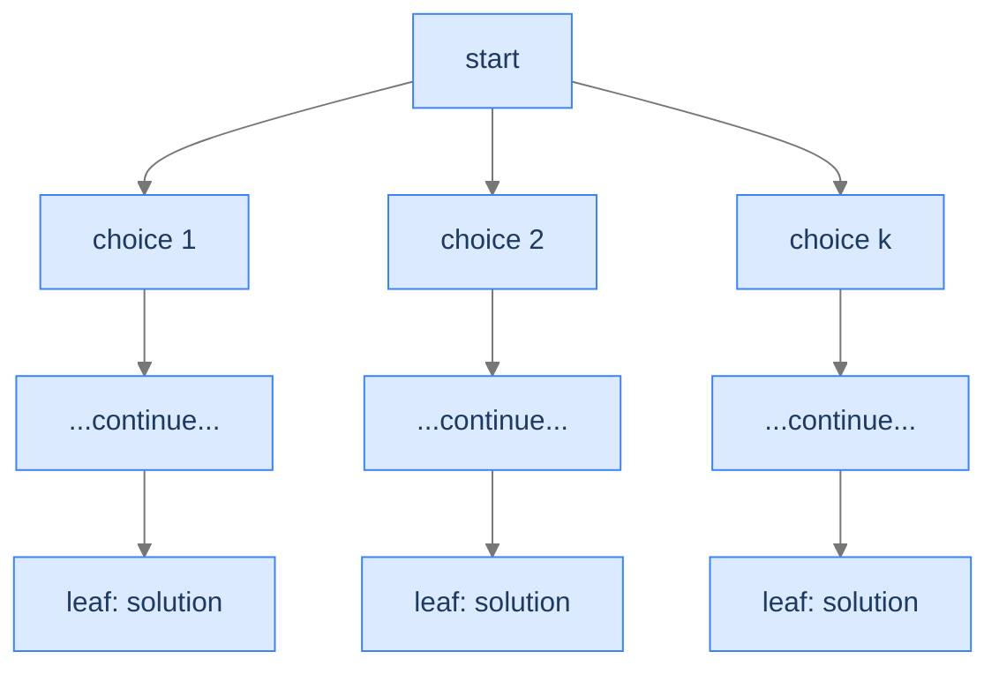
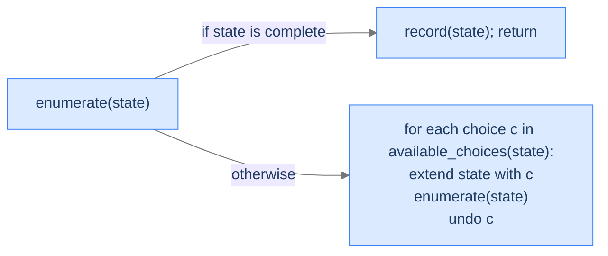
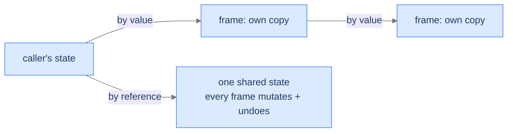
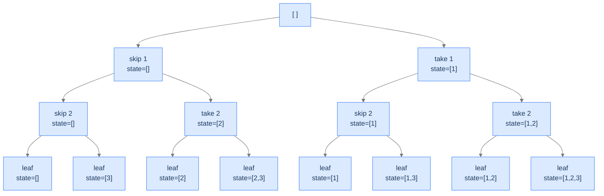
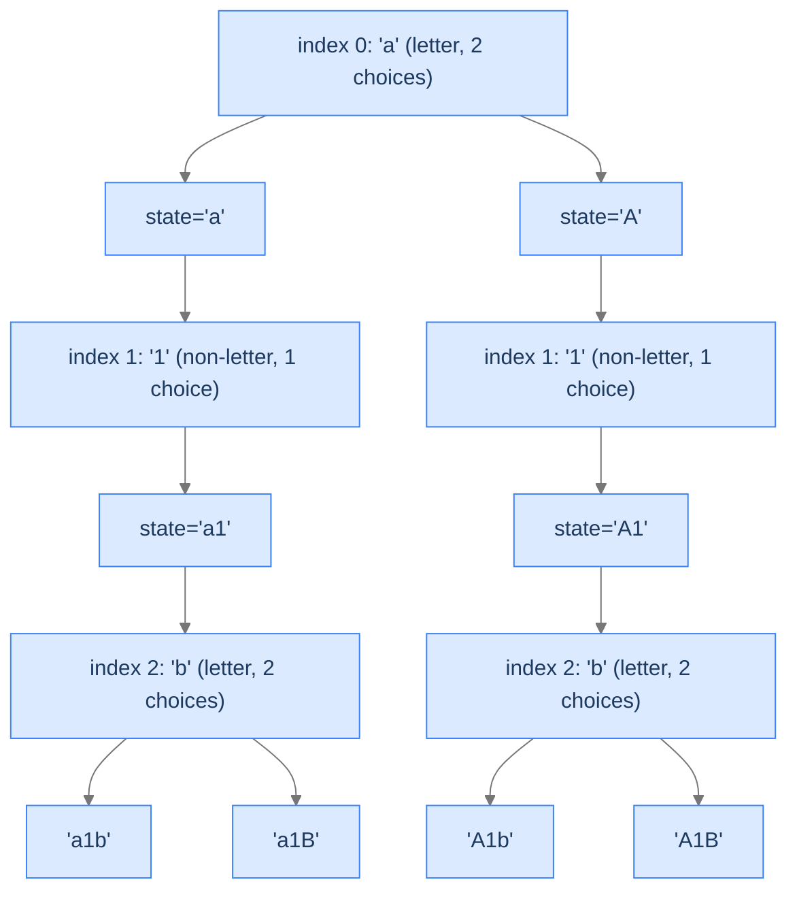
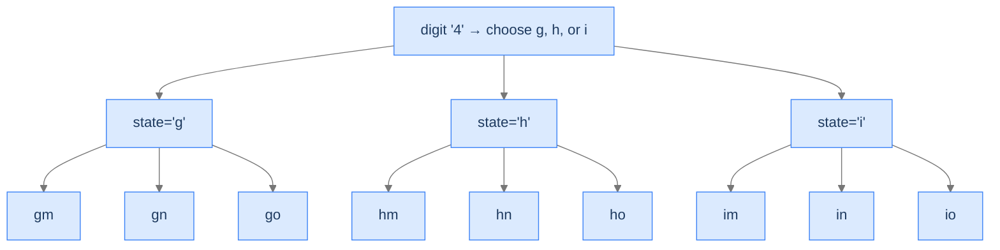

# 2. Pattern: Unconditional Enumeration

You're staring at a problem where the question is *list all the X*. All subsets of an array. All sequences of length `n` from a digit set. All case-toggle variations of a string. Every "all the X" problem has the same structure: there's a *finite* set of candidates; the algorithm has to *visit every one*; nothing about a partial guess can be ruled out before it's complete.

This is **unconditional enumeration** — the simplest of the three backtracking patterns. Every leaf of the state space tree is a valid solution. There's no pruning. No bounding function. The algorithm walks the tree, collects every leaf, returns the lot. The only design decisions you make are *what's a "choice" at each level* and *how do you assemble a leaf into the output*.

By the end of this lesson you'll know the diagnostic checks for unconditional enumeration, the three-line recipe that produces it, and four worked problems that drill the pattern.

## Table of contents

1. [Understanding unconditional enumeration](#understanding-unconditional-enumeration)
2. [Identifying unconditional enumeration](#identifying-unconditional-enumeration)
3. [Unique subsets](#unique-subsets)
4. [Case transformations](#case-transformations)
5. [Number sequence](#number-sequence)
6. [Phone combinations](#phone-combinations)

***

# Understanding Unconditional Enumeration

> **Course:** DSA › Algorithms › Backtracking › Unconditional Enumeration

A backtracking solution exhibits **unconditional enumeration** when **every leaf of the state space tree is a valid solution**. There's no validation function that filters leaves; there's no bounding rule that prunes internal nodes. The algorithm enumerates every candidate the tree can produce, and *all of them count*.

This is exactly the pattern from the introductory phone-password problem. Every 4-digit binary string is a candidate; every leaf gets recorded; the algorithm doesn't say "no" to any leaf. The only difference between problems in this category is the structure of the *choices*: subsets choose include-or-exclude per element, sequences choose a value in `1..k` per slot, phone combinations choose a letter per digit.



<p align="center"><strong>Unconditional enumeration's tree shape: every leaf is recorded; every internal node fans out into <em>all</em> its children. No pruning, no rejection.</strong></p>

The runtime is therefore the *full* tree size. There's no "average case faster than worst case" — every problem in this category does exactly the same work: visit every leaf, record it. The complexity comes entirely from *how many leaves there are* and *how expensive each candidate is to assemble*.

---

## What Unconditional Enumeration Looks Like in Code

The general shape:



<p align="center"><strong>The unconditional-enumeration recipe: when a leaf is reached, record. Otherwise, iterate over choices, extend, recurse, undo.</strong></p>

The pseudocode:

```
function enumerate(state):
    if state is complete:
        record(state)             ← every leaf is a solution
        return

    for choice in available_choices(state):
        extend(state, choice)     ← make a choice
        enumerate(state)          ← recurse
        undo(state)               ← backtrack
```

That `undo(state)` line is the structural backtrack — it puts the state back the way it was before this iteration's `extend()`, so the next iteration's choice starts from the same baseline. In some languages (Python's strings, immutable values) the "undo" is automatic because each recursion level holds its own copy. In others (C++, Rust mutating a vector) you must explicitly `pop_back()` what you just pushed.

> *Predict before reading on — for a problem with `n` slots and `k` choices per slot, how many leaves does the state space tree have? How deep is the recursion?*

`k^n` leaves; recursion depth `n`. The depth grows linearly with `n`; the leaf count grows *exponentially* with `n`. This means: deepening the recursion by 1 doubles (or more) the work — a fact you'll feel viscerally as `n` grows.

---

## Passing Data Down

Two flavours, depending on the language and the size of the partial state:

**By value (immutable per frame):** copy the partial state into the recursive call. Simple, no `undo` step needed — when the function returns, the caller's state is unchanged automatically. The cost is the per-call copy: `O(n)` per call × `O(k^n)` calls = `O(n · k^n)` total work just on copying. For small `n` this is fine.

**By reference (mutated in place):** pass a pointer/reference to a shared partial state. Each frame appends its choice; on return, the next iteration of the for-loop pops it before extending with the next choice. This avoids the `O(n · k^n)` copy overhead but requires explicit `undo`.



<p align="center"><strong>By-value: cleaner, no undo, but O(n) copy per call. By-reference: faster, but requires explicit undo to keep the shared state correct.</strong></p>

Most production backtracking code uses the by-reference style for performance. Most teaching code uses by-value (or per-frame slices) for clarity. We'll use the by-reference style in the four worked problems below, since it makes the explicit `undo` visible.

---

## Passing Data Up

The collected solutions are typically built into a single output container (the **subsets** vector, the **transformations** list, the **sequences** array). Both styles work:

- **Output container shared via reference:** every frame appends complete leaves directly to the same container. Memory-efficient.
- **Output as return value:** each call returns its leaves, parent merges. Cleaner but allocates lots of intermediate lists.

For the same reason as data-down, we use the shared-output-by-reference style throughout.

---

## Algorithm

> **enumerate(state, output)**
>
> 1. **Leaf check** — if `state` is a complete candidate, append a *copy* of it to `output` and return. (Copy because the caller may continue mutating `state` for sibling branches.)
> 2. **Branch** — for each choice in the next-level options:
>    - **Extend** `state` with the choice.
>    - **Recurse** on the extended `state`.
>    - **Undo** the extension (restore `state` to its pre-extension value).

That's the entire recipe. Every problem in this section is a different way of filling in *complete*, *available choices*, *extend*, and *undo*.

---

## Implementation

A clean, language-agnostic implementation of the generic enumeration template — generates all length-`n` sequences over alphabet of size `k`.

<div class="lang-tabs">

```python,editable
from typing import List

class Solution:
    def enumerate_all(self, n: int, k: int) -> List[List[int]]:
        results: List[List[int]] = []
        state: List[int] = []
        self._helper(n, k, state, results)
        return results

    def _helper(self, n: int, k: int, state: List[int], results: List[List[int]]) -> None:
        # Leaf check — every complete state is a solution
        if len(state) == n:
            results.append(state.copy())   # copy: caller will keep mutating `state`
            return

        # Branch over every available choice for this slot
        for choice in range(1, k + 1):
            state.append(choice)            # extend
            self._helper(n, k, state, results)   # recurse
            state.pop()                     # undo


if __name__ == "__main__":
    print(Solution().enumerate_all(2, 2))   # [[1,1], [1,2], [2,1], [2,2]]
```

```java,editable
import java.util.ArrayList;
import java.util.List;

public class Solution {
    public List<List<Integer>> enumerateAll(int n, int k) {
        List<List<Integer>> results = new ArrayList<>();
        List<Integer> state = new ArrayList<>();
        helper(n, k, state, results);
        return results;
    }

    private void helper(int n, int k, List<Integer> state, List<List<Integer>> results) {
        if (state.size() == n) {
            results.add(new ArrayList<>(state));   // copy
            return;
        }
        for (int choice = 1; choice <= k; choice++) {
            state.add(choice);                     // extend
            helper(n, k, state, results);          // recurse
            state.remove(state.size() - 1);        // undo
        }
    }

    public static void main(String[] args) {
        System.out.println(new Solution().enumerateAll(2, 2));   // [[1,1],[1,2],[2,1],[2,2]]
    }
}
```

```c,editable
#include <stdio.h>
#include <stdlib.h>
#include <string.h>

static void helper(int n, int k, int *state, int depth, int **results, int *count) {
    if (depth == n) {
        results[*count] = (int *) malloc(sizeof(int) * n);
        memcpy(results[*count], state, sizeof(int) * n);
        (*count)++;
        return;
    }
    for (int choice = 1; choice <= k; choice++) {
        state[depth] = choice;                /* extend */
        helper(n, k, state, depth + 1, results, count);
        /* implicit undo — next iteration overwrites state[depth] */
    }
}

int main(void) {
    int n = 2, k = 2;
    int total = 1; for (int i = 0; i < n; i++) total *= k;     /* k^n */
    int **results = (int **) malloc(sizeof(int *) * total);
    int *state = (int *) malloc(sizeof(int) * n);
    int count = 0;
    helper(n, k, state, 0, results, &count);
    for (int i = 0; i < count; i++) {
        printf("[");
        for (int j = 0; j < n; j++) printf("%d%s", results[i][j], j + 1 < n ? "," : "");
        printf("]\n");
        free(results[i]);
    }
    free(state); free(results);
    return 0;
}
```

```cpp,editable
#include <iostream>
#include <vector>

class Solution {
public:
    void helper(int n, int k, std::vector<int>& state, std::vector<std::vector<int>>& results) {
        if ((int) state.size() == n) {
            results.push_back(state);                      // copy
            return;
        }
        for (int choice = 1; choice <= k; choice++) {
            state.push_back(choice);                       // extend
            helper(n, k, state, results);                  // recurse
            state.pop_back();                              // undo
        }
    }

    std::vector<std::vector<int>> enumerateAll(int n, int k) {
        std::vector<std::vector<int>> results;
        std::vector<int> state;
        helper(n, k, state, results);
        return results;
    }
};

int main() {
    auto r = Solution{}.enumerateAll(2, 2);
    for (auto& v : r) { for (int x : v) std::cout << x << ' '; std::cout << '\n'; }
}
```

```scala,editable
import scala.collection.mutable.ArrayBuffer

class Solution {
  def enumerateAll(n: Int, k: Int): List[List[Int]] = {
    val results = ArrayBuffer[List[Int]]()
    val state = ArrayBuffer[Int]()
    helper(n, k, state, results)
    results.toList
  }

  private def helper(n: Int, k: Int, state: ArrayBuffer[Int], results: ArrayBuffer[List[Int]]): Unit = {
    if (state.length == n) {
      results += state.toList                              // copy
      return
    }
    for (choice <- 1 to k) {
      state += choice                                       // extend
      helper(n, k, state, results)                          // recurse
      state.remove(state.length - 1)                        // undo
    }
  }
}

object Main {
  def main(args: Array[String]): Unit = println(new Solution().enumerateAll(2, 2))
}
```

```javascript,editable
class Solution {
    enumerateAll(n, k) {
        const results = [];
        const state = [];
        this._helper(n, k, state, results);
        return results;
    }

    _helper(n, k, state, results) {
        if (state.length === n) {
            results.push([...state]);                       // copy
            return;
        }
        for (let choice = 1; choice <= k; choice++) {
            state.push(choice);                             // extend
            this._helper(n, k, state, results);             // recurse
            state.pop();                                    // undo
        }
    }
}

console.log(new Solution().enumerateAll(2, 2));
```

```typescript,editable
class Solution {
    enumerateAll(n: number, k: number): number[][] {
        const results: number[][] = [];
        const state: number[] = [];
        this._helper(n, k, state, results);
        return results;
    }

    private _helper(n: number, k: number, state: number[], results: number[][]): void {
        if (state.length === n) {
            results.push([...state]);
            return;
        }
        for (let choice = 1; choice <= k; choice++) {
            state.push(choice);
            this._helper(n, k, state, results);
            state.pop();
        }
    }
}

console.log(new Solution().enumerateAll(2, 2));
```

```go,editable
package main

import "fmt"

func helper(n, k int, state *[]int, results *[][]int) {
    if len(*state) == n {
        cpy := make([]int, len(*state))
        copy(cpy, *state)
        *results = append(*results, cpy)                   // copy
        return
    }
    for choice := 1; choice <= k; choice++ {
        *state = append(*state, choice)                    // extend
        helper(n, k, state, results)                       // recurse
        *state = (*state)[:len(*state)-1]                  // undo
    }
}

func enumerateAll(n, k int) [][]int {
    results := [][]int{}
    state := []int{}
    helper(n, k, &state, &results)
    return results
}

func main() {
    fmt.Println(enumerateAll(2, 2))
}
```

```kotlin,editable
class Solution {
    fun enumerateAll(n: Int, k: Int): List<List<Int>> {
        val results = mutableListOf<List<Int>>()
        val state = mutableListOf<Int>()
        helper(n, k, state, results)
        return results
    }

    private fun helper(n: Int, k: Int, state: MutableList<Int>, results: MutableList<List<Int>>) {
        if (state.size == n) {
            results.add(state.toList())                    // copy
            return
        }
        for (choice in 1..k) {
            state.add(choice)                              // extend
            helper(n, k, state, results)                   // recurse
            state.removeAt(state.size - 1)                 // undo
        }
    }
}

fun main() {
    println(Solution().enumerateAll(2, 2))
}
```

```rust,editable
fn helper(n: usize, k: i32, state: &mut Vec<i32>, results: &mut Vec<Vec<i32>>) {
    if state.len() == n {
        results.push(state.clone());                       // copy
        return;
    }
    for choice in 1..=k {
        state.push(choice);                                // extend
        helper(n, k, state, results);                      // recurse
        state.pop();                                       // undo
    }
}

fn enumerate_all(n: usize, k: i32) -> Vec<Vec<i32>> {
    let mut results: Vec<Vec<i32>> = Vec::new();
    let mut state: Vec<i32> = Vec::new();
    helper(n, k, &mut state, &mut results);
    results
}

fn main() {
    println!("{:?}", enumerate_all(2, 2));
}
```

</div>

---

## Complexity Analysis

| Resource | Cost | Why |
|---|---|---|
| **Time** | `O(n · k^n)` | `k^n` leaves × `O(n)` to copy each leaf into the output. |
| **Space (output)** | `O(n · k^n)` | The same `k^n` results, each of size `n`. |
| **Space (stack)** | `O(n)` | Recursion depth = number of slots. |

The output dominates. Your algorithm can never be faster than the size of the output it produces — and unconditional enumeration always produces the full tree's leaves. **The pattern is "as fast as it can possibly be" for the problem of "list every X."**

> **Best Case** — Time `O(n · k^n)`, Space `O(n)` (stack)
>
> **Worst Case** — Same as best — input doesn't change tree size

---

## Key Takeaway

Unconditional enumeration is the simplest backtracking pattern: walk the full state space tree, record every leaf, no pruning. The only knobs you turn are *what's a choice at each level* and *how do you copy a leaf into the output*. Now we'll learn how to spot one.

***

# Identifying Unconditional Enumeration

> **Course:** DSA › Algorithms › Backtracking › Unconditional Enumeration

Three diagnostic questions decide whether unconditional enumeration fits.

| # | Question | If "yes," unconditional enumeration fits because... |
|---|---|---|
| **Q1** | Is **every** complete candidate a valid solution? | No filter at the leaf — record everything. |
| **Q2** | Is the candidate built by making **one decision per slot**? | Each level of the tree is one slot's decision. |
| **Q3** | Is there a **fixed number of choices per slot** (or one bounded by the input)? | The branching factor of the tree is well-defined. |

If all three are "yes," you can write the algorithm in three lines: leaf-check, for-loop over choices, recurse with undo.

### Q1 — Why "every leaf is a solution"?

**Mental model.** If *some* leaves are valid and others aren't, you'd need a validation function to filter — that's conditional enumeration (the Conditional Enumeration lesson), not unconditional. Unconditional means "every leaf the tree can produce is correct by construction."

**Concrete check.** Subsets of `[1, 2, 3]`: every subset is a valid output. ✓

**What breaks otherwise.** "Generate balanced parentheses of length 6" — many leaves of the naive tree (like `)))(((`) aren't balanced. You'd need to filter at the leaf or prune internally. That's conditional enumeration, not unconditional.

### Q2 — Why "one decision per slot"?

**Mental model.** The state space tree's depth equals the number of slots. Each level is one slot, each child is one choice. If a single slot involved multiple decisions glued together, the tree wouldn't be uniform and the recipe would need to bend.

**Concrete check.** Phone combinations: each digit is one slot, each letter for that digit is one choice. ✓

**What breaks otherwise.** Problems where the *number* of slots itself depends on a path-specific decision require more elaborate recursion (often the search pattern, the Backtracking Search lesson).

### Q3 — Why "fixed branching factor"?

**Mental model.** If every slot has `k` choices, the tree is `k`-ary and uniform. If different slots have wildly different choice counts (sometimes 2, sometimes 26), the tree is irregular but still tractable — the algorithm doesn't change. The bound is what matters: a finite, computable number of choices per slot.

**Concrete check.** Case transformations: each character has 1 choice (non-alphabetic) or 2 choices (alphabetic). The branching factor varies but is bounded. ✓

**What breaks otherwise.** Problems where the choice space at a slot is "all subsets of unconsumed inputs" or similar combinatorial explosion typically don't fit unconditional enumeration cleanly — you'd want a permutation-aware structure.

---

## A Worked Example — Length-2 Binary Sequences

> *Pause and predict — list all length-2 sequences of 0s and 1s. How many? What does the state space tree look like?*

Four sequences: `[0,0]`, `[0,1]`, `[1,0]`, `[1,1]`. The tree:

```
                 [ ]                  (root)
              /        \
           append 0   append 1
              |          |
            [0]         [1]
           /   \        /  \
         [0,0] [0,1] [1,0] [1,1]      (leaves)
```

Depth 2, 4 leaves, 7 nodes total. The algorithm walks this depth-first. We'll generalise to length `n` with `k` choices per slot in **Problem 3** below.

---

## Key Takeaway

Three checks — every leaf is a solution, one decision per slot, fixed branching factor — gate every unconditional-enumeration problem. Pass all three and the algorithm slides into the three-line template. Four worked problems coming up. The first is the canonical subsets problem; the second introduces a "skip or transform" choice per slot; the third generalises the slot count and branching factor; the fourth maps each slot to a different choice set.

***

# Unique Subsets

> **Course:** DSA › Algorithms › Backtracking › Unconditional Enumeration

The textbook subsets problem. Each element of the input array becomes one slot in the state space tree; each slot has exactly two choices: include or exclude.

---

## The Problem

Given an integer array `arr` containing **unique** elements, return all possible subsets (the power set). The result must not contain duplicates. Subsets can be returned in any order.

```
Input:  arr = [1, 2, 3]
Output: [[], [1], [2], [1,2], [3], [1,3], [2,3], [1,2,3]]

Input:  arr = [1]
Output: [[], [1]]

Input:  arr = []
Output: [[]]
```

---

## What Does "Power Set" Mean Recursively?

For each element of `arr`, you have two choices: **include it in the current subset, or exclude it.** Make this decision once per element, and you've fully specified one subset. There are `n` decisions and `2^n` outcomes — the power set.



<p align="center"><strong>State space tree for subsets of <code>[1, 2, 3]</code>. Depth = 3, leaves = 8 = 2³, every leaf is a valid subset.</strong></p>

---

## Applying the Diagnostic Questions

| # | Check | Answer |
|---|---|---|
| **Q1** | Every leaf a solution? | **Yes** — every subset (including empty) is a valid output. |
| **Q2** | One decision per slot? | **Yes** — one decision per element: include or exclude. |
| **Q3** | Fixed branching factor? | **Yes** — `k = 2` per slot. |

### Q1 — Why "every subset is valid"?

The power set is *defined* as the set of all subsets, including `{}` and the full input. There's no rule that disqualifies any one of them. ✓

### Q2 — Why "one decision per element"?

The recipe for a subset is a sequence of `n` independent yes/no decisions, one per element. The state space tree's depth equals `n`. ✓

### Q3 — Why "branching factor 2"?

Every element has exactly two choices: include or exclude. The tree is binary. ✓

---

## The Include-or-Exclude Strategy (Visualised)

We process elements left-to-right. At each element, the state space splits into two branches. The current "partial subset" lives in a shared mutable list; we push when including, pop when undoing.

<div class="d2-slides" data-caption="Each frame either includes the current element (extend, recurse, then pop to undo) or skips it (just recurse).">

```d2
state: "Start at index 0, current = []" {
  arr: "arr = [1, 2, 3]"
  cur: "current = []" {style.fill: "#dbeafe"; style.stroke: "#3b82f6"}
}
```

```d2
state: "Include 1 — current = [1], recurse on index 1" {
  cur: "current = [1]" {style.fill: "#fde68a"; style.stroke: "#d97706"}
}
```

```d2
state: "Include 2 — current = [1, 2], recurse on index 2" {
  cur: "current = [1, 2]" {style.fill: "#bbf7d0"; style.stroke: "#16a34a"}
}
```

```d2
state: "Include 3 — current = [1, 2, 3] = LEAF, record and return" {
  cur: "current = [1, 2, 3]" {style.fill: "#ede9fe"; style.stroke: "#7c3aed"}
}
```

```d2
state: "Backtrack: pop 3 → current = [1, 2], skip 3, leaf [1, 2]" {
  cur: "current = [1, 2]" {style.fill: "#bbf7d0"; style.stroke: "#16a34a"}
}
```

```d2
state: "...backtrack further, eventually visit all 8 leaves" {
  result: "subsets = [[], [3], [2], [2,3], [1], [1,3], [1,2], [1,2,3]]" {style.fill: "#fde68a"; style.stroke: "#d97706"}
}
```

</div>

---

## The Solution

<div class="lang-tabs">

```python,editable
from typing import List

class Solution:
    def unique_subsets(self, arr: List[int]) -> List[List[int]]:
        results: List[List[int]] = []
        current: List[int] = []
        self._helper(arr, 0, current, results)
        return results

    def _helper(self, arr: List[int], index: int, current: List[int], results: List[List[int]]) -> None:
        # Leaf: every subset is valid; record a copy
        if index == len(arr):
            results.append(current.copy())
            return

        # Choice 1 — include arr[index]
        current.append(arr[index])             # extend
        self._helper(arr, index + 1, current, results)
        current.pop()                           # undo

        # Choice 2 — skip arr[index]
        self._helper(arr, index + 1, current, results)


if __name__ == "__main__":
    print(Solution().unique_subsets([1, 2, 3]))
```

```java,editable
import java.util.ArrayList;
import java.util.List;

public class Solution {
    public List<List<Integer>> uniqueSubsets(int[] arr) {
        List<List<Integer>> results = new ArrayList<>();
        List<Integer> current = new ArrayList<>();
        helper(arr, 0, current, results);
        return results;
    }

    private void helper(int[] arr, int index, List<Integer> current, List<List<Integer>> results) {
        if (index == arr.length) {
            results.add(new ArrayList<>(current));
            return;
        }
        // Include
        current.add(arr[index]);
        helper(arr, index + 1, current, results);
        current.remove(current.size() - 1);
        // Skip
        helper(arr, index + 1, current, results);
    }

    public static void main(String[] args) {
        System.out.println(new Solution().uniqueSubsets(new int[]{1, 2, 3}));
    }
}
```

```c,editable
#include <stdio.h>
#include <stdlib.h>
#include <string.h>

static void helper(int *arr, int n, int index, int *current, int curLen, int **results, int *resCount, int *resLens) {
    if (index == n) {
        results[*resCount] = (int *) malloc(sizeof(int) * curLen);
        memcpy(results[*resCount], current, sizeof(int) * curLen);
        resLens[*resCount] = curLen;
        (*resCount)++;
        return;
    }
    /* Include */
    current[curLen] = arr[index];
    helper(arr, n, index + 1, current, curLen + 1, results, resCount, resLens);
    /* Skip — implicit undo: curLen returns to original on next call */
    helper(arr, n, index + 1, current, curLen, results, resCount, resLens);
}

int main(void) {
    int arr[] = {1, 2, 3};
    int n = 3, total = 1 << n;
    int **results = (int **) malloc(sizeof(int *) * total);
    int *current = (int *) malloc(sizeof(int) * n);
    int *resLens = (int *) calloc(total, sizeof(int));
    int resCount = 0;
    helper(arr, n, 0, current, 0, results, &resCount, resLens);
    for (int i = 0; i < resCount; i++) {
        printf("[");
        for (int j = 0; j < resLens[i]; j++) printf("%d%s", results[i][j], j+1 < resLens[i] ? "," : "");
        printf("]\n");
        free(results[i]);
    }
    free(current); free(results); free(resLens);
    return 0;
}
```

```cpp,editable
#include <iostream>
#include <vector>

class Solution {
public:
    void helper(std::vector<int>& arr, int index, std::vector<int>& current, std::vector<std::vector<int>>& results) {
        if (index == (int) arr.size()) {
            results.push_back(current);
            return;
        }
        current.push_back(arr[index]);                 // include
        helper(arr, index + 1, current, results);
        current.pop_back();                            // undo
        helper(arr, index + 1, current, results);     // skip
    }

    std::vector<std::vector<int>> uniqueSubsets(std::vector<int>& arr) {
        std::vector<std::vector<int>> results;
        std::vector<int> current;
        helper(arr, 0, current, results);
        return results;
    }
};

int main() {
    std::vector<int> arr = {1, 2, 3};
    auto r = Solution{}.uniqueSubsets(arr);
    for (auto& s : r) { std::cout << "["; for (int x : s) std::cout << x << ' '; std::cout << "]\n"; }
}
```

```scala,editable
import scala.collection.mutable.ArrayBuffer

class Solution {
  def uniqueSubsets(arr: Array[Int]): List[List[Int]] = {
    val results = ArrayBuffer[List[Int]]()
    val current = ArrayBuffer[Int]()
    helper(arr, 0, current, results)
    results.toList
  }

  private def helper(arr: Array[Int], index: Int, current: ArrayBuffer[Int], results: ArrayBuffer[List[Int]]): Unit = {
    if (index == arr.length) {
      results += current.toList
      return
    }
    current += arr(index)
    helper(arr, index + 1, current, results)
    current.remove(current.length - 1)
    helper(arr, index + 1, current, results)
  }
}

object Main {
  def main(args: Array[String]): Unit = println(new Solution().uniqueSubsets(Array(1, 2, 3)))
}
```

```javascript,editable
class Solution {
    uniqueSubsets(arr) {
        const results = [];
        const current = [];
        this._helper(arr, 0, current, results);
        return results;
    }

    _helper(arr, index, current, results) {
        if (index === arr.length) {
            results.push([...current]);
            return;
        }
        current.push(arr[index]);
        this._helper(arr, index + 1, current, results);
        current.pop();
        this._helper(arr, index + 1, current, results);
    }
}

console.log(new Solution().uniqueSubsets([1, 2, 3]));
```

```typescript,editable
class Solution {
    uniqueSubsets(arr: number[]): number[][] {
        const results: number[][] = [];
        const current: number[] = [];
        this._helper(arr, 0, current, results);
        return results;
    }

    private _helper(arr: number[], index: number, current: number[], results: number[][]): void {
        if (index === arr.length) {
            results.push([...current]);
            return;
        }
        current.push(arr[index]);
        this._helper(arr, index + 1, current, results);
        current.pop();
        this._helper(arr, index + 1, current, results);
    }
}

console.log(new Solution().uniqueSubsets([1, 2, 3]));
```

```go,editable
package main

import "fmt"

func helper(arr []int, index int, current *[]int, results *[][]int) {
    if index == len(arr) {
        cpy := make([]int, len(*current))
        copy(cpy, *current)
        *results = append(*results, cpy)
        return
    }
    *current = append(*current, arr[index])
    helper(arr, index+1, current, results)
    *current = (*current)[:len(*current)-1]
    helper(arr, index+1, current, results)
}

func uniqueSubsets(arr []int) [][]int {
    results := [][]int{}
    current := []int{}
    helper(arr, 0, &current, &results)
    return results
}

func main() {
    fmt.Println(uniqueSubsets([]int{1, 2, 3}))
}
```

```kotlin,editable
class Solution {
    fun uniqueSubsets(arr: IntArray): List<List<Int>> {
        val results = mutableListOf<List<Int>>()
        val current = mutableListOf<Int>()
        helper(arr, 0, current, results)
        return results
    }

    private fun helper(arr: IntArray, index: Int, current: MutableList<Int>, results: MutableList<List<Int>>) {
        if (index == arr.size) {
            results.add(current.toList())
            return
        }
        current.add(arr[index])
        helper(arr, index + 1, current, results)
        current.removeAt(current.size - 1)
        helper(arr, index + 1, current, results)
    }
}

fun main() {
    println(Solution().uniqueSubsets(intArrayOf(1, 2, 3)))
}
```

```rust,editable
fn helper(arr: &[i32], index: usize, current: &mut Vec<i32>, results: &mut Vec<Vec<i32>>) {
    if index == arr.len() {
        results.push(current.clone());
        return;
    }
    current.push(arr[index]);
    helper(arr, index + 1, current, results);
    current.pop();
    helper(arr, index + 1, current, results);
}

fn unique_subsets(arr: &[i32]) -> Vec<Vec<i32>> {
    let mut results: Vec<Vec<i32>> = Vec::new();
    let mut current: Vec<i32> = Vec::new();
    helper(arr, 0, &mut current, &mut results);
    results
}

fn main() {
    println!("{:?}", unique_subsets(&[1, 2, 3]));
}
```

</div>

<details>
<summary><strong>Trace — arr = [1, 2, 3]</strong></summary>

```
helper(0, [])
├─ include 1 → helper(1, [1])
│  ├─ include 2 → helper(2, [1,2])
│  │  ├─ include 3 → helper(3, [1,2,3]) → leaf → results = [[1,2,3]]
│  │  ├─ undo (pop 3)
│  │  └─ skip 3 → helper(3, [1,2]) → leaf → results = [[1,2,3], [1,2]]
│  ├─ undo (pop 2)
│  └─ skip 2 → helper(2, [1])
│     ├─ include 3 → helper(3, [1,3]) → leaf → results = [..., [1,3]]
│     ├─ undo (pop 3)
│     └─ skip 3 → helper(3, [1]) → leaf → results = [..., [1]]
├─ undo (pop 1)
└─ skip 1 → helper(1, [])
   ├─ include 2 → ... (mirror of above without the 1)
   └─ ...

Final results: [[1,2,3], [1,2], [1,3], [1], [2,3], [2], [3], []]
(8 leaves, in DFS order)
```

</details>

---

## Complexity Analysis

| Resource | Cost | Why |
|---|---|---|
| **Time** | `O(n · 2^n)` | `2^n` subsets × `O(n)` to copy each into the output. |
| **Space (output)** | `O(n · 2^n)` | Total size of all subsets summed. |
| **Space (stack)** | `O(n)` | Recursion depth equals input length. |

The output dominates; you can never be faster than this.

---

## Edge Cases

| Case | Example | Expected | Reasoning |
|---|---|---|---|
| Empty input | `arr = []` | `[[]]` | Only the empty subset; tree has just the root. |
| Single element | `arr = [5]` | `[[], [5]]` | Two leaves. |
| Duplicates in input | `arr = [1, 1]` (problem says unique, but…) | algorithm produces `[[], [1], [1], [1,1]]` — has dupes | The problem statement guarantees unique elements; if not, we'd need to dedupe (a different problem variant). |
| Larger input | `arr = [1..20]` | 2²⁰ ≈ 1M subsets | Output size is the bottleneck. |

---

## Final Takeaway

Unique Subsets is the canonical 2-choice unconditional enumeration: include-or-exclude, depth equals input length, every leaf valid. The next problem applies the same shape but with a *conditional* choice: only some slots have two choices; others are forced.

***

# Case Transformations

> **Course:** DSA › Algorithms › Backtracking › Unconditional Enumeration

The branching factor varies per slot. Letters have 2 choices (toggle or keep); non-letters have 1 choice (keep). Same recipe; different choice generation.

---

## The Problem

Given a string `s`, return every possible string formed by transforming each *letter* (alphabetic character) to either lowercase or uppercase. Non-letters stay as-is. Output may be in any order.

```
Input:  s = "a1b2"
Output: ["a1b2", "a1B2", "A1b2", "A1B2"]

Input:  s = "3z4"
Output: ["3Z4", "3z4"]

Input:  s = "a"
Output: ["a", "A"]
```

---

## What's Different About This Problem?

The branching factor depends on the slot. For a letter, you have two choices: leave it as-is or toggle the case. For a non-letter (digit, symbol), you have one choice: leave it as-is. The state space tree is *non-uniform* but the recipe is identical:



<p align="center"><strong>Tree for <code>s = "a1b2"</code> (showing only first 3 chars). Letter slots branch 2-way; digit slots branch 1-way. The non-uniform tree still produces a clean enumeration.</strong></p>

---

## Applying the Diagnostic Questions

| # | Check | Answer |
|---|---|---|
| **Q1** | Every leaf a solution? | **Yes** — every case-toggle combination is a valid output. |
| **Q2** | One decision per slot? | **Yes** — one decision per character. |
| **Q3** | Fixed (or bounded) branching factor? | **Yes** — 1 for non-letters, 2 for letters; bounded. |

### Q1 — Why "every leaf valid"?

The output is defined as "every possible case combination" — none are excluded. ✓

### Q2 — Why "one decision per character"?

Each character is processed independently. ✓

### Q3 — Why "branching bounded"?

Per-slot branching is either 1 or 2 — bounded by 2. The tree is finite and walkable. ✓

---

## The Solution

<div class="lang-tabs">

```python,editable
from typing import List

class Solution:
    def case_transformations(self, s: str) -> List[str]:
        results: List[str] = []
        current: List[str] = []
        self._helper(s, 0, current, results)
        return results

    def _helper(self, s: str, index: int, current: List[str], results: List[str]) -> None:
        if index == len(s):
            results.append("".join(current))
            return

        ch = s[index]
        # Always: keep original
        current.append(ch)
        self._helper(s, index + 1, current, results)
        current.pop()

        # Letter only: also try toggled
        if ch.isalpha():
            current.append(ch.swapcase())
            self._helper(s, index + 1, current, results)
            current.pop()


if __name__ == "__main__":
    print(Solution().case_transformations("a1b2"))   # ['a1b2', 'a1B2', 'A1b2', 'A1B2']
```

```java,editable
import java.util.ArrayList;
import java.util.List;

public class Solution {
    public List<String> caseTransformations(String s) {
        List<String> results = new ArrayList<>();
        StringBuilder current = new StringBuilder();
        helper(s, 0, current, results);
        return results;
    }

    private void helper(String s, int index, StringBuilder current, List<String> results) {
        if (index == s.length()) {
            results.add(current.toString());
            return;
        }
        char ch = s.charAt(index);

        current.append(ch);
        helper(s, index + 1, current, results);
        current.deleteCharAt(current.length() - 1);

        if (Character.isLetter(ch)) {
            char toggled = Character.isLowerCase(ch) ? Character.toUpperCase(ch) : Character.toLowerCase(ch);
            current.append(toggled);
            helper(s, index + 1, current, results);
            current.deleteCharAt(current.length() - 1);
        }
    }

    public static void main(String[] args) {
        System.out.println(new Solution().caseTransformations("a1b2"));
    }
}
```

```c,editable
#include <stdio.h>
#include <stdlib.h>
#include <string.h>
#include <ctype.h>

static char toggle_case(char c) {
    if (islower((unsigned char) c)) return toupper((unsigned char) c);
    return tolower((unsigned char) c);
}

static void helper(const char *s, int n, int index, char *current, int curLen, char **results, int *count) {
    if (index == n) {
        current[curLen] = '\0';
        results[*count] = strdup(current);
        (*count)++;
        return;
    }
    char ch = s[index];
    current[curLen] = ch;
    helper(s, n, index + 1, current, curLen + 1, results, count);
    if (isalpha((unsigned char) ch)) {
        current[curLen] = toggle_case(ch);
        helper(s, n, index + 1, current, curLen + 1, results, count);
    }
}

int main(void) {
    const char *s = "a1b2";
    int n = 4;
    char **results = (char **) malloc(sizeof(char *) * 100);
    char *current = (char *) malloc(n + 1);
    int count = 0;
    helper(s, n, 0, current, 0, results, &count);
    for (int i = 0; i < count; i++) { printf("%s\n", results[i]); free(results[i]); }
    free(current); free(results);
    return 0;
}
```

```cpp,editable
#include <iostream>
#include <vector>
#include <string>
#include <cctype>

class Solution {
public:
    void helper(const std::string& s, int index, std::string& current, std::vector<std::string>& results) {
        if (index == (int) s.length()) {
            results.push_back(current);
            return;
        }
        char ch = s[index];
        current.push_back(ch);
        helper(s, index + 1, current, results);
        current.pop_back();

        if (std::isalpha((unsigned char) ch)) {
            char toggled = std::islower((unsigned char) ch) ? std::toupper((unsigned char) ch) : std::tolower((unsigned char) ch);
            current.push_back(toggled);
            helper(s, index + 1, current, results);
            current.pop_back();
        }
    }

    std::vector<std::string> caseTransformations(const std::string& s) {
        std::vector<std::string> results;
        std::string current;
        helper(s, 0, current, results);
        return results;
    }
};

int main() {
    auto r = Solution{}.caseTransformations("a1b2");
    for (auto& x : r) std::cout << x << '\n';
}
```

```scala,editable
import scala.collection.mutable.ArrayBuffer

class Solution {
  def caseTransformations(s: String): List[String] = {
    val results = ArrayBuffer[String]()
    val current = new StringBuilder
    helper(s, 0, current, results)
    results.toList
  }

  private def helper(s: String, index: Int, current: StringBuilder, results: ArrayBuffer[String]): Unit = {
    if (index == s.length) {
      results += current.toString()
      return
    }
    val ch = s.charAt(index)
    current.append(ch)
    helper(s, index + 1, current, results)
    current.deleteCharAt(current.length - 1)

    if (ch.isLetter) {
      val toggled = if (ch.isLower) ch.toUpper else ch.toLower
      current.append(toggled)
      helper(s, index + 1, current, results)
      current.deleteCharAt(current.length - 1)
    }
  }
}

object Main {
  def main(args: Array[String]): Unit = println(new Solution().caseTransformations("a1b2"))
}
```

```javascript,editable
class Solution {
    caseTransformations(s) {
        const results = [];
        const current = [];
        this._helper(s, 0, current, results);
        return results;
    }

    _helper(s, index, current, results) {
        if (index === s.length) {
            results.push(current.join(""));
            return;
        }
        const ch = s[index];
        current.push(ch);
        this._helper(s, index + 1, current, results);
        current.pop();

        if (/[a-zA-Z]/.test(ch)) {
            const toggled = ch === ch.toLowerCase() ? ch.toUpperCase() : ch.toLowerCase();
            current.push(toggled);
            this._helper(s, index + 1, current, results);
            current.pop();
        }
    }
}

console.log(new Solution().caseTransformations("a1b2"));
```

```typescript,editable
class Solution {
    caseTransformations(s: string): string[] {
        const results: string[] = [];
        const current: string[] = [];
        this._helper(s, 0, current, results);
        return results;
    }

    private _helper(s: string, index: number, current: string[], results: string[]): void {
        if (index === s.length) {
            results.push(current.join(""));
            return;
        }
        const ch = s[index];
        current.push(ch);
        this._helper(s, index + 1, current, results);
        current.pop();

        if (/[a-zA-Z]/.test(ch)) {
            const toggled = ch === ch.toLowerCase() ? ch.toUpperCase() : ch.toLowerCase();
            current.push(toggled);
            this._helper(s, index + 1, current, results);
            current.pop();
        }
    }
}

console.log(new Solution().caseTransformations("a1b2"));
```

```go,editable
package main

import (
    "fmt"
    "unicode"
)

func helper(s string, index int, current []byte, results *[]string) {
    if index == len(s) {
        *results = append(*results, string(current))
        return
    }
    ch := s[index]
    current = append(current, ch)
    helper(s, index+1, current, results)
    current = current[:len(current)-1]
    if unicode.IsLetter(rune(ch)) {
        var toggled byte
        if unicode.IsLower(rune(ch)) {
            toggled = byte(unicode.ToUpper(rune(ch)))
        } else {
            toggled = byte(unicode.ToLower(rune(ch)))
        }
        current = append(current, toggled)
        helper(s, index+1, current, results)
        current = current[:len(current)-1]
    }
}

func caseTransformations(s string) []string {
    results := []string{}
    helper(s, 0, []byte{}, &results)
    return results
}

func main() {
    fmt.Println(caseTransformations("a1b2"))
}
```

```kotlin,editable
class Solution {
    fun caseTransformations(s: String): List<String> {
        val results = mutableListOf<String>()
        val current = StringBuilder()
        helper(s, 0, current, results)
        return results
    }

    private fun helper(s: String, index: Int, current: StringBuilder, results: MutableList<String>) {
        if (index == s.length) {
            results.add(current.toString())
            return
        }
        val ch = s[index]
        current.append(ch)
        helper(s, index + 1, current, results)
        current.deleteCharAt(current.length - 1)

        if (ch.isLetter()) {
            val toggled = if (ch.isLowerCase()) ch.uppercaseChar() else ch.lowercaseChar()
            current.append(toggled)
            helper(s, index + 1, current, results)
            current.deleteCharAt(current.length - 1)
        }
    }
}

fun main() {
    println(Solution().caseTransformations("a1b2"))
}
```

```rust,editable
fn helper(s: &[u8], index: usize, current: &mut Vec<u8>, results: &mut Vec<String>) {
    if index == s.len() {
        results.push(String::from_utf8(current.clone()).unwrap());
        return;
    }
    let ch = s[index];
    current.push(ch);
    helper(s, index + 1, current, results);
    current.pop();

    if (ch as char).is_alphabetic() {
        let toggled = if (ch as char).is_lowercase() { (ch as char).to_ascii_uppercase() as u8 } else { (ch as char).to_ascii_lowercase() as u8 };
        current.push(toggled);
        helper(s, index + 1, current, results);
        current.pop();
    }
}

fn case_transformations(s: &str) -> Vec<String> {
    let mut results: Vec<String> = Vec::new();
    let mut current: Vec<u8> = Vec::new();
    helper(s.as_bytes(), 0, &mut current, &mut results);
    results
}

fn main() {
    println!("{:?}", case_transformations("a1b2"));
}
```

</div>

<details>
<summary><strong>Trace — s = "a1b"</strong></summary>

```
helper(0, [])
├─ append 'a' → helper(1, ['a'])
│  ├─ append '1' → helper(2, ['a','1'])
│  │  ├─ append 'b' → helper(3, [...,'b']) → leaf → "a1b"
│  │  ├─ pop, append 'B' → helper(3, [...,'B']) → leaf → "a1B"
│  │  └─ pop
│  └─ pop '1'  (only one choice for digit, no second branch)
├─ pop 'a', append 'A' → helper(1, ['A'])
│  └─ ... (mirror)

Final: ['a1b', 'a1B', 'A1b', 'A1B']
```

</details>

---

## Complexity Analysis

| Resource | Cost | Why |
|---|---|---|
| **Time** | `O(n · 2^L)` where `L` = number of letters | `2^L` results × `O(n)` per copy. |
| **Space (output)** | `O(n · 2^L)` | Same reasoning. |
| **Space (stack)** | `O(n)` | Depth = input length. |

Notice: the exponent is the *letter count*, not the string length. Strings with no letters have a single output (`"123" → ["123"]`).

---

## Edge Cases

| Case | Example | Expected |
|---|---|---|
| All letters | `"abc"` | 8 outputs (`2³`). |
| No letters | `"123"` | 1 output (`["123"]`). |
| Empty | `""` | `[""]` — single empty result. |
| Mixed | `"a1b"` | 4 outputs. |
| Already mixed-case | `"aA"` | 4 outputs (each letter toggled independently). |

---

## Final Takeaway

Case Transformations shows unconditional enumeration with a *variable* branching factor per slot. The recipe doesn't change; only the inner `for` loop's range adapts to the current slot. Next, we generalise the slot count and choice set with a numerical sequence problem.

***

# Number Sequence

> **Course:** DSA › Algorithms › Backtracking › Unconditional Enumeration

Both slot count and branching factor become parameters. This is the most general unconditional-enumeration shape in this section.

---

## The Problem

Given non-negative integers `n` and `k`, return all sequences of length `n` whose elements are integers in `[1, k]`. Sequences may repeat values; order may be any.

```
Input:  n = 2, k = 2
Output: [[1,1], [1,2], [2,1], [2,2]]

Input:  n = 3, k = 1
Output: [[1,1,1]]

Input:  n = 1, k = 4
Output: [[1], [2], [3], [4]]
```

---

## What Does the State Space Tree Look Like?

Depth `n`, branching factor `k`, every leaf valid. `k^n` total leaves — exactly the generic enumeration template.

---

## The Solution

<div class="lang-tabs">

```python,editable
from typing import List

class Solution:
    def number_sequence(self, n: int, k: int) -> List[List[int]]:
        results: List[List[int]] = []
        current: List[int] = []
        self._helper(n, k, current, results)
        return results

    def _helper(self, n: int, k: int, current: List[int], results: List[List[int]]) -> None:
        if len(current) == n:
            results.append(current.copy())
            return
        for choice in range(1, k + 1):
            current.append(choice)
            self._helper(n, k, current, results)
            current.pop()


if __name__ == "__main__":
    print(Solution().number_sequence(2, 2))
```

```java,editable
import java.util.ArrayList;
import java.util.List;

public class Solution {
    public List<List<Integer>> numberSequence(int n, int k) {
        List<List<Integer>> results = new ArrayList<>();
        List<Integer> current = new ArrayList<>();
        helper(n, k, current, results);
        return results;
    }

    private void helper(int n, int k, List<Integer> current, List<List<Integer>> results) {
        if (current.size() == n) {
            results.add(new ArrayList<>(current));
            return;
        }
        for (int choice = 1; choice <= k; choice++) {
            current.add(choice);
            helper(n, k, current, results);
            current.remove(current.size() - 1);
        }
    }

    public static void main(String[] args) {
        System.out.println(new Solution().numberSequence(2, 2));
    }
}
```

```c,editable
#include <stdio.h>
#include <stdlib.h>
#include <string.h>

static void helper(int n, int k, int *current, int curLen, int **results, int *count) {
    if (curLen == n) {
        results[*count] = (int *) malloc(sizeof(int) * n);
        memcpy(results[*count], current, sizeof(int) * n);
        (*count)++;
        return;
    }
    for (int choice = 1; choice <= k; choice++) {
        current[curLen] = choice;
        helper(n, k, current, curLen + 1, results, count);
    }
}

int main(void) {
    int n = 2, k = 2;
    int total = 1; for (int i = 0; i < n; i++) total *= k;
    int **results = (int **) malloc(sizeof(int *) * total);
    int *current = (int *) malloc(sizeof(int) * n);
    int count = 0;
    helper(n, k, current, 0, results, &count);
    for (int i = 0; i < count; i++) {
        printf("[");
        for (int j = 0; j < n; j++) printf("%d%s", results[i][j], j+1<n ? "," : "");
        printf("]\n");
        free(results[i]);
    }
    free(current); free(results);
    return 0;
}
```

```cpp,editable
#include <iostream>
#include <vector>

class Solution {
public:
    void helper(int n, int k, std::vector<int>& current, std::vector<std::vector<int>>& results) {
        if ((int) current.size() == n) {
            results.push_back(current);
            return;
        }
        for (int choice = 1; choice <= k; choice++) {
            current.push_back(choice);
            helper(n, k, current, results);
            current.pop_back();
        }
    }

    std::vector<std::vector<int>> numberSequence(int n, int k) {
        std::vector<std::vector<int>> results;
        std::vector<int> current;
        helper(n, k, current, results);
        return results;
    }
};

int main() {
    auto r = Solution{}.numberSequence(2, 2);
    for (auto& s : r) { for (int x : s) std::cout << x << ' '; std::cout << '\n'; }
}
```

```scala,editable
import scala.collection.mutable.ArrayBuffer

class Solution {
  def numberSequence(n: Int, k: Int): List[List[Int]] = {
    val results = ArrayBuffer[List[Int]]()
    val current = ArrayBuffer[Int]()
    helper(n, k, current, results)
    results.toList
  }

  private def helper(n: Int, k: Int, current: ArrayBuffer[Int], results: ArrayBuffer[List[Int]]): Unit = {
    if (current.length == n) {
      results += current.toList
      return
    }
    for (choice <- 1 to k) {
      current += choice
      helper(n, k, current, results)
      current.remove(current.length - 1)
    }
  }
}

object Main {
  def main(args: Array[String]): Unit = println(new Solution().numberSequence(2, 2))
}
```

```javascript,editable
class Solution {
    numberSequence(n, k) {
        const results = [];
        const current = [];
        this._helper(n, k, current, results);
        return results;
    }

    _helper(n, k, current, results) {
        if (current.length === n) {
            results.push([...current]);
            return;
        }
        for (let choice = 1; choice <= k; choice++) {
            current.push(choice);
            this._helper(n, k, current, results);
            current.pop();
        }
    }
}

console.log(new Solution().numberSequence(2, 2));
```

```typescript,editable
class Solution {
    numberSequence(n: number, k: number): number[][] {
        const results: number[][] = [];
        const current: number[] = [];
        this._helper(n, k, current, results);
        return results;
    }

    private _helper(n: number, k: number, current: number[], results: number[][]): void {
        if (current.length === n) {
            results.push([...current]);
            return;
        }
        for (let choice = 1; choice <= k; choice++) {
            current.push(choice);
            this._helper(n, k, current, results);
            current.pop();
        }
    }
}

console.log(new Solution().numberSequence(2, 2));
```

```go,editable
package main

import "fmt"

func helper(n, k int, current *[]int, results *[][]int) {
    if len(*current) == n {
        cpy := make([]int, len(*current))
        copy(cpy, *current)
        *results = append(*results, cpy)
        return
    }
    for choice := 1; choice <= k; choice++ {
        *current = append(*current, choice)
        helper(n, k, current, results)
        *current = (*current)[:len(*current)-1]
    }
}

func numberSequence(n, k int) [][]int {
    results := [][]int{}
    current := []int{}
    helper(n, k, &current, &results)
    return results
}

func main() {
    fmt.Println(numberSequence(2, 2))
}
```

```kotlin,editable
class Solution {
    fun numberSequence(n: Int, k: Int): List<List<Int>> {
        val results = mutableListOf<List<Int>>()
        val current = mutableListOf<Int>()
        helper(n, k, current, results)
        return results
    }

    private fun helper(n: Int, k: Int, current: MutableList<Int>, results: MutableList<List<Int>>) {
        if (current.size == n) {
            results.add(current.toList())
            return
        }
        for (choice in 1..k) {
            current.add(choice)
            helper(n, k, current, results)
            current.removeAt(current.size - 1)
        }
    }
}

fun main() {
    println(Solution().numberSequence(2, 2))
}
```

```rust,editable
fn helper(n: usize, k: i32, current: &mut Vec<i32>, results: &mut Vec<Vec<i32>>) {
    if current.len() == n {
        results.push(current.clone());
        return;
    }
    for choice in 1..=k {
        current.push(choice);
        helper(n, k, current, results);
        current.pop();
    }
}

fn number_sequence(n: usize, k: i32) -> Vec<Vec<i32>> {
    let mut results: Vec<Vec<i32>> = Vec::new();
    let mut current: Vec<i32> = Vec::new();
    helper(n, k, &mut current, &mut results);
    results
}

fn main() {
    println!("{:?}", number_sequence(2, 2));
}
```

</div>

---

## Complexity Analysis

| Resource | Cost |
|---|---|
| **Time** | `O(n · k^n)` |
| **Space (output)** | `O(n · k^n)` |
| **Space (stack)** | `O(n)` |

---

## Edge Cases

| Case | Example | Expected |
|---|---|---|
| `n = 0` | `n = 0, k = 5` | `[[]]` |
| `k = 0` | `n = 2, k = 0` | `[]` (no choices, no leaves) |
| `n = 1` | `n = 1, k = 4` | `[[1], [2], [3], [4]]` |
| Largish | `n = 6, k = 4` | 4096 sequences |

---

## Final Takeaway

Number Sequence is the cleanest demonstration of unconditional enumeration's general shape: depth-`n`, `k`-ary tree, every leaf valid. The next problem maps each slot to a *different* choice set instead of a uniform `[1, k]`.

***

# Phone Combinations

> **Course:** DSA › Algorithms › Backtracking › Unconditional Enumeration

The classic phone-keypad problem. Each digit's set of letters is different — branching factor varies per slot — but every leaf is still a valid output.

---

## The Problem

Given a string `digits` consisting of digits `2`–`9`, return all letter combinations the digits could represent on a phone keypad. Mapping:

| Digit | Letters |
|---|---|
| 2 | abc |
| 3 | def |
| 4 | ghi |
| 5 | jkl |
| 6 | mno |
| 7 | pqrs |
| 8 | tuv |
| 9 | wxyz |

```
Input:  digits = "46"
Output: ["gm", "gn", "go", "hm", "hn", "ho", "im", "in", "io"]

Input:  digits = "28"
Output: ["at", "au", "av", "bt", "bu", "bv", "ct", "cu", "cv"]

Input:  digits = "2"
Output: ["a", "b", "c"]
```

---

## State Space Tree

For `digits = "46"`:



<p align="center"><strong>Tree for <code>digits = "46"</code>. Digit 4's branching factor is 3 (g/h/i); digit 6's branching factor is 3 (m/n/o). Total leaves = 9 = 3 × 3.</strong></p>

---

## The Solution

<div class="lang-tabs">

```python,editable
from typing import List

PHONE_MAP = ["", "", "abc", "def", "ghi", "jkl", "mno", "pqrs", "tuv", "wxyz"]

class Solution:
    def phone_combinations(self, digits: str) -> List[str]:
        if not digits:
            return []
        results: List[str] = []
        current: List[str] = []
        self._helper(digits, 0, current, results)
        return results

    def _helper(self, digits: str, index: int, current: List[str], results: List[str]) -> None:
        if index == len(digits):
            results.append("".join(current))
            return
        for letter in PHONE_MAP[int(digits[index])]:
            current.append(letter)
            self._helper(digits, index + 1, current, results)
            current.pop()


if __name__ == "__main__":
    print(Solution().phone_combinations("46"))
```

```java,editable
import java.util.ArrayList;
import java.util.List;

public class Solution {
    private static final String[] PHONE_MAP = {"", "", "abc", "def", "ghi", "jkl", "mno", "pqrs", "tuv", "wxyz"};

    public List<String> phoneCombinations(String digits) {
        if (digits.isEmpty()) return new ArrayList<>();
        List<String> results = new ArrayList<>();
        StringBuilder current = new StringBuilder();
        helper(digits, 0, current, results);
        return results;
    }

    private void helper(String digits, int index, StringBuilder current, List<String> results) {
        if (index == digits.length()) {
            results.add(current.toString());
            return;
        }
        String letters = PHONE_MAP[digits.charAt(index) - '0'];
        for (char letter : letters.toCharArray()) {
            current.append(letter);
            helper(digits, index + 1, current, results);
            current.deleteCharAt(current.length() - 1);
        }
    }

    public static void main(String[] args) {
        System.out.println(new Solution().phoneCombinations("46"));
    }
}
```

```c,editable
#include <stdio.h>
#include <stdlib.h>
#include <string.h>

static const char *PHONE_MAP[] = {"", "", "abc", "def", "ghi", "jkl", "mno", "pqrs", "tuv", "wxyz"};

static void helper(const char *digits, int n, int index, char *current, int curLen, char **results, int *count) {
    if (index == n) {
        current[curLen] = '\0';
        results[*count] = strdup(current);
        (*count)++;
        return;
    }
    const char *letters = PHONE_MAP[digits[index] - '0'];
    for (int i = 0; letters[i]; i++) {
        current[curLen] = letters[i];
        helper(digits, n, index + 1, current, curLen + 1, results, count);
    }
}

int main(void) {
    const char *digits = "46";
    int n = 2;
    char **results = (char **) malloc(sizeof(char *) * 100);
    char *current = (char *) malloc(n + 1);
    int count = 0;
    helper(digits, n, 0, current, 0, results, &count);
    for (int i = 0; i < count; i++) { printf("%s\n", results[i]); free(results[i]); }
    free(current); free(results);
    return 0;
}
```

```cpp,editable
#include <iostream>
#include <vector>
#include <string>

class Solution {
public:
    const std::vector<std::string> phoneMap = {"", "", "abc", "def", "ghi", "jkl", "mno", "pqrs", "tuv", "wxyz"};

    void helper(const std::string& digits, int index, std::string& current, std::vector<std::string>& results) {
        if (index == (int) digits.length()) {
            results.push_back(current);
            return;
        }
        const std::string& letters = phoneMap[digits[index] - '0'];
        for (char letter : letters) {
            current.push_back(letter);
            helper(digits, index + 1, current, results);
            current.pop_back();
        }
    }

    std::vector<std::string> phoneCombinations(const std::string& digits) {
        if (digits.empty()) return {};
        std::vector<std::string> results;
        std::string current;
        helper(digits, 0, current, results);
        return results;
    }
};

int main() {
    auto r = Solution{}.phoneCombinations("46");
    for (auto& x : r) std::cout << x << '\n';
}
```

```scala,editable
import scala.collection.mutable.ArrayBuffer

class Solution {
  private val phoneMap = Vector("", "", "abc", "def", "ghi", "jkl", "mno", "pqrs", "tuv", "wxyz")

  def phoneCombinations(digits: String): List[String] = {
    if (digits.isEmpty) return List.empty
    val results = ArrayBuffer[String]()
    val current = new StringBuilder
    helper(digits, 0, current, results)
    results.toList
  }

  private def helper(digits: String, index: Int, current: StringBuilder, results: ArrayBuffer[String]): Unit = {
    if (index == digits.length) {
      results += current.toString()
      return
    }
    for (letter <- phoneMap(digits.charAt(index) - '0')) {
      current.append(letter)
      helper(digits, index + 1, current, results)
      current.deleteCharAt(current.length - 1)
    }
  }
}

object Main {
  def main(args: Array[String]): Unit = println(new Solution().phoneCombinations("46"))
}
```

```javascript,editable
const PHONE_MAP = ["", "", "abc", "def", "ghi", "jkl", "mno", "pqrs", "tuv", "wxyz"];

class Solution {
    phoneCombinations(digits) {
        if (!digits) return [];
        const results = [];
        const current = [];
        this._helper(digits, 0, current, results);
        return results;
    }

    _helper(digits, index, current, results) {
        if (index === digits.length) {
            results.push(current.join(""));
            return;
        }
        for (const letter of PHONE_MAP[+digits[index]]) {
            current.push(letter);
            this._helper(digits, index + 1, current, results);
            current.pop();
        }
    }
}

console.log(new Solution().phoneCombinations("46"));
```

```typescript,editable
const PHONE_MAP: string[] = ["", "", "abc", "def", "ghi", "jkl", "mno", "pqrs", "tuv", "wxyz"];

class Solution {
    phoneCombinations(digits: string): string[] {
        if (!digits) return [];
        const results: string[] = [];
        const current: string[] = [];
        this._helper(digits, 0, current, results);
        return results;
    }

    private _helper(digits: string, index: number, current: string[], results: string[]): void {
        if (index === digits.length) {
            results.push(current.join(""));
            return;
        }
        for (const letter of PHONE_MAP[+digits[index]]) {
            current.push(letter);
            this._helper(digits, index + 1, current, results);
            current.pop();
        }
    }
}

console.log(new Solution().phoneCombinations("46"));
```

```go,editable
package main

import "fmt"

var phoneMap = []string{"", "", "abc", "def", "ghi", "jkl", "mno", "pqrs", "tuv", "wxyz"}

func helper(digits string, index int, current []byte, results *[]string) {
    if index == len(digits) {
        *results = append(*results, string(current))
        return
    }
    letters := phoneMap[int(digits[index]-'0')]
    for i := 0; i < len(letters); i++ {
        current = append(current, letters[i])
        helper(digits, index+1, current, results)
        current = current[:len(current)-1]
    }
}

func phoneCombinations(digits string) []string {
    if digits == "" {
        return []string{}
    }
    results := []string{}
    helper(digits, 0, []byte{}, &results)
    return results
}

func main() {
    fmt.Println(phoneCombinations("46"))
}
```

```kotlin,editable
val PHONE_MAP = listOf("", "", "abc", "def", "ghi", "jkl", "mno", "pqrs", "tuv", "wxyz")

class Solution {
    fun phoneCombinations(digits: String): List<String> {
        if (digits.isEmpty()) return emptyList()
        val results = mutableListOf<String>()
        val current = StringBuilder()
        helper(digits, 0, current, results)
        return results
    }

    private fun helper(digits: String, index: Int, current: StringBuilder, results: MutableList<String>) {
        if (index == digits.length) {
            results.add(current.toString())
            return
        }
        for (letter in PHONE_MAP[digits[index] - '0']) {
            current.append(letter)
            helper(digits, index + 1, current, results)
            current.deleteCharAt(current.length - 1)
        }
    }
}

fun main() {
    println(Solution().phoneCombinations("46"))
}
```

```rust,editable
const PHONE_MAP: [&str; 10] = ["", "", "abc", "def", "ghi", "jkl", "mno", "pqrs", "tuv", "wxyz"];

fn helper(digits: &[u8], index: usize, current: &mut Vec<u8>, results: &mut Vec<String>) {
    if index == digits.len() {
        results.push(String::from_utf8(current.clone()).unwrap());
        return;
    }
    let letters = PHONE_MAP[(digits[index] - b'0') as usize];
    for &letter in letters.as_bytes() {
        current.push(letter);
        helper(digits, index + 1, current, results);
        current.pop();
    }
}

fn phone_combinations(digits: &str) -> Vec<String> {
    if digits.is_empty() { return Vec::new(); }
    let mut results: Vec<String> = Vec::new();
    let mut current: Vec<u8> = Vec::new();
    helper(digits.as_bytes(), 0, &mut current, &mut results);
    results
}

fn main() {
    println!("{:?}", phone_combinations("46"));
}
```

</div>

---

## Complexity Analysis

| Resource | Cost |
|---|---|
| **Time** | `O(n · 4^n)` worst case (digits 7 and 9 have 4 letters) |
| **Space (output)** | `O(n · 4^n)` |
| **Space (stack)** | `O(n)` |

---

## Edge Cases

| Case | Example | Expected |
|---|---|---|
| Empty | `""` | `[]` |
| Single digit | `"3"` | `["d", "e", "f"]` |
| All max-branch | `"77"` | 16 outputs (`4²`). |
| Mixed branching | `"23"` | 9 outputs (`3 × 3`). |

---

## Final Takeaway

Phone Combinations is unconditional enumeration with a *slot-specific* choice set. The recipe still applies — only the inner loop reads its choices from a per-slot table. With these four problems, you've now seen unconditional enumeration's full vocabulary: fixed branching, variable branching, parameterised branching, and table-driven branching. The next lesson lifts the central restriction: not every leaf is a solution any more, and we have to *check* on the way.

You came in suspecting backtracking was a single algorithm. You're leaving with the simplest of three patterns named, plus four worked examples that fit the same three-line template. Next we add validation — and with it, the pruning that makes backtracking practical for real-world problems.

**Transfer challenge — try before the Conditional Enumeration lesson:** Generate all permutations of `[1, 2, 3]`. Sketch the state space tree. **Hint:** unlike subsets, each level's choice set is "the elements not yet used." Is this still unconditional enumeration?

<details>
<summary><strong>Answer — open after you've sketched it</strong></summary>

The state space tree for permutations of `[1, 2, 3]` has `3! = 6` leaves. Each level represents a position in the permutation; each child is a choice of "which unused element goes here":

```
                        []                        (root)
              /          |          \
            [1]         [2]         [3]           (level 1)
           /   \       /   \       /   \
        [1,2] [1,3] [2,1] [2,3] [3,1] [3,2]       (level 2)
          |     |     |     |     |     |
       [1,2,3][1,3,2][2,1,3][2,3,1][3,1,2][3,2,1] (level 3 = leaves)
```

This *is* still unconditional enumeration — every leaf is a valid permutation. But notice the **branching factor shrinks** with depth: 3 → 2 → 1, because each used element is removed from the choice pool. The tree is non-uniform but every leaf is valid; the recipe is the same.

**You just sketched a problem that bridges into the Conditional Enumeration lesson.** Permutation-with-constraints (e.g., "permutations whose first element isn't `1`") would be conditional enumeration; constraint-free permutations are unconditional. The structural form of "remove from choice pool, recurse, restore" generalises everywhere.

</details>
