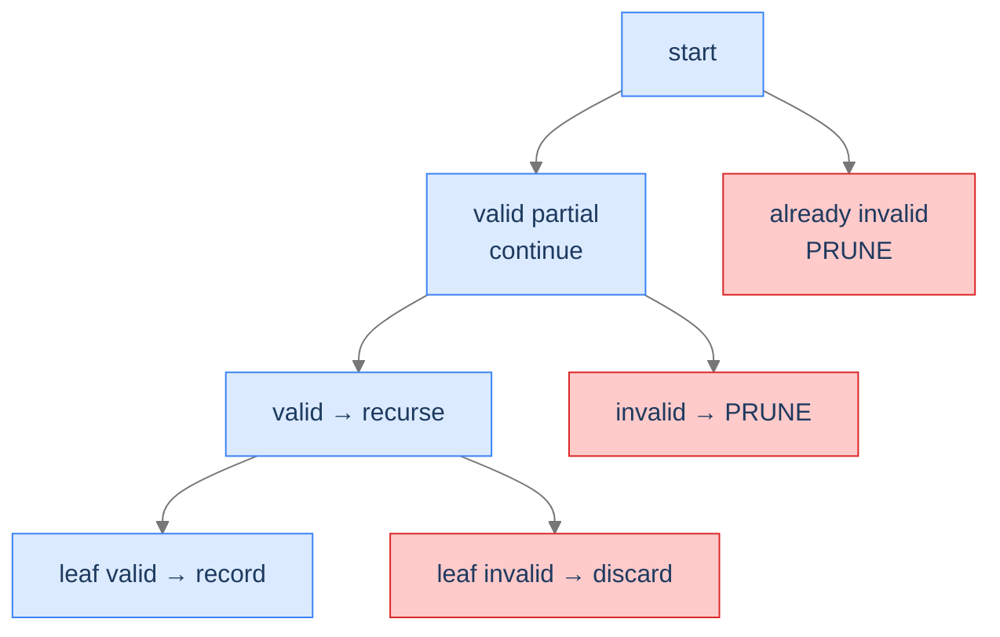
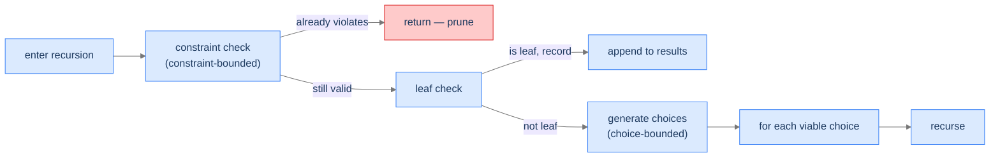
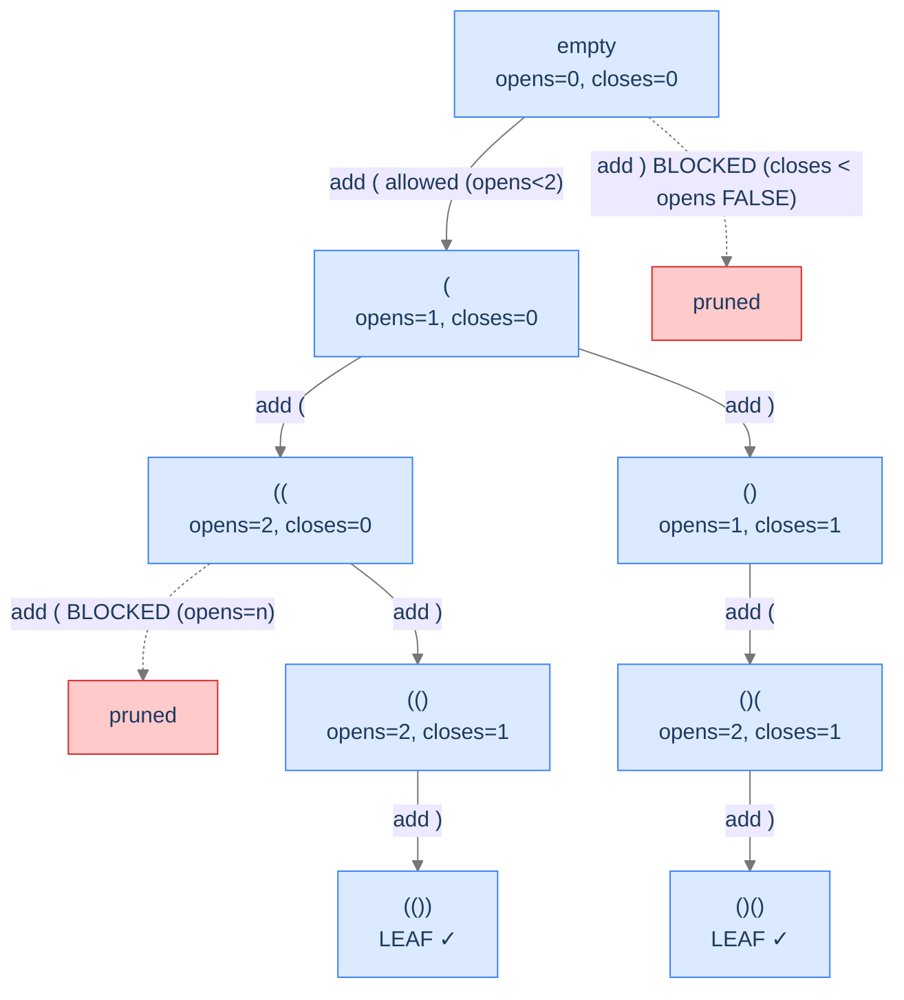
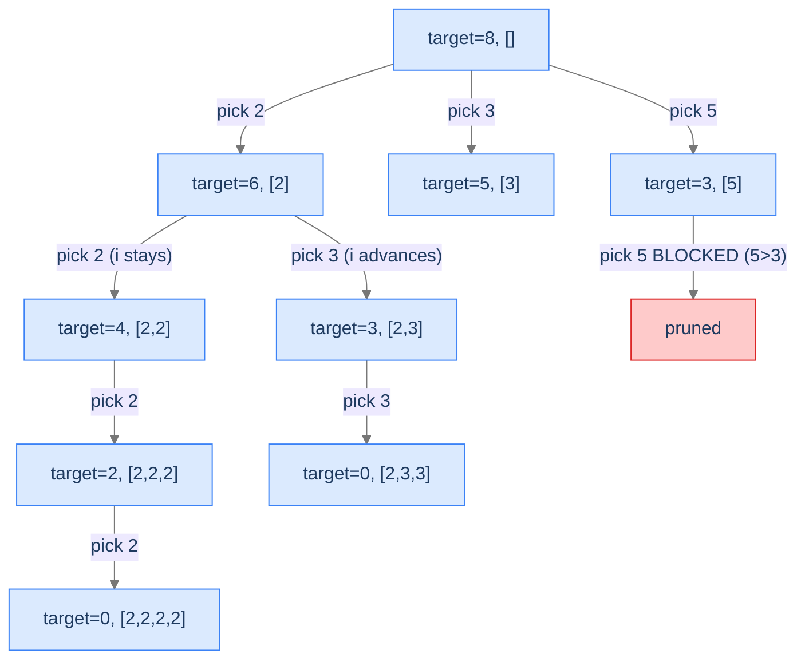
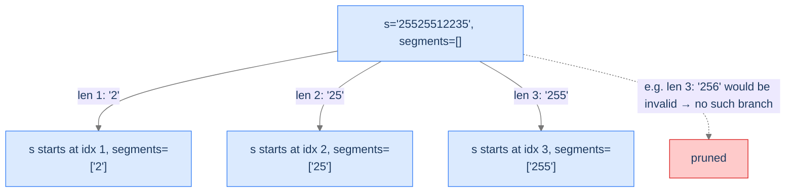
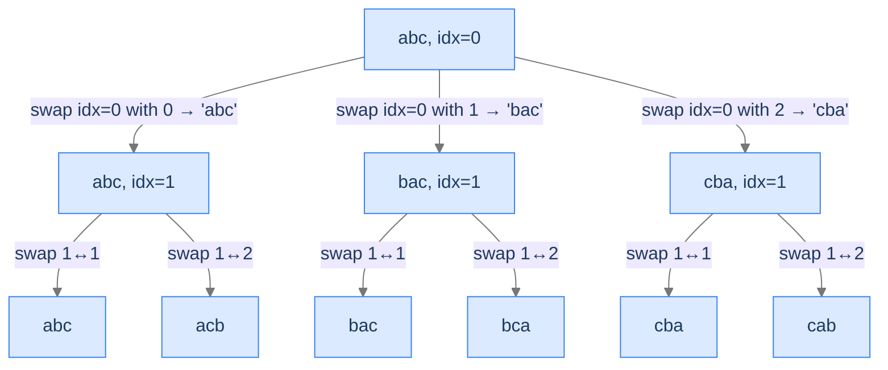

# 3. Pattern: Conditional Enumeration

Unconditional enumeration walks the full state space tree and records every leaf. **Conditional enumeration** does something smarter: at each step, it filters which branches it bothers to explore. Some leaves are valid solutions; others aren't. Some partial guesses can't possibly extend to a valid solution; the algorithm prunes them before walking their subtrees.

The leverage from pruning is exponential. A 2-way decision pruned at depth `d` skips a subtree of `2^(n-d)` leaves. For a tree of depth 30, pruning at depth 10 saves 2²⁰ ≈ 1 million leaves per pruned branch. Multiply by the number of branches you prune and you've turned an intractable brute-force search into something a laptop solves in milliseconds.

By the end of this lesson you'll know what makes a problem "conditional" rather than unconditional, two flavours of pruning (constraint-bounded and choice-bounded), the diagnostic checks for spotting it, and four worked problems that anchor the pattern.

## Table of contents

1. [Understanding conditional enumeration](#understanding-conditional-enumeration)
2. [Identifying conditional enumeration](#identifying-conditional-enumeration)
3. [Generate parentheses](#generate-parentheses)
4. [Target sum combinations](#target-sum-combinations)
5. [Generate IP addresses](#generate-ip-addresses)
6. [String permutations](#string-permutations)

***

# Understanding Conditional Enumeration

> **Course:** DSA › Algorithms › Backtracking › Conditional Enumeration

A backtracking solution exhibits **conditional enumeration** when **some leaves of the state space tree aren't valid solutions** *or* **some internal nodes can be pruned because no descendant of theirs could possibly be valid**. The algorithm validates as it goes, abandons doomed paths early, and only records leaves that survive every check.

The cleanest way to see this is to compare with the unconditional template from the previous lesson. There, *every* leaf was recorded. Here, leaves are recorded only if they pass a validation check, and **internal nodes are pruned** the moment we know they can't extend to a solution.



<p align="center"><strong>Conditional enumeration's tree shape: red nodes are pruned without exploration; green leaves are recorded only if they pass validation. The pruning is the speedup.</strong></p>

The runtime is *no longer* the full tree size. It's the size of the **explored** portion — the portion the pruning didn't cut off. For well-pruned problems, this can be exponentially smaller than the full tree. The pruning function is therefore the heart of every conditional-enumeration solution.

---

## Two Flavours of Pruning

Pruning happens in one of two places, and most problems use both:

**1. Choice-bounded pruning.** When generating choices for the next slot, *don't generate* the ones that would lead to invalid states. The `for` loop only iterates over choices that are still viable.

**2. Constraint-bounded pruning.** Inside the recursion, check the current partial state. If it already violates a constraint, return immediately without recursing further.



<p align="center"><strong>Both kinds of pruning. Choice-bounded never even creates a doomed branch; constraint-bounded checks at the top of the recursion and returns early.</strong></p>

Generate Parentheses below uses choice-bounded pruning (the `getChoices` function only returns characters that won't break balance). Target Sum uses constraint-bounded (skips array entries larger than the remaining target). Most real problems combine both.

---

## What Conditional Enumeration Looks Like in Code

The general shape:

```
function enumerate(state):
    if state already violates a constraint:
        return                              ← constraint-bounded prune

    if state is a complete candidate:
        if state is a valid solution:
            record(state)
        return

    for choice in viable_choices(state):    ← choice-bounded prune happens here
        extend(state, choice)
        enumerate(state)
        undo(state)
```

The two prunes appear in the two highlighted lines. Either one alone is sufficient for some problems; both together is the most powerful form.

> *Predict before reading on — for "all balanced parentheses of length 6" with no pruning at all, how many leaves does the tree have? With perfect pruning, how many leaves are valid?*

Without pruning, length-6 strings of `(` and `)` total `2⁶ = 64` candidates. With pruning, only 5 are balanced (`(((()))`, `(()(())`, `(()()()`, `(())()`, `()()()`). The pruning saves us from generating 59 doomed candidates out of 64 — about 92% of the work.

---

## Passing Data Down

Same options as unconditional: by-value (immutable) or by-reference (mutated, with explicit undo). The conditional case adds **state for constraint checking** — typically a few additional integers (counts, running sum, etc.) that ride along with the partial state.

For Generate Parentheses, the additional state is `(open_count, close_count)`. For Target Sum, it's `remaining_target`. For Generate IPs, it's the position in the string and the count of segments built so far. The auxiliary state is what makes choice-bounded pruning possible — without knowing how many `(` we've placed, we can't decide whether to allow another one.

---

## Algorithm

> **enumerate(state, aux)**
>
> 1. **Constraint check** — if `state` already violates a constraint, return.
> 2. **Leaf check** — if `state` is a complete candidate, validate; if valid, record.
> 3. **Generate viable choices** — compute the set of choices that don't immediately violate any constraint.
> 4. **Branch** — for each viable choice:
>    - Extend `state` and update `aux`.
>    - Recurse.
>    - Undo the extension.

Step 1 is constraint-bounded pruning; step 3 is choice-bounded pruning; step 4 is the same as unconditional. Together they enumerate only the viable portion of the tree.

---

## Implementation

A clean, language-agnostic implementation showing both pruning styles. We'll use Generate Parentheses as the canonical example since it has both flavours visible.

<div class="lang-tabs">

```pseudocode
function generateBalanced(n):
    results ← empty list
    current ← empty list of characters
    helper(n, 0, 0, current, results)
    return results

function helper(n, opens, closes, current, results):
    # Leaf check: 2n characters means a complete candidate.
    # Pruning guarantees every reached leaf is balanced.
    if length(current) = 2 × n:
        append join(current) to results
        return

    # Choice-bounded pruning: emit only choices that keep the prefix valid.
    if opens < n:                           # can still open
        append "(" to current
        helper(n, opens + 1, closes, current, results)
        remove last element of current
    if closes < opens:                      # can close only if an open is unmatched
        append ")" to current
        helper(n, opens, closes + 1, current, results)
        remove last element of current
```

```python,editable
from typing import List

class Solution:
    def generate_balanced(self, n: int) -> List[str]:
        results: List[str] = []
        current: List[str] = []
        self._helper(n, 0, 0, current, results)
        return results

    def _helper(self, n: int, opens: int, closes: int, current: List[str], results: List[str]) -> None:
        # Leaf check: 2n characters means we have a complete candidate.
        # Because of pruning, every leaf reached here is guaranteed balanced.
        if len(current) == 2 * n:
            results.append("".join(current))
            return

        # Choice-bounded pruning: only emit choices that don't immediately
        # violate the balance constraint.
        if opens < n:                         # we can still open
            current.append("(")
            self._helper(n, opens + 1, closes, current, results)
            current.pop()
        if closes < opens:                    # we can close only if there's an open to match
            current.append(")")
            self._helper(n, opens, closes + 1, current, results)
            current.pop()


if __name__ == "__main__":
    print(Solution().generate_balanced(3))
```

```java,editable
import java.util.ArrayList;
import java.util.List;

public class Solution {
    public List<String> generateBalanced(int n) {
        List<String> results = new ArrayList<>();
        StringBuilder current = new StringBuilder();
        helper(n, 0, 0, current, results);
        return results;
    }

    private void helper(int n, int opens, int closes, StringBuilder current, List<String> results) {
        if (current.length() == 2 * n) {
            results.add(current.toString());
            return;
        }
        if (opens < n) {
            current.append('(');
            helper(n, opens + 1, closes, current, results);
            current.deleteCharAt(current.length() - 1);
        }
        if (closes < opens) {
            current.append(')');
            helper(n, opens, closes + 1, current, results);
            current.deleteCharAt(current.length() - 1);
        }
    }

    public static void main(String[] args) {
        System.out.println(new Solution().generateBalanced(3));
    }
}
```

```c,editable
#include <stdio.h>
#include <stdlib.h>
#include <string.h>

static void helper(int n, int opens, int closes, char *current, int curLen, char **results, int *count) {
    if (curLen == 2 * n) {
        current[curLen] = '\0';
        results[*count] = strdup(current);
        (*count)++;
        return;
    }
    if (opens < n) {
        current[curLen] = '(';
        helper(n, opens + 1, closes, current, curLen + 1, results, count);
    }
    if (closes < opens) {
        current[curLen] = ')';
        helper(n, opens, closes + 1, current, curLen + 1, results, count);
    }
}

int main(void) {
    int n = 3;
    char **results = (char **) malloc(sizeof(char *) * 100);
    char *current = (char *) malloc(2 * n + 1);
    int count = 0;
    helper(n, 0, 0, current, 0, results, &count);
    for (int i = 0; i < count; i++) { printf("%s\n", results[i]); free(results[i]); }
    free(current); free(results);
    return 0;
}
```

```cpp,editable
#include <iostream>
#include <vector>
#include <string>

class Solution {
public:
    void helper(int n, int opens, int closes, std::string& current, std::vector<std::string>& results) {
        if ((int) current.length() == 2 * n) {
            results.push_back(current);
            return;
        }
        if (opens < n) {
            current.push_back('(');
            helper(n, opens + 1, closes, current, results);
            current.pop_back();
        }
        if (closes < opens) {
            current.push_back(')');
            helper(n, opens, closes + 1, current, results);
            current.pop_back();
        }
    }

    std::vector<std::string> generateBalanced(int n) {
        std::vector<std::string> results;
        std::string current;
        helper(n, 0, 0, current, results);
        return results;
    }
};

int main() {
    auto r = Solution{}.generateBalanced(3);
    for (auto& s : r) std::cout << s << '\n';
}
```

```scala,editable
import scala.collection.mutable.ArrayBuffer

class Solution {
  def generateBalanced(n: Int): List[String] = {
    val results = ArrayBuffer[String]()
    val current = new StringBuilder
    helper(n, 0, 0, current, results)
    results.toList
  }

  private def helper(n: Int, opens: Int, closes: Int, current: StringBuilder, results: ArrayBuffer[String]): Unit = {
    if (current.length == 2 * n) {
      results += current.toString()
      return
    }
    if (opens < n) {
      current.append('(')
      helper(n, opens + 1, closes, current, results)
      current.deleteCharAt(current.length - 1)
    }
    if (closes < opens) {
      current.append(')')
      helper(n, opens, closes + 1, current, results)
      current.deleteCharAt(current.length - 1)
    }
  }
}

object Main {
  def main(args: Array[String]): Unit = println(new Solution().generateBalanced(3))
}
```

```typescript,editable
class Solution {
    generateBalanced(n: number): string[] {
        const results: string[] = [];
        const current: string[] = [];
        this._helper(n, 0, 0, current, results);
        return results;
    }

    private _helper(n: number, opens: number, closes: number, current: string[], results: string[]): void {
        if (current.length === 2 * n) {
            results.push(current.join(""));
            return;
        }
        if (opens < n) {
            current.push("(");
            this._helper(n, opens + 1, closes, current, results);
            current.pop();
        }
        if (closes < opens) {
            current.push(")");
            this._helper(n, opens, closes + 1, current, results);
            current.pop();
        }
    }
}

console.log(new Solution().generateBalanced(3));
```

```go,editable
package main

import "fmt"

func helper(n, opens, closes int, current []byte, results *[]string) {
    if len(current) == 2*n {
        *results = append(*results, string(current))
        return
    }
    if opens < n {
        current = append(current, '(')
        helper(n, opens+1, closes, current, results)
        current = current[:len(current)-1]
    }
    if closes < opens {
        current = append(current, ')')
        helper(n, opens, closes+1, current, results)
        current = current[:len(current)-1]
    }
}

func generateBalanced(n int) []string {
    results := []string{}
    helper(n, 0, 0, []byte{}, &results)
    return results
}

func main() {
    fmt.Println(generateBalanced(3))
}
```

```rust,editable
fn helper(n: usize, opens: usize, closes: usize, current: &mut Vec<u8>, results: &mut Vec<String>) {
    if current.len() == 2 * n {
        results.push(String::from_utf8(current.clone()).unwrap());
        return;
    }
    if opens < n {
        current.push(b'(');
        helper(n, opens + 1, closes, current, results);
        current.pop();
    }
    if closes < opens {
        current.push(b')');
        helper(n, opens, closes + 1, current, results);
        current.pop();
    }
}

fn generate_balanced(n: usize) -> Vec<String> {
    let mut results: Vec<String> = Vec::new();
    let mut current: Vec<u8> = Vec::new();
    helper(n, 0, 0, &mut current, &mut results);
    results
}

fn main() {
    println!("{:?}", generate_balanced(3));
}
```

</div>

---

## Complexity Analysis

| Resource | Cost | Why |
|---|---|---|
| **Time** | `O(n · C(n))` where `C(n)` is the n-th Catalan number | The `n`-th Catalan number counts well-formed parentheses of `n` pairs. Each leaf takes `O(n)` to copy. |
| **Space (output)** | `O(n · C(n))` | Same argument. |
| **Space (stack)** | `O(n)` | Recursion depth equals number of pairs. |

The Catalan number `C(n) ≈ 4^n / n^1.5` — vastly smaller than the unpruned `2^(2n)` tree. The pruning saves us roughly a factor of `n^1.5`.

> **Best Case** — Time `O(n · C(n))`, Space `O(n · C(n))`
>
> **Worst Case** — Same — pruning is deterministic; no input variation changes the tree size

---

## Key Takeaway

Conditional enumeration adds *pruning* to the unconditional template. Two flavours: choice-bounded (don't even generate doomed choices) and constraint-bounded (return early when state is already invalid). The pruning is exponential leverage. Now we'll learn how to spot conditional enumeration on sight.

***

# Identifying Conditional Enumeration

> **Course:** DSA › Algorithms › Backtracking › Conditional Enumeration

Three diagnostic questions decide whether conditional enumeration fits.

| # | Question | If "yes," conditional enumeration fits because... |
|---|---|---|
| **Q1** | Are some complete candidates *invalid*? | We need a validation step at the leaf — that's what makes it conditional. |
| **Q2** | Can a *partial* candidate be detected as already-doomed before completion? | Internal-node pruning is possible — the speedup. |
| **Q3** | Is the candidate built by **incremental decisions** like in unconditional? | The same recipe applies, just with extra checks. |

If all three are "yes," you're in conditional enumeration's sweet spot — same template as unconditional, plus pruning.

### Q1 — Why "some leaves are invalid"?

**Mental model.** If every leaf is automatically valid, you don't need a validation function and conditional enumeration's machinery is overkill — go back to unconditional. Conditional enumeration's value comes from the leaf-validation check that filters bad outcomes.

**Concrete check.** Generate Parentheses: many length-`2n` strings of `(` and `)` aren't balanced. ✓

**What breaks otherwise.** If every leaf is valid, the validation step at the leaf is wasted code. Just use unconditional.

### Q2 — Why "doomed-partial detection"?

**Mental model.** Pruning is possible only if a partial state can be classified as "no descendant of this state can possibly be valid." If you can't classify partial states, you have to walk the whole tree and check at the leaves only — which is still correct but loses the pruning speedup.

**Concrete check.** Generate Parentheses: a partial string with more `)` than `(` (e.g., `())`) can never extend to a balanced one. Detect this early; prune. ✓

**What breaks otherwise.** Without partial-state pruning, you're paying full unconditional cost for the search even though some leaves get rejected. Inefficient but still correct.

### Q3 — Why "incremental decisions"?

**Mental model.** The state space tree must still be built one decision at a time, just like unconditional. The pruning happens *between* decisions, not as a replacement for the decision-making structure.

**Concrete check.** Target Sum Combinations: pick a number, recurse with reduced target; pick the next number; recurse with further-reduced target. Same incremental shape as unconditional. ✓

**What breaks otherwise.** If the candidate isn't built incrementally (e.g., a single closed-form computation), backtracking isn't the right pattern at all.

---

## A Worked Example — Generate Strings With Property X

> *Pause and predict — for the problem "generate all length-6 strings of `(` and `)` that are balanced," sketch the state space tree without pruning. How many leaves? How many of those are balanced?*

Without pruning, `2⁶ = 64` candidate strings. With balance-checking only at the leaf, we'd generate all 64 and reject 59. That's the unconditional approach with leaf validation.

With pruning, we keep two counters during the descent: `opens` (number of `(`) and `closes` (number of `)`). At any step, if `closes > opens`, the partial string is already unbalanced — prune the subtree without exploring.

```
At the partial string '()(',  opens=2, closes=1:
  - We can add '(' if opens < 3.  ✓ (2 < 3)
  - We can add ')' if closes < opens. ✓ (1 < 2)

At the partial string '()))', opens=1, closes=3:
  - opens < closes — IMPOSSIBLE state. PRUNE. (we never reach this node in the pruned tree.)
```

Result: only the 5 balanced strings are walked to leaves; the other 59 are pruned at various depths. We make this concrete in **Problem 1** below.

---

## Key Takeaway

Three checks — invalid-leaf possibility, partial-state pruning possibility, incremental decisions — gate every conditional-enumeration problem. Pass all three and the algorithm slides in. Four worked problems coming up. The first introduces partial-state pruning via counters; the second adds constraint-bounded pruning; the third combines both with multi-segment validation; the fourth uses a permutation-flavoured swap-and-undo recipe.

***

# Generate Parentheses

> **Course:** DSA › Algorithms › Backtracking › Conditional Enumeration

The canonical conditional-enumeration problem. Both flavours of pruning visible side-by-side: choice-bounded (only emit `(` if there's room; only emit `)` if there's an open to match) and the implicit constraint-bounded (no separate check needed, because the choice-bounded prune handles it).

---

## The Problem

Given a positive integer `n`, return all combinations of well-formed parentheses with exactly `n` pairs. Output may be in any order.

```
Input:  n = 2
Output: ["(())", "()()"]

Input:  n = 1
Output: ["()"]

Input:  n = 0
Output: []
```

---

## What Does "Well-Formed" Mean Recursively?

A balanced sequence of parentheses obeys two invariants at every prefix:
1. **`opens ≥ closes`** at every position. (You can't have more `)` than `(` so far — that would mean an unmatched `)`.)
2. **`opens == closes` and `opens == n` at the end.** (Equal counts and `n` pairs total.)

Pruning happens by enforcing invariant 1 *during* construction. Whenever we'd add a `)` that violates `closes < opens`, we don't even try.



<p align="center"><strong>State space tree for <code>n = 2</code> with pruning. Red branches are never explored. Out of <code>2⁴ = 16</code> possible length-4 strings, only 2 are balanced — and we generate exactly those 2.</strong></p>

---

## Applying the Diagnostic Questions

| # | Check | Answer |
|---|---|---|
| **Q1** | Some leaves invalid? | **Yes** — most random `(`/`)` strings aren't balanced. |
| **Q2** | Doomed-partial detectable? | **Yes** — `closes > opens` partway through is already invalid. |
| **Q3** | Incremental decisions? | **Yes** — one character per decision. |

### Q1 — Why "many leaves invalid"?

For length `2n`, there are `2^(2n)` total candidates. The number of balanced ones is the `n`-th Catalan number, roughly `4^n / n^1.5` — much smaller. The vast majority are invalid. ✓

### Q2 — Why "early-detect doomed partials"?

The invariant `closes ≤ opens` must hold at *every* prefix of a balanced string. Violating it once means *no* extension can recover; every descendant of that partial state is doomed. Perfect pruning candidate. ✓

### Q3 — Why "incremental"?

We build the string one character at a time. The state at depth `d` is the prefix of length `d`. Same shape as unconditional enumeration. ✓

---

## The Pruned-DFS Strategy (Visualised)

We maintain two counters — `opens` and `closes` — and decide at each step which next characters are viable:

- Adding `(` is viable iff `opens < n`.
- Adding `)` is viable iff `closes < opens`.

If neither is viable (which never happens during a properly running search but is the boundary condition), we'd return without recursing. With `n` pairs, the leaves are exactly the `2n`-length strings the search reaches; every one is balanced because we prevented imbalance at every step.

---

## The Solution

The implementation in 10 languages was already shown in the [Implementation](#implementation) section above (where we used Generate Parentheses as the canonical example for the conditional-enumeration template). We restate the Python here to keep this section self-contained, then provide the trace.

```python,editable
class Solution:
    def generate_parentheses(self, n: int):
        results = []
        current = []
        self._helper(n, 0, 0, current, results)
        return results

    def _helper(self, n, opens, closes, current, results):
        if len(current) == 2 * n:
            results.append("".join(current))
            return
        if opens < n:                                  # choice-bounded prune
            current.append("(")
            self._helper(n, opens + 1, closes, current, results)
            current.pop()
        if closes < opens:                             # choice-bounded prune
            current.append(")")
            self._helper(n, opens, closes + 1, current, results)
            current.pop()


print(Solution().generate_parentheses(3))   # ['((()))', '(()())', '(())()', '()(())', '()()()']
```

For the implementations in the other 9 languages, see the [Implementation](#implementation) section at the top of this lesson (the function name there is `generateBalanced` — same logic).

<details>
<summary><strong>Trace — n = 2</strong></summary>

```
helper("", opens=0, closes=0)
├─ '(' allowed (0 < 2)
│  helper("(", opens=1, closes=0)
│  ├─ '(' allowed (1 < 2)
│  │  helper("((", opens=2, closes=0)
│  │  ├─ '(' BLOCKED (opens not < 2)
│  │  └─ ')' allowed (0 < 2)
│  │     helper("(()", opens=2, closes=1)
│  │     ├─ '(' BLOCKED
│  │     └─ ')' allowed (1 < 2)
│  │        helper("(())", opens=2, closes=2)  → leaf, record "(())"
│  └─ ')' allowed (0 < 1)
│     helper("()", opens=1, closes=1)
│     ├─ '(' allowed (1 < 2)
│     │  helper("()(", opens=2, closes=1)
│     │  ├─ '(' BLOCKED
│     │  └─ ')' allowed
│     │     helper("()()", opens=2, closes=2) → leaf, record "()()"
│     └─ ')' BLOCKED (closes not < opens; 1 not < 1)

Result: ["(())", "()()"]  (only 2 leaves ever reached, vs 16 unpruned)
```

</details>

---

## Complexity Analysis

| Resource | Cost |
|---|---|
| **Time** | `O(n · C(n))` where `C(n)` is the n-th Catalan number |
| **Space (output)** | `O(n · C(n))` |
| **Space (stack)** | `O(n)` |

Catalan numbers: `C(0)=1, C(1)=1, C(2)=2, C(3)=5, C(4)=14, C(5)=42, C(6)=132, ..., C(n) ≈ 4^n / (n^1.5 √π)`.

---

## Edge Cases

| Case | Example | Expected |
|---|---|---|
| `n = 0` | `[]` | No pairs, no balanced strings (or `[""]` depending on convention; we return `[]`). |
| `n = 1` | `["()"]` | Only one balanced sequence. |
| `n = 3` | `["((()))", "(()())", "(())()", "()(())", "()()()"]` | 5 sequences = `C(3)`. |

---

## Final Takeaway

Generate Parentheses is the textbook example of choice-bounded pruning. Two counters in the recursion's parameters; two prune-checks before each recursive call. The next problem flips to constraint-bounded pruning: instead of checking what's *allowable* before generating, we check what's *over-budget* on entry.

***

# Target Sum Combinations

> **Course:** DSA › Algorithms › Backtracking › Conditional Enumeration

Find all combinations of array elements (with repetition) that sum to a target. Constraint-bounded pruning: stop the recursion the moment the partial sum *exceeds* the target.

---

## The Problem

Given an array `arr` of distinct positive integers and a positive integer `target`, return all unique combinations whose elements sum to `target`. The same number from `arr` may be reused. Two combinations are *unique* if they differ in the multiplicities of the chosen numbers.

```
Input:  arr = [2, 3, 5], target = 8
Output: [[2,2,2,2], [2,3,3], [3,5]]

Input:  arr = [2, 3, 6, 7], target = 7
Output: [[2,2,3], [7]]

Input:  arr = [1, 2, 3], target = 4
Output: [[1,1,1,1], [1,1,2], [1,3], [2,2]]
```

---

## What Pruning Helps Here?

Two prunes:
1. **Skip overshoots.** If `arr[i] > remaining_target`, choosing `arr[i]` would push the partial sum past the target. Skip.
2. **Early termination.** If `remaining_target == 0`, the partial sum exactly hits the target. Record the combination and return — no further children to explore.

A third structural trick avoids generating duplicate combinations: **only consider candidates from the current index onward.** This forces a canonical order on the chosen numbers (non-decreasing in input order) so that `[2, 3, 3]` is generated but `[3, 2, 3]` and `[3, 3, 2]` aren't.



<p align="center"><strong>Tree (partial) for <code>arr = [2, 3, 5], target = 8</code>. The "pick 5 with 3 remaining" branch is pruned — 5 overshoots. The recursion uses <code>i</code> to enforce non-decreasing order.</strong></p>

---

## Applying the Diagnostic Questions

| # | Check | Answer |
|---|---|---|
| **Q1** | Some leaves invalid? | **Yes** — overshooting partial sums and the wrong target totals. |
| **Q2** | Doomed-partial detectable? | **Yes** — partial sum exceeding target is unrecoverable (positive numbers only). |
| **Q3** | Incremental decisions? | **Yes** — one element added per call. |

### Q1 — Why "many partials invalid"?

Most ways of summing array elements don't hit the target exactly. We must filter. ✓

### Q2 — Why "overshoot is doom"?

Since `arr` contains only positive integers, adding any element strictly increases the partial sum. Once the sum exceeds the target, no future addition can decrease it back. The branch is dead. ✓

### Q3 — Why "incremental"?

Each recursive call picks one element to add. ✓

---

## The Constrained-Sum Strategy (Visualised)

The state at each call is `(remaining_target, current_combination, start_index)`. The `start_index` enforces non-decreasing order; the `remaining_target` shrinks per addition; the `current_combination` accumulates the picks.

The recursion's three branches:
1. `remaining_target == 0` → record `current_combination`, return.
2. `remaining_target < 0` → prune (won't happen because we skip overshooting elements before recursing).
3. Otherwise → for each `i` from `start_index` to `len(arr) - 1`, if `arr[i] ≤ remaining_target`, append `arr[i]`, recurse with `remaining_target - arr[i]` and `start_index = i` (allowing reuse), undo.

---

## The Solution

<div class="lang-tabs">

```pseudocode
function targetSumCombinations(arr, target):
    arr ← sort(arr)                     # canonical order makes the prune-on-overshoot work
    results ← empty list
    current ← empty list
    helper(arr, target, 0, current, results)
    return results

function helper(arr, remaining, start, current, results):
    if remaining = 0:                   # leaf — exact sum found
        append a copy of current to results
        return

    for i from start to length(arr) − 1:
        if arr[i] > remaining:
            break                       # sorted: every larger element also overshoots
        append arr[i] to current
        helper(arr, remaining − arr[i], i, current, results)   # i (not i+1): reuse allowed
        remove last element of current
```

```python,editable
from typing import List

class Solution:
    def target_sum_combinations(self, arr: List[int], target: int) -> List[List[int]]:
        arr = sorted(arr)                          # canonical order for the trick to work
        results: List[List[int]] = []
        current: List[int] = []
        self._helper(arr, target, 0, current, results)
        return results

    def _helper(self, arr: List[int], remaining: int, start: int, current: List[int], results: List[List[int]]) -> None:
        # Leaf — exact sum found, record
        if remaining == 0:
            results.append(current.copy())
            return

        for i in range(start, len(arr)):
            if arr[i] > remaining:                # constraint-bounded prune
                break                              # sorted, so all larger; safe to break
            current.append(arr[i])
            self._helper(arr, remaining - arr[i], i, current, results)   # i (not i+1): reuse allowed
            current.pop()


if __name__ == "__main__":
    print(Solution().target_sum_combinations([2, 3, 5], 8))
```

```java,editable
import java.util.ArrayList;
import java.util.Arrays;
import java.util.List;

public class Solution {
    public List<List<Integer>> targetSumCombinations(int[] arr, int target) {
        Arrays.sort(arr);
        List<List<Integer>> results = new ArrayList<>();
        List<Integer> current = new ArrayList<>();
        helper(arr, target, 0, current, results);
        return results;
    }

    private void helper(int[] arr, int remaining, int start, List<Integer> current, List<List<Integer>> results) {
        if (remaining == 0) {
            results.add(new ArrayList<>(current));
            return;
        }
        for (int i = start; i < arr.length; i++) {
            if (arr[i] > remaining) break;        // sorted → break
            current.add(arr[i]);
            helper(arr, remaining - arr[i], i, current, results);
            current.remove(current.size() - 1);
        }
    }

    public static void main(String[] args) {
        System.out.println(new Solution().targetSumCombinations(new int[]{2, 3, 5}, 8));
    }
}
```

```c,editable
#include <stdio.h>
#include <stdlib.h>
#include <string.h>

static int cmp(const void *a, const void *b) { return *(int*)a - *(int*)b; }

static void helper(int *arr, int n, int remaining, int start, int *current, int curLen, int **results, int *count, int *resLens) {
    if (remaining == 0) {
        results[*count] = (int *) malloc(sizeof(int) * curLen);
        memcpy(results[*count], current, sizeof(int) * curLen);
        resLens[*count] = curLen;
        (*count)++;
        return;
    }
    for (int i = start; i < n; i++) {
        if (arr[i] > remaining) break;
        current[curLen] = arr[i];
        helper(arr, n, remaining - arr[i], i, current, curLen + 1, results, count, resLens);
    }
}

int main(void) {
    int arr[] = {2, 3, 5};
    int n = 3, target = 8;
    qsort(arr, n, sizeof(int), cmp);
    int **results = (int **) malloc(sizeof(int *) * 100);
    int *current = (int *) malloc(sizeof(int) * 50);
    int *resLens = (int *) calloc(100, sizeof(int));
    int count = 0;
    helper(arr, n, target, 0, current, 0, results, &count, resLens);
    for (int i = 0; i < count; i++) {
        printf("[");
        for (int j = 0; j < resLens[i]; j++) printf("%d%s", results[i][j], j+1<resLens[i] ? "," : "");
        printf("]\n");
        free(results[i]);
    }
    free(current); free(results); free(resLens);
    return 0;
}
```

```cpp,editable
#include <iostream>
#include <vector>
#include <algorithm>

class Solution {
public:
    void helper(std::vector<int>& arr, int remaining, int start, std::vector<int>& current, std::vector<std::vector<int>>& results) {
        if (remaining == 0) {
            results.push_back(current);
            return;
        }
        for (int i = start; i < (int) arr.size(); i++) {
            if (arr[i] > remaining) break;
            current.push_back(arr[i]);
            helper(arr, remaining - arr[i], i, current, results);
            current.pop_back();
        }
    }

    std::vector<std::vector<int>> targetSumCombinations(std::vector<int>& arr, int target) {
        std::sort(arr.begin(), arr.end());
        std::vector<std::vector<int>> results;
        std::vector<int> current;
        helper(arr, target, 0, current, results);
        return results;
    }
};

int main() {
    std::vector<int> arr = {2, 3, 5};
    auto r = Solution{}.targetSumCombinations(arr, 8);
    for (auto& v : r) { std::cout << "["; for (int x : v) std::cout << x << ' '; std::cout << "]\n"; }
}
```

```scala,editable
import scala.collection.mutable.ArrayBuffer

class Solution {
  def targetSumCombinations(arr: Array[Int], target: Int): List[List[Int]] = {
    val sorted = arr.sorted
    val results = ArrayBuffer[List[Int]]()
    val current = ArrayBuffer[Int]()
    helper(sorted, target, 0, current, results)
    results.toList
  }

  private def helper(arr: Array[Int], remaining: Int, start: Int, current: ArrayBuffer[Int], results: ArrayBuffer[List[Int]]): Unit = {
    if (remaining == 0) {
      results += current.toList
      return
    }
    var i = start
    while (i < arr.length && arr(i) <= remaining) {
      current += arr(i)
      helper(arr, remaining - arr(i), i, current, results)
      current.remove(current.length - 1)
      i += 1
    }
  }
}

object Main {
  def main(args: Array[String]): Unit = println(new Solution().targetSumCombinations(Array(2, 3, 5), 8))
}
```

```typescript,editable
class Solution {
    targetSumCombinations(arr: number[], target: number): number[][] {
        arr = [...arr].sort((a, b) => a - b);
        const results: number[][] = [];
        const current: number[] = [];
        this._helper(arr, target, 0, current, results);
        return results;
    }

    private _helper(arr: number[], remaining: number, start: number, current: number[], results: number[][]): void {
        if (remaining === 0) {
            results.push([...current]);
            return;
        }
        for (let i = start; i < arr.length; i++) {
            if (arr[i] > remaining) break;
            current.push(arr[i]);
            this._helper(arr, remaining - arr[i], i, current, results);
            current.pop();
        }
    }
}

console.log(new Solution().targetSumCombinations([2, 3, 5], 8));
```

```go,editable
package main

import (
    "fmt"
    "sort"
)

func helper(arr []int, remaining, start int, current *[]int, results *[][]int) {
    if remaining == 0 {
        cpy := make([]int, len(*current))
        copy(cpy, *current)
        *results = append(*results, cpy)
        return
    }
    for i := start; i < len(arr); i++ {
        if arr[i] > remaining {
            break
        }
        *current = append(*current, arr[i])
        helper(arr, remaining-arr[i], i, current, results)
        *current = (*current)[:len(*current)-1]
    }
}

func targetSumCombinations(arr []int, target int) [][]int {
    sort.Ints(arr)
    results := [][]int{}
    current := []int{}
    helper(arr, target, 0, &current, &results)
    return results
}

func main() {
    fmt.Println(targetSumCombinations([]int{2, 3, 5}, 8))
}
```

```rust,editable
fn helper(arr: &[i32], remaining: i32, start: usize, current: &mut Vec<i32>, results: &mut Vec<Vec<i32>>) {
    if remaining == 0 {
        results.push(current.clone());
        return;
    }
    for i in start..arr.len() {
        if arr[i] > remaining { break; }
        current.push(arr[i]);
        helper(arr, remaining - arr[i], i, current, results);
        current.pop();
    }
}

fn target_sum_combinations(arr: &[i32], target: i32) -> Vec<Vec<i32>> {
    let mut sorted = arr.to_vec();
    sorted.sort();
    let mut results: Vec<Vec<i32>> = Vec::new();
    let mut current: Vec<i32> = Vec::new();
    helper(&sorted, target, 0, &mut current, &mut results);
    results
}

fn main() {
    println!("{:?}", target_sum_combinations(&[2, 3, 5], 8));
}
```

</div>

<details>
<summary><strong>Trace — arr = [2, 3, 5], target = 8</strong></summary>

```
helper(rem=8, start=0, current=[])
├─ i=0, pick 2 → helper(rem=6, start=0, current=[2])
│  ├─ pick 2 → helper(rem=4, start=0, current=[2,2])
│  │  ├─ pick 2 → helper(rem=2, start=0, current=[2,2,2])
│  │  │  ├─ pick 2 → helper(rem=0, ..., [2,2,2,2]) → record [2,2,2,2]
│  │  │  ├─ pick 3 → 3 > 2 → BREAK (no more for this loop)
│  │  ├─ pick 3 → helper(rem=1, start=1, current=[2,2,3])
│  │  │  ├─ pick 3 → 3 > 1 → BREAK
│  │  ├─ pick 5 → 5 > 4 → BREAK
│  ├─ pick 3 → helper(rem=3, start=1, current=[2,3])
│  │  ├─ pick 3 → helper(rem=0, ..., [2,3,3]) → record [2,3,3]
│  │  ├─ pick 5 → 5 > 3 → BREAK
│  ├─ pick 5 → 5 > 4 → BREAK
├─ i=1, pick 3 → helper(rem=5, start=1, current=[3])
│  ├─ pick 3 → helper(rem=2, start=1, current=[3,3])
│  │  ├─ pick 3 → 3 > 2 → BREAK
│  │  ├─ pick 5 → 5 > 2 → BREAK
│  ├─ pick 5 → helper(rem=0, ..., [3,5]) → record [3,5]
├─ i=2, pick 5 → helper(rem=3, start=2, current=[5])
│  ├─ pick 5 → 5 > 3 → BREAK

Result: [[2,2,2,2], [2,3,3], [3,5]] ✓
```

</details>

---

## Complexity Analysis

| Resource | Cost | Why |
|---|---|---|
| **Time** | `O(arr.length^(target/min(arr)))` worst case | Hard to bound tightly; depends on how aggressively pruning fires. |
| **Space (output)** | `O(combinations × avg_combination_length)` | Total size of all valid combos. |
| **Space (stack)** | `O(target / min(arr))` | Deepest recursion = longest combination = target divided by smallest element. |

The two-pronged pruning (sort + `break` on overshoot) typically reduces the search by orders of magnitude vs unpruned brute force.

---

## Edge Cases

| Case | Example | Expected |
|---|---|---|
| `target = 0` | any input | `[[]]` (one empty combination). |
| All elements > target | `[5, 6], target = 3` | `[]`. |
| One-element solution | `[7, 2], target = 7` | `[[7], [2,2,2]]` (after sorting). |
| Large target | `[1], target = 100` | `[[1] * 100]`. |

---

## Final Takeaway

Target Sum Combinations introduces constraint-bounded pruning at its cleanest: a `break` in the loop the moment future iterations would also overshoot. Combined with the index-based de-duplication trick, this is the canonical "find all sums" pattern. The next problem combines several constraints — leading-zero rejection, value-range checks, segment count — for a multi-pronged validation.

***

# Generate IP Addresses

> **Course:** DSA › Algorithms › Backtracking › Conditional Enumeration

A digit string can split into an IPv4 address in many ways, but most splits produce invalid octets. Validation per segment + segment-count constraint = several pruning rules combined.

---

## The Problem

Given a digit string `s`, return all valid IPv4 addresses formed by inserting three dots. An address has exactly 4 segments, each in `[0, 255]`, with no leading zeros (so `0.0.0.0` is fine but `01.0.0.0` is not).

```
Input:  s = "25525512235"
Output: ["255.255.12.235", "255.255.122.35"]

Input:  s = "025511135"
Output: ["0.255.11.135", "0.255.111.35"]

Input:  s = "789"
Output: []
```

---

## What's the Recursion Doing?

We're choosing where to place the three dots inside the string. Equivalently, we're picking the *length* of each segment (1, 2, or 3 characters), one at a time, until we've consumed all 4 segments.

Three pruning rules:
1. **Segment length bounded.** Segment length must be 1, 2, or 3.
2. **Leading zeros forbidden** (except a literal `"0"`).
3. **Numeric value bounded.** Segment value must be in `[0, 255]`.

Plus the structural constraint: **exactly 4 segments must consume exactly all of `s`** — neither too few nor too many.



<p align="center"><strong>At each level, three potential segment lengths (1, 2, or 3 chars). Each is validated before recursing — invalid segments produce no branch.</strong></p>

---

## Applying the Diagnostic Questions

| # | Check | Answer |
|---|---|---|
| **Q1** | Some leaves invalid? | **Yes** — most splits don't produce valid IPv4 addresses. |
| **Q2** | Doomed-partial detectable? | **Yes** — invalid segment, leading-zero, or wrong segment count caught early. |
| **Q3** | Incremental decisions? | **Yes** — one segment per recursion level. |

### Q1 — Why "many leaves invalid"?

Most random splits produce segments outside `[0, 255]` or with leading zeros. ✓

### Q2 — Why "early detection"?

We can validate each segment as we extract it. Invalid → don't recurse. The other prune is segment-count: if we've placed 4 segments but haven't consumed all of `s`, that path is dead — return without recording. ✓

### Q3 — Why "incremental"?

Each recursion picks one more segment. ✓

---

## The Solution

<div class="lang-tabs">

```pseudocode
function generateIpAddresses(s):
    results ← empty list
    segments ← empty list
    helper(s, 0, segments, results)
    return results

function helper(s, index, segments, results):
    # Leaf — 4 segments built; they must consume *all* of s.
    if length(segments) = 4:
        if index = length(s):
            append join(segments, ".") to results
        return                                     # constraint-bounded prune

    # Try every viable next segment length (1, 2, or 3).
    for length from 1 to 3:
        if index + length > length(s):
            break                                  # ran off the end
        part ← substring of s from index to index + length
        if isValidPart(part):                      # choice-bounded prune
            append part to segments
            helper(s, index + length, segments, results)
            remove last element of segments

function isValidPart(part):
    if length(part) > 1 AND part[0] = '0':
        return false                               # leading zero is illegal
    return 0 ≤ toInteger(part) ≤ 255
```

```python,editable
from typing import List

class Solution:
    def generate_ip_addresses(self, s: str) -> List[str]:
        results: List[str] = []
        segments: List[str] = []
        self._helper(s, 0, segments, results)
        return results

    def _helper(self, s: str, index: int, segments: List[str], results: List[str]) -> None:
        # Leaf — 4 segments built; they must consume *all* of s
        if len(segments) == 4:
            if index == len(s):
                results.append(".".join(segments))
            return                                  # constraint-bounded prune

        # Try every viable next segment length (1, 2, or 3)
        for length in (1, 2, 3):
            if index + length > len(s):
                break                               # ran off the end
            part = s[index:index + length]
            if self._is_valid_part(part):           # choice-bounded prune
                segments.append(part)
                self._helper(s, index + length, segments, results)
                segments.pop()

    @staticmethod
    def _is_valid_part(part: str) -> bool:
        if len(part) > 1 and part[0] == "0":
            return False                            # leading zero
        return 0 <= int(part) <= 255


if __name__ == "__main__":
    print(Solution().generate_ip_addresses("25525512235"))
```

```java,editable
import java.util.ArrayList;
import java.util.List;

public class Solution {
    public List<String> generateIPAddresses(String s) {
        List<String> results = new ArrayList<>();
        List<String> segments = new ArrayList<>();
        helper(s, 0, segments, results);
        return results;
    }

    private void helper(String s, int index, List<String> segments, List<String> results) {
        if (segments.size() == 4) {
            if (index == s.length()) {
                results.add(String.join(".", segments));
            }
            return;
        }
        for (int length = 1; length <= 3; length++) {
            if (index + length > s.length()) break;
            String part = s.substring(index, index + length);
            if (isValidPart(part)) {
                segments.add(part);
                helper(s, index + length, segments, results);
                segments.remove(segments.size() - 1);
            }
        }
    }

    private boolean isValidPart(String part) {
        if (part.length() > 1 && part.charAt(0) == '0') return false;
        int value = Integer.parseInt(part);
        return value >= 0 && value <= 255;
    }

    public static void main(String[] args) {
        System.out.println(new Solution().generateIPAddresses("25525512235"));
    }
}
```

```c,editable
#include <stdio.h>
#include <stdlib.h>
#include <string.h>

static int is_valid_part(const char *part) {
    int len = (int) strlen(part);
    if (len > 1 && part[0] == '0') return 0;
    int v = atoi(part);
    return v >= 0 && v <= 255;
}

static void helper(const char *s, int n, int index, char segs[4][4], int segCount, char **results, int *count) {
    if (segCount == 4) {
        if (index == n) {
            char buf[20];
            snprintf(buf, sizeof(buf), "%s.%s.%s.%s", segs[0], segs[1], segs[2], segs[3]);
            results[*count] = strdup(buf);
            (*count)++;
        }
        return;
    }
    for (int length = 1; length <= 3; length++) {
        if (index + length > n) break;
        char part[4];
        strncpy(part, s + index, length);
        part[length] = '\0';
        if (is_valid_part(part)) {
            strcpy(segs[segCount], part);
            helper(s, n, index + length, segs, segCount + 1, results, count);
        }
    }
}

int main(void) {
    const char *s = "25525512235";
    int n = (int) strlen(s);
    char segs[4][4];
    char **results = (char **) malloc(sizeof(char *) * 100);
    int count = 0;
    helper(s, n, 0, segs, 0, results, &count);
    for (int i = 0; i < count; i++) { printf("%s\n", results[i]); free(results[i]); }
    free(results);
    return 0;
}
```

```cpp,editable
#include <iostream>
#include <vector>
#include <string>

class Solution {
public:
    bool isValidPart(const std::string& part) {
        if (part.length() > 1 && part[0] == '0') return false;
        int value = std::stoi(part);
        return value >= 0 && value <= 255;
    }

    void helper(const std::string& s, int index, std::vector<std::string>& segments, std::vector<std::string>& results) {
        if ((int) segments.size() == 4) {
            if (index == (int) s.length()) {
                std::string ip = segments[0] + "." + segments[1] + "." + segments[2] + "." + segments[3];
                results.push_back(ip);
            }
            return;
        }
        for (int length = 1; length <= 3; length++) {
            if (index + length > (int) s.length()) break;
            std::string part = s.substr(index, length);
            if (isValidPart(part)) {
                segments.push_back(part);
                helper(s, index + length, segments, results);
                segments.pop_back();
            }
        }
    }

    std::vector<std::string> generateIPAddresses(const std::string& s) {
        std::vector<std::string> results;
        std::vector<std::string> segments;
        helper(s, 0, segments, results);
        return results;
    }
};

int main() {
    auto r = Solution{}.generateIPAddresses("25525512235");
    for (auto& x : r) std::cout << x << '\n';
}
```

```scala,editable
import scala.collection.mutable.ArrayBuffer

class Solution {
  def generateIPAddresses(s: String): List[String] = {
    val results = ArrayBuffer[String]()
    val segments = ArrayBuffer[String]()
    helper(s, 0, segments, results)
    results.toList
  }

  private def helper(s: String, index: Int, segments: ArrayBuffer[String], results: ArrayBuffer[String]): Unit = {
    if (segments.length == 4) {
      if (index == s.length) results += segments.mkString(".")
      return
    }
    var length = 1
    while (length <= 3 && index + length <= s.length) {
      val part = s.substring(index, index + length)
      if (isValidPart(part)) {
        segments += part
        helper(s, index + length, segments, results)
        segments.remove(segments.length - 1)
      }
      length += 1
    }
  }

  private def isValidPart(part: String): Boolean = {
    if (part.length > 1 && part.charAt(0) == '0') return false
    val v = part.toInt
    v >= 0 && v <= 255
  }
}

object Main {
  def main(args: Array[String]): Unit = println(new Solution().generateIPAddresses("25525512235"))
}
```

```typescript,editable
class Solution {
    generateIPAddresses(s: string): string[] {
        const results: string[] = [];
        const segments: string[] = [];
        this._helper(s, 0, segments, results);
        return results;
    }

    private _helper(s: string, index: number, segments: string[], results: string[]): void {
        if (segments.length === 4) {
            if (index === s.length) results.push(segments.join("."));
            return;
        }
        for (let length = 1; length <= 3; length++) {
            if (index + length > s.length) break;
            const part = s.substring(index, index + length);
            if (this._isValidPart(part)) {
                segments.push(part);
                this._helper(s, index + length, segments, results);
                segments.pop();
            }
        }
    }

    private _isValidPart(part: string): boolean {
        if (part.length > 1 && part[0] === "0") return false;
        const v = parseInt(part, 10);
        return v >= 0 && v <= 255;
    }
}

console.log(new Solution().generateIPAddresses("25525512235"));
```

```go,editable
package main

import (
    "fmt"
    "strconv"
    "strings"
)

func isValidPart(part string) bool {
    if len(part) > 1 && part[0] == '0' {
        return false
    }
    v, _ := strconv.Atoi(part)
    return v >= 0 && v <= 255
}

func helper(s string, index int, segments *[]string, results *[]string) {
    if len(*segments) == 4 {
        if index == len(s) {
            *results = append(*results, strings.Join(*segments, "."))
        }
        return
    }
    for length := 1; length <= 3; length++ {
        if index+length > len(s) {
            break
        }
        part := s[index : index+length]
        if isValidPart(part) {
            *segments = append(*segments, part)
            helper(s, index+length, segments, results)
            *segments = (*segments)[:len(*segments)-1]
        }
    }
}

func generateIPAddresses(s string) []string {
    results := []string{}
    segments := []string{}
    helper(s, 0, &segments, &results)
    return results
}

func main() {
    fmt.Println(generateIPAddresses("25525512235"))
}
```

```rust,editable
fn is_valid_part(part: &str) -> bool {
    if part.len() > 1 && part.starts_with('0') { return false; }
    match part.parse::<i32>() {
        Ok(v) => (0..=255).contains(&v),
        Err(_) => false,
    }
}

fn helper(s: &str, index: usize, segments: &mut Vec<String>, results: &mut Vec<String>) {
    if segments.len() == 4 {
        if index == s.len() {
            results.push(segments.join("."));
        }
        return;
    }
    for length in 1..=3 {
        if index + length > s.len() { break; }
        let part = &s[index..index + length];
        if is_valid_part(part) {
            segments.push(part.to_string());
            helper(s, index + length, segments, results);
            segments.pop();
        }
    }
}

fn generate_ip_addresses(s: &str) -> Vec<String> {
    let mut results: Vec<String> = Vec::new();
    let mut segments: Vec<String> = Vec::new();
    helper(s, 0, &mut segments, &mut results);
    results
}

fn main() {
    println!("{:?}", generate_ip_addresses("25525512235"));
}
```

</div>

<details>
<summary><strong>Trace — s = "25525512235"</strong></summary>

```
helper(idx=0, segs=[])
├─ try '2'   → valid → recurse(idx=1, ['2'])      ... eventually fails (too many chars left)
├─ try '25'  → valid → recurse(idx=2, ['25'])     ... eventually fails
├─ try '255' → valid → recurse(idx=3, ['255'])
│  ├─ try '2'   → valid → recurse(idx=4, ['255','2'])     ... eventually fails
│  ├─ try '25'  → valid → recurse(idx=5, ['255','25'])    ... eventually fails
│  ├─ try '255' → valid → recurse(idx=6, ['255','255'])
│  │  ├─ try '1'   → valid → recurse(idx=7, ['255','255','1'])
│  │  │  ├─ try '2'    → recurse(8, [...,'2'])      ... fails (too many chars)
│  │  │  ├─ try '22'   → recurse(9, [...,'22'])     ... fails (too many)
│  │  │  ├─ try '223'  → recurse(10, [...,'223'])   ... fails (too many)
│  │  ├─ try '12'  → valid → recurse(idx=8, ['255','255','12'])
│  │  │  ├─ try '2'    → recurse(9, [...,'2'])     leaf, idx=9 ≠ 11 → discard
│  │  │  ├─ try '23'   → recurse(10, [...,'23'])   leaf, idx=10 ≠ 11 → discard
│  │  │  ├─ try '235'  → recurse(11, [...,'235'])  leaf, idx=11=11 → RECORD "255.255.12.235"
│  │  ├─ try '122' → valid → recurse(idx=9, ['255','255','122'])
│  │  │  ├─ try '3'    → recurse(10, [...,'3'])    leaf, idx=10 ≠ 11 → discard
│  │  │  ├─ try '35'   → recurse(11, [...,'35'])   leaf, idx=11=11 → RECORD "255.255.122.35"

Result: ["255.255.12.235", "255.255.122.35"]
```

</details>

---

## Complexity Analysis

| Resource | Cost | Why |
|---|---|---|
| **Time** | `O(81 · n)` = `O(n)` | At most `3⁴ = 81` ways to split into 4 segments; each takes `O(n)` to validate and join. |
| **Space (output)** | `O(n × num_results)` | Up to 81 results × ~16 chars each. |
| **Space (stack)** | `O(1)` (depth ≤ 4) | Constant — IP addresses always have 4 segments. |

The constant depth is unusual; most backtracking has linear depth. The bound here is the *fixed* number of segments.

---

## Edge Cases

| Case | Example | Expected |
|---|---|---|
| Too short | `"12"` | `[]` (can't split into 4 segments). |
| Too long | `"123456789012345"` | `[]` (every split has at least one over-3-char segment). |
| All zeros | `"0000"` | `["0.0.0.0"]`. |
| Leading zeros | `"010010"` | `["0.10.0.10"]` (others have leading zeros). |
| Boundary 255 | `"255255255255"` | `["255.255.255.255"]`. |

---

## Final Takeaway

Generate IPs combines several pruning rules: per-segment validation, segment-count constraint, total-length constraint. The recipe still fits the conditional-enumeration template — only the validation function gets richer. The next problem swaps the *style* of recursion: instead of "build an output one piece at a time," we *swap* characters in place to generate permutations.

***

# String Permutations

> **Course:** DSA › Algorithms › Backtracking › Conditional Enumeration

The swap-and-undo recipe. Different shape from the previous three problems — we mutate the input string directly to produce each permutation, then swap back to undo.

---

## The Problem

Given a string `s`, return all permutations. Order doesn't matter. The input length is bounded (e.g., ≤ 5 characters).

```
Input:  s = "abc"
Output: ["abc", "acb", "bac", "bca", "cab", "cba"]
```

---

## What's the Recursion Doing?

We process positions left-to-right. At position `index`, we try each "remaining unused character" by swapping it into position `index`. After recursing, we swap it back. The implicit choice-pool is "everything not yet placed in positions `0..index-1`."



<p align="center"><strong>Permutation tree via swap-and-undo. At each level, we swap the current position with each remaining position. The leaves are all <code>n!</code> permutations.</strong></p>

This is technically *unconditional* — every leaf is a valid permutation. We include it in the conditional-enumeration chapter because the *style* (swap during descent, swap-back to undo) is a different recipe from the earlier append/pop pattern, and you'll see it in many real conditional-enumeration problems where permutation-generation is a sub-step.

---

## The Solution

<div class="lang-tabs">

```pseudocode
function stringPermutations(s):
    chars ← list of characters of s          # mutable working copy
    results ← empty list
    helper(chars, 0, results)
    return results

function helper(chars, index, results):
    if index = length(chars):
        append join(chars) to results
        return

    for i from index to length(chars) − 1:
        swap chars[index] and chars[i]       # choose: pin chars[i] at position index
        helper(chars, index + 1, results)
        swap chars[index] and chars[i]       # undo: restore order for the next iteration
```

```python,editable
from typing import List

class Solution:
    def string_permutations(self, s: str) -> List[str]:
        chars = list(s)                          # make mutable
        results: List[str] = []
        self._helper(chars, 0, results)
        return results

    def _helper(self, chars: List[str], index: int, results: List[str]) -> None:
        if index == len(chars):
            results.append("".join(chars))
            return
        for i in range(index, len(chars)):
            chars[index], chars[i] = chars[i], chars[index]    # swap
            self._helper(chars, index + 1, results)
            chars[index], chars[i] = chars[i], chars[index]    # swap back


if __name__ == "__main__":
    print(Solution().string_permutations("abc"))
```

```java,editable
import java.util.ArrayList;
import java.util.List;

public class Solution {
    public List<String> stringPermutations(String s) {
        char[] chars = s.toCharArray();
        List<String> results = new ArrayList<>();
        helper(chars, 0, results);
        return results;
    }

    private void helper(char[] chars, int index, List<String> results) {
        if (index == chars.length) {
            results.add(new String(chars));
            return;
        }
        for (int i = index; i < chars.length; i++) {
            char tmp = chars[index]; chars[index] = chars[i]; chars[i] = tmp;
            helper(chars, index + 1, results);
            tmp = chars[index]; chars[index] = chars[i]; chars[i] = tmp;
        }
    }

    public static void main(String[] args) {
        System.out.println(new Solution().stringPermutations("abc"));
    }
}
```

```c,editable
#include <stdio.h>
#include <stdlib.h>
#include <string.h>

static void helper(char *chars, int n, int index, char **results, int *count) {
    if (index == n) {
        results[*count] = strdup(chars);
        (*count)++;
        return;
    }
    for (int i = index; i < n; i++) {
        char tmp = chars[index]; chars[index] = chars[i]; chars[i] = tmp;
        helper(chars, n, index + 1, results, count);
        tmp = chars[index]; chars[index] = chars[i]; chars[i] = tmp;
    }
}

int main(void) {
    char chars[] = "abc";
    int n = 3;
    char **results = (char **) malloc(sizeof(char *) * 100);
    int count = 0;
    helper(chars, n, 0, results, &count);
    for (int i = 0; i < count; i++) { printf("%s\n", results[i]); free(results[i]); }
    free(results);
    return 0;
}
```

```cpp,editable
#include <iostream>
#include <vector>
#include <string>
#include <algorithm>

class Solution {
public:
    void helper(std::string& chars, int index, std::vector<std::string>& results) {
        if (index == (int) chars.length()) {
            results.push_back(chars);
            return;
        }
        for (int i = index; i < (int) chars.length(); i++) {
            std::swap(chars[index], chars[i]);
            helper(chars, index + 1, results);
            std::swap(chars[index], chars[i]);
        }
    }

    std::vector<std::string> stringPermutations(std::string s) {
        std::vector<std::string> results;
        helper(s, 0, results);
        return results;
    }
};

int main() {
    auto r = Solution{}.stringPermutations("abc");
    for (auto& x : r) std::cout << x << '\n';
}
```

```scala,editable
import scala.collection.mutable.ArrayBuffer

class Solution {
  def stringPermutations(s: String): List[String] = {
    val chars = s.toCharArray
    val results = ArrayBuffer[String]()
    helper(chars, 0, results)
    results.toList
  }

  private def helper(chars: Array[Char], index: Int, results: ArrayBuffer[String]): Unit = {
    if (index == chars.length) {
      results += new String(chars)
      return
    }
    for (i <- index until chars.length) {
      val tmp = chars(index); chars(index) = chars(i); chars(i) = tmp
      helper(chars, index + 1, results)
      val tmp2 = chars(index); chars(index) = chars(i); chars(i) = tmp2
    }
  }
}

object Main {
  def main(args: Array[String]): Unit = println(new Solution().stringPermutations("abc"))
}
```

```typescript,editable
class Solution {
    stringPermutations(s: string): string[] {
        const chars: string[] = [...s];
        const results: string[] = [];
        this._helper(chars, 0, results);
        return results;
    }

    private _helper(chars: string[], index: number, results: string[]): void {
        if (index === chars.length) {
            results.push(chars.join(""));
            return;
        }
        for (let i = index; i < chars.length; i++) {
            [chars[index], chars[i]] = [chars[i], chars[index]];
            this._helper(chars, index + 1, results);
            [chars[index], chars[i]] = [chars[i], chars[index]];
        }
    }
}

console.log(new Solution().stringPermutations("abc"));
```

```go,editable
package main

import "fmt"

func helper(chars []byte, index int, results *[]string) {
    if index == len(chars) {
        *results = append(*results, string(chars))
        return
    }
    for i := index; i < len(chars); i++ {
        chars[index], chars[i] = chars[i], chars[index]
        helper(chars, index+1, results)
        chars[index], chars[i] = chars[i], chars[index]
    }
}

func stringPermutations(s string) []string {
    chars := []byte(s)
    results := []string{}
    helper(chars, 0, &results)
    return results
}

func main() {
    fmt.Println(stringPermutations("abc"))
}
```

```rust,editable
fn helper(chars: &mut Vec<char>, index: usize, results: &mut Vec<String>) {
    if index == chars.len() {
        results.push(chars.iter().collect());
        return;
    }
    for i in index..chars.len() {
        chars.swap(index, i);
        helper(chars, index + 1, results);
        chars.swap(index, i);
    }
}

fn string_permutations(s: &str) -> Vec<String> {
    let mut chars: Vec<char> = s.chars().collect();
    let mut results: Vec<String> = Vec::new();
    helper(&mut chars, 0, &mut results);
    results
}

fn main() {
    println!("{:?}", string_permutations("abc"));
}
```

</div>

<details>
<summary><strong>Trace — s = "abc"</strong></summary>

```
helper("abc", index=0)
├─ swap 0,0 → "abc" → helper("abc", index=1)
│  ├─ swap 1,1 → "abc" → helper("abc", index=2) → leaf "abc" → swap back
│  ├─ swap 1,2 → "acb" → helper("acb", index=2) → leaf "acb" → swap back → "abc"
│  swap back
├─ swap 0,1 → "bac" → helper("bac", index=1)
│  ├─ swap 1,1 → "bac" → leaf
│  ├─ swap 1,2 → "bca" → leaf → swap back → "bac"
│  swap back → "abc"
├─ swap 0,2 → "cba" → helper("cba", index=1)
│  ├─ swap 1,1 → "cba" → leaf
│  ├─ swap 1,2 → "cab" → leaf → swap back → "cba"
│  swap back → "abc"

Result: ["abc","acb","bac","bca","cba","cab"]
```

</details>

---

## Complexity Analysis

| Resource | Cost |
|---|---|
| **Time** | `O(n · n!)` |
| **Space (output)** | `O(n · n!)` |
| **Space (stack)** | `O(n)` |

`n!` permutations × `O(n)` to copy each into the result.

---

## Edge Cases

| Case | Example | Expected |
|---|---|---|
| Empty | `""` | `[""]` (one empty permutation). |
| Single | `"a"` | `["a"]`. |
| Duplicates | `"aa"` | swap-style produces `["aa", "aa"]` — two identical entries. (To dedupe: skip i if chars[i] equals chars[index], a separate variant.) |
| Five chars | `"abcde"` | 120 permutations. |

---

## Final Takeaway

String Permutations is the swap-and-undo recipe. The state mutation is happening *inside* the input itself, and the undo restores it for the parent. This shape is also used in N-Queens (the Backtracking Search lesson) where we mutate a board representation directly. With these four problems, you've now covered conditional enumeration's full vocabulary: choice-bounded pruning (parentheses), constraint-bounded pruning (target sum), multi-pronged validation (IP addresses), and swap-and-undo state mutation (permutations).

You came in with the discipline of unconditional enumeration. You're leaving with two new tools — pruning rules and constraint checking — that turn brute-force backtracking into something practical for problems with billions of candidates. The next lesson lifts the focus from *enumeration* to *search*: instead of finding *all* solutions, we want *one* — and the algorithm can stop as soon as it succeeds.

**Transfer challenge — try before the Backtracking Search lesson:** Modify the Generate Parentheses solution to count the number of valid combinations *without storing them all*. What changes? What's the time complexity? (Hint: the recursion's structure stays the same; only the leaf action changes.)

<details>
<summary><strong>Answer — open after you've thought about it</strong></summary>

```python,editable
class Solution:
    def count_balanced(self, n: int) -> int:
        return self._helper(n, 0, 0, 0)

    def _helper(self, n: int, length: int, opens: int, closes: int) -> int:
        if length == 2 * n:
            return 1                         # one valid leaf
        count = 0
        if opens < n:
            count += self._helper(n, length + 1, opens + 1, closes)
        if closes < opens:
            count += self._helper(n, length + 1, opens, closes + 1)
        return count


print(Solution().count_balanced(3))   # 5 (the 3rd Catalan number)
```

The change: instead of recording leaves into a list, return `1` from each leaf and *sum* the returns. The recursion shape and pruning are identical; the leaf action is different. Time and space stay `O(n · C(n))` and `O(n)` respectively — same tree, less output.

This pattern (count instead of enumerate) is a tiny step toward dynamic programming. Memoising the call by `(opens, closes, length)` would collapse the repeated subtrees and turn this into `O(n²)` time. **You're one cache away from the next major topic.**

</details>
