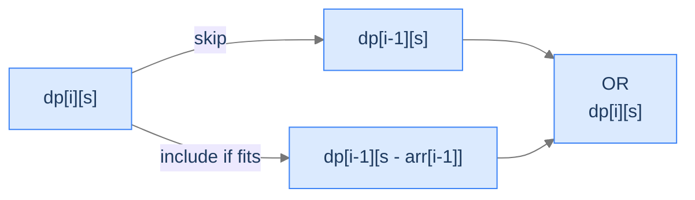
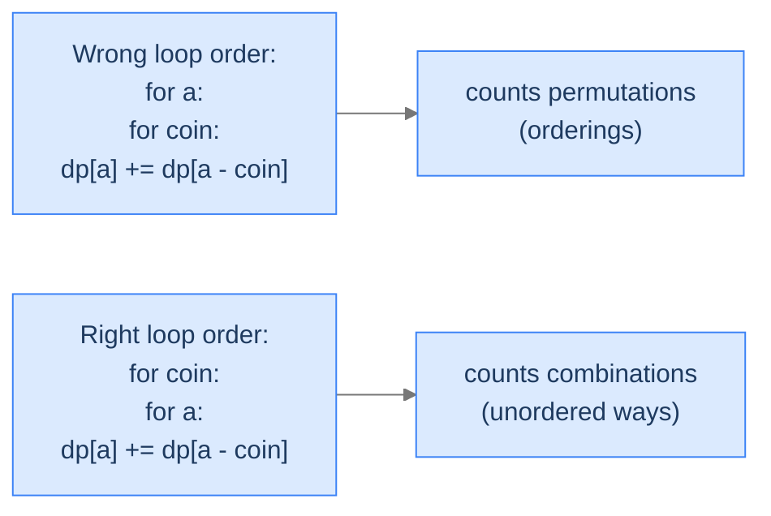

# 11. Knapsack Applications

The previous lesson built the knapsack family — three recurrence shapes that decide what to take from a list of items under a capacity budget. The astonishing thing isn't the family itself; it's how *many* ostensibly unrelated problems reduce to it. A vending machine making change with the fewest coins? Unbounded knapsack with a min-aggregator. Cutting a steel rod into pieces to maximise revenue? Unbounded knapsack where the "items" are cut lengths. Deciding whether a multiset of integers contains a subset summing to a target? 0/1 knapsack, boolean version. Counting how many distinct ways to make change with unlimited coins? Unbounded knapsack with a sum-aggregator.

By the end of this lesson you'll know how to recognise the knapsack shape in disguise, and you'll have written four canonical reductions: **subset sum** (boolean fits), **rod cutting** (max value with cut lengths), **coin change** (min count to hit an amount), and **coin change II** (count of distinct ways). Same DP table, four different aggregators — that pattern alone is the dirty secret behind half of medium-hard interview problems.

## Table of contents

1. [Subset Sum — The Boolean 0/1 Knapsack](#subset-sum--the-boolean-01-knapsack)
2. [Rod Cutting — Unbounded Knapsack in Disguise](#rod-cutting--unbounded-knapsack-in-disguise)
3. [Coin Change — Minimum Coins to Hit an Amount](#coin-change--minimum-coins-to-hit-an-amount)
4. [Coin Change II — Counting the Ways](#coin-change-ii--counting-the-ways)
5. [Final Takeaway](#final-takeaway)

***

# Subset Sum — The Boolean 0/1 Knapsack

> **Course:** DSA › Algorithms › Dynamic Programming › Knapsack Applications

Strip the *value* from 0/1 knapsack, drop the *capacity* in favour of an *exact* target, and ask "is it possible?" instead of "what's the maximum?". You're left with **subset sum**: given an array of integers and a target, does any subset sum exactly to the target?

## The Problem

Given an array `arr` of non-negative integers and a target `target`, return `true` if some subset of `arr` sums to `target`, else `false`.

```
Input:  arr = [1, 5, 3, 10], target = 15
Output: true                          [5, 10] sums to 15

Input:  arr = [1, 2, 3, 4, 5], target = 6
Output: true                          [2, 4] sums to 6, also [1, 5] and [1, 2, 3]

Input:  arr = [1, 2, 3, 4, 5], target = 40
Output: false                         Total of all is 15 < 40 — impossible
```

## The Recurrence

`dp[i][s]` = whether some subset of the first `i` items sums to exactly `s`. Two cases:

- **Skip item `i - 1`**: `dp[i][s] = dp[i - 1][s]`.
- **Include item `i - 1` (if `arr[i - 1] ≤ s`)**: `dp[i][s] = dp[i - 1][s - arr[i - 1]]`.

OR them together:
```
dp[i][s] = dp[i - 1][s] OR (arr[i - 1] ≤ s AND dp[i - 1][s - arr[i - 1]])
```

**Base cases.**
- `dp[i][0] = true` for all `i` — the empty subset sums to 0.
- `dp[0][s] = false` for `s > 0` — no items can hit any positive sum.



<p align="center"><strong>Subset sum decomposes exactly like 0/1 knapsack — but the aggregator is OR instead of max, and we ask <em>existence</em> instead of <em>optimum</em>.</strong></p>

> *Pause. Compare this to the 0/1-knapsack recurrence — what changed?*

Two things only: **values disappeared** (we don't measure quality, only feasibility) and **aggregator flipped from max to OR** (we want any path, not the best one). Capacity becomes target; the structure is identical.

## The Solution

<div class="lang-tabs">

```python,editable
from typing import List

class Solution:
    def subset_sum(self, arr: List[int], target: int) -> bool:
        n = len(arr)
        # dp[i][s] = True iff some subset of the first i items sums to s.
        dp: List[List[bool]] = [[False] * (target + 1) for _ in range(n + 1)]
        # Base: empty subset hits sum 0 for every item count.
        for i in range(n + 1):
            dp[i][0] = True
        for i in range(1, n + 1):
            ai = arr[i - 1]
            for s in range(1, target + 1):
                dp[i][s] = dp[i - 1][s]                  # skip item i-1
                if ai <= s and dp[i - 1][s - ai]:
                    dp[i][s] = True                      # include item i-1
        return dp[n][target]


if __name__ == "__main__":
    sol = Solution()
    print(sol.subset_sum([1, 5, 3, 10],   15))   # True
    print(sol.subset_sum([1, 2, 3, 4, 5], 6))    # True
    print(sol.subset_sum([1, 2, 3, 4, 5], 40))   # False
```

```java,editable
public class Solution {
    public boolean subsetSum(int[] arr, int target) {
        int n = arr.length;
        boolean[][] dp = new boolean[n + 1][target + 1];
        for (int i = 0; i <= n; i++) dp[i][0] = true;
        for (int i = 1; i <= n; i++) {
            int ai = arr[i - 1];
            for (int s = 1; s <= target; s++) {
                dp[i][s] = dp[i - 1][s];
                if (ai <= s && dp[i - 1][s - ai]) dp[i][s] = true;
            }
        }
        return dp[n][target];
    }

    public static void main(String[] args) {
        Solution sol = new Solution();
        System.out.println(sol.subsetSum(new int[]{1, 5, 3, 10},   15));   // true
        System.out.println(sol.subsetSum(new int[]{1, 2, 3, 4, 5}, 6));    // true
        System.out.println(sol.subsetSum(new int[]{1, 2, 3, 4, 5}, 40));   // false
    }
}
```

```c,editable
#include <stdio.h>
#include <stdbool.h>

bool dp[1001][10001];

bool subset_sum(const int *arr, int n, int target) {
    for (int i = 0; i <= n; i++)
        for (int s = 0; s <= target; s++) dp[i][s] = false;
    for (int i = 0; i <= n; i++) dp[i][0] = true;
    for (int i = 1; i <= n; i++) {
        int ai = arr[i - 1];
        for (int s = 1; s <= target; s++) {
            dp[i][s] = dp[i - 1][s];
            if (ai <= s && dp[i - 1][s - ai]) dp[i][s] = true;
        }
    }
    return dp[n][target];
}

int main(void) {
    int a1[] = {1, 5, 3, 10}, a2[] = {1, 2, 3, 4, 5};
    printf("%d\n", subset_sum(a1, 4, 15));   /* 1 */
    printf("%d\n", subset_sum(a2, 5, 6));    /* 1 */
    printf("%d\n", subset_sum(a2, 5, 40));   /* 0 */
    return 0;
}
```

```cpp,editable
#include <iostream>
#include <vector>

class Solution {
public:
    bool subsetSum(const std::vector<int>& arr, int target) {
        int n = (int) arr.size();
        std::vector<std::vector<bool>> dp(n + 1, std::vector<bool>(target + 1, false));
        for (int i = 0; i <= n; i++) dp[i][0] = true;
        for (int i = 1; i <= n; i++) {
            int ai = arr[i - 1];
            for (int s = 1; s <= target; s++) {
                dp[i][s] = dp[i - 1][s];
                if (ai <= s && dp[i - 1][s - ai]) dp[i][s] = true;
            }
        }
        return dp[n][target];
    }
};

int main() {
    Solution sol;
    std::cout << sol.subsetSum({1, 5, 3, 10}, 15)  << "\n";   // 1
    std::cout << sol.subsetSum({1, 2, 3, 4, 5}, 6) << "\n";   // 1
    return 0;
}
```

```scala,editable
class Solution {
  def subsetSum(arr: Array[Int], target: Int): Boolean = {
    val n = arr.length
    val dp = Array.fill(n + 1, target + 1)(false)
    for (i <- 0 to n) dp(i)(0) = true
    for (i <- 1 to n) {
      val ai = arr(i - 1)
      for (s <- 1 to target) {
        dp(i)(s) = dp(i - 1)(s)
        if (ai <= s && dp(i - 1)(s - ai)) dp(i)(s) = true
      }
    }
    dp(n)(target)
  }
}

object Main extends App {
  println(new Solution().subsetSum(Array(1, 5, 3, 10), 15))   // true
}
```

```javascript,editable
class Solution {
    subsetSum(arr, target) {
        const n = arr.length;
        const dp = Array.from({length: n + 1}, () => new Array(target + 1).fill(false));
        for (let i = 0; i <= n; i++) dp[i][0] = true;
        for (let i = 1; i <= n; i++) {
            const ai = arr[i - 1];
            for (let s = 1; s <= target; s++) {
                dp[i][s] = dp[i - 1][s];
                if (ai <= s && dp[i - 1][s - ai]) dp[i][s] = true;
            }
        }
        return dp[n][target];
    }
}

console.log(new Solution().subsetSum([1, 5, 3, 10], 15));   // true
```

```typescript,editable
class Solution {
    subsetSum(arr: number[], target: number): boolean {
        const n = arr.length;
        const dp: boolean[][] = Array.from({length: n + 1}, () => new Array(target + 1).fill(false));
        for (let i = 0; i <= n; i++) dp[i][0] = true;
        for (let i = 1; i <= n; i++) {
            const ai = arr[i - 1];
            for (let s = 1; s <= target; s++) {
                dp[i][s] = dp[i - 1][s];
                if (ai <= s && dp[i - 1][s - ai]) dp[i][s] = true;
            }
        }
        return dp[n][target];
    }
}
```

```go,editable
package main

import "fmt"

func subsetSum(arr []int, target int) bool {
    n := len(arr)
    dp := make([][]bool, n+1)
    for i := range dp { dp[i] = make([]bool, target+1) }
    for i := 0; i <= n; i++ { dp[i][0] = true }
    for i := 1; i <= n; i++ {
        ai := arr[i-1]
        for s := 1; s <= target; s++ {
            dp[i][s] = dp[i-1][s]
            if ai <= s && dp[i-1][s-ai] { dp[i][s] = true }
        }
    }
    return dp[n][target]
}

func main() {
    fmt.Println(subsetSum([]int{1, 5, 3, 10}, 15))   // true
}
```

```kotlin,editable
class Solution {
    fun subsetSum(arr: IntArray, target: Int): Boolean {
        val n = arr.size
        val dp = Array(n + 1) { BooleanArray(target + 1) }
        for (i in 0..n) dp[i][0] = true
        for (i in 1..n) {
            val ai = arr[i - 1]
            for (s in 1..target) {
                dp[i][s] = dp[i - 1][s]
                if (ai <= s && dp[i - 1][s - ai]) dp[i][s] = true
            }
        }
        return dp[n][target]
    }
}

fun main() {
    println(Solution().subsetSum(intArrayOf(1, 5, 3, 10), 15))   // true
}
```

```rust,editable
fn subset_sum(arr: &[i32], target: i32) -> bool {
    let n = arr.len();
    let t = target as usize;
    let mut dp = vec![vec![false; t + 1]; n + 1];
    for i in 0..=n { dp[i][0] = true; }
    for i in 1..=n {
        let ai = arr[i - 1] as usize;
        for s in 1..=t {
            dp[i][s] = dp[i - 1][s];
            if ai <= s && dp[i - 1][s - ai] { dp[i][s] = true; }
        }
    }
    dp[n][t]
}

fn main() {
    println!("{}", subset_sum(&[1, 5, 3, 10], 15));   // true
}
```

</div>

## Complexity

| Aspect | Cost |
|---|---|
| Time | `O(n × target)` |
| Space | `O(n × target)` — reducible to `O(target)` with downward 1D iteration |

***

# Rod Cutting — Unbounded Knapsack in Disguise

> **Course:** DSA › Algorithms › Dynamic Programming › Knapsack Applications

You have a steel rod of length `length` and a price list `prices` where `prices[i]` is the selling price for a piece of length `i + 1`. Cut the rod into integer-length pieces (any number of pieces, including just one — no cuts) and sell each piece individually. Maximise total revenue.

This is **unbounded knapsack** with a twist: weight = piece length, capacity = total rod length, and the "items" are *every possible piece length from 1 to `length`*. You can cut multiple pieces of the same length, so reuse is unlimited — that's what makes it unbounded.

## The Problem

```
Input:  prices = [1, 5, 8, 9], length = 4
Output: 10                       Two pieces of length 2: 5 + 5 = 10

Input:  prices = [1, 4, 8, 5], length = 4
Output: 9                        Length 1 + length 3: 1 + 8 = 9 — beats no-cut value 5

Input:  prices = [1, 2, 3, 6], length = 4
Output: 6                        No cuts: sell whole rod for 6
```

> *Predict before reading on — for `prices = [1, 5, 8, 9, 10, 17]` and `length = 6`, what's the optimal revenue?*

`17`. Length-6 piece sells for 17 outright. Length-1 + length-5 = 1 + 10 = 11. Length-2 + length-4 = 5 + 9 = 14. Length-3 + length-3 = 8 + 8 = 16. Length-2 + length-2 + length-2 = 15. The full rod wins.

## The Recurrence

Let `dp[i]` = max revenue from a rod of length `i`. Try every first cut at position `j` (1 to `i`); the cut piece sells for `prices[j - 1]` and the remainder of length `i - j` recursively gives `dp[i - j]`:
```
dp[i] = max over j ∈ [1, i] of (prices[j - 1] + dp[i - j])
```

This is a 1D unbounded knapsack: piece lengths are reusable, the "capacity" is the rod length.

```d2
direction: right
cuts: "Length 4 rod, prices = [1, 5, 8, 9]" {
  grid-rows: 1
  grid-columns: 4
  grid-gap: 0
  c0: "[1]<br/>$1"
  c1: "[2]<br/>$5"
  c2: "[3]<br/>$8"
  c3: "[4]<br/>$9"
}
```

<p align="center"><strong>Five candidate splits for a length-4 rod: keep whole (price 9), 1+3 (1+8=9), 2+2 (5+5=10), 3+1 (8+1=9), 1+1+2 (1+1+5=7), and so on. <code>dp[4]</code> picks the winner — 10.</strong></p>

## The Solution

<div class="lang-tabs">

```python,editable
from typing import List

class Solution:
    def rod_cutting(self, prices: List[int], length: int) -> int:
        # dp[i] = max revenue from a rod of length i.  dp[0] = 0 (no rod, no money).
        dp: List[int] = [0] * (length + 1)
        for i in range(1, length + 1):
            best = prices[i - 1]                  # No-cut baseline: sell whole rod
            for j in range(1, i):
                # Cut a piece of length j (price prices[j-1]) + best for the remainder.
                best = max(best, prices[j - 1] + dp[i - j])
            dp[i] = best
        return dp[length]


if __name__ == "__main__":
    sol = Solution()
    print(sol.rod_cutting([1, 5, 8, 9],          4))   # 10
    print(sol.rod_cutting([1, 4, 8, 5],          4))   # 9
    print(sol.rod_cutting([1, 2, 3, 6],          4))   # 6
    print(sol.rod_cutting([1, 5, 8, 9, 10, 17],  6))   # 17
```

```java,editable
public class Solution {
    public int rodCutting(int[] prices, int length) {
        int[] dp = new int[length + 1];
        for (int i = 1; i <= length; i++) {
            int best = prices[i - 1];
            for (int j = 1; j < i; j++) {
                best = Math.max(best, prices[j - 1] + dp[i - j]);
            }
            dp[i] = best;
        }
        return dp[length];
    }

    public static void main(String[] args) {
        Solution sol = new Solution();
        System.out.println(sol.rodCutting(new int[]{1, 5, 8, 9}, 4));   // 10
        System.out.println(sol.rodCutting(new int[]{1, 4, 8, 5}, 4));   // 9
    }
}
```

```c,editable
#include <stdio.h>

int dp[1001];

int max(int a, int b) { return a > b ? a : b; }

int rod_cutting(const int *prices, int length) {
    for (int i = 0; i <= length; i++) dp[i] = 0;
    for (int i = 1; i <= length; i++) {
        int best = prices[i - 1];
        for (int j = 1; j < i; j++) best = max(best, prices[j - 1] + dp[i - j]);
        dp[i] = best;
    }
    return dp[length];
}

int main(void) {
    int p1[] = {1, 5, 8, 9};
    printf("%d\n", rod_cutting(p1, 4));    /* 10 */
    return 0;
}
```

```cpp,editable
#include <iostream>
#include <vector>
#include <algorithm>

class Solution {
public:
    int rodCutting(const std::vector<int>& prices, int length) {
        std::vector<int> dp(length + 1, 0);
        for (int i = 1; i <= length; i++) {
            int best = prices[i - 1];
            for (int j = 1; j < i; j++) best = std::max(best, prices[j - 1] + dp[i - j]);
            dp[i] = best;
        }
        return dp[length];
    }
};

int main() {
    std::cout << Solution().rodCutting({1, 5, 8, 9}, 4) << "\n";  // 10
    return 0;
}
```

```scala,editable
class Solution {
  def rodCutting(prices: Array[Int], length: Int): Int = {
    val dp = Array.fill(length + 1)(0)
    for (i <- 1 to length) {
      var best = prices(i - 1)
      for (j <- 1 until i) best = math.max(best, prices(j - 1) + dp(i - j))
      dp(i) = best
    }
    dp(length)
  }
}

object Main extends App {
  println(new Solution().rodCutting(Array(1, 5, 8, 9), 4))  // 10
}
```

```javascript,editable
class Solution {
    rodCutting(prices, length) {
        const dp = new Array(length + 1).fill(0);
        for (let i = 1; i <= length; i++) {
            let best = prices[i - 1];
            for (let j = 1; j < i; j++) best = Math.max(best, prices[j - 1] + dp[i - j]);
            dp[i] = best;
        }
        return dp[length];
    }
}

console.log(new Solution().rodCutting([1, 5, 8, 9], 4));  // 10
```

```typescript,editable
class Solution {
    rodCutting(prices: number[], length: number): number {
        const dp = new Array(length + 1).fill(0);
        for (let i = 1; i <= length; i++) {
            let best = prices[i - 1];
            for (let j = 1; j < i; j++) best = Math.max(best, prices[j - 1] + dp[i - j]);
            dp[i] = best;
        }
        return dp[length];
    }
}
```

```go,editable
package main

import "fmt"

func max(a, b int) int { if a > b { return a }; return b }

func rodCutting(prices []int, length int) int {
    dp := make([]int, length+1)
    for i := 1; i <= length; i++ {
        best := prices[i-1]
        for j := 1; j < i; j++ {
            if prices[j-1]+dp[i-j] > best { best = prices[j-1] + dp[i-j] }
        }
        dp[i] = best
    }
    return dp[length]
}

func main() {
    fmt.Println(rodCutting([]int{1, 5, 8, 9}, 4))  // 10
}
```

```kotlin,editable
class Solution {
    fun rodCutting(prices: IntArray, length: Int): Int {
        val dp = IntArray(length + 1)
        for (i in 1..length) {
            var best = prices[i - 1]
            for (j in 1 until i) best = maxOf(best, prices[j - 1] + dp[i - j])
            dp[i] = best
        }
        return dp[length]
    }
}

fun main() {
    println(Solution().rodCutting(intArrayOf(1, 5, 8, 9), 4))  // 10
}
```

```rust,editable
fn rod_cutting(prices: &[i32], length: i32) -> i32 {
    let len = length as usize;
    let mut dp = vec![0i32; len + 1];
    for i in 1..=len {
        let mut best = prices[i - 1];
        for j in 1..i {
            let cand = prices[j - 1] + dp[i - j];
            if cand > best { best = cand; }
        }
        dp[i] = best;
    }
    dp[len]
}

fn main() {
    println!("{}", rod_cutting(&[1, 5, 8, 9], 4));   // 10
}
```

</div>

## Complexity

| Aspect | Cost |
|---|---|
| Time | `O(length²)` — outer loop over rod length, inner loop over cut positions |
| Space | `O(length)` — single 1D array |

***

# Coin Change — Minimum Coins to Hit an Amount

> **Course:** DSA › Algorithms › Dynamic Programming › Knapsack Applications

You have unlimited supply of coins in denominations `coins[i]`. What's the minimum number of coins that sum to `amount`? If impossible, return `-1`.

This is **unbounded knapsack** with weight = denomination, value = 1 (one coin per unit), and the optimisation reversed from max to min.

## The Problem

```
Input:  coins = [1, 5, 8, 9], amount = 4
Output: 4                          Four 1-coins.  Other denominations don't fit.

Input:  coins = [1, 4, 8, 9], amount = 13
Output: 2                          One 4-coin + one 9-coin.

Input:  coins = [2, 3, 4, 9], amount = 1
Output: -1                         No way to hit 1 with these denominations.
```

> *Predict before reading on — what's the minimum-coin answer for `coins = [1, 5, 10, 25]`, `amount = 30`?*

`2`. One 5-coin + one 25-coin. Greedy "biggest first" happens to work here (US-coin-style denominations have that property), but it doesn't work in general — for `coins = [1, 3, 4]`, `amount = 6`, greedy picks 4 + 1 + 1 = 3 coins, but the optimum is 3 + 3 = 2 coins.

## The Recurrence

`dp[i]` = minimum number of coins to make exactly amount `i`. For each denomination `c ≤ i`, the answer is `1 + dp[i - c]` (one coin of `c`, plus optimum for the remainder). Take the min:
```
dp[i] = min over c ∈ coins, c ≤ i of (1 + dp[i - c])
```
With `dp[0] = 0` (zero coins make zero amount) and `dp[i] = ∞` (or sentinel) for unreachable amounts.

The unreachable case is the key new wrinkle. Carry an `INF` sentinel; a final `dp[amount] == INF` becomes a `-1` return.

## The Solution

<div class="lang-tabs">

```python,editable
from typing import List

class Solution:
    def coin_change(self, coins: List[int], amount: int) -> int:
        # dp[i] = minimum number of coins to make exactly amount i.
        INF = amount + 1                              # Any unreachable sentinel > any reachable answer
        dp: List[int] = [INF] * (amount + 1)
        dp[0] = 0
        for i in range(1, amount + 1):
            for c in coins:
                if c <= i and dp[i - c] + 1 < dp[i]:
                    dp[i] = dp[i - c] + 1
        return dp[amount] if dp[amount] != INF else -1


if __name__ == "__main__":
    sol = Solution()
    print(sol.coin_change([1, 5, 8, 9], 4))    # 4
    print(sol.coin_change([1, 4, 8, 9], 13))   # 2
    print(sol.coin_change([2, 3, 4, 9], 1))    # -1
```

```java,editable
public class Solution {
    public int coinChange(int[] coins, int amount) {
        int INF = amount + 1;
        int[] dp = new int[amount + 1];
        java.util.Arrays.fill(dp, INF);
        dp[0] = 0;
        for (int i = 1; i <= amount; i++) {
            for (int c : coins) {
                if (c <= i && dp[i - c] + 1 < dp[i]) dp[i] = dp[i - c] + 1;
            }
        }
        return dp[amount] == INF ? -1 : dp[amount];
    }

    public static void main(String[] args) {
        Solution sol = new Solution();
        System.out.println(sol.coinChange(new int[]{1, 5, 8, 9}, 4));   // 4
        System.out.println(sol.coinChange(new int[]{2, 3, 4, 9}, 1));   // -1
    }
}
```

```c,editable
#include <stdio.h>

int dp[100001];

int coin_change(const int *coins, int n, int amount) {
    int INF = amount + 1;
    for (int i = 0; i <= amount; i++) dp[i] = INF;
    dp[0] = 0;
    for (int i = 1; i <= amount; i++) {
        for (int k = 0; k < n; k++) {
            int c = coins[k];
            if (c <= i && dp[i - c] + 1 < dp[i]) dp[i] = dp[i - c] + 1;
        }
    }
    return dp[amount] == INF ? -1 : dp[amount];
}

int main(void) {
    int c1[] = {1, 5, 8, 9};
    printf("%d\n", coin_change(c1, 4, 4));     /* 4 */
    return 0;
}
```

```cpp,editable
#include <iostream>
#include <vector>

class Solution {
public:
    int coinChange(const std::vector<int>& coins, int amount) {
        int INF = amount + 1;
        std::vector<int> dp(amount + 1, INF);
        dp[0] = 0;
        for (int i = 1; i <= amount; i++) {
            for (int c : coins) {
                if (c <= i && dp[i - c] + 1 < dp[i]) dp[i] = dp[i - c] + 1;
            }
        }
        return dp[amount] == INF ? -1 : dp[amount];
    }
};

int main() {
    std::cout << Solution().coinChange({1, 5, 8, 9}, 4)  << "\n";  // 4
    std::cout << Solution().coinChange({2, 3, 4, 9}, 1)  << "\n";  // -1
    return 0;
}
```

```scala,editable
class Solution {
  def coinChange(coins: Array[Int], amount: Int): Int = {
    val INF = amount + 1
    val dp = Array.fill(amount + 1)(INF)
    dp(0) = 0
    for (i <- 1 to amount; c <- coins) {
      if (c <= i && dp(i - c) + 1 < dp(i)) dp(i) = dp(i - c) + 1
    }
    if (dp(amount) == INF) -1 else dp(amount)
  }
}

object Main extends App {
  println(new Solution().coinChange(Array(1, 5, 8, 9), 4))  // 4
}
```

```javascript,editable
class Solution {
    coinChange(coins, amount) {
        const INF = amount + 1;
        const dp = new Array(amount + 1).fill(INF);
        dp[0] = 0;
        for (let i = 1; i <= amount; i++) {
            for (const c of coins) {
                if (c <= i && dp[i - c] + 1 < dp[i]) dp[i] = dp[i - c] + 1;
            }
        }
        return dp[amount] === INF ? -1 : dp[amount];
    }
}

console.log(new Solution().coinChange([1, 5, 8, 9], 4));   // 4
console.log(new Solution().coinChange([2, 3, 4, 9], 1));   // -1
```

```typescript,editable
class Solution {
    coinChange(coins: number[], amount: number): number {
        const INF = amount + 1;
        const dp = new Array(amount + 1).fill(INF);
        dp[0] = 0;
        for (let i = 1; i <= amount; i++) {
            for (const c of coins) {
                if (c <= i && dp[i - c] + 1 < dp[i]) dp[i] = dp[i - c] + 1;
            }
        }
        return dp[amount] === INF ? -1 : dp[amount];
    }
}
```

```go,editable
package main

import "fmt"

func coinChange(coins []int, amount int) int {
    INF := amount + 1
    dp := make([]int, amount+1)
    for i := range dp { dp[i] = INF }
    dp[0] = 0
    for i := 1; i <= amount; i++ {
        for _, c := range coins {
            if c <= i && dp[i-c]+1 < dp[i] { dp[i] = dp[i-c] + 1 }
        }
    }
    if dp[amount] == INF { return -1 }
    return dp[amount]
}

func main() {
    fmt.Println(coinChange([]int{1, 5, 8, 9}, 4))   // 4
    fmt.Println(coinChange([]int{2, 3, 4, 9}, 1))   // -1
}
```

```kotlin,editable
class Solution {
    fun coinChange(coins: IntArray, amount: Int): Int {
        val INF = amount + 1
        val dp = IntArray(amount + 1) { INF }
        dp[0] = 0
        for (i in 1..amount) {
            for (c in coins) {
                if (c <= i && dp[i - c] + 1 < dp[i]) dp[i] = dp[i - c] + 1
            }
        }
        return if (dp[amount] == INF) -1 else dp[amount]
    }
}

fun main() {
    println(Solution().coinChange(intArrayOf(1, 5, 8, 9), 4))   // 4
}
```

```rust,editable
fn coin_change(coins: &[i32], amount: i32) -> i32 {
    let amt = amount as usize;
    let inf = amt + 1;
    let mut dp = vec![inf; amt + 1];
    dp[0] = 0;
    for i in 1..=amt {
        for &c in coins {
            let c = c as usize;
            if c <= i && dp[i - c] + 1 < dp[i] { dp[i] = dp[i - c] + 1; }
        }
    }
    if dp[amt] == inf { -1 } else { dp[amt] as i32 }
}

fn main() {
    println!("{}", coin_change(&[1, 5, 8, 9], 4));   // 4
    println!("{}", coin_change(&[2, 3, 4, 9], 1));   // -1
}
```

</div>

## Complexity

| Aspect | Cost |
|---|---|
| Time | `O(amount × n)` where `n` is the number of coin denominations |
| Space | `O(amount)` |

***

# Coin Change II — Counting the Ways

> **Course:** DSA › Algorithms › Dynamic Programming › Knapsack Applications

Same setup — unlimited coins of each denomination — but now we ask **how many distinct ways** can the amount be made? Order doesn't matter; `[1, 2]` and `[2, 1]` count as the same way.

## The Problem

```
Input:  coins = [1, 5, 8, 9], amount = 4
Output: 1                          Only [1, 1, 1, 1] works

Input:  coins = [3, 4, 8, 9], amount = 13
Output: 2                          [3, 3, 3, 4]  and  [4, 9]

Input:  coins = [3, 4, 5, 9], amount = 1
Output: 0                          No combination hits 1
```

## The Recurrence — Watch the Loop Order

`dp[a]` = number of distinct ways to make amount `a`. Naïvely you might think to iterate `a` outer, `coins` inner — but that double-counts orderings. To count *combinations* (order doesn't matter), iterate **coins outer, amount inner**:

```
for each coin c:
    for a in c..amount:
        dp[a] += dp[a - c]
```

This forces every way to use coin `c` to be considered together, before moving to the next denomination — which is exactly what eliminates double-counting.



<p align="center"><strong>Loop order isn't a stylistic choice. Coins-outer counts combinations; amount-outer counts permutations. Same arithmetic, different answers.</strong></p>

> *Pause. Why does coins-outer work? Predict the reasoning.*

When `coin = c1` is the only one in the inner loop, every count we accumulate uses *only* `c1`. When we add `coin = c2`, we extend each existing count by all the ways to add zero or more `c2`'s. By the time `coin = c3` arrives, every combination has its denominations in a fixed order (`c1`s, then `c2`s, then `c3`s). That fixed order is what kills duplicates: `[1, 2]` and `[2, 1]` both end up encoded as "one 1-coin and one 2-coin", counted exactly once.

Base case: `dp[0] = 1` (the empty combination is one way to make 0).

## The Solution

<div class="lang-tabs">

```python,editable
from typing import List

class Solution:
    def coin_change_ii(self, coins: List[int], amount: int) -> int:
        # dp[a] = number of distinct combinations summing to a.
        dp: List[int] = [0] * (amount + 1)
        dp[0] = 1                                 # The empty combination
        # Coins outer + amount inner → counts combinations (not permutations).
        for c in coins:
            for a in range(c, amount + 1):
                dp[a] += dp[a - c]
        return dp[amount]


if __name__ == "__main__":
    sol = Solution()
    print(sol.coin_change_ii([1, 5, 8, 9], 4))    # 1
    print(sol.coin_change_ii([3, 4, 8, 9], 13))   # 2
    print(sol.coin_change_ii([3, 4, 5, 9], 1))    # 0
```

```java,editable
public class Solution {
    public int coinChangeII(int[] coins, int amount) {
        int[] dp = new int[amount + 1];
        dp[0] = 1;
        for (int c : coins) {
            for (int a = c; a <= amount; a++) {
                dp[a] += dp[a - c];
            }
        }
        return dp[amount];
    }

    public static void main(String[] args) {
        Solution sol = new Solution();
        System.out.println(sol.coinChangeII(new int[]{1, 5, 8, 9}, 4));    // 1
        System.out.println(sol.coinChangeII(new int[]{3, 4, 8, 9}, 13));   // 2
    }
}
```

```c,editable
#include <stdio.h>

int dp[100001];

int coin_change_ii(const int *coins, int n, int amount) {
    for (int a = 0; a <= amount; a++) dp[a] = 0;
    dp[0] = 1;
    for (int k = 0; k < n; k++) {
        int c = coins[k];
        for (int a = c; a <= amount; a++) dp[a] += dp[a - c];
    }
    return dp[amount];
}

int main(void) {
    int c1[] = {3, 4, 8, 9};
    printf("%d\n", coin_change_ii(c1, 4, 13));   /* 2 */
    return 0;
}
```

```cpp,editable
#include <iostream>
#include <vector>

class Solution {
public:
    int coinChangeII(const std::vector<int>& coins, int amount) {
        std::vector<int> dp(amount + 1, 0);
        dp[0] = 1;
        for (int c : coins) {
            for (int a = c; a <= amount; a++) dp[a] += dp[a - c];
        }
        return dp[amount];
    }
};

int main() {
    std::cout << Solution().coinChangeII({3, 4, 8, 9}, 13) << "\n";   // 2
    return 0;
}
```

```scala,editable
class Solution {
  def coinChangeII(coins: Array[Int], amount: Int): Int = {
    val dp = Array.fill(amount + 1)(0)
    dp(0) = 1
    for (c <- coins; a <- c to amount) dp(a) += dp(a - c)
    dp(amount)
  }
}

object Main extends App {
  println(new Solution().coinChangeII(Array(3, 4, 8, 9), 13))   // 2
}
```

```javascript,editable
class Solution {
    coinChangeII(coins, amount) {
        const dp = new Array(amount + 1).fill(0);
        dp[0] = 1;
        for (const c of coins) {
            for (let a = c; a <= amount; a++) dp[a] += dp[a - c];
        }
        return dp[amount];
    }
}

console.log(new Solution().coinChangeII([3, 4, 8, 9], 13));   // 2
```

```typescript,editable
class Solution {
    coinChangeII(coins: number[], amount: number): number {
        const dp = new Array(amount + 1).fill(0);
        dp[0] = 1;
        for (const c of coins) {
            for (let a = c; a <= amount; a++) dp[a] += dp[a - c];
        }
        return dp[amount];
    }
}
```

```go,editable
package main

import "fmt"

func coinChangeII(coins []int, amount int) int {
    dp := make([]int, amount+1)
    dp[0] = 1
    for _, c := range coins {
        for a := c; a <= amount; a++ {
            dp[a] += dp[a-c]
        }
    }
    return dp[amount]
}

func main() {
    fmt.Println(coinChangeII([]int{3, 4, 8, 9}, 13))   // 2
}
```

```kotlin,editable
class Solution {
    fun coinChangeII(coins: IntArray, amount: Int): Int {
        val dp = IntArray(amount + 1)
        dp[0] = 1
        for (c in coins) {
            for (a in c..amount) dp[a] += dp[a - c]
        }
        return dp[amount]
    }
}

fun main() {
    println(Solution().coinChangeII(intArrayOf(3, 4, 8, 9), 13))   // 2
}
```

```rust,editable
fn coin_change_ii(coins: &[i32], amount: i32) -> i32 {
    let amt = amount as usize;
    let mut dp = vec![0i64; amt + 1];
    dp[0] = 1;
    for &c in coins {
        let c = c as usize;
        for a in c..=amt {
            dp[a] += dp[a - c];
        }
    }
    dp[amt] as i32
}

fn main() {
    println!("{}", coin_change_ii(&[3, 4, 8, 9], 13));   // 2
}
```

</div>

## Complexity

| Aspect | Cost |
|---|---|
| Time | `O(amount × n)` |
| Space | `O(amount)` |

***

# Final Takeaway

Four ostensibly different problems — boolean feasibility, max revenue cutting a rod, minimum coins, count of ways — all collapse to *one* recurrence shape with four different aggregators:

| Problem | State | Aggregator | Item Reuse |
|---|---|---|---|
| Subset sum | `dp[i][s]` | OR | once each (0/1) |
| Rod cutting | `dp[i]` | max | unlimited |
| Coin change | `dp[i]` | min | unlimited |
| Coin change II | `dp[a]` | sum | unlimited, count combinations |

The pattern: pick a state-space dimension that captures "how much budget remains" (`s`, length, amount), iterate over the items, and choose the aggregator that matches the question (boolean → OR, optimum → max/min, count → sum). Loop order matters when counting combinations: **coins outer, amount inner** to avoid double-counting permutations as distinct ways.

**You didn't just memorise four reductions. You learned that the entire knapsack family is a *template* — change the aggregator and you change the question; change the index decrement and you change the reuse policy. Every "fit a budget" DP problem you'll ever see will reduce to one of these four shapes.**

> *Transfer challenge for the next lesson:* Two players take turns picking from either end of a row of coins. Each plays optimally, trying to maximise their own total. What's the maximum the first player can *guarantee*? Predict the recurrence shape — and notice it's *not* knapsack-shaped at all.

<details>
<summary><strong>Answer</strong></summary>

`dp[i][j]` = max value the player to move can guarantee from the slice `arr[i..j]`. The recurrence flips between maximising your gain and minimising the opponent's freedom: `dp[i][j] = max(arr[i] - dp[i+1][j], arr[j] - dp[i][j-1])`. The "− dp(...)" is what makes it adversarial — the opponent's optimum eats into your future. The next lesson formalises this as the **Optimal Strategy** problem (game-theoretic DP).

</details>
