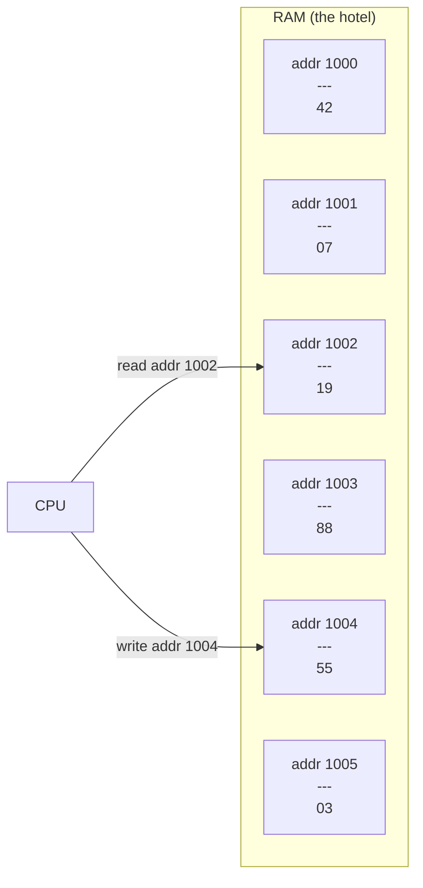
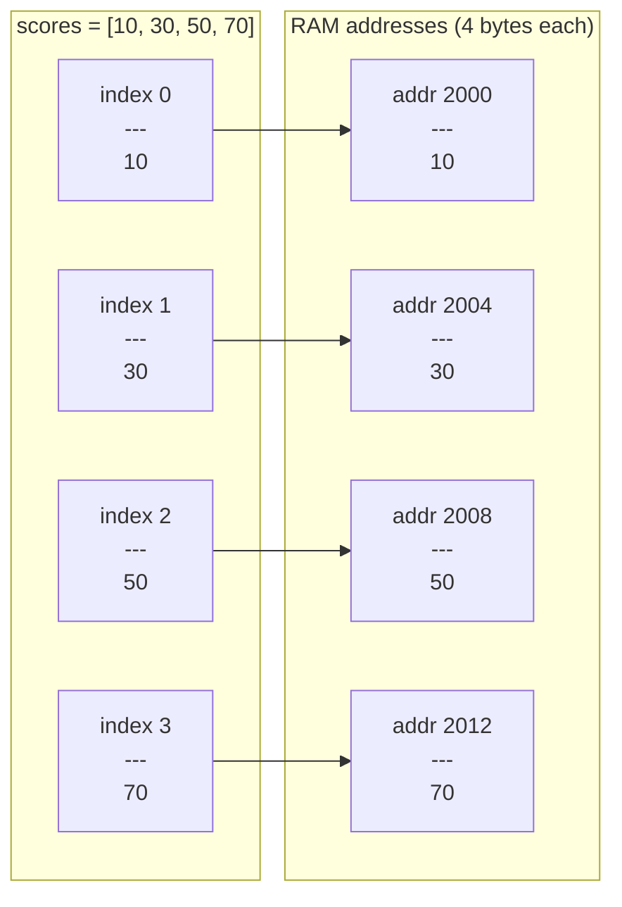

# RAM

Before arrays make sense, memory needs to make sense. And once you understand memory, the clever design of arrays will feel completely obvious.

## RAM is a giant hotel

Picture a huge hotel with millions of numbered rooms, side by side down an infinitely long corridor. Every room has a unique **address** (room number) printed on the door, and each room can hold exactly one small value (typically 1 byte).

Your program is a guest who has been given a key to a block of rooms. When it needs to store a number, it checks in to a room and remembers the address. When it needs the number back, it walks straight to that door — no searching, no asking at reception.

The crucial insight: **the CPU can open any room in O(1) time** because it knows every address in advance. It never has to wander down the hallway checking room numbers one by one.



## How an array maps onto RAM

When you create an integer array, Python (or C, or any language) reserves a **contiguous block** of rooms — a stretch of addresses all in a row. Each element lives in the next room along.



## The O(1) address formula

If the array starts at address `base` and each element occupies `size` bytes, then the address of element `i` is:

```
address(i) = base + i × size
```

For the example above with `base = 2000` and `size = 4`:

| Index | Calculation | Address |
|---|---|---|
| 0 | 2000 + 0 × 4 | 2000 |
| 1 | 2000 + 1 × 4 | 2004 |
| 2 | 2000 + 2 × 4 | 2008 |
| 3 | 2000 + 3 × 4 | 2012 |

One multiplication, one addition — and the CPU is standing at exactly the right room door. That is why array index access is O(1) no matter whether the array has 4 elements or 4 million.

## Seeing memory addresses in Python

Python hides raw memory management, but you can still peek at the underlying address of any object using `id()`. The value returned is the memory address where that object lives.

```python,editable
# id() returns the memory address of an object in CPython
a = 42
b = "hello"
c = [1, 2, 3]

print(f"Address of integer 42   : {id(a)}")
print(f"Address of string hello : {id(b)}")
print(f"Address of list [1,2,3] : {id(c)}")

# List elements are stored contiguously in a backing array.
# We can also examine the id of individual element objects.
numbers = [100, 200, 300, 400]
print("\nElement addresses inside the list:")
for i, val in enumerate(numbers):
    print(f"  numbers[{i}] = {val}  →  id = {id(numbers[i])}")
