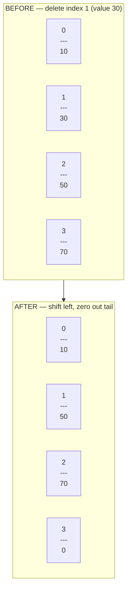
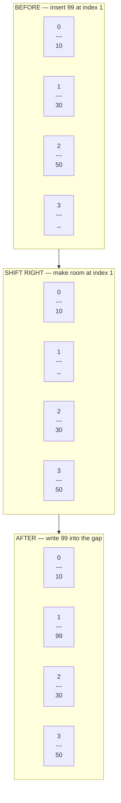

# Static Arrays

Imagine buying an egg carton at the supermarket. It holds exactly 12 eggs — no more, no less. You cannot squeeze a 13th egg in, and the carton does not shrink if you only buy 6. That is a static array: a fixed-capacity container where every slot has a reserved place in memory.

Static arrays are the simplest and most efficient array type. They are used everywhere performance is critical — pixel buffers in images, audio sample arrays, network packet buffers, and low-level game engines all rely on them.

## Reading and traversal

Because elements live at predictable addresses, reading any element by index costs **O(1)** — it is a single arithmetic calculation regardless of array size.

Walking the whole array visits `n` elements, so that costs **O(n)**.

```python,editable
# Think of this as a fixed 5-slot container
scores = [88, 72, 95, 61, 84]

# O(1) random access — instant, no matter the size
print("Third score:", scores[2])

# O(n) traversal — visits every element once
print("\nAll scores:")
for i in range(len(scores)):
    print(f"  slot {i}: {scores[i]}")

# Index out of range is the classic static-array mistake
try:
    print(scores[10])
except IndexError as e:
    print(f"\nError: {e}  <- static arrays have hard boundaries!")
```

## Deleting from the middle

This is where static arrays get expensive. Memory must stay contiguous, so when you remove an element from the middle, every element to its right has to **slide one slot to the left** to close the gap.



In the worst case (deleting the first element) every element shifts, so this is **O(n)**.

```python,editable
def remove_at(arr, index, length):
    """Remove element at `index` by shifting later elements left."""
    # Slide everything after `index` one position to the left
    for i in range(index + 1, length):
        arr[i - 1] = arr[i]
    # Zero out the vacated last slot
    arr[length - 1] = 0
    return length - 1


arr = [10, 30, 50, 70, 0]   # last slot is reserved padding
length = 4

print("Before:", arr[:length])
length = remove_at(arr, 1, length)   # remove 30
print("After: ", arr[:length])
print("Full backing array:", arr)    # see the zeroed tail
```

## Inserting into the middle

The opposite problem: to make a gap at a chosen position, every element from that position onward has to **slide one slot to the right** before you can write the new value.



Inserting at the front is the worst case — every element moves — so this is also **O(n)**.

```python,editable
def insert_at(arr, index, value, length, capacity):
    """Insert `value` at `index` by shifting later elements right."""
    if length == capacity:
        raise ValueError("Array is full — static arrays cannot grow!")

    # Slide everything from `index` onward one position to the right
    for i in range(length - 1, index - 1, -1):
        arr[i + 1] = arr[i]

    arr[index] = value
    return length + 1


arr = [10, 30, 50, 0]    # one spare slot at the end
length = 3
capacity = len(arr)

print("Before:", arr[:length])
length = insert_at(arr, 1, 99, length, capacity)   # insert 99 at index 1
print("After: ", arr[:length])
```

## Timing: reads vs inserts

Run this to see the time difference between O(1) reads and O(n) inserts at scale.

```python,editable
import time

SIZE = 100_000
arr = list(range(SIZE))

# O(1) read — blazing fast
start = time.perf_counter()
for _ in range(10_000):
    _ = arr[SIZE // 2]
read_time = time.perf_counter() - start

# O(n) insert at front — much slower
start = time.perf_counter()
for _ in range(100):
    arr.insert(0, -1)   # Python list.insert is O(n) for middle/front
insert_time = time.perf_counter() - start

print(f"10,000 random reads  : {read_time*1000:.2f} ms")
print(f"   100 front inserts : {insert_time*1000:.2f} ms")
print(f"\nInserts were ~{insert_time/read_time * 100:.0f}x slower per operation")
```

## Operation complexity summary

| Operation | Time complexity | Why |
|---|---|---|
| Read by index | O(1) | Direct address calculation |
| Update by index | O(1) | Same — just write to that address |
| Traverse all | O(n) | Must visit every element |
| Insert at middle/front | O(n) | All later elements must shift right |
| Delete from middle/front | O(n) | All later elements must shift left |
| Insert at end (if space) | O(1) | No shifting needed |
| Delete from end | O(1) | No shifting needed |

## Real-world uses

- **Image pixel buffers** — a 1920x1080 image is a flat static array of 2,073,600 colour values. Random access to any pixel is O(1).
- **Audio samples** — a WAV file stores 44,100 integer samples per second. The playback engine reads them in order at high speed.
- **Lookup tables** — precomputed values like sine/cosine tables are stored in static arrays for O(1) retrieval.
- **Ring buffers in networking** — fixed-size arrays used to buffer incoming packets before they are processed.

## Takeaway

Static arrays shine when you know the size upfront and need fast reads. They become painful when you need to insert or delete from anywhere other than the end. The next chapter shows how dynamic arrays solve the growth problem.
