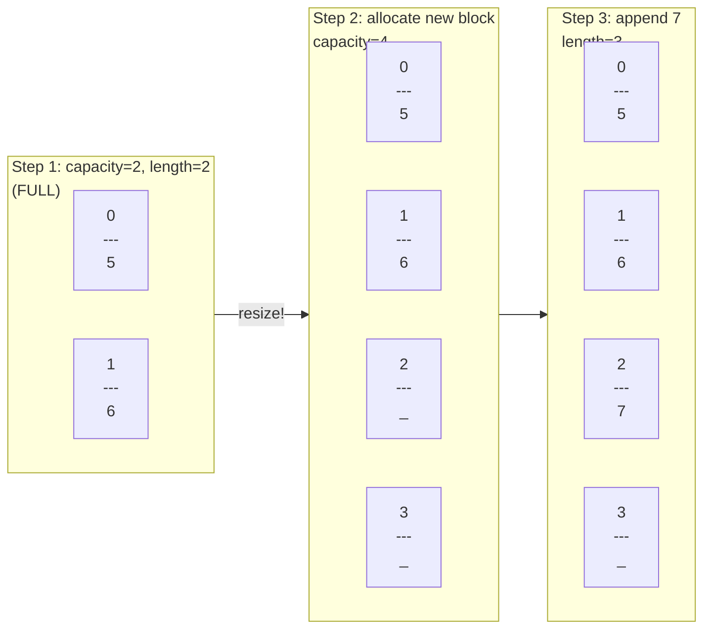
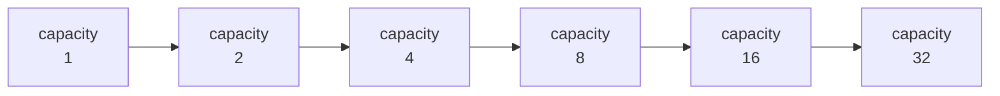

# Dynamic Arrays

Imagine a magical backpack that starts small but silently doubles in size the moment it gets full. You never have to think about how big it is — you just keep throwing things in. That is exactly how a dynamic array works.

Dynamic arrays give you the fast O(1) index access of static arrays while also letting the collection **grow automatically** as you add items. Python's `list`, JavaScript's `Array`, and Java's `ArrayList` are all dynamic arrays under the hood.

## The core idea

A dynamic array maintains two numbers internally:

- **length** — how many elements you have actually stored
- **capacity** — how many slots the underlying memory block can hold

When `length == capacity` and you try to add another element, the array quietly allocates a bigger block (usually **2x** the current capacity), copies everything over, and continues as if nothing happened.



## Building a dynamic array from scratch

This implementation mirrors exactly what Python's built-in `list` does behind the scenes:

```python,editable
class DynamicArray:
    def __init__(self):
        self.capacity = 2         # starting size of the backing store
        self.length = 0           # number of real elements
        self.arr = [0] * self.capacity

    def pushback(self, value):
        """Append a value. Resize first if the array is full."""
        if self.length == self.capacity:
            self._resize()
        self.arr[self.length] = value
        self.length += 1

    def popback(self):
        """Remove and return the last element."""
        if self.length == 0:
            raise IndexError("popback from empty array")
        value = self.arr[self.length - 1]
        self.arr[self.length - 1] = 0   # optional cleanup
        self.length -= 1
        return value

    def get(self, index):
        """O(1) read by index."""
        if index < 0 or index >= self.length:
            raise IndexError("index out of range")
        return self.arr[index]

    def _resize(self):
        """Double the capacity and copy all elements over."""
        self.capacity *= 2
        new_arr = [0] * self.capacity
        for i in range(self.length):
            new_arr[i] = self.arr[i]
        self.arr = new_arr
        print(f"  [resize] capacity doubled to {self.capacity}")

    def values(self):
        return self.arr[:self.length]

    def __repr__(self):
        return f"DynamicArray(values={self.values()}, length={self.length}, capacity={self.capacity})"


# Watch the resizes happen live
da = DynamicArray()
for v in [5, 6, 7, 8, 9, 10, 11, 12]:
    da.pushback(v)
    print(f"  appended {v:2d}  →  {da}")
```

## The capacity doubling chain

Every time the array fills up, capacity doubles. The sequence is predictable:



This geometric growth is the key to why appends stay cheap on average.

## Why append is amortized O(1)

A resize copies `n` elements and costs O(n). But resizes are **rare** — they only happen at capacities 1, 2, 4, 8, 16, ... So if you append `n` items total:

- The resize at capacity 1 copies 1 element
- The resize at capacity 2 copies 2 elements
- The resize at capacity 4 copies 4 elements
- ...
- The final resize copies at most `n` elements

Total copy work: `1 + 2 + 4 + ... + n = 2n`. Spread across `n` appends, each append costs `2n / n = 2` on average — **O(1) amortized**.

```python,editable
# Prove it: measure the average cost of appending n elements
import time

def bench_appends(n):
    start = time.perf_counter()
    lst = []
    for i in range(n):
        lst.append(i)
    elapsed = time.perf_counter() - start
    return elapsed

sizes = [10_000, 100_000, 1_000_000]
for n in sizes:
    t = bench_appends(n)
    per_append = t / n * 1_000_000   # microseconds
    print(f"n={n:>9,}  total={t*1000:.1f}ms  per_append={per_append:.4f}us")

print("\nPer-append time stays roughly constant as n grows: amortized O(1)!")
```

## Watching Python list capacity grow

Python does not expose capacity directly, but the `sys.getsizeof()` trick lets you watch memory usage jump at the doubling points:

```python,editable
import sys

lst = []
prev_size = sys.getsizeof(lst)
print(f"elements={0:>3}  memory={prev_size} bytes")

for i in range(1, 33):
    lst.append(i)
    size = sys.getsizeof(lst)
    marker = "  <-- RESIZE" if size != prev_size else ""
    print(f"elements={i:>3}  memory={size} bytes{marker}")
    prev_size = size
```

## Real-world dynamic arrays

| Language | Dynamic array type | Notes |
|---|---|---|
| Python | `list` | Overallocates by ~12.5% beyond capacity |
| JavaScript | `Array` | Engine-dependent, usually similar doubling |
| Java | `ArrayList` | Default capacity 10, grows by 50% |
| C++ | `std::vector` | Doubles on resize |
| C# | `List<T>` | Doubles on resize |

## Operation complexity summary

| Operation | Time complexity | Notes |
|---|---|---|
| Read / write by index | O(1) | Direct address calculation |
| Append (pushback) | O(1) amortized | Occasional O(n) resize, but rare |
| Pop from end | O(1) | No shifting |
| Insert at middle | O(n) | Must shift elements right |
| Delete from middle | O(n) | Must shift elements left |
| Resize | O(n) | Triggered automatically, rarely |

## Takeaway

Dynamic arrays solve the biggest limitation of static arrays (fixed size) while keeping O(1) random access and O(1) amortized appends. The price is occasional O(n) resize events and some wasted capacity. For most applications, that trade-off is completely worth it — which is why almost every language uses them as the default list type.

Next up: [Stacks](./04-stacks.md), a clever restriction on dynamic arrays that turns out to be one of the most powerful tools in computer science.
