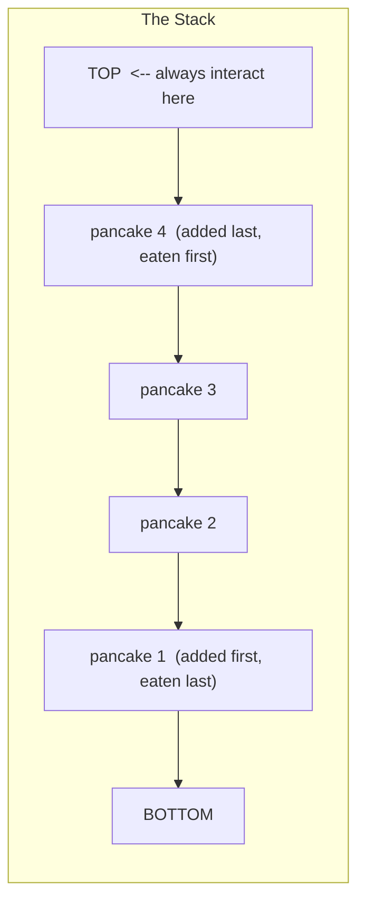
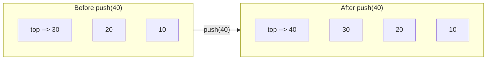
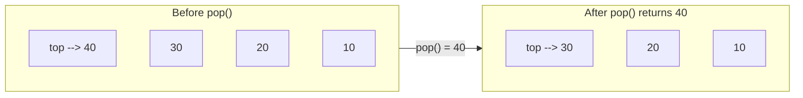

# Stacks

Picture a stack of pancakes fresh off the griddle. You always add the newest pancake on top, and you always eat from the top first. You would never pull a pancake from the middle or the bottom — the whole structure works because there is only **one end you can touch**.

That is a stack in computer science: a collection that allows additions and removals at one end only — the **top**.

## The LIFO principle

Stack stands for **Last In, First Out**. Whatever you added most recently is the first thing you get back. This single constraint makes stacks surprisingly powerful.



## The three core operations

Every stack provides exactly three operations:

| Operation | Description | Cost |
|---|---|---|
| `push(value)` | Add an item to the top | O(1) amortized |
| `pop()` | Remove and return the top item | O(1) |
| `peek()` | Look at the top item without removing it | O(1) |

### Push: adding to the top



### Pop: removing from the top



## A complete Stack implementation

```python,editable
class Stack:
    def __init__(self):
        self._data = []   # dynamic array as the backing store

    def push(self, value):
        """Add value to the top of the stack. O(1) amortized."""
        self._data.append(value)

    def pop(self):
        """Remove and return the top value. O(1). Raises if empty."""
        if self.is_empty():
            raise IndexError("pop from an empty stack")
        return self._data.pop()

    def peek(self):
        """Return the top value without removing it. O(1). Raises if empty."""
        if self.is_empty():
            raise IndexError("peek at an empty stack")
        return self._data[-1]

    def is_empty(self):
        """Return True if the stack has no elements."""
        return len(self._data) == 0

    def size(self):
        """Return the number of elements in the stack."""
        return len(self._data)

    def __repr__(self):
        if self.is_empty():
            return "Stack([]  <-- top)"
        items = " | ".join(str(x) for x in self._data)
        return f"Stack([{items}]  <-- top)"


# --- Demo ---
s = Stack()

print("=== Pushing 10, 20, 30, 40 ===")
for v in [10, 20, 30, 40]:
    s.push(v)
    print(f"  push({v:2d})  -->  {s}")

print(f"\npeek() = {s.peek()}  (stack unchanged: {s})")

print("\n=== Popping everything ===")
while not s.is_empty():
    val = s.pop()
    print(f"  pop() = {val:2d}  -->  {s}")

print("\nAttempting pop on empty stack:")
try:
    s.pop()
except IndexError as e:
    print(f"  IndexError: {e}")
```

## Real-world uses

### Browser back button

Every time you navigate to a new page, the browser pushes the current URL onto a history stack. When you hit Back, it pops the top URL and navigates there.

```python,editable
class BrowserHistory:
    def __init__(self, start_page):
        self._back_stack = Stack()
        self._current = start_page

    def visit(self, url):
        """Navigate to a new page."""
        self._back_stack.push(self._current)
        self._current = url
        print(f"  Visited: {self._current}")

    def back(self):
        """Go back to the previous page."""
        if self._back_stack.is_empty():
            print("  No history to go back to!")
            return
        self._current = self._back_stack.pop()
        print(f"  Back to: {self._current}")

    def current(self):
        return self._current


class Stack:
    def __init__(self):
        self._data = []
    def push(self, v):
        self._data.append(v)
    def pop(self):
        if not self._data:
            raise IndexError("empty")
        return self._data.pop()
    def peek(self):
        return self._data[-1]
    def is_empty(self):
        return len(self._data) == 0


browser = BrowserHistory("google.com")
browser.visit("github.com")
browser.visit("docs.python.org")
browser.visit("stackoverflow.com")

print(f"\nCurrent page: {browser.current()}")
print()
browser.back()
browser.back()
print(f"\nCurrent page: {browser.current()}")
```

### Undo and redo

Text editors push every action onto an undo stack. Ctrl+Z pops the last action and reverses it, pushing it onto a redo stack so Ctrl+Y can restore it.

```python,editable
class Stack:
    def __init__(self):
        self._data = []
    def push(self, v):
        self._data.append(v)
    def pop(self):
        if not self._data:
            return None
        return self._data.pop()
    def peek(self):
        return self._data[-1] if self._data else None
    def is_empty(self):
        return len(self._data) == 0
    def __repr__(self):
        return str(self._data)


class TextEditor:
    def __init__(self):
        self.text = ""
        self._undo_stack = Stack()
        self._redo_stack = Stack()

    def type(self, chars):
        self._undo_stack.push(self.text)   # save current state
        self._redo_stack = Stack()          # typing clears redo history
        self.text += chars
        print(f"  type({chars!r})  -->  {self.text!r}")

    def undo(self):
        prev = self._undo_stack.pop()
        if prev is None:
            print("  Nothing to undo!")
            return
        self._redo_stack.push(self.text)
        self.text = prev
        print(f"  undo()          -->  {self.text!r}")

    def redo(self):
        nxt = self._redo_stack.pop()
        if nxt is None:
            print("  Nothing to redo!")
            return
        self._undo_stack.push(self.text)
        self.text = nxt
        print(f"  redo()          -->  {self.text!r}")


ed = TextEditor()
ed.type("Hello")
ed.type(", ")
ed.type("world")
ed.type("!")
print()
ed.undo()
ed.undo()
print()
ed.redo()
```

### Balanced parentheses checker

A classic stack interview problem: scan a string left to right, push every opening bracket, and pop when you see a closing bracket. If the stack is empty at the end, the brackets are balanced.

```python,editable
class Stack:
    def __init__(self):
        self._data = []
    def push(self, v):
        self._data.append(v)
    def pop(self):
        return self._data.pop() if self._data else None
    def is_empty(self):
        return len(self._data) == 0


def is_balanced(s):
    stack = Stack()
    matching = {')': '(', ']': '[', '}': '{'}

    for ch in s:
        if ch in '([{':
            stack.push(ch)
        elif ch in ')]}':
            if stack.is_empty() or stack.pop() != matching[ch]:
                return False

    return stack.is_empty()


tests = [
    "((1 + 2) * (3 + 4))",
    "{[()]}",
    "([)]",
    "(((",
    "",
]

for expr in tests:
    result = is_balanced(expr)
    icon = "OK" if result else "FAIL"
    print(f"  {icon}  {expr!r}")
```

## Other places stacks appear

- **Function call stack** — every function call in every program pushes a frame, every return pops it. The "stack overflow" error literally means the call stack ran out of space.
- **Depth-first search (DFS)** — graph traversal uses a stack (explicitly or via recursion) to track the current path.
- **Expression evaluation** — compilers use stacks to evaluate arithmetic expressions and respect operator precedence.
- **HTML/XML parsing** — opening tags are pushed; closing tags must match the top of the stack.

## Operation complexity summary

| Operation | Time complexity | Notes |
|---|---|---|
| `push` | O(1) amortized | Backed by a dynamic array |
| `pop` | O(1) | Remove last element of the backing array |
| `peek` | O(1) | Read last element of the backing array |
| `is_empty` | O(1) | Check length |
| `size` | O(1) | Check length |

## Takeaway

A stack is a dynamic array with a single rule: **only touch the top**. That constraint sounds limiting, but it perfectly models a huge class of real problems — anything with a "most recent first" or "undo last action" pattern. The call stack in your computer right now is a stack, and you have been using stacks every time you pressed Ctrl+Z or the browser back button.
