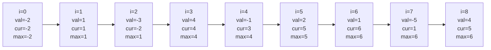

# Kadane's Algorithm

Your stock trading app shows the best period to buy and sell. You glance at a chart of daily gains and losses and want to know: *which consecutive stretch of days would have made you the most money?* Behind that feature — and countless others — lives Kadane's algorithm.

---

## The Problem

Given an array of integers (positive and negative), find the **contiguous subarray** whose elements sum to the largest possible value.

```
Input:  [-2, 1, -3, 4, -1, 2, 1, -5, 4]
Output: 6   (subarray [4, -1, 2, 1])
```

---

## Why Brute Force Is Too Slow

The obvious approach checks every possible subarray:

```python,editable
def max_subarray_brute(arr):
    n = len(arr)
    max_sum = float('-inf')
    best_start = best_end = 0

    for i in range(n):
        for j in range(i, n):
            current = sum(arr[i:j+1])
            if current > max_sum:
                max_sum = current
                best_start, best_end = i, j

    return max_sum, arr[best_start:best_end+1]

arr = [-2, 1, -3, 4, -1, 2, 1, -5, 4]
result, subarray = max_subarray_brute(arr)
print(f"Max sum: {result}")
print(f"Subarray: {subarray}")

# Show why this gets expensive
import time
import random

for size in [100, 1000, 5000]:
    data = [random.randint(-10, 10) for _ in range(size)]
    start = time.time()
    max_subarray_brute(data)
    elapsed = (time.time() - start) * 1000
    print(f"n={size:5d}: {elapsed:.1f} ms")
```

With n = 5000 the brute force checks over 12 million subarrays. At n = 100 000 that becomes 5 billion. We need better.

**Time complexity:** O(n²) — two nested loops
**Space complexity:** O(1)

---

## The Key Insight

At each position `i`, you face exactly one decision:

> Should the current element **join** the existing subarray, or should it **start a fresh** subarray of its own?

If the running sum so far is negative, it is dragging you down. Throw it away and start fresh from the current element.

```
current_sum = max(arr[i], current_sum + arr[i])
max_sum     = max(max_sum, current_sum)
```

That single comparison is the entire algorithm.

---

## Tracing Through the Example

Here is how `current_sum` and `max_sum` evolve over `[-2, 1, -3, 4, -1, 2, 1, -5, 4]`:



At index 3, `current_sum` would have been `-2 + 4 = 2`, but starting fresh at `4` is better, so `current_sum` resets to `4`. From there it grows to **6** before the `-5` drags it back down.

---

## Clean Implementation

```python,editable
def kadane(arr):
    if not arr:
        return 0

    current_sum = arr[0]
    max_sum = arr[0]

    for i in range(1, len(arr)):
        # Either extend the current subarray or start fresh
        current_sum = max(arr[i], current_sum + arr[i])
        max_sum = max(max_sum, current_sum)

    return max_sum

# Basic test
arr = [-2, 1, -3, 4, -1, 2, 1, -5, 4]
print(f"Max subarray sum: {kadane(arr)}")  # 6

# Edge cases
print(f"All negative: {kadane([-3, -1, -4, -1, -5])}")  # -1
print(f"Single element: {kadane([7])}")                  # 7
print(f"All positive: {kadane([1, 2, 3, 4])}")           # 10
```

**Time complexity:** O(n) — one pass
**Space complexity:** O(1) — no extra storage

---

## Step-by-Step Trace Version

Seeing the algorithm think helps it click:

```python,editable
def kadane_verbose(arr):
    print(f"{'i':>3}  {'val':>5}  {'cur_sum':>8}  {'max_sum':>8}  note")
    print("-" * 45)

    current_sum = arr[0]
    max_sum = arr[0]
    print(f"{'0':>3}  {arr[0]:>5}  {current_sum:>8}  {max_sum:>8}  (seed)")

    for i in range(1, len(arr)):
        extended = current_sum + arr[i]
        fresh    = arr[i]
        current_sum = max(fresh, extended)
        max_sum = max(max_sum, current_sum)

        note = "start fresh" if fresh > extended else "extend"
        print(f"{i:>3}  {arr[i]:>5}  {current_sum:>8}  {max_sum:>8}  {note}")

    return max_sum

arr = [-2, 1, -3, 4, -1, 2, 1, -5, 4]
result = kadane_verbose(arr)
print(f"\nAnswer: {result}")
```

---

## Finding the Actual Subarray (Not Just the Sum)

Often you need the subarray itself, not only its sum:

```python,editable
def kadane_with_indices(arr):
    if not arr:
        return 0, 0, 0

    current_sum = arr[0]
    max_sum = arr[0]

    start = end = 0          # best subarray found so far
    temp_start = 0           # start of current candidate

    for i in range(1, len(arr)):
        if arr[i] > current_sum + arr[i]:
            # Starting fresh is better
            current_sum = arr[i]
            temp_start = i
        else:
            current_sum = current_sum + arr[i]

        if current_sum > max_sum:
            max_sum = current_sum
            start = temp_start
            end = i

    return max_sum, start, end

arr = [-2, 1, -3, 4, -1, 2, 1, -5, 4]
total, s, e = kadane_with_indices(arr)
print(f"Max sum:  {total}")
print(f"Indices:  [{s}, {e}]")
print(f"Subarray: {arr[s:e+1]}")
```

---

## Edge Cases

```python,editable
def kadane(arr):
    if not arr:
        return 0
    current_sum = max_sum = arr[0]
    for x in arr[1:]:
        current_sum = max(x, current_sum + x)
        max_sum = max(max_sum, current_sum)
    return max_sum

# All negative — the "least bad" element wins
print(kadane([-5, -3, -8, -1, -4]))   # -1

# Single element
print(kadane([42]))                    # 42
print(kadane([-7]))                    # -7

# Zeros in the array
print(kadane([0, -1, 0, -2, 0]))      # 0

# Already optimal is entire array
print(kadane([1, 2, 3, 4, 5]))        # 15
```

---

## Real-World Applications

### Stock Profit Analysis

The classic framing: `arr[i]` is the price *change* on day `i`. The maximum subarray sum is the best possible profit from buying and selling exactly once.

```python,editable
def best_trade_window(daily_changes):
    """
    Find the buy day and sell day that maximise profit.
    daily_changes[i] = price[i+1] - price[i]
    """
    if not daily_changes:
        return 0, -1, -1

    current_sum = daily_changes[0]
    max_sum = daily_changes[0]
    temp_start = 0
    start = end = 0

    for i in range(1, len(daily_changes)):
        if daily_changes[i] > current_sum + daily_changes[i]:
            current_sum = daily_changes[i]
            temp_start = i
        else:
            current_sum += daily_changes[i]

        if current_sum > max_sum:
            max_sum = current_sum
            start = temp_start
            end = i

    buy_day  = start
    sell_day = end + 1          # sell at close of next day
    return max_sum, buy_day, sell_day

prices = [7, 1, 5, 3, 6, 4]
changes = [prices[i+1] - prices[i] for i in range(len(prices)-1)]
profit, buy, sell = best_trade_window(changes)
print(f"Prices:    {prices}")
print(f"Changes:   {changes}")
print(f"Buy day:   {buy}  (price={prices[buy]})")
print(f"Sell day:  {sell} (price={prices[sell]})")
print(f"Profit:    {profit}")
```

### Signal Processing

In audio or sensor data, Kadane's algorithm finds the segment with the highest cumulative signal strength — useful for detecting bursts of activity:

```python,editable
def find_peak_signal_window(signal):
    """Find the start and end of the strongest signal burst."""
    max_sum, start, end = float('-inf'), 0, 0
    current_sum = signal[0]
    temp_start = 0
    max_sum = current_sum

    for i in range(1, len(signal)):
        if signal[i] > current_sum + signal[i]:
            current_sum = signal[i]
            temp_start = i
        else:
            current_sum += signal[i]
        if current_sum > max_sum:
            max_sum = current_sum
            start = temp_start
            end = i

    return max_sum, start, end

# Simulated sensor readings (positive = above baseline, negative = below)
sensor = [-1, -2, 4, 6, -1, 3, -8, 2, 1]
strength, s, e = find_peak_signal_window(sensor)
print(f"Signal:        {sensor}")
print(f"Peak window:   indices {s}–{e}  →  {sensor[s:e+1]}")
print(f"Total strength: {strength}")
```

---

## Complexity Summary

| Approach    | Time  | Space | Notes                         |
|-------------|-------|-------|-------------------------------|
| Brute force | O(n²) | O(1)  | Check all subarrays           |
| Kadane's    | O(n)  | O(1)  | Single pass, constant space   |

Kadane's algorithm is a beautiful example of **dynamic programming without a table**: the only "state" you carry forward is two numbers — `current_sum` and `max_sum`.
