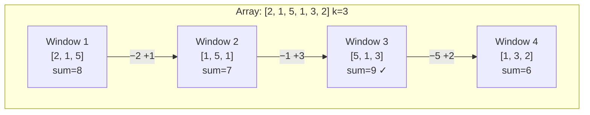

# Sliding Window — Fixed Size

Find the maximum sum of any 3 consecutive elements in an array. The naive way recomputes the sum from scratch for every window. The **sliding window** technique throws away just the leftmost element and adds the new rightmost one — turning O(n·k) into O(n).

---

## The Core Idea

Imagine a physical window of width `k` sliding across an array. As it moves one step right:

- **Add** the element entering from the right
- **Remove** the element leaving from the left

The sum updates in O(1) per step.

```
arr = [2, 1, 5, 1, 3, 2],  k = 3

Window [2, 1, 5]  →  sum = 8
       [1, 5, 1]  →  sum = 8 - 2 + 1 = 7   (remove 2, add 1)
          [5, 1, 3]  →  sum = 7 - 1 + 3 = 9   (remove 1, add 3)
             [1, 3, 2]  →  sum = 9 - 5 + 2 = 6   (remove 5, add 2)
```

---

## Visualising the Window



---

## Problem 1 — Maximum Sum Subarray of Size k

```python,editable
def max_sum_subarray(arr, k):
    n = len(arr)
    if n < k:
        return None

    # Build the first window
    window_sum = sum(arr[:k])
    max_sum = window_sum

    # Slide: add right element, remove left element
    for i in range(k, n):
        window_sum += arr[i] - arr[i - k]
        if window_sum > max_sum:
            max_sum = window_sum

    return max_sum

arr = [2, 1, 5, 1, 3, 2]
print(f"Array: {arr}")
print(f"Max sum of size 3: {max_sum_subarray(arr, 3)}")   # 9

arr2 = [1, 4, 2, 9, 7, 3, 8, 2]
print(f"\nArray: {arr2}")
print(f"Max sum of size 4: {max_sum_subarray(arr2, 4)}")  # 27  (9+7+3+8)
```

**Time:** O(n) — one pass after the initial window setup
**Space:** O(1) — only three variables

### Trace version

```python,editable
def max_sum_trace(arr, k):
    n = len(arr)
    window_sum = sum(arr[:k])
    max_sum = window_sum
    best_start = 0

    print(f"Initial window {arr[:k]}: sum = {window_sum}")

    for i in range(k, n):
        removed = arr[i - k]
        added   = arr[i]
        window_sum += added - removed
        window_start = i - k + 1
        marker = " ← new max" if window_sum > max_sum else ""
        print(f"Remove {removed}, add {added}  →  {arr[window_start:i+1]}: sum = {window_sum}{marker}")
        if window_sum > max_sum:
            max_sum = window_sum
            best_start = window_start

    print(f"\nBest window: {arr[best_start:best_start+k]}, sum = {max_sum}")
    return max_sum

max_sum_trace([2, 1, 5, 1, 3, 2], k=3)
```

---

## Problem 2 — Average of Every Window of Size k

```python,editable
def window_averages(arr, k):
    n = len(arr)
    if n < k:
        return []

    averages = []
    window_sum = sum(arr[:k])
    averages.append(round(window_sum / k, 2))

    for i in range(k, n):
        window_sum += arr[i] - arr[i - k]
        averages.append(round(window_sum / k, 2))

    return averages

# Daily temperatures over a week, k=3 day rolling average
temps = [22, 24, 21, 26, 28, 25, 27]
avgs  = window_averages(temps, k=3)

print("Day temperatures:", temps)
print("3-day rolling avg:", avgs)

# Show paired output
for i, avg in enumerate(avgs):
    window = temps[i:i+3]
    print(f"  Days {i+1}–{i+3}: {window}  →  avg {avg}°C")
```

---

## Problem 3 — First Negative Number in Every Window of Size k

```python,editable
def first_negative_in_windows(arr, k):
    """
    For each window of size k, report the first negative number.
    Report 0 if the window has no negatives.
    Uses a deque to track indices of negative numbers.
    """
    from collections import deque

    n = len(arr)
    result = []
    neg_indices = deque()   # stores indices of negatives in current window

    for i in range(n):
        # Add current element if it is negative
        if arr[i] < 0:
            neg_indices.append(i)

        # Remove indices that have slid out of the window
        if neg_indices and neg_indices[0] < i - k + 1:
            neg_indices.popleft()

        # Record result once the first full window is formed
        if i >= k - 1:
            result.append(arr[neg_indices[0]] if neg_indices else 0)

    return result

arr = [-3, -1, 2, -4, 5, 3, -2]
k = 3
results = first_negative_in_windows(arr, k)

print(f"Array: {arr},  k = {k}\n")
for i, first_neg in enumerate(results):
    window = arr[i:i+k]
    msg = first_neg if first_neg != 0 else "none"
    print(f"Window {window}: first negative = {msg}")
```

---

## Comparing All Three in One Run

```python,editable
def sliding_window_summary(arr, k):
    from collections import deque

    n = len(arr)
    max_sum = float('-inf')
    window_sum = sum(arr[:k])
    current_sum = window_sum
    neg_indices = deque()

    for j in range(k):
        if arr[j] < 0:
            neg_indices.append(j)

    averages = [round(window_sum / k, 2)]
    max_sum = window_sum
    firsts  = []

    if neg_indices:
        firsts.append(arr[neg_indices[0]])
    else:
        firsts.append(0)

    for i in range(k, n):
        window_sum += arr[i] - arr[i - k]
        if arr[i] < 0:
            neg_indices.append(i)
        if neg_indices and neg_indices[0] < i - k + 1:
            neg_indices.popleft()

        averages.append(round(window_sum / k, 2))
        max_sum = max(max_sum, window_sum)
        firsts.append(arr[neg_indices[0]] if neg_indices else 0)

    print(f"Array: {arr},  k = {k}")
    print(f"Max sum of any window:     {max_sum}")
    print(f"Window averages:           {averages}")
    print(f"First negative per window: {firsts}")

sliding_window_summary([2, -1, 5, 1, -3, 2], k=3)
```

---

## Real-World Applications

### Moving Average in Finance

Financial dashboards smooth noisy price data with a rolling average. A 20-day or 50-day moving average is computed exactly like Problem 2 above — slide a fixed-size window over daily closing prices.

```python,editable
def moving_average(prices, window=5):
    avgs = []
    total = sum(prices[:window])
    avgs.append(total / window)
    for i in range(window, len(prices)):
        total += prices[i] - prices[i - window]
        avgs.append(round(total / window, 2))
    return avgs

# Mock closing prices for 10 days
prices = [150, 152, 149, 153, 158, 155, 160, 162, 157, 165]
ma5 = moving_average(prices, window=5)
print("Prices:        ", prices)
print("5-day MA:      ", ma5)
```

### Network Throughput Monitoring

A network monitor tracks bytes received per second. A sliding window gives the average throughput over the last `k` seconds, smoothing out momentary spikes.

```python,editable
def throughput_monitor(bytes_per_second, window_secs=3):
    """Return max observed throughput and rolling average."""
    avg = moving_average(bytes_per_second, window=window_secs)
    peak = max(avg)
    return avg, peak

def moving_average(data, window):
    avgs = []
    total = sum(data[:window])
    avgs.append(round(total / window, 1))
    for i in range(window, len(data)):
        total += data[i] - data[i - window]
        avgs.append(round(total / window, 1))
    return avgs

# MB/s sampled every second over 10 seconds
samples = [12, 15, 14, 20, 35, 30, 10, 8, 9, 11]
avgs, peak = throughput_monitor(samples, window_secs=3)

print("Raw MB/s:      ", samples)
print("3-sec rolling: ", avgs)
print(f"Peak 3-sec avg: {peak} MB/s")
```

---

## Complexity Summary

| Approach              | Time    | Space | Notes                          |
|-----------------------|---------|-------|--------------------------------|
| Recompute each window | O(n·k)  | O(1)  | Nested loop — slow for large k |
| Sliding window        | O(n)    | O(1)  | Add right, remove left         |
| With deque (negatives)| O(n)    | O(k)  | Deque holds at most k entries  |

The fixed-size sliding window is one of the easiest ways to cut an O(n·k) solution down to O(n) — and once you see it, you will recognise it everywhere.
