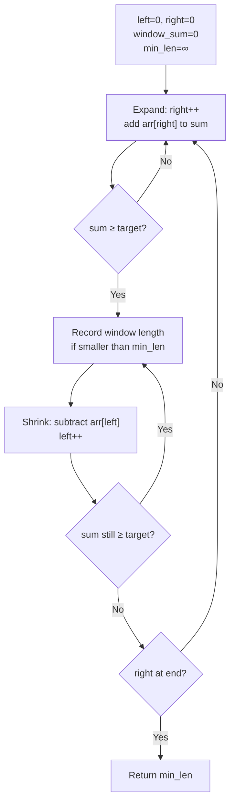

# Sliding Window — Variable Size

Find the smallest subarray with a sum ≥ 7. Unlike the fixed-size window, this window has no fixed width — it **grows** when you need more and **shrinks** when you have enough. Two pointers (`left` and `right`) mark its boundaries, and together they do the job in O(n).

---

## The Core Idea

Use two pointers, both starting at index 0:

1. **Expand right** — move `right` forward to grow the window and add more to the sum.
2. **Shrink left** — once the window satisfies the condition, try to make it smaller by moving `left` forward.
3. Record the best answer whenever the condition is satisfied.

Each pointer moves at most `n` steps, so the total work is O(n) even though it looks like two nested operations.

```
arr = [2, 3, 1, 2, 4, 3],  target = 7

left=0, right grows until sum ≥ 7:
  [2, 3, 1, 2]  sum=8 ≥ 7  →  length 4, try shrinking
  [3, 1, 2]     sum=6 < 7  →  can't shrink, expand again
  [3, 1, 2, 4]  sum=10 ≥ 7 →  length 4, try shrinking
  [1, 2, 4]     sum=7 ≥ 7  →  length 3, try shrinking
  [2, 4]        sum=6 < 7  →  can't shrink
  ...
Answer: 2  (subarray [4, 3])
```

---

## Visualising Expand and Shrink



---

## Problem 1 — Smallest Subarray with Sum ≥ Target

```python,editable
def min_subarray_len(arr, target):
    left = 0
    window_sum = 0
    min_len = float('inf')

    for right in range(len(arr)):
        window_sum += arr[right]            # expand

        while window_sum >= target:         # shrink while valid
            min_len = min(min_len, right - left + 1)
            window_sum -= arr[left]
            left += 1

    return min_len if min_len != float('inf') else 0

arr = [2, 3, 1, 2, 4, 3]
print(f"Array: {arr},  target = 7")
print(f"Smallest length: {min_subarray_len(arr, 7)}")   # 2  ([4,3])

arr2 = [1, 1, 1, 1, 1, 1, 1]
print(f"\nArray: {arr2},  target = 11")
print(f"Smallest length: {min_subarray_len(arr2, 11)}")  # 0 (impossible)
```

**Time:** O(n) — `left` and `right` each travel the array once
**Space:** O(1)

### Trace version

```python,editable
def min_subarray_trace(arr, target):
    left = 0
    window_sum = 0
    min_len = float('inf')
    best = None

    print(f"Target = {target}\n")

    for right in range(len(arr)):
        window_sum += arr[right]
        print(f"Expand  right={right} (+{arr[right]})  window={arr[left:right+1]}  sum={window_sum}")

        while window_sum >= target:
            length = right - left + 1
            if length < min_len:
                min_len = length
                best = arr[left:right+1][:]
            print(f"  Shrink left={left} (−{arr[left]})  len={length} ← {'new best!' if length == min_len else ''}")
            window_sum -= arr[left]
            left += 1

    print(f"\nSmallest subarray: {best},  length = {min_len}")
    return min_len

min_subarray_trace([2, 3, 1, 2, 4, 3], target=7)
```

---

## Problem 2 — Longest Substring Without Repeating Characters

The window now tracks *characters* instead of a numeric sum. We use a set to know what is currently inside the window.

```python,editable
def longest_unique_substring(s):
    char_set = set()
    left = 0
    max_len = 0
    best_start = 0

    for right in range(len(s)):
        # Shrink until the duplicate is gone
        while s[right] in char_set:
            char_set.remove(s[left])
            left += 1

        char_set.add(s[right])

        if right - left + 1 > max_len:
            max_len = right - left + 1
            best_start = left

    return max_len, s[best_start:best_start + max_len]

tests = ["abcabcbb", "bbbbb", "pwwkew", "dvdf", ""]
for t in tests:
    length, substr = longest_unique_substring(t)
    print(f'"{t}"  →  length={length}  window="{substr}"')
```

### Trace to see the window in action

```python,editable
def longest_unique_trace(s):
    char_set = set()
    left = 0
    max_len = 0

    for right in range(len(s)):
        while s[right] in char_set:
            print(f"  Shrink: remove '{s[left]}'")
            char_set.remove(s[left])
            left += 1

        char_set.add(s[right])
        current = s[left:right+1]
        new_best = " ← new best" if len(current) > max_len else ""
        print(f"Add '{s[right]}'  window='{current}'{new_best}")
        max_len = max(max_len, len(current))

    print(f"\nMax length: {max_len}")

longest_unique_trace("abcabcbb")
```

---

## Problem 3 — Longest Subarray with at Most k Distinct Characters

Generalise: allow at most `k` different characters. Use a dictionary to count each character's frequency in the window.

```python,editable
def longest_k_distinct(s, k):
    from collections import defaultdict

    char_count = defaultdict(int)
    left = 0
    max_len = 0
    best_start = 0

    for right in range(len(s)):
        char_count[s[right]] += 1

        # Too many distinct chars — shrink
        while len(char_count) > k:
            char_count[s[left]] -= 1
            if char_count[s[left]] == 0:
                del char_count[s[left]]
            left += 1

        if right - left + 1 > max_len:
            max_len = right - left + 1
            best_start = left

    return max_len, s[best_start:best_start + max_len]

tests = [
    ("eceba",   2),
    ("aa",      1),
    ("aabbcc",  2),
    ("aabbcc",  3),
]
for s, k in tests:
    length, substr = longest_k_distinct(s, k)
    print(f'"{s}"  k={k}  →  length={length}  "{substr}"')
```

---

## Comparing Variable vs Fixed Windows

```python,editable
def demo_both():
    arr = [2, 3, 1, 2, 4, 3]

    # Fixed: max sum of exactly k=3 elements
    k = 3
    window_sum = sum(arr[:k])
    max_sum = window_sum
    for i in range(k, len(arr)):
        window_sum += arr[i] - arr[i - k]
        max_sum = max(max_sum, window_sum)
    print(f"Fixed k={k}: max sum = {max_sum}")

    # Variable: smallest subarray with sum >= 7
    left = window_sum_v = 0
    min_len = float('inf')
    for right in range(len(arr)):
        window_sum_v += arr[right]
        while window_sum_v >= 7:
            min_len = min(min_len, right - left + 1)
            window_sum_v -= arr[left]
            left += 1
    print(f"Variable target=7: min length = {min_len}")

demo_both()
```

---

## Real-World Applications

### Network Rate Limiting

A rate limiter allows at most `N` requests in any rolling window. As new requests arrive, the window grows; as old ones expire, it shrinks. Variable window size is the natural fit.

```python,editable
def max_requests_in_window(timestamps_ms, window_ms):
    """
    Find the maximum number of requests in any window of duration window_ms.
    timestamps_ms: sorted list of request arrival times in milliseconds.
    """
    left = 0
    max_count = 0

    for right in range(len(timestamps_ms)):
        # Shrink while window exceeds allowed duration
        while timestamps_ms[right] - timestamps_ms[left] > window_ms:
            left += 1
        max_count = max(max_count, right - left + 1)

    return max_count

# Request timestamps (ms since start)
requests = [0, 100, 200, 300, 350, 400, 900, 1000]
window   = 500   # 500 ms rolling window

peak = max_requests_in_window(requests, window)
print(f"Timestamps (ms): {requests}")
print(f"Window size:     {window} ms")
print(f"Peak requests:   {peak}")
```

### Longest User Session Without Logout

Given a log of page-view events, find the longest streak of activity where the user never went idle for more than `gap` seconds.

```python,editable
def longest_active_session(event_times, max_gap):
    """
    Find the length of the longest session where no gap between
    consecutive events exceeds max_gap seconds.
    """
    if not event_times:
        return 0

    left = 0
    max_events = 1

    for right in range(1, len(event_times)):
        # A gap larger than allowed breaks the session
        if event_times[right] - event_times[right - 1] > max_gap:
            left = right   # start a new session

        max_events = max(max_events, right - left + 1)

    return max_events

# Event timestamps in seconds
events  = [0, 10, 25, 30, 80, 85, 90, 200, 210, 215, 220]
max_gap = 60   # seconds

length = longest_active_session(events, max_gap)
print(f"Events (s): {events}")
print(f"Max gap:    {max_gap}s")
print(f"Longest session: {length} events")
```

---

## Complexity Summary

| Problem                        | Time | Space | Notes                            |
|--------------------------------|------|-------|----------------------------------|
| Min subarray sum ≥ target      | O(n) | O(1)  | Each pointer moves at most n steps |
| Longest substring no repeats  | O(n) | O(1)  | Set holds at most 26 chars        |
| Longest k-distinct substring  | O(n) | O(k)  | Dict holds at most k entries      |

The variable sliding window is powerful because the same two-pointer skeleton solves wildly different problems — just change what "condition met" means.
