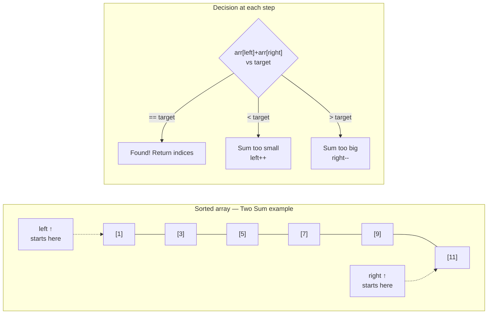

# Two Pointers

Two detectives searching a sorted list from opposite ends — one starting at the smallest value, one at the largest. They compare, decide who moves inward, and meet in the middle in O(n). That is the two-pointer pattern: elegant, fast, and used everywhere from database joins to DNA sequencing.

---

## The Core Idea

Place one pointer at the **start** (`left = 0`) and one at the **end** (`right = n - 1`). Each step, inspect both pointers and move one inward based on a condition. Because the array is sorted, moving a pointer always gives you meaningful information about what to try next.

```
Sorted: [1, 3, 5, 7, 9, 11],  target = 12

left→1  right→11  sum=12  ✓  found!

Sorted: [1, 3, 5, 7, 9, 11],  target = 10

left→1  right→11  sum=12  too big  →  right moves left
left→1  right→9   sum=10  ✓  found!
```

---

## Visualising the Converging Pointers



---

## Problem 1 — Two Sum on a Sorted Array

```python,editable
def two_sum_sorted(arr, target):
    left  = 0
    right = len(arr) - 1

    while left < right:
        current = arr[left] + arr[right]

        if current == target:
            return left, right
        elif current < target:
            left += 1     # need a bigger sum → move left pointer right
        else:
            right -= 1    # need a smaller sum → move right pointer left

    return None   # no pair found

arr = [1, 3, 5, 7, 9, 11]
print(f"Array: {arr}")

for target in [12, 10, 20, 4]:
    result = two_sum_sorted(arr, target)
    if result:
        i, j = result
        print(f"  target={target:2d}  →  [{i}]+[{j}] = {arr[i]}+{arr[j]}")
    else:
        print(f"  target={target:2d}  →  no pair found")
```

**Time:** O(n) — each pointer moves at most n steps
**Space:** O(1)

### Trace version

```python,editable
def two_sum_trace(arr, target):
    left, right = 0, len(arr) - 1

    print(f"Array: {arr},  target = {target}\n")
    print(f"{'left':>5}  {'right':>6}  {'sum':>5}  action")
    print("-" * 35)

    while left < right:
        s = arr[left] + arr[right]
        if s == target:
            print(f"{left:>5}  {right:>6}  {s:>5}  FOUND: {arr[left]}+{arr[right]}")
            return left, right
        elif s < target:
            print(f"{left:>5}  {right:>6}  {s:>5}  too small → left++")
            left += 1
        else:
            print(f"{left:>5}  {right:>6}  {s:>5}  too big  → right--")
            right -= 1

    print("No pair found.")
    return None

two_sum_trace([1, 3, 5, 7, 9, 11], target=10)
```

---

## Problem 2 — Remove Duplicates from a Sorted Array In-Place

Two pointers travelling in the **same direction**: `slow` marks the frontier of unique elements; `fast` scans ahead for the next new value.

```python,editable
def remove_duplicates(arr):
    if not arr:
        return 0

    slow = 0   # last position of unique elements

    for fast in range(1, len(arr)):
        if arr[fast] != arr[slow]:
            slow += 1
            arr[slow] = arr[fast]

    return slow + 1   # length of the deduplicated prefix

# Modify in-place and return new length
arr = [1, 1, 2, 3, 3, 3, 4, 5, 5]
print(f"Before: {arr}")
k = remove_duplicates(arr)
print(f"After:  {arr[:k]}")
print(f"Unique count: {k}")

arr2 = [0, 0, 1, 1, 1, 2, 2, 3, 3, 4]
k2 = remove_duplicates(arr2)
print(f"\nBefore: {[0,0,1,1,1,2,2,3,3,4]}")
print(f"After:  {arr2[:k2]}")
```

### How the two pointers move

```python,editable
def remove_duplicates_trace(arr):
    slow = 0
    print(f"{'fast':>5}  {'slow':>5}  arr[fast]  action")
    print("-" * 42)
    for fast in range(1, len(arr)):
        if arr[fast] != arr[slow]:
            slow += 1
            arr[slow] = arr[fast]
            action = f"NEW → write {arr[slow]} at pos {slow}"
        else:
            action = f"DUP → skip"
        print(f"{fast:>5}  {slow:>5}  {arr[fast]:>9}  {action}")
    return slow + 1

arr = [1, 1, 2, 3, 3, 4]
k = remove_duplicates_trace(arr)
print(f"\nResult: {arr[:k]}")
```

---

## Problem 3 — Container With Most Water

Given heights of vertical lines at each index, find two lines that together with the x-axis hold the most water.

```python,editable
def max_water(heights):
    left  = 0
    right = len(heights) - 1
    best  = 0
    best_pair = (0, 0)

    while left < right:
        width  = right - left
        height = min(heights[left], heights[right])
        water  = width * height

        if water > best:
            best = water
            best_pair = (left, right)

        # Move the shorter wall — moving the taller one can only hurt
        if heights[left] < heights[right]:
            left += 1
        else:
            right -= 1

    return best, best_pair

heights = [1, 8, 6, 2, 5, 4, 8, 3, 7]
water, (l, r) = max_water(heights)
print(f"Heights: {heights}")
print(f"Max water: {water}")
print(f"Between indices {l} (h={heights[l]}) and {r} (h={heights[r]})")
```

**Why move the shorter wall?** The water level is capped by the shorter line. Making the taller line even taller changes nothing. Moving the shorter line is the only way to potentially increase the water level.

---

## Problem 4 — Three Sum (Find All Triplets Summing to Zero)

Fix one element, then use two pointers on the rest:

```python,editable
def three_sum(nums):
    nums.sort()
    result = []
    n = len(nums)

    for i in range(n - 2):
        # Skip duplicate values at the fixed position
        if i > 0 and nums[i] == nums[i - 1]:
            continue

        left  = i + 1
        right = n - 1

        while left < right:
            total = nums[i] + nums[left] + nums[right]

            if total == 0:
                result.append([nums[i], nums[left], nums[right]])
                # Skip duplicates at both pointers
                while left < right and nums[left] == nums[left + 1]:
                    left += 1
                while left < right and nums[right] == nums[right - 1]:
                    right -= 1
                left  += 1
                right -= 1
            elif total < 0:
                left += 1
            else:
                right -= 1

    return result

nums = [-1, 0, 1, 2, -1, -4]
print(f"Input:   {nums}")
triplets = three_sum(nums)
print(f"Triplets summing to 0:")
for t in triplets:
    print(f"  {t}")

nums2 = [0, 0, 0, 0]
print(f"\nInput:   {nums2}")
print(f"Triplets: {three_sum(nums2)}")
```

**Time:** O(n²) — outer loop O(n), inner two-pointer O(n)
**Space:** O(1) excluding output

---

## Palindrome Checking

Two pointers from both ends, comparing characters as they close in:

```python,editable
def is_palindrome(s):
    # Normalise: keep only alphanumeric, lowercase
    cleaned = ''.join(c.lower() for c in s if c.isalnum())
    left, right = 0, len(cleaned) - 1

    while left < right:
        if cleaned[left] != cleaned[right]:
            return False
        left  += 1
        right -= 1

    return True

tests = [
    "racecar",
    "A man, a plan, a canal: Panama",
    "hello",
    "Was it a car or a cat I saw?",
    "",
]
for t in tests:
    print(f'"{t}"  →  {is_palindrome(t)}')
```

---

## Real-World Applications

### Database Merge Joins

When two sorted tables are joined on a common column, a database engine walks both with one pointer each — no nested loops needed. This is the merge step in merge sort, generalised to relational data.

```python,editable
def merge_join(table_a, table_b):
    """
    Given two sorted lists of (id, value) tuples, find all matching ids.
    Simulates a database merge join.
    """
    i, j = 0, 0
    matches = []

    while i < len(table_a) and j < len(table_b):
        id_a, val_a = table_a[i]
        id_b, val_b = table_b[j]

        if id_a == id_b:
            matches.append((id_a, val_a, val_b))
            i += 1
            j += 1
        elif id_a < id_b:
            i += 1
        else:
            j += 1

    return matches

users   = [(1, "Alice"), (3, "Bob"), (5, "Carol"), (7, "Dave")]
orders  = [(2, "laptop"), (3, "phone"), (5, "tablet"), (6, "keyboard")]

joined = merge_join(users, orders)
print(f"{'ID':>3}  {'User':>8}  {'Order':>10}")
print("-" * 28)
for uid, user, order in joined:
    print(f"{uid:>3}  {user:>8}  {order:>10}")
```

### DNA Sequence Alignment

Checking if one DNA strand is the reverse complement of another is a classic two-pointer palindrome check:

```python,editable
def is_reverse_complement(strand_a, strand_b):
    """
    In DNA: A pairs with T, C pairs with G.
    strand_b is the reverse complement of strand_a if
    reading strand_b backwards gives the complement of strand_a.
    """
    complement = {'A': 'T', 'T': 'A', 'C': 'G', 'G': 'C'}

    if len(strand_a) != len(strand_b):
        return False

    left  = 0
    right = len(strand_b) - 1

    while left < len(strand_a):
        if strand_a[left] != complement.get(strand_b[right], '?'):
            return False
        left  += 1
        right -= 1

    return True

print(is_reverse_complement("ATCG", "CGAT"))   # True
print(is_reverse_complement("AAAA", "TTTT"))   # True
print(is_reverse_complement("ATCG", "ATCG"))   # False
```

---

## Complexity Summary

| Problem                        | Time  | Space | Notes                              |
|--------------------------------|-------|-------|------------------------------------|
| Two Sum (sorted)               | O(n)  | O(1)  | Converging pointers                |
| Remove duplicates in-place     | O(n)  | O(1)  | Same-direction fast/slow pointers  |
| Container with most water      | O(n)  | O(1)  | Always move the shorter wall       |
| Three Sum                      | O(n²) | O(1)  | Fix + two-pointer inner loop       |
| Palindrome check               | O(n)  | O(1)  | Converging, compare and close in   |

The two-pointer pattern works because sorted order lets each pointer movement *eliminate* a range of possibilities. Recognise when your input is sorted (or can be sorted cheaply) and ask whether two pointers can replace a nested loop.
