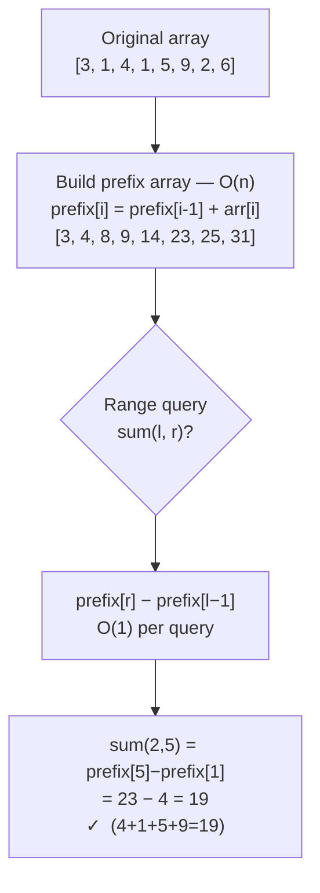

# Prefix Sums

Answer "what is the sum of elements from index 3 to 7?" in O(1) — after a one-time O(n) setup. Prefix sums trade a little memory for the ability to answer unlimited range queries instantly. Once you understand the trick, you will see it in financial dashboards, databases, image processing, and competitive programming alike.

---

## The Core Idea

Build a **prefix array** where `prefix[i]` holds the sum of all elements from index 0 up to and including index `i`.

```
arr    =  [3, 1, 4, 1, 5, 9, 2, 6]
index  =   0  1  2  3  4  5  6  7

prefix =  [3, 4, 8, 9, 14, 23, 25, 31]
```

Now, the sum of any range `[l, r]` is:

```
range_sum(l, r) = prefix[r] - prefix[l-1]   (when l > 0)
range_sum(0, r) = prefix[r]
```

---

## From Array to Prefix Array to Range Query



---

## Problem 1 — Range Sum Query (The Classic)

```python,editable
def build_prefix(arr):
    prefix = [0] * len(arr)
    prefix[0] = arr[0]
    for i in range(1, len(arr)):
        prefix[i] = prefix[i - 1] + arr[i]
    return prefix

def range_sum(prefix, l, r):
    if l == 0:
        return prefix[r]
    return prefix[r] - prefix[l - 1]

arr    = [3, 1, 4, 1, 5, 9, 2, 6]
prefix = build_prefix(arr)

print(f"Array:  {arr}")
print(f"Prefix: {prefix}\n")

queries = [(0, 7), (2, 5), (3, 3), (0, 3), (5, 7)]
for l, r in queries:
    total = range_sum(prefix, l, r)
    print(f"sum({l},{r}) = {arr[l:r+1]}  →  {total}")
```

**Time:** O(n) to build, O(1) per query
**Space:** O(n) for the prefix array

### Why this beats recomputing each time

```python,editable
import time
import random

arr    = [random.randint(1, 100) for _ in range(10_000)]
prefix = build_prefix(arr)

queries = [(random.randint(0, 4999), random.randint(5000, 9999)) for _ in range(10_000)]

def build_prefix(a):
    p = [0] * len(a)
    p[0] = a[0]
    for i in range(1, len(a)):
        p[i] = p[i-1] + a[i]
    return p

# Brute force: O(n) per query
t0 = time.time()
for l, r in queries:
    _ = sum(arr[l:r+1])
brute_ms = (time.time() - t0) * 1000

# Prefix sums: O(1) per query
prefix = build_prefix(arr)
t1 = time.time()
for l, r in queries:
    _ = prefix[r] - (prefix[l-1] if l > 0 else 0)
prefix_ms = (time.time() - t1) * 1000

print(f"10 000 queries on 10 000-element array:")
print(f"  Brute force:  {brute_ms:.1f} ms")
print(f"  Prefix sums:  {prefix_ms:.1f} ms")
print(f"  Speedup:      {brute_ms/max(prefix_ms,0.001):.0f}×")
```

---

## Problem 2 — Number of Subarrays with Sum Equal to k

This is where prefix sums become genuinely clever. We want to count subarrays whose elements sum to exactly `k`.

**The insight:** a subarray `arr[l..r]` sums to `k` if and only if `prefix[r] - prefix[l-1] == k`, which means `prefix[l-1] == prefix[r] - k`. Use a hashmap to count how many times each prefix sum has appeared so far.

```python,editable
from collections import defaultdict

def count_subarrays_with_sum(arr, k):
    count = 0
    prefix_sum = 0
    freq = defaultdict(int)
    freq[0] = 1    # empty prefix has sum 0

    for x in arr:
        prefix_sum += x
        # How many previous prefix sums equal (current - k)?
        count += freq[prefix_sum - k]
        freq[prefix_sum] += 1

    return count

arr = [1, 1, 1]
print(f"Array: {arr},  k=2  →  {count_subarrays_with_sum(arr, 2)} subarrays")
# Subarrays: [1,1] at (0,1) and (1,2)  →  2

arr2 = [1, 2, 3]
print(f"Array: {arr2},  k=3  →  {count_subarrays_with_sum(arr2, 3)} subarrays")
# [3] at index 2, and [1,2] at (0,1)  →  2

arr3 = [3, 4, 7, 2, -3, 1, 4, 2]
print(f"Array: {arr3},  k=7  →  {count_subarrays_with_sum(arr3, 7)} subarrays")
```

### Trace to see the hashmap fill up

```python,editable
from collections import defaultdict

def count_subarrays_trace(arr, k):
    count = 0
    prefix_sum = 0
    freq = defaultdict(int)
    freq[0] = 1

    print(f"k = {k}\n")
    print(f"{'i':>3}  {'arr[i]':>6}  {'prefix':>7}  {'need':>5}  {'found':>6}  count")
    print("-" * 50)

    for i, x in enumerate(arr):
        prefix_sum += x
        need  = prefix_sum - k
        found = freq[need]
        count += found
        freq[prefix_sum] += 1
        print(f"{i:>3}  {x:>6}  {prefix_sum:>7}  {need:>5}  {found:>6}  {count}")

    print(f"\nTotal subarrays with sum={k}: {count}")
    return count

count_subarrays_trace([1, 2, 3, 0, 3], k=3)
```

---

## Problem 3 — Product of Array Except Self

For each index `i`, compute the product of all other elements without division and in O(n).

The trick: build a **left prefix product** (product of everything to the left of `i`) and a **right suffix product** (product of everything to the right). Multiply them together.

```python,editable
def product_except_self(arr):
    n = len(arr)
    result = [1] * n

    # Pass 1: result[i] = product of arr[0..i-1]
    prefix = 1
    for i in range(n):
        result[i] = prefix
        prefix *= arr[i]

    # Pass 2: multiply in product of arr[i+1..n-1]
    suffix = 1
    for i in range(n - 1, -1, -1):
        result[i] *= suffix
        suffix *= arr[i]

    return result

arr = [1, 2, 3, 4]
print(f"Array:   {arr}")
print(f"Product: {product_except_self(arr)}")
# [24, 12, 8, 6]
# index 0: 2*3*4=24, index 1: 1*3*4=12, etc.

arr2 = [-1, 1, 0, -3, 3]
print(f"\nArray:   {arr2}")
print(f"Product: {product_except_self(arr2)}")
```

### Visualising the two passes

```python,editable
def product_except_self_trace(arr):
    n = len(arr)
    result = [1] * n

    prefix = 1
    print("Left pass (prefix products):")
    for i in range(n):
        result[i] = prefix
        prefix *= arr[i]
        print(f"  i={i}  result[{i}]={result[i]}  prefix becomes {prefix}")

    suffix = 1
    print("\nRight pass (multiply suffix):")
    for i in range(n - 1, -1, -1):
        result[i] *= suffix
        suffix *= arr[i]
        print(f"  i={i}  result[{i}]={result[i]}  suffix becomes {suffix}")

    print(f"\nFinal: {result}")
    return result

product_except_self_trace([1, 2, 3, 4])
```

---

## Real-World Applications

### Cumulative Sales Totals

Every business dashboard shows "sales from date A to date B". Build the prefix once at report-generation time; every date-range query is then O(1).

```python,editable
def build_prefix(arr):
    p = [0] * len(arr)
    p[0] = arr[0]
    for i in range(1, len(arr)):
        p[i] = p[i-1] + arr[i]
    return p

def range_sum(prefix, l, r):
    return prefix[r] - (prefix[l-1] if l > 0 else 0)

# Daily sales for January (31 days, indexed 0–30)
daily_sales = [
    120, 95, 140, 200, 180, 160, 175,   # week 1
    130, 145, 190, 210, 170, 155, 165,   # week 2
     90, 100, 220, 195, 185, 175, 160,   # week 3
    140, 155, 200, 180, 170, 165, 175,   # week 4
    190, 195, 210                         # final days
]

prefix = build_prefix(daily_sales)

print(f"Week 1 total:  ${range_sum(prefix, 0, 6):,}")
print(f"Week 2 total:  ${range_sum(prefix, 7, 13):,}")
print(f"Week 3 total:  ${range_sum(prefix, 14, 20):,}")
print(f"Full January:  ${range_sum(prefix, 0, 30):,}")
print(f"Days 10–20:    ${range_sum(prefix, 10, 20):,}")
```

### 2D Prefix Sums — Image Integral (Computer Vision)

The same idea extends to two dimensions. The **integral image** (or summed-area table) is used in computer vision to compute the sum of any rectangular region of pixel values in O(1), enabling real-time face detection (Viola-Jones algorithm).

```python,editable
def build_2d_prefix(grid):
    rows = len(grid)
    cols = len(grid[0])
    prefix = [[0] * (cols + 1) for _ in range(rows + 1)]

    for r in range(1, rows + 1):
        for c in range(1, cols + 1):
            prefix[r][c] = (
                grid[r-1][c-1]
                + prefix[r-1][c]
                + prefix[r][c-1]
                - prefix[r-1][c-1]
            )
    return prefix

def rect_sum(prefix, r1, c1, r2, c2):
    """Sum of rectangle from (r1,c1) to (r2,c2), inclusive, 0-indexed."""
    return (
        prefix[r2+1][c2+1]
        - prefix[r1][c2+1]
        - prefix[r2+1][c1]
        + prefix[r1][c1]
    )

# 5x5 grayscale pixel values (0-255)
image = [
    [10, 20, 30, 40, 50],
    [15, 25, 35, 45, 55],
    [20, 30, 40, 50, 60],
    [25, 35, 45, 55, 65],
    [30, 40, 50, 60, 70],
]

prefix = build_2d_prefix(image)

# Sum of a 3x3 region starting at (1,1)
total = rect_sum(prefix, 1, 1, 3, 3)
print(f"Sum of rectangle (1,1)→(3,3): {total}")

# Verify by brute force
brute = sum(image[r][c] for r in range(1, 4) for c in range(1, 4))
print(f"Brute force verification:      {brute}")
print(f"Match: {total == brute}")

# Full image sum in O(1)
print(f"Full image sum: {rect_sum(prefix, 0, 0, 4, 4)}")
```

---

## Complexity Summary

| Problem                             | Build  | Query | Space |
|-------------------------------------|--------|-------|-------|
| Range sum query                     | O(n)   | O(1)  | O(n)  |
| Subarrays with sum = k (hashmap)    | O(n)   | —     | O(n)  |
| Product except self                 | O(n)   | —     | O(1)* |
| 2D range sum (integral image)       | O(n·m) | O(1)  | O(n·m)|

\* Two extra O(1) variables for prefix/suffix; result array is required output, not overhead.

Prefix sums embody a core engineering trade-off: **spend O(n) time and O(n) space once, then answer queries in O(1) forever**. Whenever you find yourself recomputing the same running total across many queries, ask whether a prefix array can replace the loop.
