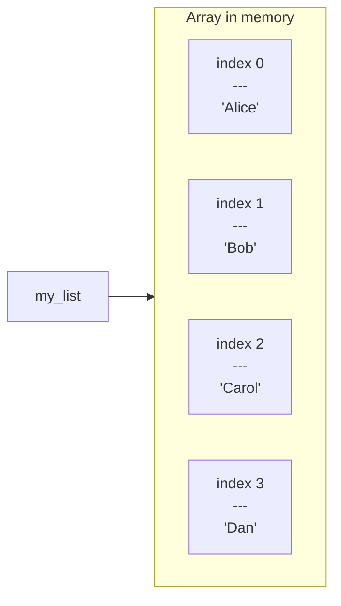
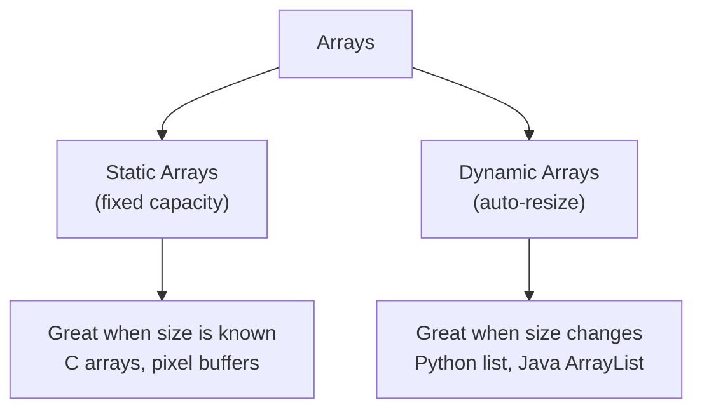

# Arrays

Every list in every app you have ever used is backed by an array. Your Spotify playlist, your Instagram feed, the leaderboard in your favourite game — all arrays under the hood. Understanding arrays means understanding the foundation that almost every other data structure is built on top of.

## What is an array?

An array is a collection of items stored **one after another in memory** — like a row of labelled boxes on a shelf. Each box holds one value and has a unique number called an **index** starting from `0`.



Because items sit side-by-side in memory, the computer can jump straight to any slot using simple arithmetic. That is why reading `arr[2]` is just as fast as reading `arr[0]` — it is always a single step, no matter how large the array is.

## A quick taste

```python,editable
players = ["Alice", "Bob", "Carol", "Dan"]

# Read any element in O(1) — instant, no matter the size
print("First player:", players[0])
print("Last player: ", players[-1])

# Iterate over all elements in O(n)
print("\nFull roster:")
for i, name in enumerate(players):
    print(f"  Slot {i}: {name}")
```

## What you will learn in this section

This section builds your understanding layer by layer:

| Chapter | Topic | The big idea |
|---|---|---|
| [RAM](./01-ram.md) | Memory and addresses | Why index access costs O(1) |
| [Static Arrays](./02-static-arrays.md) | Fixed-size arrays | Fast reads, expensive inserts |
| [Dynamic Arrays](./03-dynamic-arrays.md) | Resizable arrays | How Python lists grow automatically |
| [Stacks](./04-stacks.md) | LIFO structure | One of the most useful tools in CS |
| [Problems](./problems/index.md) | Practice problems | Apply everything you learned |

## Where arrays appear in the real world

- **Social media feeds** — posts stored in order, newest first
- **Image pixels** — a 1080p image is just an array of 2,073,600 colour values
- **Audio samples** — a 44 kHz audio track stores 44,000 numbers per second
- **Undo history** — every keystroke you type is pushed onto an array
- **Game inventories** — item slots are fixed-size arrays
- **Spreadsheets** — each row and column is an array of cells

## The two flavours

Arrays come in two main varieties that this section explores in depth:



Start with [RAM](./01-ram.md) to understand why arrays are designed the way they are, then work through each chapter in order.
