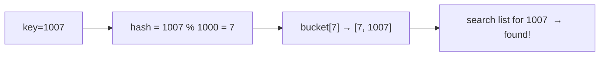

# Design HashSet

**Difficulty:** Easy
**Source:** [NeetCode](https://neetcode.io/problems/design-hashset)

## Problem

> Design a HashSet without using any built-in hash table libraries.
>
> Implement the `MyHashSet` class:
> - `add(key)` — Inserts the value `key` into the HashSet.
> - `remove(key)` — Removes the value `key` from the HashSet. If `key` does not exist, do nothing.
> - `contains(key)` — Returns `true` if `key` exists, `false` otherwise.
>
> **Example 1:**
> Input: `["MyHashSet","add","add","contains","contains","add","contains","remove","contains"]`
> `[[], [1], [2], [1], [3], [2], [2], [2], [2]]`
> Output: `[null, null, null, true, false, null, true, null, false]`
>
> **Constraints:**
> - `0 <= key <= 10^6`
> - At most `10^4` calls will be made to `add`, `remove`, and `contains`.

## Prerequisites

Before attempting this problem, you should be comfortable with:

- **Arrays** — direct-address tables using index-as-key
- **Hash Functions** — mapping keys to array indices
- **Linked Lists** — chaining to handle collisions

---

## 1. Boolean Array (Direct Address Table)

### Intuition

Since keys are bounded between `0` and `10^6`, we can allocate a boolean array of size `10^6 + 1`. Each index represents a key — `True` means the key is present, `False` means it is absent. No hashing or collision handling needed because the key directly serves as the index.

This is a **direct-address table** — extremely fast (O(1) per operation) but only practical when the key range is small and known in advance.

### Algorithm

- **add(key):** Set `data[key] = True`.
- **remove(key):** Set `data[key] = False`.
- **contains(key):** Return `data[key]`.

### Solution

```python,editable
class MyHashSet:
    def __init__(self):
        self.data = [False] * (10**6 + 1)

    def add(self, key: int) -> None:
        self.data[key] = True

    def remove(self, key: int) -> None:
        self.data[key] = False

    def contains(self, key: int) -> bool:
        return self.data[key]


hs = MyHashSet()
hs.add(1)
hs.add(2)
print(hs.contains(1))   # True
print(hs.contains(3))   # False
hs.add(2)
print(hs.contains(2))   # True
hs.remove(2)
print(hs.contains(2))   # False
```

### Complexity

- Time: `O(1)` per operation
- Space: `O(N)` where `N = 10^6` — fixed overhead regardless of how many keys are inserted

---

## 2. Chaining with Array of Lists

### Intuition

A more realistic hash set uses a hash function to map keys into buckets, and each bucket is a list (chain) that can hold multiple keys. Collisions — when two keys hash to the same bucket — are resolved by storing both in the same list and searching linearly within it.

This approach generalises to arbitrary key types and does not require knowing the key range upfront. The key design choices are: the number of buckets (affects collision rate) and the hash function.

### Algorithm

- **`__init__`:** Create `NUM_BUCKETS` empty lists.
- **`_hash(key)`:** Return `key % NUM_BUCKETS` to pick the bucket.
- **add(key):** If `key` not already in the bucket, append it.
- **remove(key):** Filter `key` out of the bucket list.
- **contains(key):** Return `True` if `key` is in the bucket.



### Solution

```python,editable
class MyHashSet:
    NUM_BUCKETS = 1000

    def __init__(self):
        self.buckets = [[] for _ in range(self.NUM_BUCKETS)]

    def _hash(self, key: int) -> int:
        return key % self.NUM_BUCKETS

    def add(self, key: int) -> None:
        h = self._hash(key)
        if key not in self.buckets[h]:
            self.buckets[h].append(key)

    def remove(self, key: int) -> None:
        h = self._hash(key)
        self.buckets[h] = [k for k in self.buckets[h] if k != key]

    def contains(self, key: int) -> bool:
        h = self._hash(key)
        return key in self.buckets[h]


hs = MyHashSet()
hs.add(1)
hs.add(2)
print(hs.contains(1))   # True
print(hs.contains(3))   # False
hs.add(2)
print(hs.contains(2))   # True
hs.remove(2)
print(hs.contains(2))   # False
```

### Complexity

- Time: `O(n / k)` per operation on average, where `n` is the number of keys and `k` is the number of buckets. With a good hash and reasonable load, this approaches `O(1)`.
- Space: `O(n + k)` — `k` bucket lists plus space for `n` stored keys

---

## Common Pitfalls

**Not checking for duplicates before adding.** `add` should be idempotent — adding a key that already exists should not create a duplicate entry in the bucket. Always check `if key not in bucket` before appending.

**Modifying the bucket list while iterating it.** When removing, create a new filtered list rather than deleting elements while iterating. In Python, a list comprehension is the cleanest way to do this.

**Choosing too few buckets.** With only 10 buckets and 10^4 operations, each bucket could hold 1000 keys on average, making each operation O(1000). Choose a bucket count that gives a low load factor (roughly number-of-keys / number-of-buckets ≈ 1).
