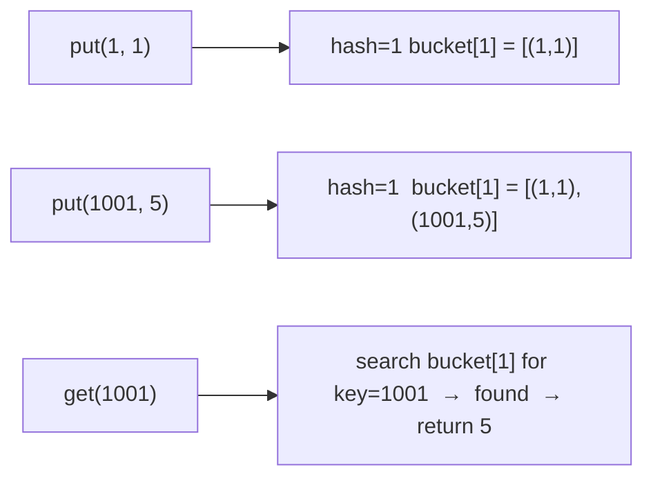

# Design HashMap

**Difficulty:** Easy
**Source:** [NeetCode](https://neetcode.io/problems/design-hashmap)

## Problem

> Design a HashMap without using any built-in hash table libraries.
>
> Implement the `MyHashMap` class:
> - `put(key, value)` — Inserts or updates the mapping `key → value`. If `key` already exists, update its value.
> - `get(key)` — Returns the value mapped to `key`, or `-1` if it does not exist.
> - `remove(key)` — Removes `key` and its associated value. If `key` does not exist, do nothing.
>
> **Example 1:**
> Input: `["MyHashMap","put","put","get","get","put","get","remove","get"]`
> `[[], [1,1], [2,2], [1], [3], [2,1], [2], [2], [2]]`
> Output: `[null, null, null, 1, -1, null, 1, null, -1]`
>
> **Constraints:**
> - `0 <= key, value <= 10^6`
> - At most `10^4` calls will be made to `put`, `get`, and `remove`.

## Prerequisites

Before attempting this problem, you should be comfortable with:

- **Arrays** — fixed-size storage for direct address tables
- **Hash Functions** — mapping keys to indices
- **Linked Lists or Arrays** — chaining to handle collisions

---

## 1. Fixed-Size Array (Direct Address Table)

### Intuition

Since keys are bounded between `0` and `10^6`, allocate an array of size `10^6 + 1` where each slot stores the associated value (or `-1` to indicate absence). The key directly serves as the array index — no hash function needed. This is fast but memory-heavy.

### Algorithm

- **`__init__`:** Create `data = [-1] * (10^6 + 1)`.
- **put(key, value):** Set `data[key] = value`.
- **get(key):** Return `data[key]`.
- **remove(key):** Set `data[key] = -1`.

### Solution

```python,editable
class MyHashMap:
    def __init__(self):
        self.data = [-1] * (10**6 + 1)

    def put(self, key: int, value: int) -> None:
        self.data[key] = value

    def get(self, key: int) -> int:
        return self.data[key]

    def remove(self, key: int) -> None:
        self.data[key] = -1


hm = MyHashMap()
hm.put(1, 1)
hm.put(2, 2)
print(hm.get(1))    # 1
print(hm.get(3))    # -1
hm.put(2, 1)        # update key 2
print(hm.get(2))    # 1
hm.remove(2)
print(hm.get(2))    # -1
```

### Complexity

- Time: `O(1)` per operation
- Space: `O(N)` where `N = 10^6` — allocated upfront regardless of usage

---

## 2. Chaining with Buckets

### Intuition

A more realistic implementation uses a hash function to assign keys to buckets, with each bucket holding a list of `(key, value)` pairs. On collision, pairs are stored in the same bucket and we search linearly for the matching key. This scales better in memory when the key space is large.

### Algorithm

- **`__init__`:** Create `NUM_BUCKETS` empty lists.
- **`_hash(key)`:** Return `key % NUM_BUCKETS`.
- **put(key, value):** Search the bucket for `key`. If found, update value. Otherwise, append `(key, value)`.
- **get(key):** Search the bucket for `key`. Return its value or `-1`.
- **remove(key):** Filter out the pair with `key` from the bucket.



### Solution

```python,editable
class MyHashMap:
    NUM_BUCKETS = 1000

    def __init__(self):
        self.buckets = [[] for _ in range(self.NUM_BUCKETS)]

    def _hash(self, key: int) -> int:
        return key % self.NUM_BUCKETS

    def put(self, key: int, value: int) -> None:
        h = self._hash(key)
        for i, (k, v) in enumerate(self.buckets[h]):
            if k == key:
                self.buckets[h][i] = (key, value)
                return
        self.buckets[h].append((key, value))

    def get(self, key: int) -> int:
        h = self._hash(key)
        for k, v in self.buckets[h]:
            if k == key:
                return v
        return -1

    def remove(self, key: int) -> None:
        h = self._hash(key)
        self.buckets[h] = [(k, v) for k, v in self.buckets[h] if k != key]


hm = MyHashMap()
hm.put(1, 1)
hm.put(2, 2)
print(hm.get(1))    # 1
print(hm.get(3))    # -1
hm.put(2, 1)        # update key 2
print(hm.get(2))    # 1
hm.remove(2)
print(hm.get(2))    # -1
```

### Complexity

- Time: `O(n / k)` per operation on average, where `n` is the number of stored pairs and `k` is the number of buckets
- Space: `O(n + k)`

---

## Common Pitfalls

**Updating instead of appending on duplicate keys.** `put` must update the value for an existing key, not append a second `(key, value)` pair. Iterate through the bucket first; if the key is found, update in place and return early.

**Returning `-1` for absent keys vs. `None`.** The problem specifies `-1` as the sentinel for "not found." If you use a different sentinel, you risk confusing a legitimately stored value of `-1` with "not found." For this problem, the constraints say `0 <= value <= 10^6`, so `-1` is safe. In a general-purpose map, use `None` instead.

**Thread safety.** Real hash map implementations need locking or lock-free data structures for concurrent access. For this problem, assume single-threaded access.
