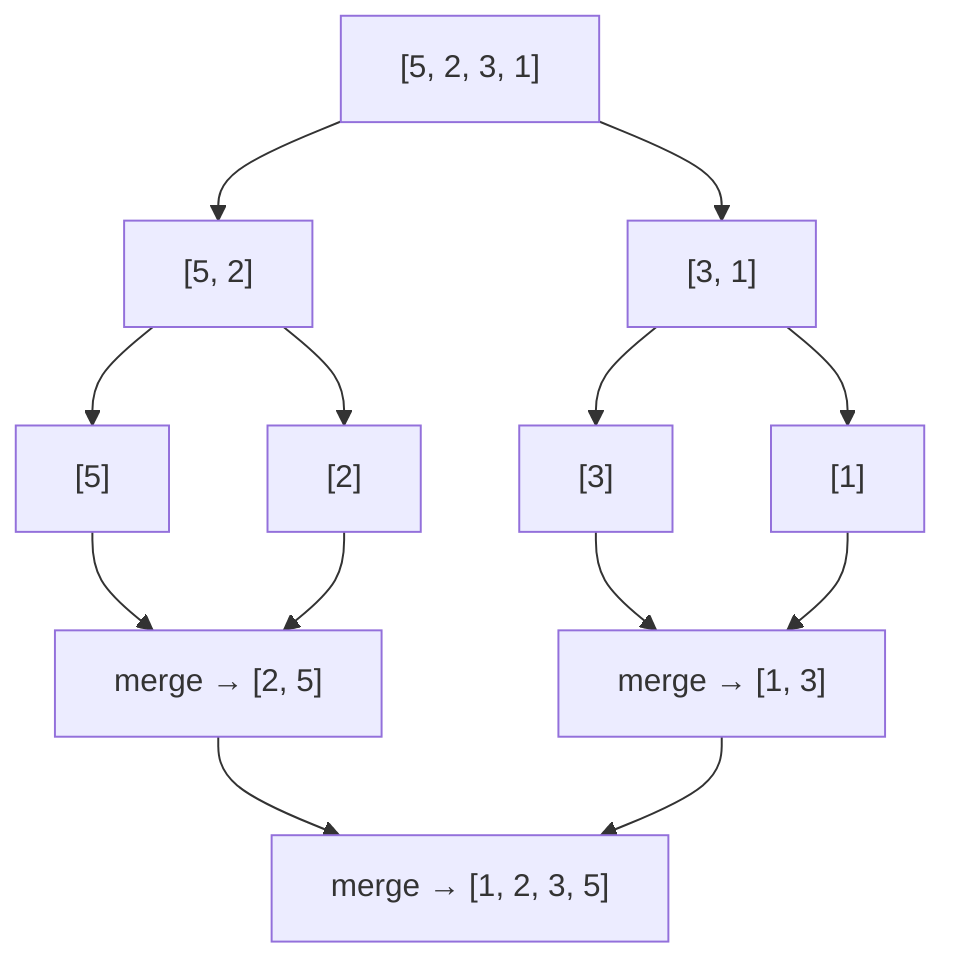

# Sort an Array

**Difficulty:** Medium
**Source:** [NeetCode](https://neetcode.io/problems/sort-an-array)

## Problem

> Given an array of integers `nums`, sort the array in **ascending order** and return it.
>
> You must solve the problem **without using any built-in functions** in `O(n log n)` time complexity and with the smallest space complexity possible.
>
> **Example 1:**
> Input: `nums = [5, 2, 3, 1]`
> Output: `[1, 2, 3, 5]`
>
> **Example 2:**
> Input: `nums = [5, 1, 1, 2, 0, 0]`
> Output: `[0, 0, 1, 1, 2, 5]`
>
> **Constraints:**
> - `1 <= nums.length <= 5 * 10^4`
> - `-5 * 10^4 <= nums[i] <= 5 * 10^4`

## Prerequisites

Before attempting this problem, you should be comfortable with:

- **Recursion** — divide-and-conquer thinking
- **Merging sorted arrays** — combining two sorted halves into one

---

## 1. Brute Force (Bubble Sort)

### Intuition

Repeatedly scan through the array and swap adjacent elements that are out of order. Each full pass "bubbles" the largest unsorted element to its final position at the end. After `n - 1` passes, the array is sorted. This is correct but extremely slow for large inputs.

### Algorithm

1. For each pass `i` from `0` to `n - 1`:
   - For each index `j` from `0` to `n - i - 2`:
     - If `nums[j] > nums[j + 1]`, swap them.
2. Return `nums`.

### Solution

```python,editable
def sortArray(nums):
    n = len(nums)
    for i in range(n):
        for j in range(n - i - 1):
            if nums[j] > nums[j + 1]:
                nums[j], nums[j + 1] = nums[j + 1], nums[j]
    return nums


print(sortArray([5, 2, 3, 1]))       # [1, 2, 3, 5]
print(sortArray([5, 1, 1, 2, 0, 0])) # [0, 0, 1, 1, 2, 5]
```

### Complexity

- Time: `O(n²)`
- Space: `O(1)`

---

## 2. Merge Sort

### Intuition

Merge sort is a classic divide-and-conquer algorithm. Split the array in half, recursively sort each half, then merge the two sorted halves back together. The merge step is O(n) and the recursion depth is O(log n), giving an overall time of O(n log n).

The key operation is the **merge**: two sorted arrays can be combined in O(n) by always picking the smaller front element from either array.

### Algorithm

1. **Base case:** If the array has 0 or 1 elements, it is already sorted — return it.
2. **Split:** Find the midpoint `mid = len(nums) // 2`. Recursively sort `left = nums[:mid]` and `right = nums[mid:]`.
3. **Merge:** Compare elements from the front of `left` and `right`, appending the smaller one to the result.
4. Drain any remaining elements from either half.
5. Return the merged result.



### Solution

```python,editable
def sortArray(nums):
    if len(nums) <= 1:
        return nums

    mid = len(nums) // 2
    left = sortArray(nums[:mid])
    right = sortArray(nums[mid:])

    # Merge step
    result = []
    i = j = 0
    while i < len(left) and j < len(right):
        if left[i] <= right[j]:
            result.append(left[i])
            i += 1
        else:
            result.append(right[j])
            j += 1
    result.extend(left[i:])
    result.extend(right[j:])
    return result


print(sortArray([5, 2, 3, 1]))        # [1, 2, 3, 5]
print(sortArray([5, 1, 1, 2, 0, 0]))  # [0, 0, 1, 1, 2, 5]
print(sortArray([-4, 0, 7, 4, 9, -5, 1, 10, -1, -1]))  # [-5,-4,-1,-1,0,1,4,7,9,10]
```

### Complexity

- Time: `O(n log n)` — `log n` levels of recursion, each doing `O(n)` work in the merge step
- Space: `O(n)` — temporary arrays allocated during the merge steps; `O(log n)` for the call stack

---

## Common Pitfalls

**Mutating `nums` in-place during merge sort.** The version above creates new lists during merging, which is simpler but uses more memory. An in-place merge sort is significantly more complex — for interviews, the slicing approach shown here is preferred.

**Choosing the wrong pivot for quicksort.** If you use quicksort instead of merge sort, always-worst-case pivot selection (e.g., always picking the first element on a sorted array) degrades to O(n²). Merge sort avoids this problem entirely — its worst case is always O(n log n).

**Stack overflow on very large inputs.** Python's default recursion limit is 1000. For `n = 50000`, the recursion depth of merge sort is about `log₂(50000) ≈ 16` — well within limits. No issue here, but keep this in mind for other recursive algorithms.
