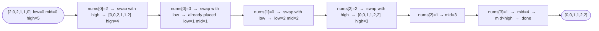

# Sort Colors

**Difficulty:** Medium
**Source:** [NeetCode](https://neetcode.io/problems/sort-colors)

## Problem

> Given an array `nums` with `n` objects colored red, white, or blue, sort them **in-place** so that objects of the same color are adjacent, with the colors in the order red, white, and blue.
>
> We will use the integers `0`, `1`, and `2` to represent the colors red, white, and blue, respectively.
>
> You must solve this problem without using the library's sort function.
>
> **Example 1:**
> Input: `nums = [2, 0, 2, 1, 1, 0]`
> Output: `[0, 0, 1, 1, 2, 2]`
>
> **Example 2:**
> Input: `nums = [2, 0, 1]`
> Output: `[0, 1, 2]`
>
> **Constraints:**
> - `n == nums.length`
> - `1 <= n <= 300`
> - `nums[i]` is either `0`, `1`, or `2`.

## Prerequisites

Before attempting this problem, you should be comfortable with:

- **Two Pointers** — maintaining multiple indices into an array
- **In-place swapping** — rearranging elements without extra storage

---

## 1. Brute Force (Count and Overwrite)

### Intuition

Count how many `0`s, `1`s, and `2`s appear in the array. Then overwrite the array — first fill in all the `0`s, then all the `1`s, then all the `2`s. This takes two passes and constant extra space (just three counters). Simple and easy to verify.

### Algorithm

1. Count occurrences of `0`, `1`, `2`.
2. Overwrite `nums`: first `count[0]` positions get `0`, next `count[1]` positions get `1`, rest get `2`.

### Solution

```python,editable
def sortColors(nums):
    count = [0, 0, 0]
    for num in nums:
        count[num] += 1
    i = 0
    for color in range(3):
        for _ in range(count[color]):
            nums[i] = color
            i += 1


nums = [2, 0, 2, 1, 1, 0]
sortColors(nums)
print(nums)  # [0, 0, 1, 1, 2, 2]

nums = [2, 0, 1]
sortColors(nums)
print(nums)  # [0, 1, 2]
```

### Complexity

- Time: `O(n)` — two passes
- Space: `O(1)` — three counters

---

## 2. Dutch National Flag Algorithm

### Intuition

This is the classic Dutch National Flag problem (named after the three-color Dutch flag) attributed to Edsger Dijkstra. The idea is to use three pointers:

- `low` — everything left of `low` is `0`
- `mid` — the current element being examined
- `high` — everything right of `high` is `2`
- Elements between `low` and `high` (exclusive) are either `1` or unprocessed

We scan `mid` from left to right. Depending on the value at `mid`:
- If it is `0`, swap it to the `low` zone and advance both `low` and `mid`.
- If it is `1`, it is already in the middle — just advance `mid`.
- If it is `2`, swap it to the `high` zone and retreat `high`. Do not advance `mid` yet because the swapped-in element has not been examined.

This sorts the array in a **single pass** with **no extra memory**.

### Algorithm

1. Initialize `low = 0`, `mid = 0`, `high = n - 1`.
2. While `mid <= high`:
   - If `nums[mid] == 0`: swap `nums[mid]` and `nums[low]`, increment `low` and `mid`.
   - If `nums[mid] == 1`: increment `mid`.
   - If `nums[mid] == 2`: swap `nums[mid]` and `nums[high]`, decrement `high`.



### Solution

```python,editable
def sortColors(nums):
    low, mid, high = 0, 0, len(nums) - 1
    while mid <= high:
        if nums[mid] == 0:
            nums[low], nums[mid] = nums[mid], nums[low]
            low += 1
            mid += 1
        elif nums[mid] == 1:
            mid += 1
        else:  # nums[mid] == 2
            nums[mid], nums[high] = nums[high], nums[mid]
            high -= 1


nums = [2, 0, 2, 1, 1, 0]
sortColors(nums)
print(nums)  # [0, 0, 1, 1, 2, 2]

nums = [2, 0, 1]
sortColors(nums)
print(nums)  # [0, 1, 2]

nums = [1]
sortColors(nums)
print(nums)  # [1]
```

### Complexity

- Time: `O(n)` — single pass, `mid` advances or `high` retreats every iteration
- Space: `O(1)` — three pointer variables only

---

## Common Pitfalls

**Not advancing `mid` when swapping with `high`.** After swapping `nums[mid]` with `nums[high]`, you decrement `high` but do NOT increment `mid`. The element that just arrived at `mid` from `high` has not been examined yet — it could be `0`, `1`, or `2`. Advancing `mid` prematurely would skip it.

**Confusing `low` and `mid`.** After swapping `nums[mid]` with `nums[low]`, it is safe to advance both because the element that moved to `low`'s position is guaranteed to be `0` (by invariant — everything before `low` is already `0`), and the element that moved to `mid` from `low` was previously known to be `0` or `1` (never `2`), so advancing `mid` is safe.
