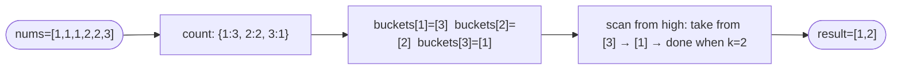

# Top K Frequent Elements

**Difficulty:** Medium
**Source:** [NeetCode](https://neetcode.io/problems/top-k-elements-in-list)

## Problem

> Given an integer array `nums` and an integer `k`, return the `k` most frequent elements. You may return the answer in **any order**.
>
> **Example 1:**
> Input: `nums = [1, 1, 1, 2, 2, 3]`, `k = 2`
> Output: `[1, 2]`
>
> **Example 2:**
> Input: `nums = [1]`, `k = 1`
> Output: `[1]`
>
> **Constraints:**
> - `1 <= nums.length <= 10^5`
> - `-10^4 <= nums[i] <= 10^4`
> - `k` is in the range `[1, the number of unique elements in nums]`
> - The answer is **unique** (no ties for the k-th position).

## Prerequisites

Before attempting this problem, you should be comfortable with:

- **Hash Maps** — counting element frequencies
- **Sorting** — ordering by a custom key
- **Bucket Sort** — mapping values to indices representing frequency

---

## 1. Hash Map + Sort

### Intuition

Count the frequency of every element with a hash map, then sort the unique elements by their frequency in descending order and return the first `k`. Straightforward and easy to implement — the bottleneck is the sort.

### Algorithm

1. Build a frequency map `count`.
2. Sort the unique keys by frequency descending.
3. Return the first `k` keys.

### Solution

```python,editable
def topKFrequent(nums, k):
    count = {}
    for num in nums:
        count[num] = count.get(num, 0) + 1
    # Sort by frequency descending
    sorted_keys = sorted(count.keys(), key=lambda x: count[x], reverse=True)
    return sorted_keys[:k]


print(topKFrequent([1, 1, 1, 2, 2, 3], 2))   # [1, 2]
print(topKFrequent([1], 1))                   # [1]
print(topKFrequent([4, 1, -1, 2, -1, 2, 3], 2))  # [-1, 2]
```

### Complexity

- Time: `O(n log n)` — dominated by the sort of up to `n` unique elements
- Space: `O(n)` — the frequency map

---

## 2. Bucket Sort

### Intuition

Here is the key observation: the maximum possible frequency of any element is `n` (if all elements are the same). So we can create a list of `n + 1` buckets where `bucket[f]` holds all elements that appear exactly `f` times.

After filling the buckets, scan from the highest frequency down to `1`, collecting elements until we have `k`. This avoids sorting entirely — the "sort" is implicit in the bucket indices.

### Algorithm

1. Build frequency map `count`.
2. Create `buckets` of size `n + 1`, where `buckets[f]` is a list.
3. For each `(num, freq)` in `count`, append `num` to `buckets[freq]`.
4. Scan `buckets` from index `n` down to `1`, collecting elements into the result until we have `k`.



### Solution

```python,editable
def topKFrequent(nums, k):
    count = {}
    for num in nums:
        count[num] = count.get(num, 0) + 1

    # buckets[i] holds all numbers with frequency i
    buckets = [[] for _ in range(len(nums) + 1)]
    for num, freq in count.items():
        buckets[freq].append(num)

    result = []
    for freq in range(len(buckets) - 1, 0, -1):
        for num in buckets[freq]:
            result.append(num)
            if len(result) == k:
                return result
    return result


print(topKFrequent([1, 1, 1, 2, 2, 3], 2))      # [1, 2]
print(topKFrequent([1], 1))                      # [1]
print(topKFrequent([4, 1, -1, 2, -1, 2, 3], 2)) # [-1, 2]
```

### Complexity

- Time: `O(n)` — building the count map is O(n), filling the buckets is O(n), scanning the buckets is O(n)
- Space: `O(n)` — the count map and bucket list each hold at most `n` entries

---

## Common Pitfalls

**Confusing frequency with value.** The bucket index represents frequency, not the element value. `buckets[3]` holds elements that appear 3 times, not the number `3`.

**Allocating `n + 1` buckets.** The maximum possible frequency is `n` (all elements identical), so you need indices `0` through `n`. Allocate `n + 1` slots. Index `0` is never used but that is fine.

**Returning early.** Once you have collected `k` elements, you can return immediately. There is no need to scan the remaining buckets.
