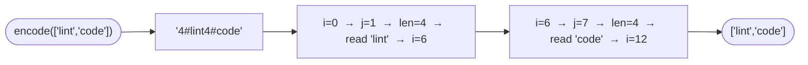

# Encode and Decode Strings

**Difficulty:** Medium
**Source:** [NeetCode](https://neetcode.io/problems/string-encode-and-decode)

## Problem

> Design an algorithm to encode a list of strings to a single string. The encoded string is then sent over the network and is decoded back to the original list of strings.
>
> Implement the `encode` and `decode` functions:
> - `encode(strs)` — encodes a list of strings into a single string.
> - `decode(s)` — decodes the encoded string back into the original list of strings.
>
> The encoded string should be decodable even if the individual strings contain any possible character, including the delimiter character itself.
>
> **Example 1:**
> Input: `["lint", "code", "love", "you"]`
> Output: `["lint", "code", "love", "you"]` (after encode then decode)
>
> **Example 2:**
> Input: `["we", "say", ":", "yes"]`
> Output: `["we", "say", ":", "yes"]`
>
> **Constraints:**
> - `0 <= strs.length <= 200`
> - `0 <= strs[i].length <= 200`
> - `strs[i]` contains any possible characters out of 256 valid ASCII characters.

## Prerequisites

Before attempting this problem, you should be comfortable with:

- **Strings** — slicing, concatenation, and `find`/`index` operations
- **Framing / length-prefix encoding** — a technique from network protocols for delimiting variable-length messages

---

## 1. Naive Delimiter (Broken Approach)

### Intuition

A first instinct is to join strings with a special delimiter like `#` or `|` and split on it during decoding. This fails when strings themselves contain the delimiter — there is no way to distinguish a delimiter from a literal character in the string.

This approach is shown here only to illustrate **why** it breaks, not as a solution.

```python,editable
# BROKEN — fails if any string contains the delimiter
def encode_broken(strs):
    return "#".join(strs)

def decode_broken(s):
    return s.split("#")

# Works fine here...
print(decode_broken(encode_broken(["lint", "code"])))   # ['lint', 'code']

# But breaks when a string contains '#'
print(decode_broken(encode_broken(["a#b", "c"])))   # ['a', 'b', 'c']  ← WRONG
```

---

## 2. Length-Prefix Encoding

### Intuition

The trick is to encode the **length** of each string along with the string itself, separated by a special character. This way, during decoding, you always know exactly how many characters to read — you do not need to search for a delimiter at all.

The format is: `"<length>#<string>"` repeated for each string. For example:
- `["lint", "code", "love", "you"]` → `"4#lint4#code4#love3#you"`
- `["we", "say", ":", "yes"]` → `"2#we3#say1#:3#yes"`

The `#` here is just used to separate the length digits from the string content. Even if the string itself contains `#`, we are safe because we read exactly `length` characters after the `#`, never searching for another `#`.

### Algorithm

**Encode:**
1. For each string `s`, append `f"{len(s)}#{s}"` to the result.
2. Return the concatenated result.

**Decode:**
1. Start with pointer `i = 0`.
2. While `i < len(s)`:
   - Find the next `#` starting from `i`. Its index is `j`.
   - Read the length: `length = int(s[i:j])`.
   - Read the string: `s[j+1 : j+1+length]`.
   - Advance `i` to `j + 1 + length`.
3. Return collected strings.



### Solution

```python,editable
def encode(strs):
    result = ""
    for s in strs:
        result += f"{len(s)}#{s}"
    return result


def decode(s):
    result = []
    i = 0
    while i < len(s):
        j = s.index('#', i)            # find the next '#' from position i
        length = int(s[i:j])           # parse the length
        result.append(s[j + 1: j + 1 + length])  # read exactly 'length' chars
        i = j + 1 + length             # advance past the string
    return result


# Test 1: basic
strs = ["lint", "code", "love", "you"]
print(decode(encode(strs)))            # ['lint', 'code', 'love', 'you']

# Test 2: strings containing '#'
strs = ["we", "say", ":", "yes"]
print(decode(encode(strs)))            # ['we', 'say', ':', 'yes']

# Test 3: empty string in the list
strs = ["", "hello", ""]
print(decode(encode(strs)))            # ['', 'hello', '']
```

### Complexity

- Time: `O(n)` for both encode and decode, where `n` is the total number of characters across all strings
- Space: `O(n)` — the encoded string and the output list

---

## Common Pitfalls

**Searching for `#` naively.** During decoding, do not scan for the `#` from position `0` on every iteration — start from the current pointer `i`. Also, `s.index('#', i)` is safe because the `#` is always at position `i + (number of digits)`, which is known to be present.

**Forgetting multi-digit lengths.** If a string has length `200`, the prefix is `"200#"` — three digits, not one. The `s.index('#', i)` approach handles this correctly regardless of how many digits the length has.

**Empty list edge case.** If `strs = []`, `encode([])` returns `""`. `decode("")` starts with `i = 0` and the `while i < len(s)` condition is immediately false, returning `[]`. This is correct behaviour.
