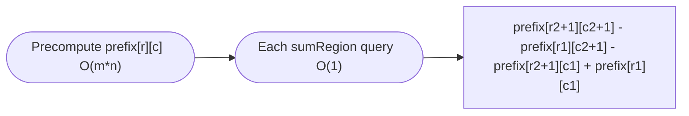

# Range Sum Query 2D - Immutable

**Difficulty:** Medium
**Source:** [NeetCode](https://neetcode.io/problems/range-sum-query-2d-immutable)

## Problem

> Given a 2D matrix `matrix`, handle multiple queries of the following type:
>
> - `sumRegion(row1, col1, row2, col2)` — Calculate the sum of the elements of `matrix` inside the rectangle defined by its **upper left corner** `(row1, col1)` and **lower right corner** `(row2, col2)`.
>
> Implement the `NumMatrix` class with an efficient `sumRegion` method.
>
> **Example 1:**
> Input: `matrix = [[3,0,1,4,2],[5,6,3,2,1],[1,2,0,1,5],[4,1,0,1,7],[1,0,3,0,5]]`
> `sumRegion(2,1,4,3)` → `8`
> `sumRegion(1,1,2,2)` → `11`
> `sumRegion(1,2,2,4)` → `12`
>
> **Constraints:**
> - `m == matrix.length`, `n == matrix[i].length`
> - `1 <= m, n <= 200`
> - `-10^4 <= matrix[i][j] <= 10^4`
> - `0 <= row1 <= row2 < m`
> - `0 <= col1 <= col2 < n`
> - At most `10^4` calls to `sumRegion`.

## Prerequisites

Before attempting this problem, you should be comfortable with:

- **Prefix sums (1D)** — computing cumulative sums for range queries
- **2D arrays** — indexing and iteration over rows and columns

---

## 1. Brute Force (Iterate Rectangle)

### Intuition

For each query, loop over every cell in the specified rectangle and add up the values. Simple and correct, but redoes work for every query — with `10^4` queries over a `200 × 200` matrix, this performs up to `4 × 10^8` operations.

### Algorithm

- **`__init__`:** Store the matrix.
- **`sumRegion`:** Iterate `row` from `row1` to `row2`, `col` from `col1` to `col2`, summing `matrix[row][col]`.

### Solution

```python,editable
class NumMatrix:
    def __init__(self, matrix):
        self.matrix = matrix

    def sumRegion(self, row1, col1, row2, col2):
        total = 0
        for r in range(row1, row2 + 1):
            for c in range(col1, col2 + 1):
                total += self.matrix[r][c]
        return total


matrix = [
    [3, 0, 1, 4, 2],
    [5, 6, 3, 2, 1],
    [1, 2, 0, 1, 5],
    [4, 1, 0, 1, 7],
    [1, 0, 3, 0, 5],
]
nm = NumMatrix(matrix)
print(nm.sumRegion(2, 1, 4, 3))   # 8
print(nm.sumRegion(1, 1, 2, 2))   # 11
print(nm.sumRegion(1, 2, 2, 4))   # 12
```

### Complexity

- Time: `O(m * n)` per query
- Space: `O(1)` extra

---

## 2. 2D Prefix Sum

### Intuition

Precompute a 2D prefix sum table `prefix` where `prefix[r][c]` = sum of all elements in the rectangle from `(0, 0)` to `(r-1, c-1)` (using 1-indexed prefix to simplify boundary handling).

Then any rectangle sum can be computed with four lookups using the inclusion-exclusion principle:

```
sumRegion(r1, c1, r2, c2)
  = prefix[r2+1][c2+1]
  - prefix[r1][c2+1]
  - prefix[r2+1][c1]
  + prefix[r1][c1]
```

Think of it like adding and subtracting overlapping areas:

```
+------------------+
|   A   |    B    |
|-------+---------|
|   C   |  query  |
+------------------+

sum(query) = total - A - C + corner(A∩C was subtracted twice)
```

### Algorithm

**`__init__`:**
1. Create `prefix` of size `(m+1) × (n+1)` filled with zeros.
2. For each `r` from `1` to `m`, for each `c` from `1` to `n`:
   - `prefix[r][c] = matrix[r-1][c-1] + prefix[r-1][c] + prefix[r][c-1] - prefix[r-1][c-1]`

**`sumRegion(r1, c1, r2, c2)`:**
1. Return `prefix[r2+1][c2+1] - prefix[r1][c2+1] - prefix[r2+1][c1] + prefix[r1][c1]`



### Solution

```python,editable
class NumMatrix:
    def __init__(self, matrix):
        m, n = len(matrix), len(matrix[0])
        # prefix[r][c] = sum of matrix[0..r-1][0..c-1]
        self.prefix = [[0] * (n + 1) for _ in range(m + 1)]
        for r in range(1, m + 1):
            for c in range(1, n + 1):
                self.prefix[r][c] = (
                    matrix[r - 1][c - 1]
                    + self.prefix[r - 1][c]
                    + self.prefix[r][c - 1]
                    - self.prefix[r - 1][c - 1]
                )

    def sumRegion(self, row1, col1, row2, col2):
        p = self.prefix
        return (
            p[row2 + 1][col2 + 1]
            - p[row1][col2 + 1]
            - p[row2 + 1][col1]
            + p[row1][col1]
        )


matrix = [
    [3, 0, 1, 4, 2],
    [5, 6, 3, 2, 1],
    [1, 2, 0, 1, 5],
    [4, 1, 0, 1, 7],
    [1, 0, 3, 0, 5],
]
nm = NumMatrix(matrix)
print(nm.sumRegion(2, 1, 4, 3))   # 8
print(nm.sumRegion(1, 1, 2, 2))   # 11
print(nm.sumRegion(1, 2, 2, 4))   # 12
```

### Complexity

- Time: `O(m * n)` for preprocessing; `O(1)` per `sumRegion` query
- Space: `O(m * n)` — the prefix table

---

## Common Pitfalls

**Off-by-one indexing.** Using a `(m+1) × (n+1)` prefix table with 1-based indexing means `prefix[0][...]` and `prefix[...][0]` are always `0` — which acts as a safe boundary, eliminating the need for explicit bounds checks.

**Getting the inclusion-exclusion formula backwards.** Draw it out: to get the sum of a rectangle, start with the large prefix sum at the bottom-right, subtract the strips above and to the left, then add back the corner that was subtracted twice.

**Negative values.** The matrix allows negative values — but the prefix sum approach handles this correctly with no modifications. Do not short-circuit on negative values.
