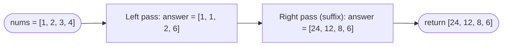

# Product of Array Except Self

**Difficulty:** Medium
**Source:** [NeetCode](https://neetcode.io/problems/products-of-array-discluding-self)

## Problem

> Given an integer array `nums`, return an array `answer` such that `answer[i]` is equal to the product of all the elements of `nums` **except** `nums[i]`.
>
> The product of any prefix or suffix of `nums` is **guaranteed** to fit in a 32-bit integer.
>
> You must write an algorithm that runs in `O(n)` time and **without using the division operation**.
>
> **Example 1:**
> Input: `nums = [1, 2, 3, 4]`
> Output: `[24, 12, 8, 6]`
>
> **Example 2:**
> Input: `nums = [-1, 1, 0, -3, 3]`
> Output: `[0, 0, 9, 0, 0]`
>
> **Constraints:**
> - `2 <= nums.length <= 10^5`
> - `-30 <= nums[i] <= 30`
> - The product of any prefix or suffix fits in a 32-bit integer.

## Prerequisites

Before attempting this problem, you should be comfortable with:

- **Prefix products** — cumulative products from the left
- **Suffix products** — cumulative products from the right
- **Two-pass array traversal** — scanning left-to-right then right-to-left

---

## 1. Brute Force

### Intuition

For each position `i`, multiply together all elements except `nums[i]`. Two nested loops: the outer loop picks the position to exclude, the inner loop multiplies everything else.

### Algorithm

1. For each index `i`:
   - Set `product = 1`.
   - For each index `j`, if `j != i`, multiply `product *= nums[j]`.
   - Set `answer[i] = product`.
2. Return `answer`.

### Solution

```python,editable
def productExceptSelf(nums):
    n = len(nums)
    answer = [1] * n
    for i in range(n):
        for j in range(n):
            if j != i:
                answer[i] *= nums[j]
    return answer


print(productExceptSelf([1, 2, 3, 4]))         # [24, 12, 8, 6]
print(productExceptSelf([-1, 1, 0, -3, 3]))    # [0, 0, 9, 0, 0]
```

### Complexity

- Time: `O(n²)`
- Space: `O(1)` extra (not counting the output array)

---

## 2. Prefix and Suffix Products

### Intuition

For any index `i`, the product of all elements except `nums[i]` equals:
- (product of all elements to the **left** of `i`) × (product of all elements to the **right** of `i`)

We can compute these two separately:
- **Left pass:** Build a `prefix` array where `prefix[i]` = product of `nums[0..i-1]`.
- **Right pass:** Build a `suffix` array where `suffix[i]` = product of `nums[i+1..n-1]`.
- `answer[i] = prefix[i] * suffix[i]`.

We can do this in O(1) extra space (beyond the output array) by computing prefix on the first pass, then multiplying in suffix on the second pass directly into the answer array.

### Algorithm

1. Initialise `answer = [1] * n`.
2. **Left pass:** Maintain a running `prefix = 1`. For each `i`, set `answer[i] = prefix`, then update `prefix *= nums[i]`.
3. **Right pass:** Maintain a running `suffix = 1`. For each `i` from right to left, multiply `answer[i] *= suffix`, then update `suffix *= nums[i]`.
4. Return `answer`.



### Solution

```python,editable
def productExceptSelf(nums):
    n = len(nums)
    answer = [1] * n

    # Left pass: answer[i] = product of nums[0..i-1]
    prefix = 1
    for i in range(n):
        answer[i] = prefix
        prefix *= nums[i]

    # Right pass: multiply in product of nums[i+1..n-1]
    suffix = 1
    for i in range(n - 1, -1, -1):
        answer[i] *= suffix
        suffix *= nums[i]

    return answer


print(productExceptSelf([1, 2, 3, 4]))          # [24, 12, 8, 6]
print(productExceptSelf([-1, 1, 0, -3, 3]))     # [0, 0, 9, 0, 0]
print(productExceptSelf([2, 3]))                 # [3, 2]
```

### Complexity

- Time: `O(n)` — two passes
- Space: `O(1)` extra (the output array does not count toward space complexity per the problem statement)

---

## Common Pitfalls

**Using division.** The naive O(n) approach — compute total product, divide by `nums[i]` — is explicitly prohibited and also breaks when `nums[i] == 0`.

**The zero case.** The prefix/suffix approach handles zeros automatically. If `nums[i] == 0`, both its left prefix and right suffix are unaffected. The zero propagates through multiplication correctly — no special casing needed.

**Order of operations in the right pass.** In the right pass, multiply the current `answer[i]` by `suffix` BEFORE updating `suffix`. If you update `suffix *= nums[i]` first, you include `nums[i]` in the suffix for position `i`, which is wrong — we want the product of elements strictly to the right.
