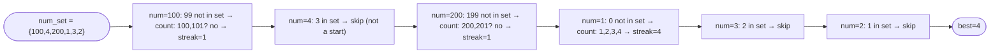

# Longest Consecutive Sequence

**Difficulty:** Medium
**Source:** [NeetCode](https://neetcode.io/problems/longest-consecutive-sequence)

## Problem

> Given an unsorted array of integers `nums`, return the length of the **longest consecutive elements sequence**.
>
> You must write an algorithm that runs in `O(n)` time.
>
> **Example 1:**
> Input: `nums = [100, 4, 200, 1, 3, 2]`
> Output: `4` (The longest consecutive sequence is `[1, 2, 3, 4]`)
>
> **Example 2:**
> Input: `nums = [0, 3, 7, 2, 5, 8, 4, 6, 0, 1]`
> Output: `9`
>
> **Constraints:**
> - `0 <= nums.length <= 10^5`
> - `-10^9 <= nums[i] <= 10^9`

## Prerequisites

Before attempting this problem, you should be comfortable with:

- **Hash Sets** — O(1) average-case lookup
- **Sequence start detection** — identifying where a consecutive run begins

---

## 1. Brute Force (Sort and Scan)

### Intuition

Sort the array first. Then scan through it: if the current number is exactly 1 more than the previous, extend the current streak; if it is the same as the previous (duplicate), skip it; otherwise, start a new streak. Track the maximum streak seen.

### Algorithm

1. Handle edge case: if `nums` is empty, return `0`.
2. Sort `nums`.
3. Track `current_streak = 1` and `best = 1`.
4. For each index `i` from `1` to `n - 1`:
   - If `nums[i] == nums[i - 1]`: skip (duplicate).
   - If `nums[i] == nums[i - 1] + 1`: increment `current_streak`, update `best`.
   - Else: reset `current_streak = 1`.
5. Return `best`.

### Solution

```python,editable
def longestConsecutive(nums):
    if not nums:
        return 0
    nums.sort()
    best = 1
    current = 1
    for i in range(1, len(nums)):
        if nums[i] == nums[i - 1]:
            continue           # skip duplicates
        elif nums[i] == nums[i - 1] + 1:
            current += 1
            best = max(best, current)
        else:
            current = 1
    return best


print(longestConsecutive([100, 4, 200, 1, 3, 2]))           # 4
print(longestConsecutive([0, 3, 7, 2, 5, 8, 4, 6, 0, 1]))  # 9
print(longestConsecutive([]))                                # 0
```

### Complexity

- Time: `O(n log n)` — dominated by the sort
- Space: `O(1)` extra

---

## 2. Hash Set (O(n))

### Intuition

The key insight: a consecutive sequence `[a, a+1, a+2, ..., a+k]` has exactly one starting point — the number `a` where `a - 1` is NOT in the array. If we only start counting from sequence beginnings, each number is counted at most once across all sequences.

Build a hash set of all numbers for O(1) lookup. For each number `n`, check if `n - 1` is in the set. If not, `n` is the start of a sequence — count upwards from there. Skip numbers where `n - 1` exists because they belong to a sequence already counted.

### Algorithm

1. Build `num_set = set(nums)`.
2. Initialize `best = 0`.
3. For each `num` in `num_set`:
   - If `num - 1` is NOT in `num_set` (i.e., `num` is a sequence start):
     - Count streak: while `num + streak` is in `num_set`, increment `streak`.
     - Update `best = max(best, streak)`.
4. Return `best`.



### Solution

```python,editable
def longestConsecutive(nums):
    num_set = set(nums)
    best = 0

    for num in num_set:
        # Only start counting from the beginning of a sequence
        if num - 1 not in num_set:
            streak = 1
            while num + streak in num_set:
                streak += 1
            best = max(best, streak)

    return best


print(longestConsecutive([100, 4, 200, 1, 3, 2]))           # 4
print(longestConsecutive([0, 3, 7, 2, 5, 8, 4, 6, 0, 1]))  # 9
print(longestConsecutive([]))                                # 0
```

### Complexity

- Time: `O(n)` — building the set is O(n). Each number is visited at most twice: once in the outer loop (to check if it is a start), and at most once in the inner `while` loop (only when it is part of a sequence being counted). Total inner loop iterations across all starting points is bounded by `n`.
- Space: `O(n)` — the hash set

---

## Common Pitfalls

**Iterating over the original list vs. the set.** Iterating over `nums` (with duplicates) instead of `num_set` is safe but wastes time on duplicates. Iterating over `num_set` ensures we consider each unique value once.

**Restarting counts for non-starts.** Without the `if num - 1 not in num_set` guard, you would count sequences starting at every element — including elements in the middle of a sequence. This makes the inner while loop run redundantly and inflates runtime to O(n²) in the worst case.

**Empty input.** If `nums` is empty, the for loop does not execute and `best` stays at `0` — correct, no special case needed.
