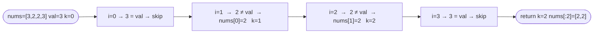
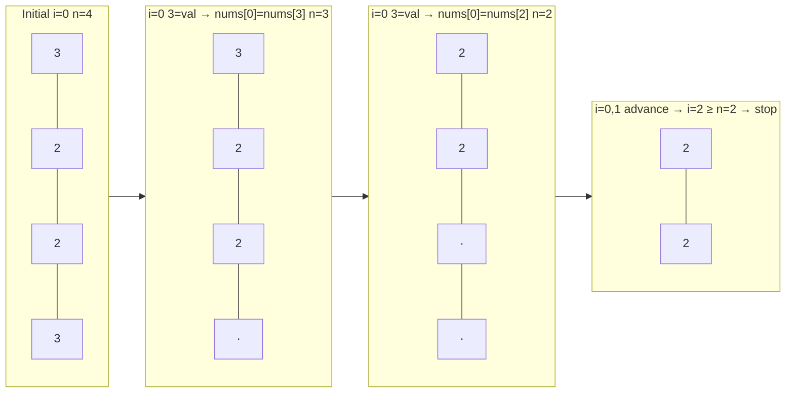

# Remove Element

**Difficulty:** Easy
**Source:** [NeetCode](https://neetcode.io/problems/remove-element/question)

## Problem

> Given an integer array `nums` and an integer `val`, remove all occurrences of `val` in `nums` **in-place**. The order of the elements may be changed. Return `k` — the number of elements in `nums` that are not equal to `val`.
>
> The first `k` elements of `nums` must contain the elements which are not equal to `val`. The remaining elements and the size of the array do not matter.
>
> **Example 1:**
> Input: `nums = [3, 2, 2, 3]`, `val = 3`
> Output: `2`, `nums = [2, 2, _, _]`
>
> **Example 2:**
> Input: `nums = [0, 1, 2, 2, 3, 0, 4, 2]`, `val = 2`
> Output: `5`, `nums = [0, 1, 3, 0, 4, _, _, _]`
>
> **Constraints:**
> - `0 <= nums.length <= 100`
> - `0 <= nums[i] <= 50`
> - `0 <= val <= 100`

## Prerequisites

Before attempting this problem, you should be comfortable with:

- **Arrays** — understanding in-place modification and index-based access
- **Two Pointers** — using separate read and write indices to process an array in a single pass

---

## 1. Brute Force

### Intuition

When an element equal to `val` is found, shift every element after it one position to the left to fill the gap, then shrink the logical length by one. Repeat until the full array has been scanned. This mimics how a naive deletion from a static array works.

### Algorithm

1. Set `k = len(nums)` as the logical length.
2. Set `i = 0`. While `i < k`:
   - If `nums[i] == val`, shift all elements from `i+1` to `k-1` one position left, then decrement `k`.
   - Otherwise, increment `i`.
3. Return `k`.

### Solution

```python,editable
def removeElement(nums, val):
    k = len(nums)
    i = 0
    while i < k:
        if nums[i] == val:
            for j in range(i + 1, k):
                nums[j - 1] = nums[j]
            k -= 1
        else:
            i += 1
    return k


nums = [3, 2, 2, 3]
k = removeElement(nums, 3)
print(k, nums[:k])  # 2 [2, 2]

nums = [0, 1, 2, 2, 3, 0, 4, 2]
k = removeElement(nums, 2)
print(k, nums[:k])  # 5 [0, 1, 3, 0, 4]
```

### Complexity

- Time: `O(n²)`
- Space: `O(1)`

---

## 2. Two Pointers

### Intuition

Use two pointers: a write pointer `k` that tracks where the next kept element should go, and a read pointer that iterates through every element. Whenever the current element is not `val`, copy it to position `k` and advance `k`. Elements equal to `val` are simply skipped. One pass through the array is enough.

### Algorithm

1. Initialize `k = 0` as the write pointer.
2. For each element `num` in `nums`:
   - If `num != val`: write `num` to `nums[k]`, then increment `k`.
3. Return `k`.



### Solution

```python,editable
def removeElement(nums, val):
    k = 0
    for num in nums:
        if num != val:
            nums[k] = num
            k += 1
    return k


nums = [3, 2, 2, 3]
k = removeElement(nums, 3)
print(k, nums[:k])  # 2 [2, 2]

nums = [0, 1, 2, 2, 3, 0, 4, 2]
k = removeElement(nums, 2)
print(k, nums[:k])  # 5 [0, 1, 3, 0, 4]
```

### Complexity

- Time: `O(n)`
- Space: `O(1)`

---

## 3. Two Pointers — II

### Intuition

When there are few elements to remove, the previous approach does unnecessary copying — it rewrites every non-`val` element even if it is already in the right place. Instead, swap unwanted elements with the element at the end of the valid range and shrink that range by one. This minimises write operations when removals are rare.

### Algorithm

1. Initialize `i = 0` as the current position and `n = len(nums)` as the effective length.
2. While `i < n`:
   - If `nums[i] == val`: overwrite it with `nums[n - 1]` and decrement `n`. Do **not** increment `i` — the swapped-in element still needs to be checked.
   - Otherwise: increment `i`.
3. Return `n`.



### Solution

```python,editable
def removeElement(nums, val):
    i = 0
    n = len(nums)
    while i < n:
        if nums[i] == val:
            n -= 1
            nums[i] = nums[n]
        else:
            i += 1
    return n


nums = [3, 2, 2, 3]
k = removeElement(nums, 3)
print(k, nums[:k])  # 2 [2, 2]

nums = [0, 1, 2, 2, 3, 0, 4, 2]
k = removeElement(nums, 2)
print(k, nums[:k])  # 5 [0, 1, 3, 0, 4]
```

### Complexity

- Time: `O(n)`
- Space: `O(1)`

> **When to prefer this over Two Pointers — I?**
> When `val` is rare, this approach writes far fewer elements. If the array has 10 000 elements and only 2 match `val`, Two Pointers — I still copies 9 998 elements; this approach writes only 2.

---

## Common Pitfalls

**Indexing into `nums` after returning `k`.**
The problem only guarantees that the first `k` elements are correct. Elements at index `k` and beyond are considered garbage — do not read or compare them.

**Modifying `nums` length directly.**
Python lists support `del` and `remove()`, but the problem requires in-place modification that works within the array's original memory. Avoid creating a new list; overwrite in place and track `k` yourself.

**Off-by-one when using `k` as a slice bound.**
`nums[:k]` is correct because `k` is the count of valid elements, which equals the exclusive upper bound of the slice.
