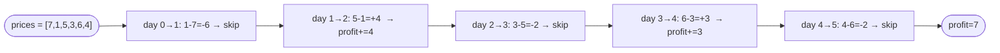

# Best Time to Buy and Sell Stock II

**Difficulty:** Medium
**Source:** [NeetCode](https://neetcode.io/problems/best-time-to-buy-and-sell-stock-ii)

## Problem

> You are given an integer array `prices` where `prices[i]` is the price of a given stock on the `i`-th day.
>
> On each day, you may decide to buy and/or sell the stock. You can only hold **at most one share** of the stock at any time. However, you can buy it then immediately sell it on the same day.
>
> Return the **maximum profit** you can achieve.
>
> **Example 1:**
> Input: `prices = [7, 1, 5, 3, 6, 4]`
> Output: `7`
> Explanation: Buy on day 2 (price=1), sell on day 3 (price=5), profit=4. Buy on day 4 (price=3), sell on day 5 (price=6), profit=3. Total=7.
>
> **Example 2:**
> Input: `prices = [1, 2, 3, 4, 5]`
> Output: `4`
> Explanation: Buy on day 1, sell on day 5. Profit=4.
>
> **Example 3:**
> Input: `prices = [7, 6, 4, 3, 1]`
> Output: `0`
> Explanation: No profitable transaction possible.
>
> **Constraints:**
> - `1 <= prices.length <= 3 * 10^4`
> - `0 <= prices[i] <= 10^4`

## Prerequisites

Before attempting this problem, you should be comfortable with:

- **Greedy algorithms** — making locally optimal choices that lead to a global optimum
- **Peaks and valleys** — identifying upward and downward trends in a sequence

---

## 1. Peaks and Valleys

### Intuition

To maximise profit, we want to buy at every valley (local minimum) and sell at every peak (local maximum). Between any valley and peak, we capture the full upward movement of the stock price.

Scan through the prices and whenever the current price is lower than the next price, buy (or keep holding). When the current price is higher than the next, sell. Accumulate all upward movements.

### Algorithm

1. Initialize `profit = 0`, `i = 0`.
2. While `i < n - 1`:
   - Find valley: while `prices[i] >= prices[i + 1]`, increment `i`.
   - Find peak: while `prices[i] <= prices[i + 1]`, increment `i`.
   - Add `prices[peak] - prices[valley]` to `profit`.
3. Return `profit`.

### Solution

```python,editable
def maxProfit(prices):
    profit = 0
    i = 0
    n = len(prices)
    while i < n - 1:
        # Find valley
        while i < n - 1 and prices[i] >= prices[i + 1]:
            i += 1
        valley = prices[i]
        # Find peak
        while i < n - 1 and prices[i] <= prices[i + 1]:
            i += 1
        peak = prices[i]
        profit += peak - valley
    return profit


print(maxProfit([7, 1, 5, 3, 6, 4]))   # 7
print(maxProfit([1, 2, 3, 4, 5]))       # 4
print(maxProfit([7, 6, 4, 3, 1]))       # 0
```

### Complexity

- Time: `O(n)`
- Space: `O(1)`

---

## 2. Greedy (Sum Positive Differences)

### Intuition

Here is the key insight that simplifies everything: since we can buy and sell on consecutive days, we can decompose any profit into the sum of single-day gains.

For example, buying at price `1` on day 1 and selling at price `5` on day 4 gives profit 4. But this is the same as buying and selling each day: `(2-1) + (3-2) + (4-3) + (5-4) = 1 + 1 + 1 + 1 = 4`. The intermediate buy-sell steps cancel out.

So: just sum up all positive consecutive differences. If `prices[i+1] > prices[i]`, add the difference to profit. Ignore negative differences (do not trade on down days).

### Algorithm

1. Initialize `profit = 0`.
2. For each index `i` from `0` to `n - 2`:
   - If `prices[i + 1] > prices[i]`: add `prices[i + 1] - prices[i]` to `profit`.
3. Return `profit`.



### Solution

```python,editable
def maxProfit(prices):
    profit = 0
    for i in range(len(prices) - 1):
        if prices[i + 1] > prices[i]:
            profit += prices[i + 1] - prices[i]
    return profit


print(maxProfit([7, 1, 5, 3, 6, 4]))   # 7
print(maxProfit([1, 2, 3, 4, 5]))       # 4
print(maxProfit([7, 6, 4, 3, 1]))       # 0
```

### Complexity

- Time: `O(n)` — one pass
- Space: `O(1)`

---

## Common Pitfalls

**Confusing this with Best Time to Buy and Sell Stock I.** In problem I, you can only make one transaction. Here, unlimited transactions are allowed. The greedy approach only works because you can trade as many times as you want.

**Trying to track buy/sell days.** You do not need to know exactly which days to buy and sell to compute the maximum profit. The sum-of-positive-differences trick gives the correct answer without tracking individual transactions.

**Selling before buying.** You must buy before you can sell. The consecutive-day trick handles this automatically — we only add gains from one day to the next, never going backwards in time.
