# Majority Element II

**Difficulty:** Medium
**Source:** [NeetCode](https://neetcode.io/problems/majority-element-ii)

## Problem

> Given an integer array of size `n`, find all elements that appear **more than** `⌊n / 3⌋` times.
>
> **Example 1:**
> Input: `nums = [3, 2, 3]`
> Output: `[3]`
>
> **Example 2:**
> Input: `nums = [1, 2]`
> Output: `[1, 2]`
>
> **Example 3:**
> Input: `nums = [3, 2, 3, 2, 1, 2]`
> Output: `[3, 2]`
>
> **Constraints:**
> - `1 <= nums.length <= 5 * 10^4`
> - `-10^9 <= nums[i] <= 10^9`

## Prerequisites

Before attempting this problem, you should be comfortable with:

- **Hash Maps** — frequency counting
- **Boyer-Moore Voting Algorithm** — from Majority Element I
- **Mathematical observation** — at most 2 elements can appear more than n/3 times

---

## 1. Hash Map Count

### Intuition

Count every element's frequency with a hash map, then collect all elements whose count exceeds `n // 3`. This is direct and easy to verify.

### Algorithm

1. Build a frequency map `count`.
2. Threshold = `n // 3`.
3. Return all elements with `count[num] > threshold`.

### Solution

```python,editable
def majorityElement(nums):
    n = len(nums)
    count = {}
    for num in nums:
        count[num] = count.get(num, 0) + 1
    threshold = n // 3
    return [num for num, freq in count.items() if freq > threshold]


print(majorityElement([3, 2, 3]))           # [3]
print(majorityElement([1, 2]))              # [1, 2]
print(majorityElement([3, 2, 3, 2, 1, 2])) # [3, 2]
```

### Complexity

- Time: `O(n)`
- Space: `O(n)` — the hash map

---

## 2. Boyer-Moore Voting with Two Candidates

### Intuition

**Key observation:** At most **2** elements can appear more than `n/3` times. Why? If three elements each appeared more than `n/3` times, they would collectively account for more than `n` elements — impossible.

Extending Boyer-Moore to find at most 2 candidates:

Maintain two candidates (`c1`, `c2`) and their respective counts (`cnt1`, `cnt2`). For each number:
- If it matches `c1`, increment `cnt1`.
- Else if it matches `c2`, increment `cnt2`.
- Else if `cnt1 == 0`, replace `c1` with the current number.
- Else if `cnt2 == 0`, replace `c2` with the current number.
- Else both candidates differ — decrement both counts (cancel one of each).

After the first pass, `c1` and `c2` are candidates. Do a **second pass** to verify both actually exceed `n // 3` (since the voting pass finds candidates, not guaranteed winners).

### Algorithm

1. **Phase 1:** Find two candidates using the extended voting algorithm.
2. **Phase 2:** Count actual occurrences of `c1` and `c2`; include those exceeding `n // 3`.

```mermaid
flowchart LR
    S(["nums=[3,2,3,2,1,2]  c1=None cnt1=0  c2=None cnt2=0"])
    S --> a["3: cnt1=0 → c1=3 cnt1=1"]
    a --> b["2: cnt2=0 → c2=2 cnt2=1"]
    b --> c["3: matches c1 → cnt1=2"]
    c --> d["2: matches c2 → cnt2=2"]
    d --> e["1: neither, cnt1>0 cnt2>0 → cnt1=1 cnt2=1"]
    e --> f["2: matches c2 → cnt2=2"]
    f --> G["Phase 2: count(3)=2 > 6//3=2? No! count(2)=3>2? Yes"]
    G --> R(["result=[2]  ... wait: count(3)=2 not > 2"])
```



> Note: `>` not `>=` — so for `[3,2,3,2,1,2]` (n=6), threshold is `2`, count(3)=2 is NOT `> 2`, count(2)=3 IS `> 2`. Let's verify: `[1,2]` (n=2), threshold=0, both count 1 which is `> 0`. Correct.

### Solution

```python,editable
def majorityElement(nums):
    # Phase 1: find candidates
    c1, c2 = None, None
    cnt1, cnt2 = 0, 0

    for num in nums:
        if num == c1:
            cnt1 += 1
        elif num == c2:
            cnt2 += 1
        elif cnt1 == 0:
            c1, cnt1 = num, 1
        elif cnt2 == 0:
            c2, cnt2 = num, 1
        else:
            cnt1 -= 1
            cnt2 -= 1

    # Phase 2: verify candidates
    n = len(nums)
    threshold = n // 3
    result = []
    for candidate in [c1, c2]:
        if candidate is not None and nums.count(candidate) > threshold:
            result.append(candidate)

    return result


print(majorityElement([3, 2, 3]))           # [3]
print(majorityElement([1, 2]))              # [1, 2]
print(majorityElement([3, 2, 3, 2, 1, 2])) # [2]
print(majorityElement([2, 2]))              # [2]
```

### Complexity

- Time: `O(n)` — two passes (the `nums.count()` calls are each O(n), but constants)
- Space: `O(1)` — four variables only

---

## Common Pitfalls

**Skipping the verification pass.** The voting algorithm finds candidates but does not guarantee they exceed the threshold. A second pass to verify their actual counts is mandatory. For example, in `[1, 2, 3]`, every element is a candidate but none appears more than once (threshold = `3 // 3 = 1`), so the answer is `[]`.

**Using `>=` instead of `>` for the threshold.** The problem asks for elements appearing **more than** `n/3` times, not **at least** `n/3` times.

**Not handling duplicate candidates.** If the same value becomes both `c1` and `c2` due to implementation bugs, the verification phase handles it — each candidate is checked independently.
