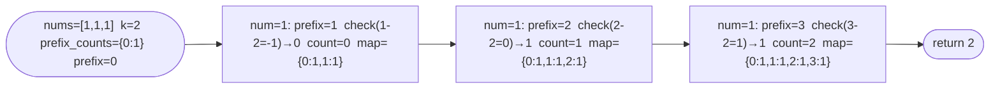

# Subarray Sum Equals K

**Difficulty:** Medium
**Source:** [NeetCode](https://neetcode.io/problems/subarray-sum-equals-k)

## Problem

> Given an array of integers `nums` and an integer `k`, return the **total number of subarrays** whose sum equals `k`.
>
> A subarray is a **contiguous** non-empty sequence of elements within an array.
>
> **Example 1:**
> Input: `nums = [1, 1, 1]`, `k = 2`
> Output: `2`
>
> **Example 2:**
> Input: `nums = [1, 2, 3]`, `k = 3`
> Output: `2`
>
> **Constraints:**
> - `1 <= nums.length <= 2 * 10^4`
> - `-1000 <= nums[i] <= 1000`
> - `-10^7 <= k <= 10^7`

## Prerequisites

Before attempting this problem, you should be comfortable with:

- **Prefix sums** — cumulative sums from the start of the array
- **Hash Maps** — counting how many times a value has been seen
- **Complement trick** — if `prefix[j] - prefix[i] == k`, then subarray `i+1..j` sums to `k`

---

## 1. Brute Force (All Subarrays)

### Intuition

Try every possible subarray. For each starting index `i`, extend the subarray rightward and keep a running sum. When the running sum equals `k`, increment the count.

### Algorithm

1. Initialize `count = 0`.
2. For each `i` from `0` to `n - 1`:
   - Set `total = 0`.
   - For each `j` from `i` to `n - 1`:
     - Add `nums[j]` to `total`.
     - If `total == k`, increment `count`.
3. Return `count`.

### Solution

```python,editable
def subarraySum(nums, k):
    count = 0
    n = len(nums)
    for i in range(n):
        total = 0
        for j in range(i, n):
            total += nums[j]
            if total == k:
                count += 1
    return count


print(subarraySum([1, 1, 1], 2))   # 2
print(subarraySum([1, 2, 3], 3))   # 2
print(subarraySum([1], 0))         # 0
```

### Complexity

- Time: `O(n²)`
- Space: `O(1)`

---

## 2. Prefix Sum with Hash Map

### Intuition

Let `prefix[i]` = sum of `nums[0..i]`. A subarray from index `i+1` to `j` sums to `k` when:

```
prefix[j] - prefix[i] == k
  →  prefix[i] == prefix[j] - k
```

So for each position `j`, the number of valid subarrays ending at `j` equals the number of times `prefix[j] - k` has appeared as a prefix sum before position `j`.

We track prefix sum occurrences in a hash map as we scan. The map starts with `{0: 1}` to handle the case where the prefix sum itself equals `k` (the entire prefix from index 0 to j is a valid subarray).

### Algorithm

1. Initialize `prefix_counts = {0: 1}`, `prefix = 0`, `count = 0`.
2. For each `num` in `nums`:
   - Update `prefix += num`.
   - Add `prefix_counts.get(prefix - k, 0)` to `count`.
   - Increment `prefix_counts[prefix]` by 1.
3. Return `count`.



### Solution

```python,editable
def subarraySum(nums, k):
    prefix_counts = {0: 1}  # prefix sum 0 has been seen once (before any element)
    prefix = 0
    count = 0

    for num in nums:
        prefix += num
        # How many earlier prefixes satisfy: prefix - earlier_prefix == k
        count += prefix_counts.get(prefix - k, 0)
        # Record this prefix sum
        prefix_counts[prefix] = prefix_counts.get(prefix, 0) + 1

    return count


print(subarraySum([1, 1, 1], 2))    # 2
print(subarraySum([1, 2, 3], 3))    # 2
print(subarraySum([1], 0))          # 0
```

### Complexity

- Time: `O(n)` — one pass with O(1) hash map operations
- Space: `O(n)` — hash map holds at most `n + 1` distinct prefix sums

---

## Common Pitfalls

**Not initialising `prefix_counts = {0: 1}`.** Without this, you miss subarrays that start from index 0 (i.e., where the prefix sum from the very beginning equals `k`). For example, `nums = [3]`, `k = 3` should return 1, but without the initial `{0: 1}` it returns 0.

**Checking before updating the map.** You must look up `prefix - k` in the map BEFORE adding the current `prefix` to the map. Adding first would allow a subarray to "match itself" — counting a zero-length subarray.

**Negative numbers and zeros.** Unlike the sliding window technique (which only works for positive numbers), prefix sum with a hash map handles negative numbers and zeros correctly. No special casing required.
