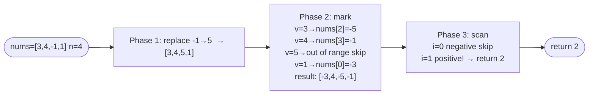

# First Missing Positive

**Difficulty:** Hard
**Source:** [NeetCode](https://neetcode.io/problems/first-missing-positive)

## Problem

> Given an unsorted integer array `nums`, return the **smallest missing positive integer**.
>
> You must implement an algorithm that runs in `O(n)` time and uses `O(1)` auxiliary space.
>
> **Example 1:**
> Input: `nums = [1, 2, 0]`
> Output: `3`
>
> **Example 2:**
> Input: `nums = [3, 4, -1, 1]`
> Output: `2`
>
> **Example 3:**
> Input: `nums = [7, 8, 9, 11, 12]`
> Output: `1`
>
> **Constraints:**
> - `1 <= nums.length <= 5 * 10^5`
> - `-2^31 <= nums[i] <= 2^31 - 1`

## Prerequisites

Before attempting this problem, you should be comfortable with:

- **Arrays as hash sets** — using indices to record the presence of values
- **Index marking** — using sign changes to encode boolean information within an array
- **Pigeonhole principle** — the answer must be in the range `[1, n+1]`

---

## 1. Hash Set

### Intuition

Put all elements into a hash set, then scan positive integers starting from 1 until you find one that is missing. This is O(n) time and O(n) space — clean and correct, but uses extra memory.

### Algorithm

1. Convert `nums` to a set `seen`.
2. For `i = 1, 2, 3, ...`:
   - If `i` is not in `seen`, return `i`.

### Solution

```python,editable
def firstMissingPositive(nums):
    seen = set(nums)
    i = 1
    while i in seen:
        i += 1
    return i


print(firstMissingPositive([1, 2, 0]))        # 3
print(firstMissingPositive([3, 4, -1, 1]))    # 2
print(firstMissingPositive([7, 8, 9, 11, 12]))  # 1
```

### Complexity

- Time: `O(n)`
- Space: `O(n)` — the hash set

---

## 2. Index Marking (O(1) Space)

### Intuition

**Key observation (pigeonhole):** Given an array of `n` elements, the first missing positive must be in the range `[1, n+1]`. Why? If all of `1, 2, ..., n` are present, the answer is `n+1`. If any of them is missing, the answer is at most `n`.

This means we only care about values in `[1, n]` — everything else is irrelevant.

**The trick:** Use the array itself as a hash set. To mark that value `v` is present, negate the element at index `v - 1`. After marking, the first index `i` with a positive value means `i + 1` is missing.

**Three-phase algorithm:**
1. **Clean up:** Replace any value that is not in `[1, n]` with a sentinel (e.g., `n+1`) so it does not interfere with marking.
2. **Mark:** For each value `v = abs(nums[i])` in `[1, n]`, negate `nums[v - 1]` if it is positive (to avoid double-negation).
3. **Scan:** The first index `i` with `nums[i] > 0` means `i + 1` is missing. If all are negative, return `n + 1`.

### Algorithm

1. Replace all values `<= 0` or `> n` with `n + 1`.
2. For each `i` in range `n`:
   - Let `v = abs(nums[i])`.
   - If `1 <= v <= n` and `nums[v - 1] > 0`: negate `nums[v - 1]`.
3. For each `i` in range `n`:
   - If `nums[i] > 0`: return `i + 1`.
4. Return `n + 1`.



### Solution

```python,editable
def firstMissingPositive(nums):
    n = len(nums)

    # Phase 1: replace out-of-range values with n+1 (a safe sentinel)
    for i in range(n):
        if nums[i] <= 0 or nums[i] > n:
            nums[i] = n + 1

    # Phase 2: mark presence of values 1..n by negating the element at that index
    for i in range(n):
        v = abs(nums[i])
        if 1 <= v <= n and nums[v - 1] > 0:
            nums[v - 1] = -nums[v - 1]

    # Phase 3: first index with a positive value → that index+1 is missing
    for i in range(n):
        if nums[i] > 0:
            return i + 1

    return n + 1


print(firstMissingPositive([1, 2, 0]))           # 3
print(firstMissingPositive([3, 4, -1, 1]))       # 2
print(firstMissingPositive([7, 8, 9, 11, 12]))   # 1
```

### Complexity

- Time: `O(n)` — three independent linear passes
- Space: `O(1)` — we reuse the input array for marking (no extra data structures)

---

## Why the Marking Works

After phase 1, every value is either in `[1, n]` or the sentinel `n+1`. In phase 2, we use index `v - 1` as a "presence flag" for value `v`. Negating `nums[v-1]` records "value `v` exists" without losing the original value `v` (we recover it via `abs()`).

After phase 2:
- `nums[i] < 0` means value `i + 1` WAS present in the original array.
- `nums[i] > 0` means value `i + 1` was NOT present — it is a candidate for the first missing positive.

---

## Common Pitfalls

**Double-negation.** When marking `nums[v-1]`, check that it is still positive before negating. If it is already negative (marked by a previous duplicate), negating it again would undo the mark. Always check `if nums[v - 1] > 0` before negating.

**Using `abs()` in the marking phase.** After some elements have been negated, `nums[i]` may be negative. When reading it as an index target in phase 2, always use `abs(nums[i])` to recover the original value.

**Off-by-one.** Value `v` maps to index `v - 1`. Value `1` is at index `0`, value `n` is at index `n - 1`. Be careful: if `v = n + 1`, there is no valid index for it — skip it (it was already cleaned up as out-of-range).

**Mutating the input.** This algorithm modifies `nums` in place. If the caller needs the original array preserved, make a copy before calling.
