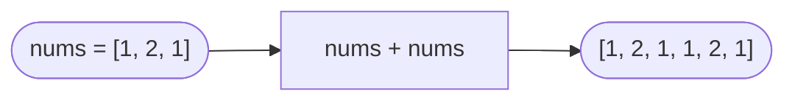

# Concatenation of Array

**Difficulty:** Easy
**Source:** [NeetCode](https://neetcode.io/problems/concatenation-of-array)

## Problem

> Given an integer array `nums` of length `n`, return an array `ans` of length `2n` where `ans[i] = nums[i]` and `ans[i + n] = nums[i]` for `0 <= i < n`.
>
> In other words, `ans` is the concatenation of two copies of `nums`.
>
> **Example 1:**
> Input: `nums = [1, 2, 1]`
> Output: `[1, 2, 1, 1, 2, 1]`
>
> **Example 2:**
> Input: `nums = [1, 3, 2, 1]`
> Output: `[1, 3, 2, 1, 1, 3, 2, 1]`
>
> **Constraints:**
> - `1 <= n <= 1000`
> - `1 <= nums[i] <= 1000`

## Prerequisites

Before attempting this problem, you should be comfortable with:

- **Arrays** — understanding index-based access and iteration
- **Array concatenation** — combining arrays or building new ones by index

---

## 1. Brute Force

### Intuition

Build the result array manually by iterating twice. On the first pass, place each element of `nums` at index `i`. On the second pass, place the same elements at index `i + n`. This makes the logic explicit and easy to follow, even if Python gives us a nicer shortcut.

### Algorithm

1. Create `ans` as a list of zeros with length `2 * n`.
2. Loop `i` from `0` to `n - 1`:
   - Set `ans[i] = nums[i]`
   - Set `ans[i + n] = nums[i]`
3. Return `ans`.

### Solution

```python,editable
def getConcatenation(nums):
    n = len(nums)
    ans = [0] * (2 * n)
    for i in range(n):
        ans[i] = nums[i]
        ans[i + n] = nums[i]
    return ans


print(getConcatenation([1, 2, 1]))        # [1, 2, 1, 1, 2, 1]
print(getConcatenation([1, 3, 2, 1]))     # [1, 3, 2, 1, 1, 3, 2, 1]
print(getConcatenation([5]))              # [5, 5]
```

### Complexity

- Time: `O(n)`
- Space: `O(n)` — the output array of length `2n`

---

## 2. Python Concatenation Operator

### Intuition

Python's `+` operator on lists creates a new list that is the concatenation of both operands. Since we want `nums` followed by `nums`, we can just return `nums + nums` — one line, same time and space complexity as the manual approach, just more readable.

This is not a "trick" — it's the same algorithm underneath. The `+` operator iterates through both lists and copies each element into a new list, which is exactly what the brute force does.

### Algorithm

1. Return `nums + nums`.



### Solution

```python,editable
def getConcatenation(nums):
    return nums + nums


print(getConcatenation([1, 2, 1]))        # [1, 2, 1, 1, 2, 1]
print(getConcatenation([1, 3, 2, 1]))     # [1, 3, 2, 1, 1, 3, 2, 1]
print(getConcatenation([5]))              # [5, 5]
```

### Complexity

- Time: `O(n)`
- Space: `O(n)` — output array of length `2n`

---

## Common Pitfalls

**Using `nums * 2` vs `nums + nums`.** Both produce the same result for this problem, but understand that `nums * 2` also creates a new list — it does not mutate `nums` in place. Either works fine here.

**Mutating `nums` in place.** If you try to append to `nums` directly inside a loop over `nums`, you will get an infinite loop since the list grows as you iterate. Always build a separate output or use `nums + nums` to create a new list.
