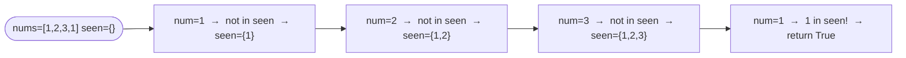

# Contains Duplicate

**Difficulty:** Easy
**Source:** [NeetCode](https://neetcode.io/problems/contains-duplicate)

## Problem

> Given an integer array `nums`, return `true` if any value appears **at least twice** in the array, and return `false` if every element is distinct.
>
> **Example 1:**
> Input: `nums = [1, 2, 3, 1]`
> Output: `true`
>
> **Example 2:**
> Input: `nums = [1, 2, 3, 4]`
> Output: `false`
>
> **Example 3:**
> Input: `nums = [1, 1, 1, 3, 3, 4, 3, 2, 4, 2]`
> Output: `true`
>
> **Constraints:**
> - `1 <= nums.length <= 10^5`
> - `-10^9 <= nums[i] <= 10^9`

## Prerequisites

Before attempting this problem, you should be comfortable with:

- **Arrays** — iteration and element access
- **Hash Sets** — O(1) average-case lookup and insertion

---

## 1. Brute Force

### Intuition

For every element in the array, check every other element that comes after it. If any two elements are equal, return `true`. This guarantees correctness but checks every possible pair — which is slow for large arrays.

### Algorithm

1. For each index `i` from `0` to `n - 1`:
   - For each index `j` from `i + 1` to `n - 1`:
     - If `nums[i] == nums[j]`, return `true`.
2. Return `false` (no duplicate found).

### Solution

```python,editable
def containsDuplicate(nums):
    n = len(nums)
    for i in range(n):
        for j in range(i + 1, n):
            if nums[i] == nums[j]:
                return True
    return False


print(containsDuplicate([1, 2, 3, 1]))              # True
print(containsDuplicate([1, 2, 3, 4]))              # False
print(containsDuplicate([1, 1, 1, 3, 3, 4, 3]))    # True
```

### Complexity

- Time: `O(n²)` — every pair of elements is compared
- Space: `O(1)`

---

## 2. Sorting

### Intuition

If you sort the array first, any duplicate values will end up sitting next to each other. A single pass checking adjacent elements is then all you need. The cost is the sort itself.

### Algorithm

1. Sort `nums`.
2. For each index `i` from `1` to `n - 1`:
   - If `nums[i] == nums[i - 1]`, return `true`.
3. Return `false`.

### Solution

```python,editable
def containsDuplicate(nums):
    nums.sort()
    for i in range(1, len(nums)):
        if nums[i] == nums[i - 1]:
            return True
    return False


print(containsDuplicate([1, 2, 3, 1]))              # True
print(containsDuplicate([1, 2, 3, 4]))              # False
print(containsDuplicate([1, 1, 1, 3, 3, 4, 3]))    # True
```

### Complexity

- Time: `O(n log n)` — dominated by the sort
- Space: `O(1)` — ignoring the sort's stack space

---

## 3. Hash Set

### Intuition

As you scan through the array, keep track of every number you have seen so far in a hash set. Before adding a number, check if it is already in the set. If it is, you have found a duplicate — return `true` immediately. Hash set lookups and insertions are O(1) on average, so the whole scan is O(n).

### Algorithm

1. Create an empty set `seen`.
2. For each `num` in `nums`:
   - If `num` is in `seen`, return `true`.
   - Otherwise, add `num` to `seen`.
3. Return `false`.



### Solution

```python,editable
def containsDuplicate(nums):
    seen = set()
    for num in nums:
        if num in seen:
            return True
        seen.add(num)
    return False


print(containsDuplicate([1, 2, 3, 1]))              # True
print(containsDuplicate([1, 2, 3, 4]))              # False
print(containsDuplicate([1, 1, 1, 3, 3, 4, 3]))    # True
```

### Complexity

- Time: `O(n)` — one pass with O(1) set operations
- Space: `O(n)` — worst case: all elements are unique and all end up in the set

---

## Common Pitfalls

**Using `len(set(nums)) != len(nums)`.** This works and is Pythonic, but it builds the entire set before checking — meaning it never short-circuits early when a duplicate is found near the start. The explicit loop with early return is faster in practice for arrays with early duplicates.

**Assuming integers are bounded.** The hash set approach works for any hashable type. If someone asks you to use O(1) space, the sorting approach is a good trade-off (though it modifies the input).
