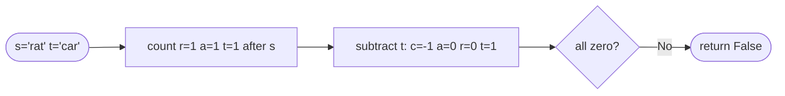

# Valid Anagram

**Difficulty:** Easy
**Source:** [NeetCode](https://neetcode.io/problems/valid-anagram)

## Problem

> Given two strings `s` and `t`, return `true` if `t` is an **anagram** of `s`, and `false` otherwise.
>
> An anagram is a word formed by rearranging the letters of a different word using all the original letters exactly once.
>
> **Example 1:**
> Input: `s = "anagram"`, `t = "nagaram"`
> Output: `true`
>
> **Example 2:**
> Input: `s = "rat"`, `t = "car"`
> Output: `false`
>
> **Constraints:**
> - `1 <= s.length, t.length <= 5 * 10^4`
> - `s` and `t` consist of lowercase English letters.

## Prerequisites

Before attempting this problem, you should be comfortable with:

- **Strings** — iteration and character access
- **Hash Maps** — storing and comparing frequency counts
- **Sorting** — understanding the cost of sorting a sequence

---

## 1. Brute Force (Sorting)

### Intuition

Two strings are anagrams of each other if and only if they contain the exact same characters with the exact same frequencies. Sorting both strings rearranges all characters into a canonical order — if the sorted versions are equal, the strings are anagrams. Short-circuit immediately if the lengths differ.

### Algorithm

1. If `len(s) != len(t)`, return `false`.
2. Sort both strings.
3. Return `sorted(s) == sorted(t)`.

### Solution

```python,editable
def isAnagram(s, t):
    if len(s) != len(t):
        return False
    return sorted(s) == sorted(t)


print(isAnagram("anagram", "nagaram"))   # True
print(isAnagram("rat", "car"))           # False
print(isAnagram("ab", "a"))              # False
```

### Complexity

- Time: `O(n log n)` — dominated by sorting, where `n = len(s)`
- Space: `O(n)` — sorted copies of each string

---

## 2. Frequency Count (Hash Map)

### Intuition

Instead of sorting, count how many times each character appears in `s`, then subtract counts for each character in `t`. If every count ends at zero, the strings are anagrams. We only need one hash map — increment for characters in `s`, decrement for characters in `t`, and check that all values are zero at the end.

### Algorithm

1. If `len(s) != len(t)`, return `false`.
2. Create a hash map `count` (default 0).
3. For each character `c` in `s`, increment `count[c]`.
4. For each character `c` in `t`, decrement `count[c]`.
5. Return `true` if all values in `count` are `0`.



### Solution

```python,editable
def isAnagram(s, t):
    if len(s) != len(t):
        return False

    count = {}
    for c in s:
        count[c] = count.get(c, 0) + 1
    for c in t:
        count[c] = count.get(c, 0) - 1

    return all(v == 0 for v in count.values())


print(isAnagram("anagram", "nagaram"))   # True
print(isAnagram("rat", "car"))           # False
print(isAnagram("ab", "a"))              # False
```

### Complexity

- Time: `O(n)` — two passes over strings of length `n`
- Space: `O(1)` — at most 26 distinct lowercase letters in the map

---

## 3. Fixed-Size Count Array

### Intuition

Since the problem guarantees lowercase English letters only, we can use a list of 26 integers instead of a hash map. Map each character to an index via `ord(c) - ord('a')`. This avoids hash overhead and is cache-friendly.

### Algorithm

1. If `len(s) != len(t)`, return `false`.
2. Create `count = [0] * 26`.
3. For each character `c` in `s`, increment `count[ord(c) - ord('a')]`.
4. For each character `c` in `t`, decrement `count[ord(c) - ord('a')]`.
5. Return `true` if all entries in `count` are `0`.

### Solution

```python,editable
def isAnagram(s, t):
    if len(s) != len(t):
        return False

    count = [0] * 26
    for c in s:
        count[ord(c) - ord('a')] += 1
    for c in t:
        count[ord(c) - ord('a')] -= 1

    return all(x == 0 for x in count)


print(isAnagram("anagram", "nagaram"))   # True
print(isAnagram("rat", "car"))           # False
print(isAnagram("ab", "a"))              # False
```

### Complexity

- Time: `O(n)`
- Space: `O(1)` — fixed array of 26 integers regardless of input size

---

## Common Pitfalls

**Forgetting the length check.** If `s` and `t` have different lengths, they cannot be anagrams. Checking length first lets you return early and avoids subtle bugs in the count comparison.

**Handling Unicode.** The problem restricts input to lowercase ASCII letters, so the 26-element array works. If the problem allowed Unicode, you would need a general hash map — the fixed array approach would fail silently on characters outside `a-z`.

**Using `Counter` directly.** `from collections import Counter; return Counter(s) == Counter(t)` is valid and clean, but understanding the underlying frequency-count approach is more important for interviews.
