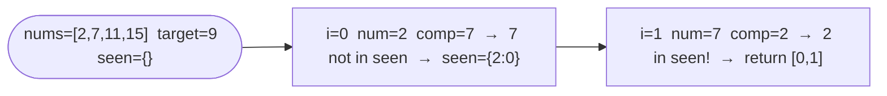

# Two Sum

**Difficulty:** Easy
**Source:** [NeetCode](https://neetcode.io/problems/two-sum)

## Problem

> Given an array of integers `nums` and an integer `target`, return the **indices** of the two numbers such that they add up to `target`.
>
> You may assume that each input has **exactly one solution**, and you may not use the same element twice. You can return the answer in any order.
>
> **Example 1:**
> Input: `nums = [2, 7, 11, 15]`, `target = 9`
> Output: `[0, 1]`
>
> **Example 2:**
> Input: `nums = [3, 2, 4]`, `target = 6`
> Output: `[1, 2]`
>
> **Example 3:**
> Input: `nums = [3, 3]`, `target = 6`
> Output: `[0, 1]`
>
> **Constraints:**
> - `2 <= nums.length <= 10^4`
> - `-10^9 <= nums[i] <= 10^9`
> - `-10^9 <= target <= 10^9`
> - Only one valid answer exists.

## Prerequisites

Before attempting this problem, you should be comfortable with:

- **Arrays** — index-based access and iteration
- **Hash Maps** — O(1) average-case lookup for key-value pairs
- **Complement** — the idea that if `a + b = target`, then `b = target - a`

---

## 1. Brute Force

### Intuition

Try every possible pair of indices `(i, j)` where `i < j`. Check if the two elements at those positions sum to `target`. The first matching pair is returned. This is correct but slow because it examines all `n*(n-1)/2` pairs.

### Algorithm

1. For each index `i` from `0` to `n - 1`:
   - For each index `j` from `i + 1` to `n - 1`:
     - If `nums[i] + nums[j] == target`, return `[i, j]`.
2. Return `[]` (problem guarantees a solution exists, so this is unreachable).

### Solution

```python,editable
def twoSum(nums, target):
    n = len(nums)
    for i in range(n):
        for j in range(i + 1, n):
            if nums[i] + nums[j] == target:
                return [i, j]
    return []


print(twoSum([2, 7, 11, 15], 9))   # [0, 1]
print(twoSum([3, 2, 4], 6))        # [1, 2]
print(twoSum([3, 3], 6))           # [0, 1]
```

### Complexity

- Time: `O(n²)`
- Space: `O(1)`

---

## 2. Hash Map (One Pass)

### Intuition

For each number `nums[i]`, we need to know if its **complement** — `target - nums[i]` — has already been seen. A hash map lets us check this in O(1). As we scan left to right, we store each number and its index in the map. Before storing, we check whether the complement is already there. If it is, we are done.

The key insight: we only ever need to look backwards (at elements already processed), so a single left-to-right pass is enough.

### Algorithm

1. Create an empty hash map `seen` mapping value → index.
2. For each index `i` and value `num` in `nums`:
   - Compute `complement = target - num`.
   - If `complement` is in `seen`, return `[seen[complement], i]`.
   - Otherwise, store `seen[num] = i`.
3. Return `[]`.



### Solution

```python,editable
def twoSum(nums, target):
    seen = {}  # value -> index
    for i, num in enumerate(nums):
        complement = target - num
        if complement in seen:
            return [seen[complement], i]
        seen[num] = i
    return []


print(twoSum([2, 7, 11, 15], 9))   # [0, 1]
print(twoSum([3, 2, 4], 6))        # [1, 2]
print(twoSum([3, 3], 6))           # [0, 1]
```

### Complexity

- Time: `O(n)` — one pass, each hash map operation is O(1) average
- Space: `O(n)` — the hash map stores at most `n` entries

---

## Common Pitfalls

**Using the same element twice.** If `target = 6` and `nums[0] = 3`, you might incorrectly find the complement `3` at index `0` itself. The one-pass hash map approach avoids this naturally — we only look at elements already seen, and `nums[0]` has not been added to the map yet when we check its complement.

**Returning values instead of indices.** The problem asks for indices, not the numbers themselves. Make sure your hash map stores `value → index`, not the reverse.

**Assuming the array is sorted.** The two-pointer approach for sorted arrays would give O(n) time and O(1) space, but it only works if the array is sorted. Two Sum does not guarantee sorted input, so you would need to sort first (losing the original indices) or use the hash map approach.
