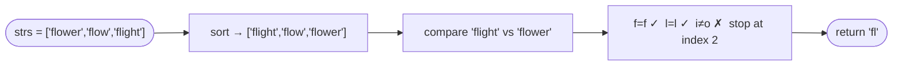

# Longest Common Prefix

**Difficulty:** Easy
**Source:** [NeetCode](https://neetcode.io/problems/longest-common-prefix)

## Problem

> Write a function to find the longest common prefix string amongst an array of strings.
>
> If there is no common prefix, return an empty string `""`.
>
> **Example 1:**
> Input: `strs = ["flower", "flow", "flight"]`
> Output: `"fl"`
>
> **Example 2:**
> Input: `strs = ["dog", "racecar", "car"]`
> Output: `""`
>
> **Constraints:**
> - `1 <= strs.length <= 200`
> - `0 <= strs[i].length <= 200`
> - `strs[i]` consists of only lowercase English letters.

## Prerequisites

Before attempting this problem, you should be comfortable with:

- **Strings** — character-by-character comparison and slicing
- **Iteration** — looping over multiple collections simultaneously

---

## 1. Brute Force (Character-by-Character)

### Intuition

Take the first string as the initial candidate prefix. Then for each subsequent string, shorten the candidate until it matches the beginning of that string. After processing all strings, whatever remains is the longest common prefix.

Alternatively: pick any column index `c`. If the character at column `c` is the same in all strings, it is part of the prefix. The moment we find a mismatch — or run off the end of any string — we stop.

### Algorithm

1. If `strs` is empty, return `""`.
2. Set `prefix = strs[0]`.
3. For each string `s` in `strs[1:]`:
   - While `s` does not start with `prefix`, remove the last character from `prefix`.
   - If `prefix` becomes empty, return `""`.
4. Return `prefix`.

### Solution

```python,editable
def longestCommonPrefix(strs):
    if not strs:
        return ""
    prefix = strs[0]
    for s in strs[1:]:
        while not s.startswith(prefix):
            prefix = prefix[:-1]
            if not prefix:
                return ""
    return prefix


print(longestCommonPrefix(["flower", "flow", "flight"]))   # "fl"
print(longestCommonPrefix(["dog", "racecar", "car"]))      # ""
print(longestCommonPrefix(["interview", "inter", "internal"]))  # "inter"
```

### Complexity

- Time: `O(S)` where `S` is the total number of characters across all strings (worst case: all strings identical)
- Space: `O(1)` extra (we reuse the prefix string in-place)

---

## 2. Sort and Compare Endpoints

### Intuition

If you sort the array of strings lexicographically, the first and last strings will be the most different from each other. Any character that matches between the first and last string also matches in every string in between. So comparing just those two strings tells you the longest common prefix for the whole array.

This is a clever observation: you do not need to compare all pairs — just the extreme ends after sorting.

### Algorithm

1. Sort `strs` lexicographically.
2. Compare the first string `lo = strs[0]` and the last string `hi = strs[-1]` character by character.
3. Find the length of their common prefix.
4. Return the prefix.



### Solution

```python,editable
def longestCommonPrefix(strs):
    if not strs:
        return ""
    strs.sort()
    lo, hi = strs[0], strs[-1]
    i = 0
    while i < len(lo) and i < len(hi) and lo[i] == hi[i]:
        i += 1
    return lo[:i]


print(longestCommonPrefix(["flower", "flow", "flight"]))         # "fl"
print(longestCommonPrefix(["dog", "racecar", "car"]))            # ""
print(longestCommonPrefix(["interview", "inter", "internal"]))   # "inter"
```

### Complexity

- Time: `O(n log n)` for the sort, plus `O(m)` for the comparison where `m` is the length of the shortest string
- Space: `O(1)` extra

---

## Common Pitfalls

**Empty array or single string.** If `strs` has one element, its entire value is the common prefix. Make sure your code handles this edge case — the sort-and-compare approach naturally handles it because `lo` and `hi` are the same string.

**Prefix becoming empty.** When no common character exists at position 0, the answer is `""`. The trimming approach handles this cleanly via the `while not prefix: return ""` check.

**Off-by-one on string length.** When comparing two strings, stop when `i` reaches the length of the *shorter* string. Accessing `lo[i]` beyond its length would raise an `IndexError`.
