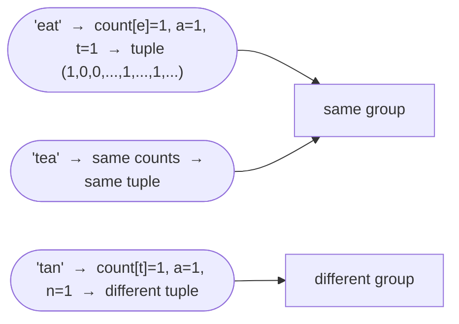

# Group Anagrams

**Difficulty:** Medium
**Source:** [NeetCode](https://neetcode.io/problems/anagram-groups)

## Problem

> Given an array of strings `strs`, group the **anagrams** together. You can return the answer in **any order**.
>
> An **anagram** is a word formed by rearranging the letters of a different word using all the original letters exactly once.
>
> **Example 1:**
> Input: `strs = ["eat","tea","tan","ate","nat","bat"]`
> Output: `[["bat"],["nat","tan"],["ate","eat","tea"]]`
>
> **Example 2:**
> Input: `strs = [""]`
> Output: `[[""]]`
>
> **Example 3:**
> Input: `strs = ["a"]`
> Output: `[["a"]]`
>
> **Constraints:**
> - `1 <= strs.length <= 10^4`
> - `0 <= strs[i].length <= 100`
> - `strs[i]` consists of lowercase English letters.

## Prerequisites

Before attempting this problem, you should be comfortable with:

- **Hash Maps** — grouping items by a shared key
- **Sorting** — using sorted strings as canonical keys
- **Tuples as dictionary keys** — immutable sequences that can be hashed

---

## 1. Brute Force (Sort Each String as Key)

### Intuition

Two strings are anagrams if and only if their sorted versions are identical. For example, `"eat"`, `"tea"`, and `"ate"` all sort to `"aet"`. We can use the sorted string as a dictionary key and group all strings that share the same key together.

This is actually quite efficient in practice — sorting each individual word is cheap, and the overall grouping work is linear in total characters.

### Algorithm

1. Create a hash map `groups` where `key → list of strings`.
2. For each string `s` in `strs`:
   - Compute `key = "".join(sorted(s))`.
   - Append `s` to `groups[key]`.
3. Return the values of `groups`.

### Solution

```python,editable
from collections import defaultdict

def groupAnagrams(strs):
    groups = defaultdict(list)
    for s in strs:
        key = "".join(sorted(s))
        groups[key].append(s)
    return list(groups.values())


print(groupAnagrams(["eat", "tea", "tan", "ate", "nat", "bat"]))
# [['eat', 'tea', 'ate'], ['tan', 'nat'], ['bat']]

print(groupAnagrams([""]))    # [['']]
print(groupAnagrams(["a"]))   # [['a']]
```

### Complexity

- Time: `O(n * k log k)` where `n` is the number of strings and `k` is the maximum string length (sorting each string)
- Space: `O(n * k)` — storing all strings in the map

---

## 2. Character Count Tuple as Key

### Intuition

Instead of sorting (which costs O(k log k) per string), we can count the frequency of each of the 26 letters in the string. Two strings are anagrams if and only if they have the same character frequencies. Represent these 26 counts as a tuple and use that as the dictionary key. Tuple creation is O(k), which is better than sorting.

### Algorithm

1. Create a hash map `groups` where `key → list of strings`.
2. For each string `s` in `strs`:
   - Create a count array of 26 zeros.
   - For each character `c` in `s`, increment `count[ord(c) - ord('a')]`.
   - Convert `count` to a tuple (tuples are hashable; lists are not).
   - Append `s` to `groups[tuple(count)]`.
3. Return the values of `groups`.



### Solution

```python,editable
from collections import defaultdict

def groupAnagrams(strs):
    groups = defaultdict(list)
    for s in strs:
        count = [0] * 26
        for c in s:
            count[ord(c) - ord('a')] += 1
        groups[tuple(count)].append(s)
    return list(groups.values())


print(groupAnagrams(["eat", "tea", "tan", "ate", "nat", "bat"]))
# [['eat', 'tea', 'ate'], ['tan', 'nat'], ['bat']]

print(groupAnagrams([""]))    # [['']]
print(groupAnagrams(["a"]))   # [['a']]
```

### Complexity

- Time: `O(n * k)` — for each of `n` strings, we do O(k) work to build the count
- Space: `O(n * k)` — storing all strings and keys

---

## Common Pitfalls

**Using a list as a dictionary key.** Lists are mutable and therefore not hashable in Python. You must convert the count array to a `tuple` before using it as a key — this is a very common mistake.

**Not using `defaultdict`.** With a regular `dict`, you need to check `if key not in groups: groups[key] = []` before appending. Using `defaultdict(list)` handles this automatically and makes the code cleaner.

**Assuming the output order matters.** The problem says the answer can be in any order — so do not worry about sorting the groups or the strings within each group unless explicitly asked.
