# Majority Element

**Difficulty:** Easy
**Source:** [NeetCode](https://neetcode.io/problems/majority-element)

## Problem

> Given an array `nums` of size `n`, return the **majority element**.
>
> The majority element is the element that appears **more than** `⌊n / 2⌋` times. You may assume that the majority element **always exists** in the array.
>
> **Example 1:**
> Input: `nums = [3, 2, 3]`
> Output: `3`
>
> **Example 2:**
> Input: `nums = [2, 2, 1, 1, 1, 2, 2]`
> Output: `2`
>
> **Constraints:**
> - `n == nums.length`
> - `1 <= n <= 5 * 10^4`
> - `-10^9 <= nums[i] <= 10^9`
> - The majority element always exists.

## Prerequisites

Before attempting this problem, you should be comfortable with:

- **Hash Maps** — counting element frequencies
- **Voting / Cancellation intuition** — understanding why majority elements survive pairwise elimination

---

## 1. Brute Force (Hash Map Count)

### Intuition

Count the occurrences of each element using a hash map, then find the element whose count exceeds `n / 2`. This is straightforward and easy to reason about — scan once to count, then scan the map to find the winner.

### Algorithm

1. Build a frequency map `count` over `nums`.
2. For each element `num` and its `freq` in `count`:
   - If `freq > n // 2`, return `num`.
3. (Unreachable — the problem guarantees a majority element exists.)

### Solution

```python,editable
def majorityElement(nums):
    n = len(nums)
    count = {}
    for num in nums:
        count[num] = count.get(num, 0) + 1
    for num, freq in count.items():
        if freq > n // 2:
            return num
    return -1  # unreachable


print(majorityElement([3, 2, 3]))               # 3
print(majorityElement([2, 2, 1, 1, 1, 2, 2]))  # 2
print(majorityElement([1]))                     # 1
```

### Complexity

- Time: `O(n)`
- Space: `O(n)` — the hash map can hold up to `n` distinct elements

---

## 2. Sorting

### Intuition

If the majority element appears more than `n/2` times, after sorting it must occupy the middle index `n // 2`. No matter how the other elements are arranged, the majority element has enough copies to span past the midpoint.

### Algorithm

1. Sort `nums`.
2. Return `nums[n // 2]`.

### Solution

```python,editable
def majorityElement(nums):
    nums.sort()
    return nums[len(nums) // 2]


print(majorityElement([3, 2, 3]))               # 3
print(majorityElement([2, 2, 1, 1, 1, 2, 2]))  # 2
print(majorityElement([1]))                     # 1
```

### Complexity

- Time: `O(n log n)` — dominated by sorting
- Space: `O(1)` — ignoring sort stack space

---

## 3. Boyer-Moore Voting Algorithm

### Intuition

Imagine pairing up different elements and cancelling each pair. Since the majority element appears more than half the time, it always survives this cancellation process — there are simply too many copies of it for all of them to be cancelled out by other elements.

Maintain a `candidate` and a `count`. When `count` hits zero, pick the current element as the new candidate. If the current element matches the candidate, increment `count`; otherwise, decrement it. By the end, the candidate is guaranteed to be the majority element.

### Algorithm

1. Set `candidate = None`, `count = 0`.
2. For each `num` in `nums`:
   - If `count == 0`, set `candidate = num`.
   - If `num == candidate`, increment `count`.
   - Otherwise, decrement `count`.
3. Return `candidate`.

```mermaid
flowchart LR
    S(["nums=[2,2,1,1,1,2,2]   candidate=None  count=0"])
    S --> a["num=2  count=0  →  candidate=2  count=1"]
    a --> b["num=2  match  →  count=2"]
    b --> c["num=1  no match  →  count=1"]
    c --> d["num=1  no match  →  count=0"]
    d --> e["num=1  count=0  →  candidate=1  count=1"]
    e --> f["num=2  no match  →  count=0"]
    f --> g["num=2  count=0  →  candidate=2  count=1"]
    g --> R(["return candidate=2"])
```



### Solution

```python,editable
def majorityElement(nums):
    candidate = None
    count = 0
    for num in nums:
        if count == 0:
            candidate = num
        count += 1 if num == candidate else -1
    return candidate


print(majorityElement([3, 2, 3]))               # 3
print(majorityElement([2, 2, 1, 1, 1, 2, 2]))  # 2
print(majorityElement([1]))                     # 1
```

### Complexity

- Time: `O(n)` — single pass
- Space: `O(1)` — only two variables

---

## Common Pitfalls

**Boyer-Moore requires a guaranteed majority.** The algorithm returns the candidate but does not verify it. If the problem did not guarantee a majority element exists, you would need a second pass to count and confirm. For this problem, verification is not needed.

**Confusing `n // 2` with `n / 2`.** In Python 3, `/` gives float division. Use `//` for integer floor division when checking `freq > n // 2`.
