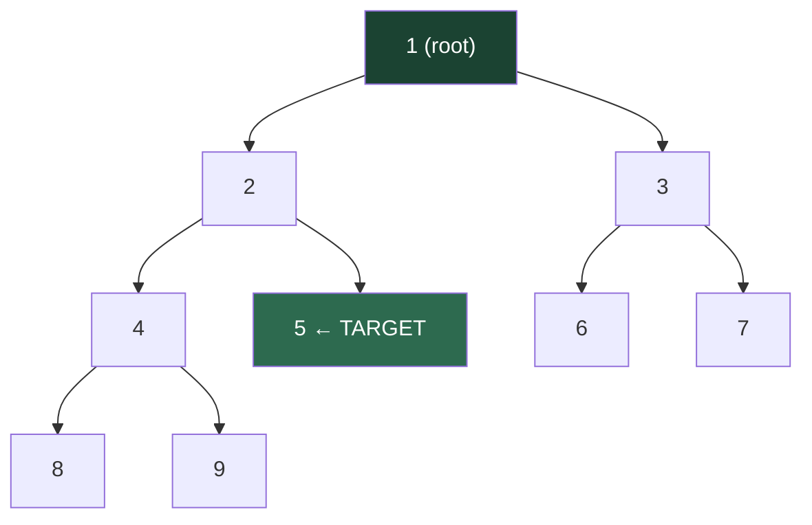

# Tree Maze

A binary tree is a natural maze: at every node you can go left or right, and you keep going until you run out of branches. Backtracking lets you explore every path without getting lost — when a branch fails to find what you are looking for, you retreat and try the other direction.

## The Tree We Will Explore



Let's build this tree in code and then search it.

```python,editable
class Node:
    def __init__(self, val, left=None, right=None):
        self.val = val
        self.left = left
        self.right = right

# Build the tree from the diagram above
tree = Node(1,
    left=Node(2,
        left=Node(4,
            left=Node(8),
            right=Node(9)),
        right=Node(5)),
    right=Node(3,
        left=Node(6),
        right=Node(7)))

print("Tree built successfully.")
print(f"Root: {tree.val}")
print(f"Root's children: {tree.left.val} and {tree.right.val}")
```

## Part 1: Find a Target Value (Return True/False)

The algorithm is:
1. If the current node is None, this path failed — return False.
2. If the current node holds the target — found it, return True.
3. Otherwise, try left. If left succeeds, we are done. Otherwise, try right.

```python,editable
class Node:
    def __init__(self, val, left=None, right=None):
        self.val = val
        self.left = left
        self.right = right

tree = Node(1,
    left=Node(2,
        left=Node(4, left=Node(8), right=Node(9)),
        right=Node(5)),
    right=Node(3,
        left=Node(6),
        right=Node(7)))


def find(node, target):
    # Base case 1: fallen off the tree — dead end
    if node is None:
        return False

    # Base case 2: found the target
    if node.val == target:
        return True

    # EXPLORE left subtree
    if find(node.left, target):
        return True   # found it on the left — no need to try right

    # Left failed. BACKTRACK implicitly (no state to undo here)
    # EXPLORE right subtree
    if find(node.right, target):
        return True

    # Both children failed — this whole subtree has no solution
    return False


for target in [5, 9, 3, 10]:
    result = find(tree, target)
    status = "FOUND" if result else "not found"
    print(f"Search for {target:>2}: {status}")
```

Notice there is no explicit "undo" step here because we are not modifying any state. The backtracking happens automatically when `find(node.left, target)` returns False and execution falls through to the right subtree. The **call stack itself** is the backtracking mechanism.

## Visualising the Search Path

Let's add tracing so we can see exactly which nodes get visited when searching for 5:

```python,editable
class Node:
    def __init__(self, val, left=None, right=None):
        self.val = val
        self.left = left
        self.right = right

tree = Node(1,
    left=Node(2,
        left=Node(4, left=Node(8), right=Node(9)),
        right=Node(5)),
    right=Node(3,
        left=Node(6),
        right=Node(7)))


def find_traced(node, target, depth=0):
    indent = "  " * depth

    if node is None:
        print(f"{indent}None — dead end, backtracking")
        return False

    print(f"{indent}Visiting node {node.val}")

    if node.val == target:
        print(f"{indent}*** FOUND {target}! ***")
        return True

    print(f"{indent}  Going left from {node.val}...")
    if find_traced(node.left, target, depth + 1):
        return True

    print(f"{indent}  Left failed. Going right from {node.val}...")
    if find_traced(node.right, target, depth + 1):
        return True

    print(f"{indent}  Both sides failed at {node.val}, backtracking")
    return False


print("Searching for 5:\n")
find_traced(tree, 5)
```

## Part 2: Find ALL Paths from Root to Leaves

Now we need explicit state management. We track the current path in a list, and we must **undo** our addition before returning — that is the classic backtracking pattern.

```python,editable
class Node:
    def __init__(self, val, left=None, right=None):
        self.val = val
        self.left = left
        self.right = right

tree = Node(1,
    left=Node(2,
        left=Node(4, left=Node(8), right=Node(9)),
        right=Node(5)),
    right=Node(3,
        left=Node(6),
        right=Node(7)))


def all_paths(root):
    results = []
    path = []          # current path being explored

    def backtrack(node):
        if node is None:
            return

        # CHOOSE: add this node to the current path
        path.append(node.val)

        # Base case: leaf node — record the complete path
        if node.left is None and node.right is None:
            results.append(list(path))  # copy! path will be modified later
        else:
            # EXPLORE left and right subtrees
            backtrack(node.left)
            backtrack(node.right)

        # UNCHOOSE: remove this node before returning to parent
        path.pop()

    backtrack(root)
    return results


paths = all_paths(tree)
print(f"Found {len(paths)} root-to-leaf paths:\n")
for p in paths:
    print("  " + " → ".join(str(v) for v in p))
```

The `path.pop()` at the end is the heart of the algorithm. Without it, the path list would keep growing and every "complete path" recorded would be contaminated by leftover values from previous branches.

## Part 3: Find All Paths That Sum to a Target

A natural extension: find every root-to-leaf path where the values add up to a given target.

```python,editable
class Node:
    def __init__(self, val, left=None, right=None):
        self.val = val
        self.left = left
        self.right = right

tree = Node(1,
    left=Node(2,
        left=Node(4, left=Node(8), right=Node(9)),
        right=Node(5)),
    right=Node(3,
        left=Node(6),
        right=Node(7)))


def paths_with_sum(root, target):
    results = []
    path = []

    def backtrack(node, remaining):
        if node is None:
            return

        # CHOOSE
        path.append(node.val)
        remaining -= node.val

        # Base case: leaf — did we hit the target?
        if node.left is None and node.right is None:
            if remaining == 0:
                results.append(list(path))
        else:
            # EXPLORE
            backtrack(node.left, remaining)
            backtrack(node.right, remaining)

        # UNCHOOSE
        path.pop()

    backtrack(root, target)
    return results


for target in [15, 11, 17]:
    found = paths_with_sum(tree, target)
    if found:
        print(f"Paths summing to {target}:")
        for p in found:
            path_str = " + ".join(str(v) for v in p)
            print(f"  {path_str} = {sum(p)}")
    else:
        print(f"No paths sum to {target}")
    print()
```

## The Three Steps in Every Example

| Step | Part 1 (find target) | Part 2 (all paths) | Part 3 (path sum) |
|---|---|---|---|
| **Choose** | visit node | `path.append(node.val)` | `path.append(node.val)` |
| **Explore** | recurse left, then right | recurse left, then right | recurse left, then right |
| **Unchoose** | implicit (no state) | `path.pop()` | `path.pop()` |

The pattern is identical across all three. Only the base case and what constitutes a "solution" changes.

## Real-World Applications

**Solving Sudoku** — A Sudoku board is a tree of choices. At each empty cell, try digits 1–9. If a digit violates a row/column/box constraint, backtrack and try the next digit. This is how all Sudoku solvers work under the hood.

**The N-Queens Problem** — Place N queens on an N×N chess board so no two threaten each other. Try a queen in each column of row 1, then recurse to row 2, pruning any placement that conflicts with existing queens. Backtrack when stuck.

**GPS Route Planning** — Finding all routes between two cities is a path-finding problem on a graph. Backtracking (depth-first search with path tracking) generates all possible routes, from which the shortest or fastest can be selected.

**Game AI — Chess Move Trees** — A chess engine explores a tree of possible moves. At each node, it tries every legal move, recurses to evaluate the resulting position, then backtracks to try the next move. Alpha-beta pruning is an advanced form of the same "cut off failing branches early" idea.

```python,editable
# Mini demo: generate all permutations of [1, 2, 3]
# This is the same backtracking pattern applied to combinations

def permutations(nums):
    results = []
    used = [False] * len(nums)
    path = []

    def backtrack():
        if len(path) == len(nums):
            results.append(list(path))
            return

        for i, num in enumerate(nums):
            if used[i]:
                continue
            # CHOOSE
            used[i] = True
            path.append(num)
            # EXPLORE
            backtrack()
            # UNCHOOSE
            path.pop()
            used[i] = False

    backtrack()
    return results


perms = permutations([1, 2, 3])
print(f"All {len(perms)} permutations of [1, 2, 3]:")
for p in perms:
    print(f"  {p}")
```

## Key Takeaways

- Backtracking = depth-first search + explicit state undo.
- The **choose / explore / unchoose** pattern is the same regardless of problem complexity.
- When no state is modified (find target), backtracking is implicit in the call stack.
- When state is modified (path tracking), you must explicitly undo every change before returning.
- Early pruning — detecting dead ends before recursing — is what makes backtracking efficient.
