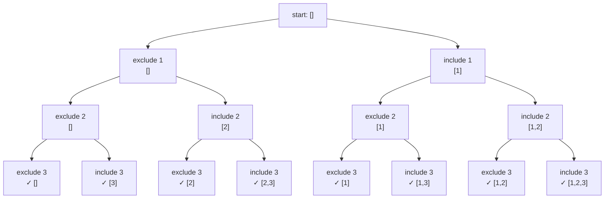

# Subsets

Your pizza app lets you choose any combination of toppings. How many possible pizzas? 2ⁿ — and backtracking generates them all.

With three toppings — mushrooms, peppers, olives — you get 2³ = 8 possible pizzas: the plain base, each topping alone, every pair, and all three together. The power set is the mathematical name for this collection of all possible subsets of a given set.

Backtracking is the engine that generates it. At each element you face one binary decision: include it or exclude it. Make that choice, move to the next element, repeat. When you run out of elements, you have a valid subset.

## The binary decision tree

For the array `[1, 2, 3]` every path from root to leaf is one subset. The left branch always means "exclude", the right branch always means "include".



The tree has 2ⁿ leaves and 2ⁿ⁺¹ - 1 total nodes. Every leaf is a valid answer — there is no pruning here, unlike many backtracking problems.

## Backtracking implementation

The key insight: pass the current subset as a growing list. At each index, record the snapshot, then explore including and excluding the current element.

```python,editable
def subsets(nums):
    result = []

    def backtrack(index, current):
        # Every state of current is a valid subset — record it
        result.append(list(current))

        for i in range(index, len(nums)):
            current.append(nums[i])       # include nums[i]
            backtrack(i + 1, current)     # recurse with next index
            current.pop()                 # exclude nums[i] (undo)

    backtrack(0, [])
    return result

nums = [1, 2, 3]
output = subsets(nums)

print(f"Input: {nums}")
print(f"Total subsets: {len(output)}")
for s in output:
    print(s)
```

Walk through the call stack for `[1, 2, 3]`:

1. `backtrack(0, [])` records `[]`, then tries each starting index.
2. Appending `1` gives `[1]` — recorded, then `backtrack(1, [1])` continues.
3. Inside that call, appending `2` gives `[1, 2]` — and so on.
4. After each recursive call returns, `pop()` undoes the last choice.

The `list(current)` snapshot is critical. If you appended `current` directly you would store a reference to the same list, and every snapshot would end up identical.

## Iterative bit-mask approach

Every integer from `0` to `2ⁿ - 1` can be read as a bitmask. Bit `j` being set means "include element `j`". This maps each number to exactly one subset.

```python,editable
def subsets_bitmask(nums):
    n = len(nums)
    result = []

    for mask in range(1 << n):          # 0 to 2^n - 1
        subset = []
        for j in range(n):
            if mask & (1 << j):         # bit j is set
                subset.append(nums[j])
        result.append(subset)

    return result

nums = [1, 2, 3]
output = subsets_bitmask(nums)

print(f"Input: {nums}")
print(f"Total subsets: {len(output)}")
for mask, s in enumerate(output):
    binary = format(mask, f'0{len(nums)}b')
    print(f"mask {binary} -> {s}")
```

The bitmask approach is iterative and easy to reason about, but it hits a wall at `n = 30` or so (2³⁰ is over a billion subsets). The backtracking version runs into the same wall — the problem is inherently exponential.

## Handling duplicates

When the input contains duplicate values, naive backtracking produces duplicate subsets.

```python,editable
# Naive approach — produces duplicates
def subsets_naive(nums):
    result = []

    def backtrack(index, current):
        result.append(list(current))
        for i in range(index, len(nums)):
            current.append(nums[i])
            backtrack(i + 1, current)
            current.pop()

    backtrack(0, [])
    return result

# Correct approach — sort first, skip same value at same depth
def subsets_no_duplicates(nums):
    nums.sort()
    result = []

    def backtrack(index, current):
        result.append(list(current))
        for i in range(index, len(nums)):
            # Skip if same value was already tried at this position
            if i > index and nums[i] == nums[i - 1]:
                continue
            current.append(nums[i])
            backtrack(i + 1, current)
            current.pop()

    backtrack(0, [])
    return result

nums_dup = [1, 2, 2]
naive = subsets_naive(nums_dup)
correct = subsets_no_duplicates(nums_dup)

print(f"Input: {nums_dup}")
print(f"\nNaive output ({len(naive)} subsets — has duplicates):")
for s in naive:
    print(s)

print(f"\nCorrect output ({len(correct)} unique subsets):")
for s in correct:
    print(s)
```

The duplicate-skip rule: `if i > index and nums[i] == nums[i - 1]: continue`. The condition `i > index` is crucial — it only skips when the same value appears more than once at the same level of the tree, not when it appears in a parent call.

## Complexity analysis

| Approach | Time | Space |
|---|---|---|
| Backtracking (no duplicates) | O(n · 2ⁿ) | O(n) recursion stack + O(n · 2ⁿ) output |
| Bitmask | O(n · 2ⁿ) | O(n · 2ⁿ) output |

The `n` factor in time comes from copying each subset into the result. There is no way to do better — the output itself has O(n · 2ⁿ) characters, so any algorithm must spend at least that much time.

## Real-world applications

**Feature selection in machine learning.** Given `n` candidate features, try every subset to find which combination produces the best model. This is exponential and impractical for large `n`, but exact for small feature sets.

**Combinatorial testing.** When software has `n` binary flags, you want to test every combination. Generating the power set gives you the full test matrix.

**Power set in set theory.** Many mathematical proofs need to enumerate all subsets of a finite set — the power set is the fundamental object.

**Generating all possible configurations.** A configuration system with `n` optional modules needs to validate that every possible combination is safe. Subsets give you the complete space.

```python,editable
# Practical example: find all subsets that sum to a target
def subsets_with_target_sum(nums, target):
    results = []

    def backtrack(index, current, current_sum):
        if current_sum == target:
            results.append(list(current))
        if current_sum >= target or index == len(nums):
            return

        for i in range(index, len(nums)):
            current.append(nums[i])
            backtrack(i + 1, current, current_sum + nums[i])
            current.pop()

    backtrack(0, [], 0)
    return results

nums = [1, 2, 3, 4, 5]
target = 6
found = subsets_with_target_sum(nums, target)

print(f"Input: {nums}")
print(f"Target sum: {target}")
print(f"Subsets that sum to {target}:")
for s in found:
    print(f"  {s}  (sum = {sum(s)})")
```

This is a small variation: add a pruning condition (`current_sum >= target`) to stop exploring branches that can never reach the target. This transforms a pure enumeration into a constrained search.
