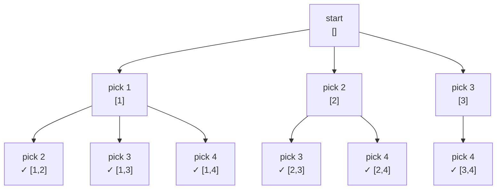

# Combinations

Choosing 3 players from a squad of 11 for a penalty shootout — order doesn't matter. How many ways? C(11,3) = 165.

The coach doesn't care whether they pick Rashford then Saka then Bellingham or Bellingham then Saka then Rashford — the same three players take the kicks either way. That indifference to order is what separates combinations from permutations.

The formula is C(n, k) = n! / (k! × (n-k)!). But the formula only counts. Backtracking actually builds each combination.

## Combinations vs permutations

| Concept | Order matters? | Example | Count |
|---|---|---|---|
| Combination | No | Picking 3 from {A, B, C, D} | C(4,3) = 4 |
| Permutation | Yes | Arranging 3 from {A, B, C, D} | P(4,3) = 24 |

The set `{1, 2, 3}` is just one combination chosen from `[1, 2, 3, 4]`. But `[1,2,3]`, `[1,3,2]`, `[2,1,3]`, `[2,3,1]`, `[3,1,2]`, `[3,2,1]` are six distinct permutations.

## The forward-only decision tree

To avoid revisiting elements (which would create duplicates), the tree only moves forward through the array. Once you include element `i`, future choices start from `i + 1`.

Below: choosing 2 elements from `[1, 2, 3, 4]`.



Each level picks one element and only looks at elements to its right. This enforces lexicographic order and eliminates duplicates without any extra checking. C(4,2) = 6, and the diagram has exactly 6 leaf nodes.

## Core implementation: choose k from 1..n

```python,editable
def combinations(n, k):
    result = []

    def backtrack(start, current):
        if len(current) == k:
            result.append(list(current))
            return

        for i in range(start, n + 1):
            current.append(i)
            backtrack(i + 1, current)
            current.pop()

    backtrack(1, [])
    return result

# C(4, 2) = 6
output = combinations(4, 2)
print(f"C(4, 2) = {len(output)}")
for c in output:
    print(c)

print()

# C(5, 3) = 10
output2 = combinations(5, 3)
print(f"C(5, 3) = {len(output2)}")
for c in output2:
    print(c)
```

The base case fires when `current` is exactly `k` long. The loop starts at `start` and goes to `n + 1` (inclusive upper bound), and each recursive call advances `start` to `i + 1` so earlier elements are never revisited.

## Pruning: stop early when there are not enough elements left

Without pruning, the loop tries indices that can never produce a full combination. Adding one condition eliminates those dead branches.

```python,editable
def combinations_pruned(n, k):
    result = []

    def backtrack(start, current):
        if len(current) == k:
            result.append(list(current))
            return

        remaining_needed = k - len(current)
        remaining_available = n - start + 1

        # Pruning: not enough elements left to complete the combination
        if remaining_available < remaining_needed:
            return

        for i in range(start, n + 1):
            current.append(i)
            backtrack(i + 1, current)
            current.pop()

    backtrack(1, [])
    return result

# Compare with and without pruning — same output, fewer calls
import sys

calls_normal = [0]
calls_pruned = [0]

def combinations_count_calls(n, k):
    count = [0]
    def backtrack(start, current):
        count[0] += 1
        if len(current) == k:
            return
        for i in range(start, n + 1):
            current.append(i)
            backtrack(i + 1, current)
            current.pop()
    backtrack(1, [])
    return count[0]

def combinations_pruned_count_calls(n, k):
    count = [0]
    def backtrack(start, current):
        count[0] += 1
        if len(current) == k:
            return
        if (n - start + 1) < (k - len(current)):
            return
        for i in range(start, n + 1):
            current.append(i)
            backtrack(i + 1, current)
            current.pop()
    backtrack(1, [])
    return count[0]

n, k = 10, 4
normal_calls = combinations_count_calls(n, k)
pruned_calls = combinations_pruned_count_calls(n, k)

print(f"C({n}, {k}) backtracking calls:")
print(f"  Without pruning: {normal_calls}")
print(f"  With pruning:    {pruned_calls}")
print(f"  Savings:         {normal_calls - pruned_calls} calls avoided")
```

The pruning condition is: if `(n - start + 1) < (k - len(current))`, there are fewer elements left than slots to fill — stop immediately. This can cut the search space dramatically when `k` is close to `n`.

## Combinations from an arbitrary array

The previous approach assumed elements `1..n`. Real problems give you an actual array.

```python,editable
def combinations_from_array(nums, k):
    result = []
    nums.sort()  # optional, but gives consistent ordering

    def backtrack(start, current):
        if len(current) == k:
            result.append(list(current))
            return

        for i in range(start, len(nums)):
            # Pruning: not enough elements left
            if len(nums) - i < k - len(current):
                break

            current.append(nums[i])
            backtrack(i + 1, current)
            current.pop()

    backtrack(0, [])
    return result

# Choose 2 players from a squad
squad = ["Rashford", "Saka", "Bellingham", "Foden", "Kane"]
k = 2
picks = combinations_from_array(squad, k)

print(f"Choosing {k} from squad of {len(squad)}: C({len(squad)},{k}) = {len(picks)}")
for pair in picks:
    print(f"  {pair}")
```

## Combination sum: target-sum variant

A classic interview problem: find all combinations of candidates that sum to a target. Elements can be reused (unlike standard combinations).

```python,editable
def combination_sum(candidates, target):
    candidates.sort()
    result = []

    def backtrack(start, current, remaining):
        if remaining == 0:
            result.append(list(current))
            return

        for i in range(start, len(candidates)):
            c = candidates[i]

            # Pruning: sorted array means all later elements are also too big
            if c > remaining:
                break

            current.append(c)
            backtrack(i, current, remaining - c)  # i not i+1: reuse allowed
            current.pop()

    backtrack(0, [], target)
    return result

candidates = [2, 3, 6, 7]
target = 7
result = combination_sum(candidates, target)

print(f"Candidates: {candidates}")
print(f"Target: {target}")
print(f"Combinations that sum to {target}:")
for combo in result:
    print(f"  {combo}  (sum = {sum(combo)})")
```

The one change from standard combinations: `backtrack(i, ...)` instead of `backtrack(i + 1, ...)`. Staying at the same index allows reusing the same element.

## Complexity analysis

| Operation | Time | Space |
|---|---|---|
| Generate all C(n,k) combinations | O(k × C(n,k)) | O(k) stack + O(k × C(n,k)) output |
| Combination sum (target T, max value M) | O(T/M × 2^(T/M)) | O(T/M) stack depth |

The `k` factor in time accounts for copying each combination into the result. The stack depth is at most `k` deep for standard combinations, and `T/M` deep for combination sum (where you can reuse elements).

## Real-world applications

**Lottery numbers.** A standard lottery picks 6 from 49. There are C(49,6) = 13,983,816 possible tickets — backtracking generates every valid ticket for analysis.

**Team selection.** Any scenario where you choose a fixed-size group from a larger pool and the order of selection does not matter — interview panels, sports squads, committee formation.

**Drug combination trials.** Clinical researchers testing which combination of `k` drugs from a set of `n` candidates produces the best outcome need to enumerate C(n,k) treatment groups.

**Network routing paths.** Choosing which `k` of `n` links to activate in a network while meeting a constraint is a combinations problem at its core.

```python,editable
# Real-world: find all 3-person committees from a group
# where no two people share the same department
people = [
    ("Alice", "Engineering"),
    ("Bob", "Engineering"),
    ("Carol", "Marketing"),
    ("Dave", "Marketing"),
    ("Eve", "Finance"),
    ("Frank", "Finance"),
]

def valid_committees(people, size):
    valid = []

    def backtrack(start, current_people, current_depts):
        if len(current_people) == size:
            valid.append(list(current_people))
            return

        for i in range(start, len(people)):
            name, dept = people[i]
            if dept not in current_depts:   # constraint: no shared department
                current_people.append(name)
                current_depts.add(dept)
                backtrack(i + 1, current_people, current_depts)
                current_people.pop()
                current_depts.remove(dept)

    backtrack(0, [], set())
    return valid

committees = valid_committees(people, 3)
print(f"Valid 3-person committees (one per department):")
for c in committees:
    print(f"  {c}")
print(f"\nTotal: {len(committees)}")
```

This shows backtracking's real power: it is not just enumeration, it is constrained enumeration. Pruning via the `dept not in current_depts` check cuts branches the moment a constraint is violated.
