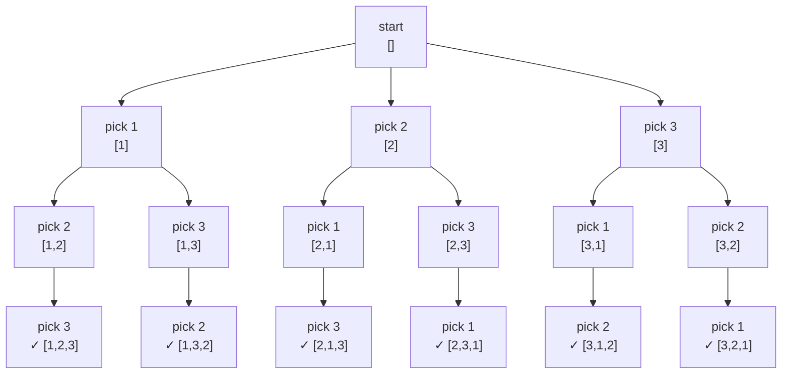

# Permutations

How many ways can 4 runners finish a race? 4! = 24. Backtracking lists them all.

First place has 4 candidates. Once filled, second place has 3. Then 2. Then 1. That countdown — 4 × 3 × 2 × 1 — is factorial growth. For just 10 runners the answer is 3,628,800. For 20 it exceeds 2 quintillion. Backtracking navigates this space systematically, visiting every arrangement exactly once.

## Permutations vs combinations

The critical difference: order matters for permutations and does not matter for combinations.

| Input | As a combination | As a permutation |
|---|---|---|
| Choosing 3 from {1, 2, 3} | `{1,2,3}` — one unique set | `[1,2,3]`, `[1,3,2]`, `[2,1,3]`, `[2,3,1]`, `[3,1,2]`, `[3,2,1]` — six arrangements |

A combination answers "who is on the team". A permutation answers "who bats first, who bats second, who bats third".

## The decision tree for [1, 2, 3]

Each level of the tree picks the next position. The element chosen at level 1 fills position 0, the element chosen at level 2 fills position 1, and so on. Every element can only appear once per path.



3! = 6 leaves, one per valid permutation. The depth equals the length of the input.

## Classic approach: used boolean array

Track which elements have been placed. At each position, try every unused element.

```python,editable
def permutations(nums):
    result = []
    used = [False] * len(nums)

    def backtrack(current):
        if len(current) == len(nums):
            result.append(list(current))
            return

        for i in range(len(nums)):
            if used[i]:
                continue            # skip already-placed elements

            used[i] = True
            current.append(nums[i])
            backtrack(current)
            current.pop()
            used[i] = False         # undo

    backtrack([])
    return result

nums = [1, 2, 3]
output = permutations(nums)

print(f"Input: {nums}")
print(f"Total permutations: {len(output)}  (expected {len(nums)}! = 6)")
for p in output:
    print(p)
```

The `used` array mirrors the call stack. When the recursion returns, `used[i] = False` un-marks the element so sibling branches can use it. This undo step is the hallmark of backtracking.

## Swap-based approach

An alternative that avoids the `used` array: swap the current element into position, recurse, then swap back. The sub-array `nums[start:]` always holds the unused elements.

```python,editable
def permutations_swap(nums):
    result = []
    nums = list(nums)  # work on a copy

    def backtrack(start):
        if start == len(nums):
            result.append(list(nums))
            return

        for i in range(start, len(nums)):
            nums[start], nums[i] = nums[i], nums[start]   # swap in
            backtrack(start + 1)
            nums[start], nums[i] = nums[i], nums[start]   # swap back

    backtrack(0)
    return result

nums = [1, 2, 3]
output = permutations_swap(nums)

print(f"Input: {nums}")
print(f"Total permutations: {len(output)}")
for p in output:
    print(p)
```

The swap approach uses O(1) extra space beyond the recursion stack and the output, but produces permutations in a different order than the `used` array approach. Neither order is more correct — they both visit every arrangement.

## Handling duplicates

When the input contains duplicate values, naive backtracking produces duplicate permutations. For `[1, 1, 2]` there are only 3!/2! = 3 unique arrangements, not 3! = 6.

```python,editable
def permutations_unique(nums):
    nums.sort()
    result = []
    used = [False] * len(nums)

    def backtrack(current):
        if len(current) == len(nums):
            result.append(list(current))
            return

        for i in range(len(nums)):
            if used[i]:
                continue

            # Skip: same value, previous sibling was already used and unset
            # This means we already explored this value at this position
            if i > 0 and nums[i] == nums[i - 1] and not used[i - 1]:
                continue

            used[i] = True
            current.append(nums[i])
            backtrack(current)
            current.pop()
            used[i] = False

    backtrack([])
    return result

nums_dup = [1, 1, 2]
naive_output = permutations([1, 1, 2])
unique_output = permutations_unique(nums_dup)

print(f"Input: {nums_dup}")
print(f"\nNaive ({len(naive_output)} permutations — has duplicates):")
for p in naive_output:
    print(f"  {p}")

print(f"\nUnique ({len(unique_output)} permutations):")
for p in unique_output:
    print(f"  {p}")
```

The skip condition `i > 0 and nums[i] == nums[i-1] and not used[i-1]` reads: "if this value equals the previous value AND the previous copy has already been unset (used and then backtracked), skip — we already explored this branch." Sort the input first so duplicates are adjacent.

## Next permutation algorithm

Given a permutation, find the lexicographically next one without generating all permutations up to that point. This is the building block for many contest problems.

```python,editable
def next_permutation(nums):
    """
    Modifies nums in-place to the next lexicographic permutation.
    If already the largest, wraps around to the smallest.

    Algorithm:
    1. Find the rightmost index i where nums[i] < nums[i+1]  (the 'dip')
    2. Find the rightmost index j where nums[j] > nums[i]
    3. Swap nums[i] and nums[j]
    4. Reverse everything after index i
    """
    n = len(nums)
    i = n - 2

    # Step 1: find rightmost ascending pair
    while i >= 0 and nums[i] >= nums[i + 1]:
        i -= 1

    if i >= 0:
        # Step 2: find rightmost element greater than nums[i]
        j = n - 1
        while nums[j] <= nums[i]:
            j -= 1
        # Step 3: swap
        nums[i], nums[j] = nums[j], nums[i]

    # Step 4: reverse the suffix
    left, right = i + 1, n - 1
    while left < right:
        nums[left], nums[right] = nums[right], nums[left]
        left += 1
        right -= 1

    return nums

# Show the sequence of next permutations starting from [1, 2, 3]
current = [1, 2, 3]
print("Lexicographic sequence for [1, 2, 3]:")
print(f"  {current}")
for _ in range(5):  # show all 6 permutations
    current = next_permutation(list(current))
    print(f"  {current}")

print()

# Demonstrate on a mid-sequence example
p = [1, 3, 2]
print(f"next_permutation({p}) = {next_permutation(list(p))}")

p = [3, 2, 1]  # largest — wraps to smallest
print(f"next_permutation({p}) = {next_permutation(list(p))}  (wrapped)")
```

The next permutation algorithm runs in O(n) time and O(1) space — far better than generating all permutations when you only need the next one.

## Complexity analysis

| Approach | Time | Space |
|---|---|---|
| Backtracking (used array) | O(n × n!) | O(n) stack + O(n × n!) output |
| Backtracking (swap) | O(n × n!) | O(n) stack + O(n × n!) output |
| Next permutation | O(n) | O(1) |

The `n` factor in backtracking time comes from copying each length-n permutation into the result. The total number of nodes in the decision tree is n! + n×(n-1)! + ... which simplifies to O(n × n!).

## Real-world applications

**Scheduling jobs in all possible orders.** Finding the optimal order to schedule `n` tasks (e.g., minimizing total waiting time) requires evaluating all n! orderings, or at least pruning smartly through them.

**Anagram generation.** All permutations of a word's letters are its anagrams. Filtering by dictionary membership gives valid words.

**Brute-force password cracking.** A 4-character PIN from digits 0-9 has 10^4 = 10,000 combinations (repetition allowed). Character permutations without repetition are a subset of that problem.

**Travelling salesman problem.** For small numbers of cities, brute force evaluates all n! routes and picks the shortest. Permutations of city order form the search space.

```python,editable
# Practical example: find the optimal job schedule (minimize total wait time)
# Each job has a processing time. Schedule to minimize sum of completion times.

def optimal_schedule(jobs):
    """
    Shortest Job First is optimal, but let's verify by checking all permutations.
    Total cost = sum of completion times for each job.
    """
    from itertools import permutations as itertools_perms

    best_order = None
    best_cost = float('inf')

    for perm in itertools_perms(range(len(jobs))):
        completion_time = 0
        total_cost = 0
        for idx in perm:
            completion_time += jobs[idx]
            total_cost += completion_time

        if total_cost < best_cost:
            best_cost = total_cost
            best_order = [jobs[i] for i in perm]

    return best_order, best_cost

jobs = [3, 1, 4, 1, 5]  # processing times
order, cost = optimal_schedule(jobs)

print(f"Job processing times: {jobs}")
print(f"Optimal order: {order}")
print(f"Total completion cost: {cost}")

# Verify: Shortest Job First should match
sjf = sorted(jobs)
completion = 0
sjf_cost = 0
for t in sjf:
    completion += t
    sjf_cost += completion
print(f"\nShortest Job First order: {sjf}")
print(f"SJF total cost: {sjf_cost}  (matches: {sjf_cost == cost})")
```

This confirms the classic SJF theorem: sorting by processing time minimizes total completion time. The brute-force permutation approach proves it holds for any input, and for small `n` is completely practical.
