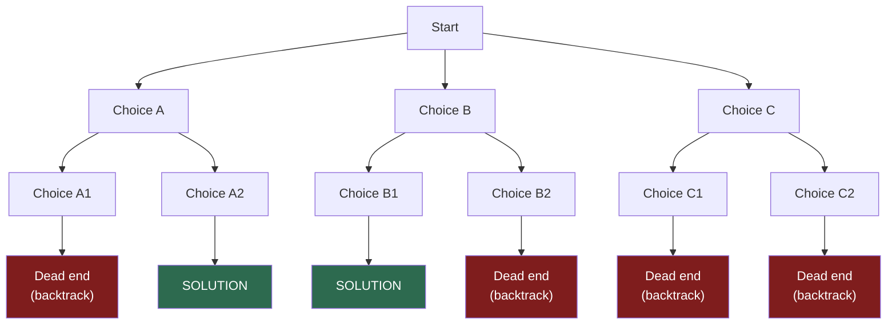

# Backtracking

Imagine navigating a maze. You walk down a corridor, turn left, keep going — and hit a dead end. You do not give up. You retrace your steps to the last junction and try the right corridor instead. If that also fails, you go back further and try another branch entirely.

That is backtracking: **explore a path, and if it fails, undo your steps and try the next option.**

It is a systematic way to search through all possibilities without missing any, and without wasting time on paths you have already ruled out.

## The Explore-and-Retreat Pattern

Every backtracking algorithm follows the same three-step loop:

```
1. CHOOSE   — pick one option from the available choices
2. EXPLORE  — recursively continue down that path
3. UNCHOOSE — if the path failed, undo the choice and try the next one
```

The "unchoose" step is what makes backtracking different from plain recursion. You are not just calling a function and forgetting about it — you are actively **restoring state** so the next branch starts from a clean slate.

## Decision Trees

Backtracking explores a **decision tree**. At each node, you make a choice. At each leaf, you either found a solution or hit a dead end.



The algorithm does a depth-first traversal of this tree. When it hits a dead end, it backtracks to the parent and tries the next branch. When it finds a solution, it can either return immediately (find one) or continue (find all).

## Why Not Just Try Everything?

A brute-force search would generate all possible combinations and then check which ones are valid. Backtracking is smarter: it **prunes** branches early. The moment a partial choice violates a constraint, it backs up without exploring the entire subtree beneath that choice.

For a problem with millions of combinations, this pruning is the difference between an algorithm that finishes in milliseconds and one that runs for years.

## The Template

Here is the skeleton that most backtracking solutions follow:

```python,editable
def backtrack(state, choices):
    # Base case: have we reached a complete solution?
    if is_solution(state):
        record(state)
        return

    for choice in choices:
        # Is this choice still valid?
        if is_valid(state, choice):
            # CHOOSE: apply the choice
            apply(state, choice)

            # EXPLORE: recurse deeper
            backtrack(state, next_choices(state, choice))

            # UNCHOOSE: undo the choice (backtrack)
            undo(state, choice)

def is_solution(state): pass   # placeholder
def is_valid(state, choice): pass
def apply(state, choice): pass
def next_choices(state, choice): pass
def undo(state, choice): pass
def record(state): pass

print("Backtracking template loaded — see Tree Maze for a concrete example.")
```

The `apply` / recurse / `undo` sandwich is the heart of every backtracking algorithm.

## In This Section

- **Tree Maze** — search a binary tree for a target value and find all root-to-leaf paths; understand how the explore-and-retreat pattern translates directly to code
