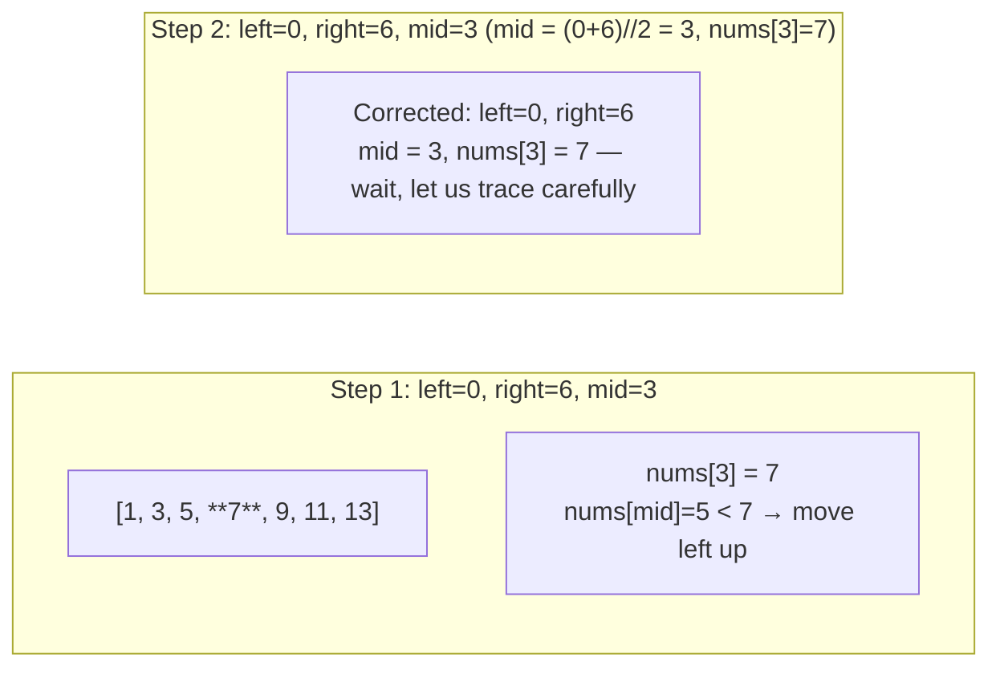
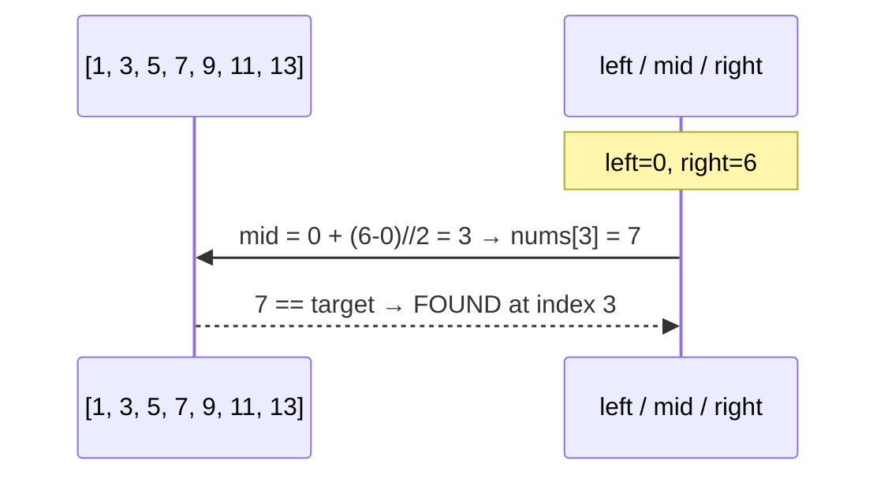
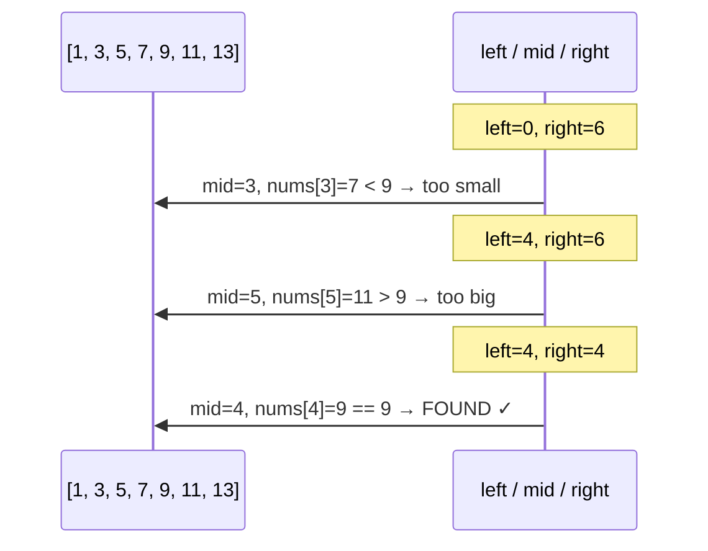

# Search Array

Binary search on a sorted array is the purest form of the algorithm. The idea is simple: maintain a window `[left, right]` that contains all possible positions for the target, then shrink it by half at every step.

**Prerequisite:** the array must be sorted in ascending order.

## Step-by-Step Walkthrough

Search for **7** in `[1, 3, 5, 7, 9, 11, 13]` (indices 0–6):



Let's trace it precisely — array indices 0 through 6:



That found it in a single step because 7 happens to land exactly on the first midpoint. Here is a longer trace searching for **9**:



Three steps to find 9 in a 7-element array.

## The Safe Midpoint Formula

You will often see `mid = (left + right) // 2`. This works in Python because Python integers have unlimited precision — but in languages like C, Java, or Go, `left + right` can **overflow** if both values are large (close to the maximum integer value), producing a negative or garbage result.

The safe formula is:

```
mid = left + (right - left) // 2
```

This is mathematically identical but never overflows because `right - left` is always a small non-negative number. Even in Python it is good practice to write it this way — you will carry the habit into other languages.

```python,editable
# Demonstrating the overflow risk in fixed-width arithmetic
import ctypes  # simulate 32-bit int overflow

MAX_INT = 2**31 - 1  # 2,147,483,647

left  = 2_000_000_000
right = 2_100_000_000

unsafe_mid = ctypes.c_int32(left + right).value   # wraps around!
safe_mid   = left + (right - left) // 2           # always correct

print(f"Unsafe mid (overflow simulation): {unsafe_mid}")
print(f"Safe    mid:                       {safe_mid}")
print(f"Expected:                          {(left + right) // 2}")
```

## Iterative Implementation

```python,editable
def binary_search(nums, target):
    """
    Return the index of target in the sorted list nums, or -1 if not found.
    Time:  O(log n)
    Space: O(1)
    """
    left = 0
    right = len(nums) - 1

    while left <= right:
        mid = left + (right - left) // 2

        if nums[mid] == target:
            return mid
        elif nums[mid] < target:
            left = mid + 1   # target must be in the right half
        else:
            right = mid - 1  # target must be in the left half

    return -1  # window collapsed — target is not in the array


# --- Tests ---
arr = [1, 3, 5, 7, 9, 11, 13]

print(binary_search(arr, 7))   # 3
print(binary_search(arr, 1))   # 0  (first element)
print(binary_search(arr, 13))  # 6  (last element)
print(binary_search(arr, 6))   # -1 (not in array)
print(binary_search([], 5))    # -1 (empty array)
```

### Why `left <= right`?

The loop condition `left <= right` means we keep searching while the window contains at least one element. When `left > right` the window is empty — the target cannot be there.

## Recursive Implementation

The recursive version maps more naturally to the mathematical definition but uses O(log n) call-stack space.

```python,editable
def binary_search_recursive(nums, target, left=None, right=None):
    """
    Recursive binary search.
    Time:  O(log n)
    Space: O(log n) — call stack depth
    """
    if left is None:
        left = 0
    if right is None:
        right = len(nums) - 1

    # Base case: empty window
    if left > right:
        return -1

    mid = left + (right - left) // 2

    if nums[mid] == target:
        return mid
    elif nums[mid] < target:
        return binary_search_recursive(nums, target, mid + 1, right)
    else:
        return binary_search_recursive(nums, target, left, mid - 1)


arr = [1, 3, 5, 7, 9, 11, 13]
print(binary_search_recursive(arr, 7))   # 3
print(binary_search_recursive(arr, 6))   # -1
```

## Edge Cases

```python,editable
def binary_search(nums, target):
    left, right = 0, len(nums) - 1
    while left <= right:
        mid = left + (right - left) // 2
        if nums[mid] == target:
            return mid
        elif nums[mid] < target:
            left = mid + 1
        else:
            right = mid - 1
    return -1

# 1. Empty array
print("Empty:        ", binary_search([], 5))          # -1

# 2. Single element — present
print("Single hit:   ", binary_search([7], 7))         # 0

# 3. Single element — absent
print("Single miss:  ", binary_search([7], 3))         # -1

# 4. Target smaller than every element
print("Below range:  ", binary_search([3, 5, 7], 1))   # -1

# 5. Target larger than every element
print("Above range:  ", binary_search([3, 5, 7], 9))   # -1

# 6. Duplicates — returns ONE matching index (not necessarily the first)
print("Duplicate:    ", binary_search([2, 2, 2, 2], 2))  # some valid index

# 7. Two elements
print("Two-elem hit: ", binary_search([4, 8], 8))      # 1
print("Two-elem miss:", binary_search([4, 8], 5))      # -1
```

> **Note on duplicates:** the standard binary search returns *an* index where the target occurs, not necessarily the first or last. If you need the exact first or last occurrence, see [Search Range](15-search-range.md).

## Complexity Summary

| Metric | Value | Why |
|--------|-------|-----|
| Time (best) | O(1) | Target is the first midpoint checked |
| Time (average/worst) | O(log n) | Halving the window each step |
| Space (iterative) | O(1) | Only a handful of integer variables |
| Space (recursive) | O(log n) | One stack frame per halving step |

## Real-World Connections

**Sorted contacts list** — your phone's contacts app stores names in sorted order. Searching for "Zhang Wei" among 500 contacts takes at most 9 comparisons (log₂ 500 ≈ 9), not 500.

**Database index scan** — a B-tree index on a `users` table sorted by `email` lets the database engine use binary-search-style page lookups to find a row in O(log n) page reads instead of a full table scan.

**`bisect` module in Python** — Python's standard library ships `bisect.bisect_left` and `bisect.bisect_right`, which are C-speed binary search implementations you can drop into any sorted list:

```python,editable
import bisect

contacts = ["Alice", "Bob", "Carol", "Dave", "Eve", "Frank"]

# Find insertion point (equivalent to find-first)
pos = bisect.bisect_left(contacts, "Carol")
print(f"'Carol' found at index: {pos}")   # 2

# Check membership
name = "Dave"
pos = bisect.bisect_left(contacts, name)
found = pos < len(contacts) and contacts[pos] == name
print(f"'Dave' in contacts: {found}")     # True

name = "Zara"
pos = bisect.bisect_left(contacts, name)
found = pos < len(contacts) and contacts[pos] == name
print(f"'Zara' in contacts: {found}")     # False
```
