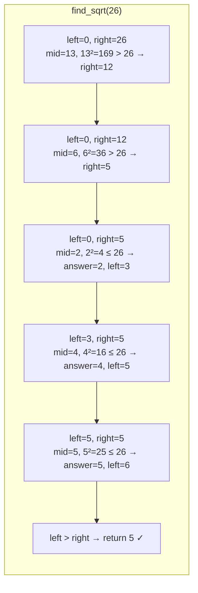

# Search Range

What if the array has duplicates and you need the **first** or **last** occurrence?

Standard binary search returns *some* matching index — but not necessarily the leftmost or rightmost one. For example, in `[1, 2, 2, 2, 3, 4]`, searching for `2` might return index 1, 2, or 3 depending on where the midpoint happens to fall.

Finding a precise boundary — or searching over a numeric range rather than an array — is a powerful generalisation of binary search that unlocks a whole family of problems.

## The Boundary Search Idea

When you find a match, instead of stopping immediately, **keep searching in one direction** to see if there is a closer match:

- **First occurrence (left boundary):** on a hit, record the index and continue searching *left* (`right = mid - 1`).
- **Last occurrence (right boundary):** on a hit, record the index and continue searching *right* (`left = mid + 1`).

```mermaid
graph TD
    subgraph Standard["Standard binary search — stops on first hit"]
        S1["left=0, right=5\nmid=2, nums[2]=2 → HIT, return 2"]
    end

    subgraph Left["find_first — keeps going left after a hit"]
        L1["left=0, right=5\nmid=2, nums[2]=2 → record 2, right=1"]
        L2["left=0, right=1\nmid=0, nums[0]=1 → too small, left=1"]
        L3["left=1, right=1\nmid=1, nums[1]=2 → record 1, right=0"]
        L4["left > right → return 1 ✓"]
        L1 --> L2 --> L3 --> L4
    end

    subgraph Right["find_last — keeps going right after a hit"]
        R1["left=0, right=5\nmid=2, nums[2]=2 → record 2, left=3"]
        R2["left=3, right=5\nmid=4, nums[4]=3 → too big, right=3"]
        R3["left=3, right=3\nmid=3, nums[3]=2 → record 3, left=4"]
        R4["left > right → return 3 ✓"]
        R1 --> R2 --> R3 --> R4
    end
```



Array used: `[1, 2, 2, 2, 3, 4]`, target = `2`

## Implementing find_first and find_last

```python,editable
def find_first(nums, target):
    """
    Return the index of the FIRST occurrence of target, or -1 if not found.
    Time: O(log n)  Space: O(1)
    """
    left, right = 0, len(nums) - 1
    answer = -1

    while left <= right:
        mid = left + (right - left) // 2

        if nums[mid] == target:
            answer = mid        # record this hit...
            right = mid - 1    # ...but keep searching left
        elif nums[mid] < target:
            left = mid + 1
        else:
            right = mid - 1

    return answer


def find_last(nums, target):
    """
    Return the index of the LAST occurrence of target, or -1 if not found.
    Time: O(log n)  Space: O(1)
    """
    left, right = 0, len(nums) - 1
    answer = -1

    while left <= right:
        mid = left + (right - left) // 2

        if nums[mid] == target:
            answer = mid        # record this hit...
            left = mid + 1     # ...but keep searching right
        elif nums[mid] < target:
            left = mid + 1
        else:
            right = mid - 1

    return answer


def search_range(nums, target):
    """Return [first_index, last_index] of target, or [-1, -1] if absent."""
    return [find_first(nums, target), find_last(nums, target)]


# Tests
arr = [1, 2, 2, 2, 3, 4]
print(search_range(arr, 2))   # [1, 3]
print(search_range(arr, 1))   # [0, 0]
print(search_range(arr, 4))   # [5, 5]
print(search_range(arr, 5))   # [-1, -1]

# All duplicates
print(search_range([7, 7, 7, 7], 7))   # [0, 3]

# Target absent from middle
print(search_range([1, 1, 3, 3], 2))   # [-1, -1]
```

## Binary Search on a Numeric Range

Binary search does not have to operate on an array at all. You can apply it to any **monotonic condition** over a numeric range.

**Classic example:** finding the integer square root of n — the largest integer k such that k² ≤ n.

Instead of a sorted array, the "array" is the range `[0, n]`, and the condition `k² ≤ n` is True for small k and False for large k — a perfect sorted boundary to binary-search on.



```python,editable
def find_sqrt(n):
    """
    Return the integer square root of n (floor(sqrt(n))) using binary search.
    Time: O(log n)  Space: O(1)
    """
    if n < 2:
        return n

    left, right = 1, n // 2   # sqrt(n) <= n//2 for n >= 4
    answer = 1

    while left <= right:
        mid = left + (right - left) // 2

        if mid * mid <= n:
            answer = mid       # mid is a valid candidate; try larger
            left = mid + 1
        else:
            right = mid - 1   # mid² too big; try smaller

    return answer


# Verify against math.isqrt
import math
test_cases = [0, 1, 4, 8, 9, 26, 100, 1000, 999_999]

print(f"{'n':<12} {'find_sqrt':<14} {'math.isqrt':<14} {'match'}")
print("-" * 46)
for n in test_cases:
    result = find_sqrt(n)
    expected = math.isqrt(n)
    print(f"{n:<12} {result:<14} {expected:<14} {'✓' if result == expected else '✗'}")
```

## The General Pattern

These three problems share the same skeleton — binary search on a condition:

```python,editable
def binary_search_condition(lo, hi, condition):
    """
    Find the LAST position where condition is True in the range [lo, hi].

    Assumes condition is True for some prefix [lo..k] and False for [k+1..hi]
    — i.e., the condition is monotonically non-increasing.

    Returns the boundary index k, or lo-1 if condition is False everywhere.
    """
    answer = lo - 1  # sentinel: condition never True

    while lo <= hi:
        mid = lo + (hi - lo) // 2
        if condition(mid):
            answer = mid
            lo = mid + 1   # record hit, search right for a later hit
        else:
            hi = mid - 1   # search left

    return answer


# Example 1: find last index where nums[i] <= target (like upper_bound)
nums = [1, 3, 3, 3, 5, 7, 9]
target = 3
last_le = binary_search_condition(0, len(nums) - 1, lambda i: nums[i] <= target)
print(f"Last index where nums[i] <= {target}: {last_le}")   # 3

# Example 2: integer square root via the same template
n = 50
sqrt_n = binary_search_condition(1, n, lambda k: k * k <= n)
print(f"Integer sqrt of {n}: {sqrt_n}")   # 7  (7² = 49 ≤ 50, 8² = 64 > 50)
```

## Complexity Summary

| Problem | Time | Space |
|---------|------|-------|
| find_first | O(log n) | O(1) |
| find_last | O(log n) | O(1) |
| search_range | O(log n) | O(1) |
| find_sqrt | O(log n) | O(1) |

Each problem performs at most two passes over log n positions, or a single pass over a numeric range of size n — so the complexity stays logarithmic.

## Real-World Connections

**Finding date ranges in logs** — given millions of log lines sorted by timestamp, finding all lines between two timestamps is exactly a `find_first` / `find_last` pair on the timestamp column.

**Python `bisect` module** — `bisect.bisect_left(a, x)` returns the first index where `x` could be inserted to keep `a` sorted (equivalent to `find_first`), and `bisect.bisect_right(a, x)` returns the last such index. These are used internally by Python's `SortedList` containers.

```python,editable
import bisect

events = [
    "2024-03-01 login",
    "2024-03-02 purchase",
    "2024-03-02 refund",
    "2024-03-02 logout",
    "2024-03-05 login",
]

# All events on 2024-03-02
lo = bisect.bisect_left(events,  "2024-03-02")
hi = bisect.bisect_right(events, "2024-03-02\xff")  # \xff sorts after all printable chars

print("Events on 2024-03-02:")
for e in events[lo:hi]:
    print(" ", e)
```

**C++ STL `lower_bound` / `upper_bound`** — C++'s `<algorithm>` header provides `lower_bound` (first position ≥ target) and `upper_bound` (first position > target) on any sorted range. They are the direct equivalents of `find_first` and the index after `find_last`, and they are used extensively in competitive programming and systems code.
