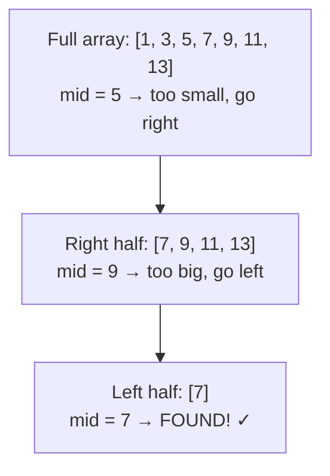

# Binary Search

Imagine a dictionary with 100,000 words. A linear search checks every word one by one — up to **100,000 checks** in the worst case. Binary search finds any word in at most **17 checks**. That is the power of O(log n).

How is that possible? Because a dictionary is already sorted. When you open it to the middle, you instantly know whether your word comes before or after that page — and you can throw away half the book. Do that again and again, and you converge on your answer with stunning speed.

## The Core Idea

Binary search works by repeatedly **halving the search space**:

1. Look at the middle element.
2. If it equals the target, you're done.
3. If the target is smaller, throw away the right half.
4. If the target is larger, throw away the left half.
5. Repeat on the surviving half.

**The one hard requirement:** the array (or range) must be **sorted**. Binary search relies on the guarantee that everything to the left is smaller and everything to the right is larger. Without that guarantee, discarding half the array would be wrong.

## Visualising the Halving

Searching for **7** in the sorted array `[1, 3, 5, 7, 9, 11, 13]`:



Each arrow cuts the remaining candidates in half. Starting with 7 elements, we needed only **3 steps**.

## Linear vs Binary Search: A Timing Example

```python,editable
import time

def linear_search(nums, target):
    for i, val in enumerate(nums):
        if val == target:
            return i
    return -1

def binary_search(nums, target):
    left, right = 0, len(nums) - 1
    while left <= right:
        mid = left + (right - left) // 2
        if nums[mid] == target:
            return mid
        elif nums[mid] < target:
            left = mid + 1
        else:
            right = mid - 1
    return -1

# Build a sorted list of 1,000,000 numbers
data = list(range(1_000_000))
target = 999_999  # worst case: near the very end

start = time.perf_counter()
result = linear_search(data, target)
linear_time = time.perf_counter() - start

start = time.perf_counter()
result = binary_search(data, target)
binary_time = time.perf_counter() - start

print(f"Linear search: found at index {result}, took {linear_time:.6f}s")
print(f"Binary search: found at index {result}, took {binary_time:.6f}s")
print(f"Binary search was ~{linear_time / binary_time:.0f}x faster")
```

## Why O(log n)?

Each step halves the remaining search space. Starting with n elements:

| Step | Elements remaining |
|------|-------------------|
| 0    | n                 |
| 1    | n / 2             |
| 2    | n / 4             |
| k    | n / 2^k           |

We stop when n / 2^k = 1, so k = log₂(n). For **n = 1,000,000**, that is just **20 steps**.

```python,editable
import math

sizes = [100, 1_000, 10_000, 100_000, 1_000_000, 1_000_000_000]

print(f"{'Array size':<20} {'Linear (worst)':<20} {'Binary (worst)'}")
print("-" * 58)
for n in sizes:
    binary_steps = math.ceil(math.log2(n))
    print(f"{n:<20,} {n:<20,} {binary_steps}")
```

## Real-World Applications

Binary search shows up everywhere sorted data exists:

**Dictionary lookup** — paper dictionaries and spell-checkers both exploit sorted order to find words in O(log n) time rather than scanning every entry.

**`git bisect`** — when a bug was introduced somewhere across hundreds of commits, `git bisect` performs a binary search through commit history. You tell it which commit is good and which is bad; it checks the midpoint, you mark it good or bad, and it keeps halving until it pinpoints the exact commit that introduced the bug.

**Database B-tree indexes** — a database index on a column is a sorted tree structure. Looking up a row by a value uses binary-search-like traversal, which is why indexed lookups are O(log n) even across millions of rows.

**Autocomplete** — as you type, a search engine narrows down candidates from a sorted trie or sorted word list using binary search to find the prefix boundary in O(log n) time.

## In This Section

| Chapter | Topic |
|---------|-------|
| [Search Array](14-search-array.md) | Classic binary search on a sorted array — iterative and recursive, with edge cases |
| [Search Range](15-search-range.md) | Finding first/last occurrences, and binary search on a numeric range |
