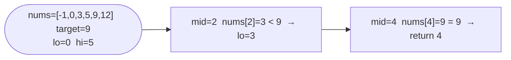

# Binary Search

**Difficulty:** Easy
**Source:** [NeetCode](https://neetcode.io/problems/binary-search)

## Problem

> Given an array of integers `nums` which is sorted in ascending order, and an integer `target`, write a function to search `target` in `nums`. If `target` exists, return its index. Otherwise, return `-1`.
>
> You must write an algorithm with `O(log n)` runtime complexity.
>
> **Example 1:**
> Input: `nums = [-1, 0, 3, 5, 9, 12]`, `target = 9`
> Output: `4`
>
> **Example 2:**
> Input: `nums = [-1, 0, 3, 5, 9, 12]`, `target = 2`
> Output: `-1`
>
> **Constraints:**
> - `1 <= nums.length <= 10^4`
> - `-10^4 < nums[i], target < 10^4`
> - All integers in `nums` are **unique**
> - `nums` is sorted in ascending order

## Prerequisites

Before attempting this problem, you should be comfortable with:

- **Sorted Arrays** — understanding that sorted order lets you eliminate half the search space at each step
- **Index Arithmetic** — computing midpoints and adjusting bounds without going out of range

---

## 1. Brute Force

### Intuition

Scan every element from left to right and return the index the moment you find the target. Simple and correct, but completely ignores the sorted property — you're doing `O(n)` work when `O(log n)` is achievable.

### Algorithm

1. For each index `i` from `0` to `len(nums) - 1`:
   - If `nums[i] == target`, return `i`.
2. Return `-1` if the loop finishes without a match.

### Solution

```python,editable
def search_linear(nums, target):
    for i in range(len(nums)):
        if nums[i] == target:
            return i
    return -1


print(search_linear([-1, 0, 3, 5, 9, 12], 9))   # 4
print(search_linear([-1, 0, 3, 5, 9, 12], 2))   # -1
print(search_linear([5], 5))                      # 0
```

### Complexity
- Time: `O(n)`
- Space: `O(1)`

---

## 2. Binary Search

### Intuition

Because the array is sorted, you can compare the middle element with the target and immediately discard half the array. If `nums[mid] == target` you're done. If `nums[mid] < target` the answer must be to the right, so move `lo` up. If `nums[mid] > target` it must be to the left, so move `hi` down. Each iteration halves the search space, giving `O(log n)`.

### Algorithm

1. Set `lo = 0` and `hi = len(nums) - 1`.
2. While `lo <= hi`:
   - Compute `mid = lo + (hi - lo) // 2`.
   - If `nums[mid] == target`, return `mid`.
   - If `nums[mid] < target`, set `lo = mid + 1`.
   - Else set `hi = mid - 1`.
3. Return `-1`.



### Solution

```python,editable
def search(nums, target):
    lo, hi = 0, len(nums) - 1
    while lo <= hi:
        mid = lo + (hi - lo) // 2
        if nums[mid] == target:
            return mid
        elif nums[mid] < target:
            lo = mid + 1
        else:
            hi = mid - 1
    return -1


print(search([-1, 0, 3, 5, 9, 12], 9))   # 4
print(search([-1, 0, 3, 5, 9, 12], 2))   # -1
print(search([5], 5))                      # 0
```

### Complexity
- Time: `O(log n)`
- Space: `O(1)`

---

## Common Pitfalls

**Using `mid = (lo + hi) // 2` in languages with fixed-width integers.** In Python integers don't overflow, but in C/Java this can wrap around for large values. Prefer `lo + (hi - lo) // 2` as a habit — it's safe everywhere.

**Loop condition `lo < hi` vs `lo <= hi`.** With `lo < hi` you exit one iteration early and may never check the element at the final `lo` position. Use `lo <= hi` so every candidate gets examined.

**Moving `lo = mid` or `hi = mid` instead of `mid ± 1`.** This can cause an infinite loop when `lo` and `hi` are adjacent — `mid` would equal `lo` and the bounds would never change.
