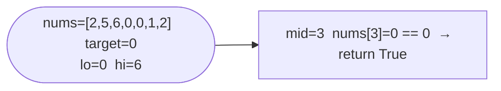

# Search in Rotated Sorted Array II

**Difficulty:** Medium
**Source:** [NeetCode](https://neetcode.io/problems/find-target-in-rotated-sorted-array-ii)

## Problem

> There is an integer array `nums` sorted in non-decreasing order (not necessarily with distinct values).
>
> Before being passed to your function, `nums` is rotated at an unknown pivot index `k`. Given the array `nums` after the possible rotation and an integer `target`, return `true` if `target` is in `nums`, or `false` if it is not in `nums`.
>
> You must decrease the overall operation steps as much as possible.
>
> **Example 1:**
> Input: `nums = [2, 5, 6, 0, 0, 1, 2]`, `target = 0`
> Output: `true`
>
> **Example 2:**
> Input: `nums = [2, 5, 6, 0, 0, 1, 2]`, `target = 3`
> Output: `false`
>
> **Constraints:**
> - `1 <= nums.length <= 5000`
> - `-10^4 <= nums[i] <= 10^4`
> - `nums` is guaranteed to be rotated at some pivot
> - `-10^4 <= target <= 10^4`

## Prerequisites

Before attempting this problem, you should be comfortable with:

- **Search in Rotated Sorted Array (no duplicates)** — the same half-sorted logic applies here as the base case
- **Handling Ambiguity** — recognizing when duplicates make it impossible to determine the sorted half

---

## 1. Brute Force

### Intuition

With duplicates, linear search is straightforward and sometimes the only option in the worst case anyway.

### Algorithm

1. Return `target in nums`.

### Solution

```python,editable
def search_linear(nums, target):
    return target in nums


print(search_linear([2, 5, 6, 0, 0, 1, 2], 0))  # True
print(search_linear([2, 5, 6, 0, 0, 1, 2], 3))  # False
```

### Complexity
- Time: `O(n)`
- Space: `O(1)`

---

## 2. Binary Search with Duplicate Handling

### Intuition

The approach is the same as the no-duplicates version, with one critical extra case: when `nums[lo] == nums[mid] == nums[hi]`, we can't tell which half is sorted — the rotation pivot could be anywhere. In this case, the only safe move is to shrink both boundaries by one (`lo += 1`, `hi -= 1`) and try again. This degenerate case makes the worst-case `O(n)` (e.g. all same elements), but the average case remains `O(log n)`.

### Algorithm

1. Set `lo = 0`, `hi = len(nums) - 1`.
2. While `lo <= hi`:
   - `mid = lo + (hi - lo) // 2`.
   - If `nums[mid] == target`, return `True`.
   - **Ambiguous case** (`nums[lo] == nums[mid] == nums[hi]`): `lo += 1`, `hi -= 1`.
   - **Left half sorted** (`nums[lo] <= nums[mid]`):
     - If `nums[lo] <= target < nums[mid]`: `hi = mid - 1`.
     - Else: `lo = mid + 1`.
   - **Right half sorted**:
     - If `nums[mid] < target <= nums[hi]`: `lo = mid + 1`.
     - Else: `hi = mid - 1`.
3. Return `False`.



### Solution

```python,editable
def search(nums, target):
    lo, hi = 0, len(nums) - 1
    while lo <= hi:
        mid = lo + (hi - lo) // 2
        if nums[mid] == target:
            return True
        # Duplicates make it impossible to determine the sorted half
        if nums[lo] == nums[mid] == nums[hi]:
            lo += 1
            hi -= 1
        # Left half is sorted
        elif nums[lo] <= nums[mid]:
            if nums[lo] <= target < nums[mid]:
                hi = mid - 1
            else:
                lo = mid + 1
        # Right half is sorted
        else:
            if nums[mid] < target <= nums[hi]:
                lo = mid + 1
            else:
                hi = mid - 1
    return False


print(search([2, 5, 6, 0, 0, 1, 2], 0))  # True
print(search([2, 5, 6, 0, 0, 1, 2], 3))  # False
print(search([1, 0, 1, 1, 1], 0))         # True
```

### Complexity
- Time: `O(log n)` average, `O(n)` worst case (all duplicates)
- Space: `O(1)`

---

## Common Pitfalls

**Skipping the ambiguous case entirely.** If you just copy the no-duplicates solution, you'll get wrong answers on arrays like `[1, 1, 1, 0, 1]` where `nums[lo] == nums[mid]` but the pivot is in the right half.

**Only shrinking one side when ambiguous.** When `nums[lo] == nums[mid] == nums[hi]`, you genuinely cannot eliminate either half — shrink both. Shrinking only `lo` or only `hi` can lead to an infinite loop or a missed target.

**Returning an index instead of a boolean.** This variant returns `true`/`false`, not an index. The problem is subtly different from LeetCode 33.
