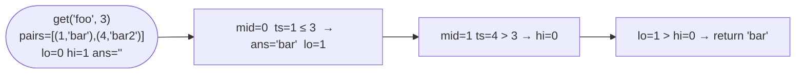

# Time Based Key-Value Store

**Difficulty:** Medium
**Source:** [NeetCode](https://neetcode.io/problems/time-based-key-value-store)

## Problem

> Design a time-based key-value data structure that can store multiple values for the same key at different time stamps and retrieve the key's value at a certain timestamp.
>
> Implement the `TimeMap` class:
> - `TimeMap()` Initializes the object.
> - `void set(String key, String value, int timestamp)` Stores the key with the value at the given time timestamp.
> - `String get(String key, int timestamp)` Returns a value such that `set` was called previously with `timestamp_prev <= timestamp`. If there are multiple such values, it returns the value associated with the largest `timestamp_prev`. If there are no values, it returns `""`.
>
> **Example 1:**
> Input:
> ```
> set("foo", "bar", 1)
> get("foo", 1)   → "bar"
> get("foo", 3)   → "bar"
> set("foo", "bar2", 4)
> get("foo", 4)   → "bar2"
> get("foo", 5)   → "bar2"
> ```
>
> **Constraints:**
> - `1 <= key.length, value.length <= 100`
> - `key` and `value` consist of lowercase English letters and digits
> - `1 <= timestamp <= 10^7`
> - All calls to `set` are made with strictly increasing `timestamp`
> - At most `2 * 10^5` calls will be made to `set` and `get`

## Prerequisites

Before attempting this problem, you should be comfortable with:

- **Hash Maps** — mapping keys to lists of values
- **Binary Search** — finding the largest timestamp `<= query` in a sorted list
- **Upper-bound / Floor Search** — a binary search variant that finds the rightmost valid position

---

## 1. Brute Force

### Intuition

Store all `(timestamp, value)` pairs for each key in a list. On `get`, scan the whole list for the largest timestamp that doesn't exceed the query. Simple but slow on large inputs.

### Algorithm

1. `set(key, value, timestamp)`: append `(timestamp, value)` to `store[key]`.
2. `get(key, timestamp)`: iterate `store[key]`, track the best `(timestamp_prev, value)` where `timestamp_prev <= timestamp`. Return the associated value, or `""`.

### Solution

```python,editable
class TimeMapBrute:
    def __init__(self):
        self.store = {}

    def set(self, key, value, timestamp):
        if key not in self.store:
            self.store[key] = []
        self.store[key].append((timestamp, value))

    def get(self, key, timestamp):
        if key not in self.store:
            return ""
        best = ""
        for ts, val in self.store[key]:
            if ts <= timestamp:
                best = val  # list is in increasing order so last valid is the answer
        return best


tm = TimeMapBrute()
tm.set("foo", "bar", 1)
print(tm.get("foo", 1))   # bar
print(tm.get("foo", 3))   # bar
tm.set("foo", "bar2", 4)
print(tm.get("foo", 4))   # bar2
print(tm.get("foo", 5))   # bar2
```

### Complexity
- Time: `set O(1)`, `get O(n)` per key
- Space: `O(n)` total

---

## 2. Binary Search on Timestamps

### Intuition

The problem guarantees timestamps are inserted in strictly increasing order, so each key's list is already sorted by timestamp. This is the perfect setup for a binary search: on `get`, find the largest timestamp `<= query` using a floor-search variant of binary search. Instead of checking equality, we track the rightmost position where `timestamps[mid] <= timestamp`.

### Algorithm

1. `set(key, value, timestamp)`: append `(timestamp, value)` to `store[key]`.
2. `get(key, timestamp)`:
   - If key doesn't exist, return `""`.
   - Binary search `store[key]` for the largest index where `ts <= timestamp`.
   - Set `lo = 0`, `hi = len(pairs) - 1`, `ans = ""`.
   - While `lo <= hi`: compute `mid`, if `pairs[mid][0] <= timestamp` record `ans = pairs[mid][1]` and go right (`lo = mid + 1`); else go left (`hi = mid - 1`).
   - Return `ans`.



### Solution

```python,editable
class TimeMap:
    def __init__(self):
        self.store = {}

    def set(self, key, value, timestamp):
        if key not in self.store:
            self.store[key] = []
        self.store[key].append((timestamp, value))

    def get(self, key, timestamp):
        if key not in self.store:
            return ""
        pairs = self.store[key]
        lo, hi, ans = 0, len(pairs) - 1, ""
        while lo <= hi:
            mid = lo + (hi - lo) // 2
            if pairs[mid][0] <= timestamp:
                ans = pairs[mid][1]
                lo = mid + 1   # look for a later (larger) valid timestamp
            else:
                hi = mid - 1
        return ans


tm = TimeMap()
tm.set("foo", "bar", 1)
print(tm.get("foo", 1))   # bar
print(tm.get("foo", 3))   # bar
tm.set("foo", "bar2", 4)
print(tm.get("foo", 4))   # bar2
print(tm.get("foo", 5))   # bar2
print(tm.get("foo", 0))   # (empty string)
```

### Complexity
- Time: `set O(1)`, `get O(log n)` per key
- Space: `O(n)` total

---

## Common Pitfalls

**Going left when `ts <= timestamp` instead of right.** You want the *largest* valid timestamp, so when you find a match, record it and keep moving right (`lo = mid + 1`) to see if there's a later one. Going left loses valid candidates.

**Returning `ans` without initialising it to `""`.**  If the query timestamp is earlier than every stored timestamp, no `ts <= timestamp` condition fires and `ans` stays as the empty string — the correct answer. Make sure `ans = ""` is your initial value.

**Assuming `set` timestamps are unique across keys.** Timestamps are strictly increasing *per method call overall*, but two different keys can have the same timestamp stored if `set` is called once per key at the same time. The binary search logic is unaffected, but don't rely on global uniqueness.
