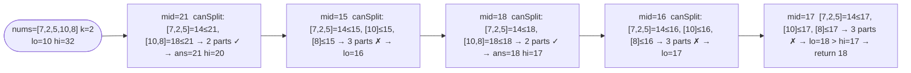

# Split Array Largest Sum

**Difficulty:** Hard
**Source:** [NeetCode](https://neetcode.io/problems/split-array-largest-sum)

## Problem

> Given an integer array `nums` and an integer `k`, split `nums` into `k` non-empty subarrays such that the largest sum of any subarray is minimized.
>
> Return the minimized largest sum of the split.
>
> **Example 1:**
> Input: `nums = [7, 2, 5, 10, 8]`, `k = 2`
> Output: `18`
> Explanation: Split into `[7,2,5]` and `[10,8]`. Largest sum is 18. Other splits are worse.
>
> **Example 2:**
> Input: `nums = [1, 2, 3, 4, 5]`, `k = 2`
> Output: `9`
> Explanation: Split into `[1,2,3,4]` and `[5]`. Largest sum is 9.
>
> **Constraints:**
> - `1 <= nums.length <= 1000`
> - `0 <= nums[i] <= 10^6`
> - `1 <= k <= min(50, nums.length)`

## Prerequisites

Before attempting this problem, you should be comfortable with:

- **Binary Search on the Answer** — the answer (largest subarray sum) lies in a known range and the feasibility check is monotone
- **Greedy Partitioning** — greedily packing elements into the fewest subarrays given a maximum sum cap

---

## 1. Brute Force (Recursion with Memoization)

### Intuition

Try every possible split position recursively. At each position decide how many elements go into the current subarray, then recurse on the rest with `k - 1` pieces. Take the minimum over all choices of the maximum subarray sum produced. Memoize on `(index, k)` to avoid redundant recomputation.

### Algorithm

1. Define `dp(i, pieces)`: minimum possible largest sum when splitting `nums[i:]` into `pieces` parts.
2. Base case: `pieces == 1` → return `sum(nums[i:])`.
3. For each `j` from `i` to `n - pieces`: try putting `nums[i:j+1]` in the current part. Recurse on `dp(j+1, pieces-1)`. Track the minimum of `max(current_sum, recursive_result)`.

### Solution

```python,editable
from functools import lru_cache

def splitArray_memo(nums, k):
    prefix = [0] * (len(nums) + 1)
    for i, v in enumerate(nums):
        prefix[i + 1] = prefix[i] + v

    def range_sum(i, j):  # sum of nums[i..j] inclusive
        return prefix[j + 1] - prefix[i]

    @lru_cache(maxsize=None)
    def dp(i, pieces):
        if pieces == 1:
            return range_sum(i, len(nums) - 1)
        best = float("inf")
        for j in range(i, len(nums) - pieces + 1):
            cur = range_sum(i, j)
            best = min(best, max(cur, dp(j + 1, pieces - 1)))
        return best

    return dp(0, k)


print(splitArray_memo([7, 2, 5, 10, 8], 2))   # 18
print(splitArray_memo([1, 2, 3, 4, 5], 2))    # 9
```

### Complexity
- Time: `O(n² * k)`
- Space: `O(n * k)`

---

## 2. Binary Search on the Answer

### Intuition

The answer — the minimized largest subarray sum — lies between `max(nums)` (each element is its own subarray, any fewer subarrays must have a larger max) and `sum(nums)` (one subarray). The feasibility function is: "given a maximum allowed sum cap, can we split `nums` into at most `k` subarrays?" This is monotone — if `cap` works, any larger cap also works. Binary-search for the smallest feasible cap.

The feasibility check is a simple greedy: accumulate elements until adding the next one would exceed `cap`, then start a new subarray.

### Algorithm

1. `canSplit(cap)`: greedily fill subarrays; count how many are needed. Return `count <= k`.
2. Binary search `[max(nums), sum(nums)]` for the smallest cap where `canSplit` returns `True`.



### Solution

```python,editable
def splitArray(nums, k):
    def canSplit(cap):
        parts, current = 1, 0
        for v in nums:
            if current + v > cap:
                parts += 1
                current = 0
            current += v
        return parts <= k

    lo, hi = max(nums), sum(nums)
    ans = hi
    while lo <= hi:
        mid = lo + (hi - lo) // 2
        if canSplit(mid):
            ans = mid
            hi = mid - 1
        else:
            lo = mid + 1
    return ans


print(splitArray([7, 2, 5, 10, 8], 2))   # 18
print(splitArray([1, 2, 3, 4, 5], 2))    # 9
print(splitArray([1, 4, 4], 3))          # 4
```

### Complexity
- Time: `O(n log(sum(nums)))`
- Space: `O(1)`

---

## Common Pitfalls

**Setting `lo = 0` or `lo = 1`.** The minimum feasible cap is `max(nums)` — any cap smaller than the largest element cannot accommodate that element at all.

**Using `parts > k` when starting a new part.** Start a new part when adding the next element *would* exceed `cap` (`current + v > cap`), not after. The element that caused the overflow belongs to the new part.

**Confusing minimization direction.** You're minimizing the largest sum, so when `canSplit(mid)` is `True`, record `ans = mid` and try *smaller* (`hi = mid - 1`). This is the opposite of a lower-bound search.
