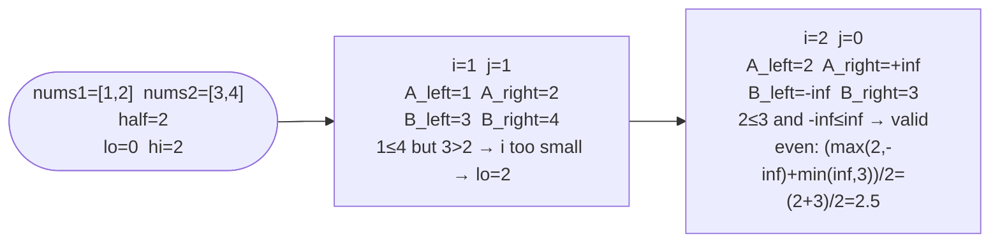

# Median of Two Sorted Arrays

**Difficulty:** Hard
**Source:** [NeetCode](https://neetcode.io/problems/median-of-two-sorted-arrays)

## Problem

> Given two sorted arrays `nums1` and `nums2` of size `m` and `n` respectively, return the median of the two sorted arrays.
>
> The overall run time complexity should be `O(log(m + n))`.
>
> **Example 1:**
> Input: `nums1 = [1, 3]`, `nums2 = [2]`
> Output: `2.0`
> Explanation: merged array = `[1, 2, 3]`, median is `2`.
>
> **Example 2:**
> Input: `nums1 = [1, 2]`, `nums2 = [3, 4]`
> Output: `2.5`
> Explanation: merged array = `[1, 2, 3, 4]`, median is `(2 + 3) / 2 = 2.5`.
>
> **Constraints:**
> - `m == nums1.length`, `n == nums2.length`
> - `0 <= m, n <= 1000`
> - `1 <= m + n <= 2000`
> - `-10^6 <= nums1[i], nums2[i] <= 10^6`

## Prerequisites

Before attempting this problem, you should be comfortable with:

- **Median Definition** — the value separating the lower and upper halves; accounts for even/odd total length
- **Binary Search on a Partition** — searching for a cut point rather than a value
- **Merge of Two Sorted Arrays** — understanding what a valid partition of both arrays looks like

---

## 1. Brute Force — Merge and Find

### Intuition

Merge both sorted arrays into one sorted array, then read off the median directly. Easy to implement, but requires `O(m + n)` time and space, violating the `O(log(m + n))` requirement.

### Algorithm

1. Merge `nums1` and `nums2` into a single sorted array `merged`.
2. If total length is odd, return the middle element.
3. If even, return the average of the two middle elements.

### Solution

```python,editable
def findMedianSortedArrays_merge(nums1, nums2):
    merged = sorted(nums1 + nums2)
    total = len(merged)
    mid = total // 2
    if total % 2 == 1:
        return float(merged[mid])
    return (merged[mid - 1] + merged[mid]) / 2.0


print(findMedianSortedArrays_merge([1, 3], [2]))      # 2.0
print(findMedianSortedArrays_merge([1, 2], [3, 4]))   # 2.5
print(findMedianSortedArrays_merge([0, 0], [0, 0]))   # 0.0
```

### Complexity
- Time: `O((m + n) log(m + n))`
- Space: `O(m + n)`

---

## 2. Binary Search on the Partition

### Intuition

Imagine cutting both arrays simultaneously into left and right halves such that:
1. The total number of elements on the left equals `(m + n) // 2` (or `// 2 + 1` for odd total).
2. Every element on the left is `<=` every element on the right.

If we binary-search for the cut position `i` in the smaller array (`nums1`), the cut position in the larger array `j` is determined: `j = half - i`. At each `i`, check the boundary elements:
- `nums1[i-1] <= nums2[j]` (left of A doesn't bleed into right of B)
- `nums2[j-1] <= nums1[i]` (left of B doesn't bleed into right of A)

If both hold, we've found the right partition. Use `float('inf')` / `float('-inf')` to handle boundary cases where a partition is at the very edge.

### Algorithm

1. Ensure `nums1` is the shorter array (swap if needed).
2. Set `lo = 0`, `hi = len(nums1)`.
3. While `lo <= hi`:
   - `i = (lo + hi) // 2` — cut in `nums1` (0..m elements on left).
   - `j = half - i` — cut in `nums2`.
   - Let `A_left = nums1[i-1]` (or `-inf`), `A_right = nums1[i]` (or `+inf`), similarly for B.
   - If `A_left <= B_right` and `B_left <= A_right`: valid partition.
     - Odd total: return `max(A_left, B_left)`.
     - Even total: return `(max(A_left, B_left) + min(A_right, B_right)) / 2`.
   - If `A_left > B_right`: `i` is too large → `hi = i - 1`.
   - Else: `i` is too small → `lo = i + 1`.



### Solution

```python,editable
def findMedianSortedArrays(nums1, nums2):
    # Always binary-search the smaller array
    if len(nums1) > len(nums2):
        nums1, nums2 = nums2, nums1

    m, n = len(nums1), len(nums2)
    half = (m + n) // 2
    lo, hi = 0, m

    while lo <= hi:
        i = (lo + hi) // 2   # cut in nums1: i elements on left
        j = half - i          # cut in nums2: j elements on left

        A_left  = nums1[i - 1] if i > 0 else float("-inf")
        A_right = nums1[i]     if i < m else float("inf")
        B_left  = nums2[j - 1] if j > 0 else float("-inf")
        B_right = nums2[j]     if j < n else float("inf")

        if A_left <= B_right and B_left <= A_right:
            # Found the correct partition
            if (m + n) % 2 == 1:
                return float(min(A_right, B_right))
            return (max(A_left, B_left) + min(A_right, B_right)) / 2.0
        elif A_left > B_right:
            hi = i - 1   # i is too large
        else:
            lo = i + 1   # i is too small

    return 0.0  # unreachable if inputs are valid


print(findMedianSortedArrays([1, 3], [2]))      # 2.0
print(findMedianSortedArrays([1, 2], [3, 4]))   # 2.5
print(findMedianSortedArrays([], [1]))           # 1.0
```

### Complexity
- Time: `O(log(min(m, n)))`
- Space: `O(1)`

---

## Common Pitfalls

**Binary-searching the longer array.** Always search the shorter one — it gives the smaller `log` factor and keeps `j` non-negative (since `j = half - i` and `half <= n` when `m <= n`).

**Off-by-one in the odd-total median.** For an odd total `m + n`, the median is the single middle element. With `half = (m + n) // 2`, the left side has `half` elements, so the median is `min(A_right, B_right)` — the smallest element on the right.

**Not guarding with `inf` at the edges.** When `i == 0`, `nums1` contributes nothing to the left half; `A_left` should be `-inf` so it never triggers the "too large" condition. When `i == m`, `A_right` should be `+inf` so it never prevents a valid partition.
